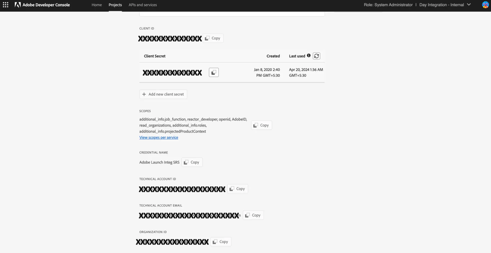

# 准备[!DNL Assets]以进行智能标记 {#configure-asset-tagging-using-the-smart-content-service}

在使用Smart Content Services开始标记资源之前，请将[!DNL Experience Manager Assets]与Adobe Developer Console集成以使用[!DNL Adobe Sensei]的智能服务。 配置完毕后，请使用一些图像和标记来训练服务。
在使用智能内容服务之前，请确保：

* [与Adobe Developer Console集成](#integrate-adobe-io)。
* [训练智能内容服务](#training-the-smart-content-service)。
* 安装最新的[[!DNL Experience Manager] 服务包](https://experienceleague.adobe.com/docs/experience-manager-release-information/aem-release-updates/aem-releases-updates.html)。

>[!IMPORTANT]
>
>有关Assets 6.5中智能标记的配置，请参阅[准备AEM以进行智能标记](https://experienceleague.adobe.com/zh-hans/docs/experience-manager-65/content/assets/administer/config-smart-tagging)。

**新用户**

新的[!DNL Experience Manager Assets]内部部署用户无法再使用智能内容服务。

**现有用户**

已启用此功能的现有内部部署用户可以继续使用智能内容服务。

## 与Adobe Developer Console集成 {#integrate-adobe-io}

与Adobe Developer Console集成时，[!DNL Experience Manager]服务器会先通过Adobe Developer Console网关验证您的服务凭据，然后再将您的请求转发到智能内容服务。 要集成，您需要一个对组织具有管理员权限的Adobe ID帐户，以及已为组织购买和启用的Smart Content Service许可证。

要配置智能内容服务，请按照以下顶级步骤操作：

1. 在[Adobe Developer Console](#create-adobe-io-integration)中创建集成。

1. 使用Adobe Developer Console中的API密钥和其他凭据创建[IMS技术帐户配置](#create-ims-account-config)。

1. [配置智能内容服务](#configure-smart-content-service)。

1. [测试配置](#validate-the-configuration)。

### 创建Adobe Developer Console集成 {#create-adobe-io-integration}

要使用Smart Content Service API，请在Adobe Developer Console中创建集成，以获取[!UICONTROL 中云配置的]Assets智能标记服务设置[!UICONTROL 的]API密钥[!UICONTROL (在Adobe Developer Console集成的]客户端ID[!UICONTROL 字段中生成)、]组织ID[!UICONTROL 和]客户端密钥[!DNL Experience Manager]。

1. 在浏览器中访问[https://developer.adobe.com](https://developer.adobe.com/)。 选择适当的帐户，并确认关联的组织角色是系统&#x200B;**管理员**。

1. 创建具有任何所需名称的项目。单击&#x200B;**[!UICONTROL 添加 API]**。

1. 在&#x200B;**[!UICONTROL 添加 API]** 页面中，依次选择 **[!UICONTROL Experience Cloud]** 和&#x200B;**[!UICONTROL 智能内容]**。单击&#x200B;**[!UICONTROL 下一步]**。

1. 选择&#x200B;**[!UICONTROL OAuth服务器到服务器]**。 单击&#x200B;**[!UICONTROL 下一步]**。
有关如何执行此配置的详细信息，请参阅Developer Console文档，具体取决于您的要求：

   * 概述：
      * [服务器到服务器身份验证](https://developer.adobe.com/developer-console/docs/guides/authentication/ServerToServerAuthentication/)

   * 创建新的 OAuth 凭据：
      * [OAuth 服务器到服务器凭据实施指南](https://developer.adobe.com/developer-console/docs/guides/authentication/ServerToServerAuthentication/implementation)

   * 将现有的 JWT 凭据迁移到 OAuth 凭据：
      * [从服务帐户 (JWT) 凭据迁移到 OAuth 服务器到服务器凭据](https://developer.adobe.com/developer-console/docs/guides/authentication/ServerToServerAuthentication/migration)

1. 在&#x200B;**[!UICONTROL 选择产品配置文件]**&#x200B;页面中，选择&#x200B;**[!UICONTROL 智能内容服务]**。 单击&#x200B;**[!UICONTROL 保存配置的API]**。

   页面会显示有关配置的更多信息。保持此页面处于打开状态，以复制这些值，并将其添加到[!UICONTROL 中云配置的]Assets智能标记服务设置[!DNL Experience Manager]中，从而配置智能标记。

   

### 创建IMS技术帐户配置 {#create-ims-account-config}

您需要使用以下步骤创建IMS技术帐户配置：

1. 在 [!DNL Experience Manager] 用户界面中，访问&#x200B;**[!UICONTROL 工具]** > **[!UICONTROL 安全]** > **[!UICONTROL Adobe IMS 配置]**。

1. 单击&#x200B;**[!UICONTROL 创建]**。

1. 在IMS技术帐户配置对话框中，使用以下值：

   

   | 字段 | 描述 |
   | -------- | ---------------------------- |
   | 云解决方案 | 从下拉列表中选择&#x200B;**[!UICONTROL 智能标记]**。 |
   | 标题 | 添加配置IMS帐户的标题。 |
   | 授权服务器 | 添加`https://ims-na1.adobelogin.com` |
   | 客户端 ID | 将通过[Adobe Developer控制台](https://developer.adobe.com/console/)提供。 |
   | 客户端密钥 | 将通过[Adobe Developer控制台](https://developer.adobe.com/console/)提供。 |
   | 范围 | 将通过[Adobe Developer控制台](https://developer.adobe.com/console/)提供。 |
   | 组织 ID | 将通过[Adobe Developer控制台](https://developer.adobe.com/console/)提供。 |

1. 选择您创建的配置，然后单击&#x200B;**[!UICONTROL 检查运行状况]**。

1. 确认检查运行状况对话框，并在配置处于正常状态时单击关闭。

### 创建新配置 {#configure-smart-content-service}

要配置集成，请使用Adobe Developer Console集成中的[!UICONTROL 技术帐户ID]、[!UICONTROL 组织ID]、[!UICONTROL 客户端密钥]和[!UICONTROL 客户端ID]字段的值。 创建智能标记云配置允许来自[!DNL Experience Manager]部署的API请求的身份验证。

1. 在[!DNL Experience Manager]中，导航到&#x200B;**[!UICONTROL 工具]** > **[!UICONTROL Cloud Service]** > **[!UICONTROL 智能标记]**&#x200B;以打开[!UICONTROL 智能标记配置]。

1. 单击&#x200B;**[!UICONTROL 创建]**&#x200B;以创建新配置。 否则，请单击&#x200B;**[!UICONTROL 属性]**&#x200B;以更新现有配置。

1. 填写以下字段：

   

   | 字段 | 描述 |
   | -------- | ---------------------------- |
   | 标题 | 添加配置IMS帐户的标题。 |
   | 关联的 Adobe IMS 配置 | 从下拉列表中选择配置。 |
   | 服务 URL | `https://smartcontent.adobe.io/<region where your Experience Manager author instance is hosted>`。例如，`https://smartcontent.adobe.io/apac`。您可以将`na`、`emea`或`apac`指定为承载Experience Manager创作实例的区域。 |

   >[!NOTE]
   >
   >如果Experience Manager托管服务是在2022年9月1日之前配置的，请使用以下服务URL：
   >`https://mc.adobe.io/marketingcloud/smartcontent`

1. 单击&#x200B;**[!UICONTROL 保存并关闭]**。

### 验证配置 {#validate-the-configuration}

完成配置后，可以使用JMX MBean来验证配置。 要进行验证，请执行以下步骤。

1. 访问位于[!DNL Experience Manager]的`https://[aem_server]:[port]`服务器。

1. 转到&#x200B;**[!UICONTROL 工具]** > **[!UICONTROL 操作]** > **[!UICONTROL Web控制台]**&#x200B;以打开OSGi控制台。 单击&#x200B;**[!UICONTROL 主] > [!UICONTROL JMX]**。

<!--
1. Click `com.day.cq.dam.similaritysearch.internal.impl`. It opens **[!UICONTROL SimilaritySearch Miscellaneous Tasks]**.-->

1. 单击 `com.day.cq.dam.similaritysearch.internal.impl (SCS)`。

   

1. 单击 `validateConfigs()`. 在&#x200B;**[!UICONTROL 验证配置]**&#x200B;对话框中，单击&#x200B;**[!UICONTROL 调用]**。

验证结果将显示在同一对话框中。

### 在[!UICONTROL DAM更新资产]工作流中启用智能标记（可选） {#enable-smart-tagging-in-the-update-asset-workflow-optional}

1. 在[!DNL Experience Manager]中，转到&#x200B;**[!UICONTROL 工具]** > **[!UICONTROL 工作流]** > **[!UICONTROL 模型]**。

1. 在&#x200B;**[!UICONTROL 工作流模型]**&#x200B;页面上，选择 **[!UICONTROL DAM 更新资产]**&#x200B;工作流模式。

1. 单击工具栏中的&#x200B;**[!UICONTROL 编辑]**。

1. 展开侧面板以显示步骤。拖动 DAM 工作流部分中可用的&#x200B;**[!UICONTROL 智能标记资产]**&#x200B;步骤，并将其放在&#x200B;**[!UICONTROL 流程缩略图]**&#x200B;步骤之后。

   

1. 打开步骤的属性以修改详细信息。 在&#x200B;**[!UICONTROL 高级设置]**&#x200B;下，确保选中&#x200B;**[!UICONTROL 处理程序前进]**&#x200B;选项。

   

1. 在&#x200B;**[!UICONTROL 参数]**&#x200B;选项卡中，如果希望完成工作流，请选择&#x200B;**[!UICONTROL 忽略错误]**，即使自动标记步骤失败也是如此。

   此外，要在上传资产时标记资产，而不考虑是否对文件夹启用了智能标记，请选择&#x200B;**[!UICONTROL 忽略智能标记标志]**。

   

1. 单击完成以关闭流程步骤。

1. 单击&#x200B;**[!UICONTROL 同步]**&#x200B;以保存工作流。

## 培训智能内容服务 {#training-the-smart-content-service}

为了使智能内容服务能够识别您的业务分类，请在一组已包含与您的业务相关的标记的资源上运行该分类。 为了有效地标记您的品牌图像，智能内容服务要求培训图像符合某些准则。 培训之后，该服务可以在类似的一组资产中应用相同的分类。

您可以多次培训服务以提高其应用相关标记的能力。 在每个培训周期后，运行标记工作流并检查资产是否进行了正确标记。

您可以定期或根据需要培训智能内容服务。

>[!NOTE]
>
>培训工作流仅在文件夹上运行。

### 培训准则 {#guidelines-for-training}

为获得最佳效果，培训集中的图像应符合以下准则：

**数量和大小：**&#x200B;每个标记至少 30 张图像。长边至少 500 像素。

**Coherence**：用于特定标记的图像在视觉上相似。

例如，将所有图像标记为`my-party`（用于培训）是不好的，因为它们视觉上并不相似。

**覆盖率**：在培训图像中使用足够多的变化。 我们的想法是提供一些合理多样化的示例，以便Experience Manager学习关注正确的事情。 如果您要在视觉上不同的图像上应用相同的标记，请至少包含每种类型的五个示例。

例如，对于标记&#x200B;*模型向下姿态*，请包含与下面高亮图像类似的更多训练图像，以便服务在标记期间更准确地识别类似图像。

**干扰/阻碍**：服务在干扰较少的图像（突出的背景、不相关的伴侣，如主主题的物体/人员）上提供更好的培训。

例如，对于标记&#x200B;*casual-shoe*，第二个图像不是良好的训练候选项。

**完整性：**&#x200B;如果图像符合多个标记的条件，请在包含培训图像之前添加所有适用的标记。例如，对于标记（如`raincoat`和`model-side-view`），请先在符合条件的资产上添加这两个标记，然后再将其加入培训。

>[!NOTE]
>
>智能内容服务根据您的标记进行培训并将其应用于其他图像的能力取决于您用于培训的图像质量。 为获得最佳结果，Adobe建议您使用视觉上相似的图像，为每个标签培训服务。

### 定期训练 {#periodic-training}

您可以使智能内容服务定期针对文件夹中的资源和关联标记进行培训。 打开资产文件夹的[!UICONTROL 属性]页面，在&#x200B;**[!UICONTROL 详细信息]**&#x200B;选项卡下选择&#x200B;**[!UICONTROL 启用智能标记]**，然后保存更改。

为文件夹选择此选项后，[!DNL Experience Manager]将自动运行培训工作流以对文件夹资产及其标记培训智能内容服务。 默认情况下，培训工作流每周于星期六凌晨12:30运行。

### 按需培训 {#on-demand-training}

您可以根据需要从工作流控制台培训智能内容服务。

1. 在[!DNL Experience Manager]界面中，转到&#x200B;**[!UICONTROL 工具]** > **[!UICONTROL 工作流]** > **[!UICONTROL 模型]**。
1. 从&#x200B;**[!UICONTROL 工作流模型]**&#x200B;页面中，选择&#x200B;**[!UICONTROL 智能标记培训]**&#x200B;工作流，然后单击工具栏中的&#x200B;**[!UICONTROL 启动工作流]**。
1. 在&#x200B;**[!UICONTROL 运行工作流]**&#x200B;对话框中，浏览到有效负荷文件夹，其中包含用于培训服务的已标记资产。
1. 指定工作流的标题并添加评论。 然后，单击&#x200B;**[!UICONTROL 运行]**。 提交资产和标记以进行培训。

   

>[!NOTE]
>
>一旦文件夹中的资产处理用于训练，后续训练周期将仅处理修改后的资产。

### 查看培训报告 {#viewing-training-reports}

要检查智能内容服务是否针对培训资产集中的标记进行了培训，请从“报表”控制台中查看培训工作流报表。

1. 在[!DNL Experience Manager]界面中，转到&#x200B;**[!UICONTROL 工具]** > **[!UICONTROL Assets]** > **[!UICONTROL 报表]**。
1. 在&#x200B;**[!UICONTROL 资产报表]**&#x200B;页面中，单击&#x200B;**[!UICONTROL 创建]**。
1. 选择&#x200B;**[!UICONTROL 智能标记培训]**&#x200B;报表，然后单击工具栏中的&#x200B;**[!UICONTROL 下一步]**。
1. 指定报表的标题和描述。在&#x200B;**[!UICONTROL 计划报告]**&#x200B;下，保持选中&#x200B;**[!UICONTROL 立即]**&#x200B;选项。如果要安排以后的计划报告，请选择&#x200B;**[!UICONTROL 稍后]**，然后指定日期和时间。然后，单击工具栏中的&#x200B;**[!UICONTROL 创建]**。
1. 在&#x200B;**[!UICONTROL 资产报表]**&#x200B;页面中，选择生成的报表。要查看报告，请单击工具栏中的&#x200B;**[!UICONTROL 查看]**。
1. 查看报告的详细信息。

   报表显示您培训的标记的培训状态。**[!UICONTROL 培训状态]**&#x200B;列中的绿色表示已为标记培训“智能内容服务”。黄色表示服务未针对特定标记进行完整培训。在这种情况下，使用特定标记添加更多图像并运行培训工作流以在标签上完整地培训服务。

   如果您未在此报表中看到您的标记，请再次运行这些标记的培训工作流。

1. 要下载报告，请从列表中选择报告，然后单击工具栏中的&#x200B;**[!UICONTROL 下载]**。 报表将下载为Microsoft Excel电子表格。

## 限制 {#limitations}

* 增强型智能标记基于图像及其标记的学习模型。 这些模型在识别标记方面并不总是完美的。 当前版本的智能内容服务具有以下限制：

   * 无法识别图像中的细微差异。 例如，超薄衬衫和普通衬衫。
   * 无法根据图像的微小模式/部分识别标记。 例如，T恤上的徽标。
   * 支持[!DNL Experience Manager]的区域设置支持标记。

* 要搜索带有智能标记（常规或增强）的资产，请使用[!DNL Assets] Omnisearch（全文搜索）。 智能标记没有单独的搜索谓词。

>[!MORELIKETHIS]
>
>* [概述以及如何培训智能标记](enhanced-smart-tags.md)
>* [OAuth凭据的智能标记疑难解答](config-oauth.md)
>* [有关智能标记的视频教程](https://experienceleague.adobe.com/docs/experience-manager-learn/assets/metadata/image-smart-tags.html)
