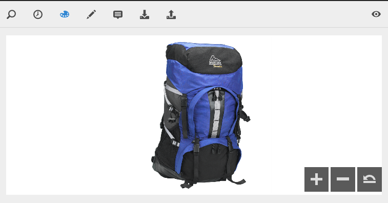

# 使用 Dynamic Media {#working-with-dynamic-media}

[Dynamic Media](https://business.adobe.com/products/experience-manager/assets/dynamic-media.html)可帮助按需提供丰富的可视化推销和营销资产，可自动扩展以用于Web、移动和社交网站上的使用。 使用一组主要源资产，该软件通过其全局、可扩展且性能优化的网络实时生成和交付多种丰富内容变体。

该软件提供交互式观看体验，包括缩放、360度旋转和视频。 它独特地整合了Adobe Experience Manager数字资产管理(Assets)解决方案的工作流，以简化和简化数字营销活动管理流程。

<!-- >ARTICLE IS MISSING. GIVES 404 [!NOTE]
>
>A Community article is available on [Working with Adobe Experience Manager and Dynamic Media](https://helpx.adobe.com/experience-manager/using/aem_dynamic_media.html). -->

## 使用软件可以做什么 {#what-you-can-do-with-dynamic-media}

通过软件，您可以在发布资产之前对其进行管理。 [使用数字资产](manage-assets.md)中详细说明了如何使用常规资产。 一般主题包括上传、下载、编辑和发布资源；查看和编辑属性以及搜索资源。

仅限Dynamic Media的功能包括：

* [传送横幅](carousel-banners.md)
* [图像集](image-sets.md)
* [交互式图像](interactive-images.md)
* [交互式视频](interactive-videos.md)
* [混合媒体集](mixed-media-sets.md)
* [全景图像](panoramic-images.md)

* [旋转集](spin-sets.md)
* [视频](video.md)
* [传递 Dynamic Media 资产](delivering-dynamic-media-assets.md)
* [管理资源](managing-assets.md)
* [使用 Quickview 创建自定义弹出窗口](custom-pop-ups.md)

另请参阅[设置Dynamic Media](administering-dynamic-media.md)。

>[!NOTE]
>
>要了解使用Dynamic Media与将Dynamic Media Classic与Adobe Experience Manager集成之间的区别，请参阅[Dynamic Media Classic集成与Dynamic Media](/help/sites-administering/scene7.md#aem-scene-integration-versus-dynamic-media)。

## Dynamic Media已启用与Dynamic Media已禁用 {#dynamic-media-on-versus-dynamic-media-off}

您可以通过以下特征来判断软件是否已启用（打开）：

* 下载或预览资源时，可以使用动态演绎版。
* 图像集、旋转集和混合媒体集均可用。
* 创建PTIFF演绎版。

选择图像资产时，该资产的视图与软件[已启用](config-dynamic.md#enabling-dynamic-media)的视图不同。 它使用按需HTML5查看器。

### 动态演绎版 {#dynamic-renditions}

启用软件后，可以使用动态演绎版，例如图像和查看器预设（位于&#x200B;**[!UICONTROL Dynamic]**&#x200B;下）。

### 图像集、旋转集、混合媒体集 {#image-sets-spins-sets-mixed-media-sets}

如果启用了软件，则可以使用图像集、旋转集和混合媒体集。

### PTIFF演绎版 {#ptiff-renditions}

已启用Dynamic Media的资源包括`pyramid.tiffs`。

### 资源视图更改 {#asset-views-change}

启用软件后，您可以通过单击`+`和`-`按钮进行放大和缩小。 您还可以单击放大特定区域。 还原将您带入原始版本，您可以通过单击对角线箭头使图像变为全屏。 启用软件后，它看起来如下所示：

禁用软件后，您可以放大、缩小并恢复到原始大小：

