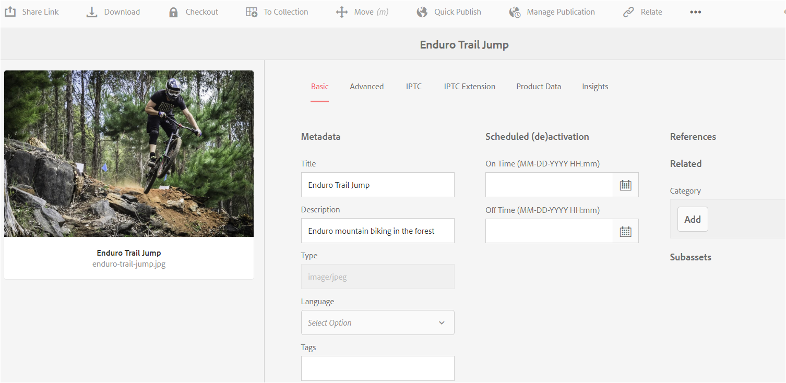

# 相关资产 {#related-assets}

[!DNL Adobe Experience Manager Assets]允许您使用相关资源功能，根据组织的需求手动关联资源。 例如，您可以将许可证文件与类似主题中的资产或图像/视频相关联。 您可以关联共享某些通用属性的资源。 您还可以使用该功能创建资源之间的源/派生关系。 例如，如果您有一个从INDD文件生成的PDF文件，则可以将PDF文件与其源INDD文件相关联。

使用此功能，您可以灵活地与供应商或机构共享低分辨率PDF文件或JPG文件，并且仅在提出请求时才提供高分辨率INDD文件。

>[!NOTE]
>
>只有对资源具有编辑权限的用户才能关联和取消关联资源。

## 关联资源 {#relating-assets}

1. 从[!DNL Experience Manager]界面中，打开要关联的资源的&#x200B;**[!UICONTROL 属性]**&#x200B;页面。

   

   *图： [!DNL Assets] [!UICONTROL 属性]页面与资源相关。*

   或者，从列表视图中选择资产。

   

   您还可以从收藏集中选择资产。

   

1. 要将其他资源与您选择的资源相关联，请在工具栏中单击&#x200B;**[!UICONTROL 相关]** 。
1. 执行下列操作之一：

   * 若要关联资产的源文件，请从列表中选择&#x200B;**[!UICONTROL Source]**。
   * 若要关联派生文件，请从列表中选择&#x200B;**[!UICONTROL 派生]**。
   * 若要在资产之间创建双向关系，请从列表中选择&#x200B;**[!UICONTROL 其他]**。

1. 从&#x200B;**[!UICONTROL 选择资源]**&#x200B;屏幕中，导航到要关联的资源的位置，然后选择该资源。

   

1. 单击&#x200B;**[!UICONTROL 确认]**。
1. 单击&#x200B;**[!UICONTROL 确定]**&#x200B;关闭对话框。 根据您在步骤3中选择的关系，**[!UICONTROL 相关]**&#x200B;部分中的相应类别下列出了相关资产。 例如，如果您相关的资源是当前资源的源文件，则它列在&#x200B;**[!UICONTROL Source]**&#x200B;下。

   

1. 要取消关联某个资源，请在工具栏中单击&#x200B;**[!UICONTROL 取消关联]** 。

1. 从&#x200B;**[!UICONTROL 删除关系]**&#x200B;对话框中选择要取消关联的资源，然后单击&#x200B;**[!UICONTROL 取消关联]**。

   

1. 单击&#x200B;**[!UICONTROL 确定]**&#x200B;关闭对话框。 您为其删除关系的资源将从&#x200B;**[!UICONTROL 相关]**&#x200B;部分下的相关资源列表中删除。

## 翻译相关资源 {#translating-related-assets}

使用相关资源功能在资源之间创建源/派生关系在翻译工作流中也很有帮助。 对派生资源运行翻译工作流时，[!DNL Experience Manager Assets]会自动获取源文件引用的任何资源并将其包含用于翻译。 通过这种方式，源资产引用的资产将随源和派生资产一起转换。 例如，假定您的英语副本包含派生的资源及其源文件，如图所示。

如果源文件与另一个资产相关，[!DNL Experience Manager Assets]将获取引用的资产并将其包含以供翻译。

*图：要包含以进行翻译的相关资源的Source资源。*

1. 执行[创建翻译项目](translation-projects.md#create-a-new-translation-project)中的步骤，将源文件夹中的资源翻译为目标语言。 例如，在本例中，请将您的资产翻译为法语。

1. 从[!UICONTROL 项目]页面，打开翻译文件夹。

1. 单击项目拼贴以打开详细信息页面。

   

1. 单击翻译作业信息卡下方的省略号可查看翻译状态。

   

1. 选择资源，然后单击工具栏中的&#x200B;**[!UICONTROL 在Assets中展现]**&#x200B;以查看资源的翻译状态。

   

1. 要验证与源相关的资产是否已翻译，请单击源资产。

1. 选择与源相关的资源，然后单击Assets中的&#x200B;**[!UICONTROL 显示]**。 将显示已翻译的相关资产。
