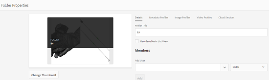
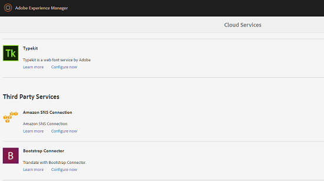
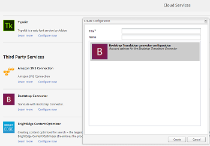

# 在文件夹中应用翻译云服务 {#applying-translation-cloud-services-to-folders}

[!DNL Adobe Experience Manager]允许您使用所选翻译提供商提供的基于云的翻译服务，以确保您的资产已根据您的要求进行翻译。

您可以将翻译云服务直接应用于资源文件夹，以便在翻译工作流期间使用这些服务。

## 应用翻译服务 {#applying-the-translation-services}

将翻译云服务直接应用于资源文件夹，让您在创建或更新翻译工作流时无需配置翻译服务。

1. 从[!DNL Assets]用户界面中，选择要应用翻译服务的文件夹。
1. 在工具栏中，单击&#x200B;**[!UICONTROL 属性]**&#x200B;以显示&#x200B;**[!UICONTROL 文件夹属性]**&#x200B;页面。

   

1. 导航到&#x200B;**[!UICONTROL 云服务]**&#x200B;选项卡。
1. 从Cloud Service配置列表中，选择所需的翻译提供商。 例如，如果要从Microsoft获得翻译服务，请选择&#x200B;**[!UICONTROL Microsoft翻译器]**。

   

1. 选择翻译提供商的连接器。

   

1. 在工具栏中，单击&#x200B;**[!UICONTROL 保存]**，然后单击&#x200B;**[!UICONTROL 确定]**&#x200B;以关闭对话框。翻译服务将应用于文件夹。

## 应用自定义翻译连接器  {#applying-custom-translation-connector}

如果要为要在翻译工作流程中使用的翻译服务应用自定义连接器。 要应用自定义连接器，请首先从“包管理器”安装连接器。 然后，从云服务控制台配置连接器。 配置连接器后，该连接器会显示在[应用翻译服务](transition-cloud-services.md#applying-the-translation-services)中所述的“云服务”选项卡的连接器列表中。 应用自定义连接器并运行翻译工作流后，翻译项目的&#x200B;**[!UICONTROL 翻译摘要]**&#x200B;拼贴会在&#x200B;**[!UICONTROL 提供程序]**&#x200B;和&#x200B;**[!UICONTROL 方法]**&#x200B;标题下显示连接器详细信息。

1. 从包管理器安装连接器。
1. 单击[!DNL Experience Manager]徽标，然后导航到&#x200B;**[!UICONTROL 工具]** > **[!UICONTROL 部署]** > **[!UICONTROL 云服务]**。
1. 在&#x200B;**[!UICONTROL 云服务]**&#x200B;页面的&#x200B;**[!UICONTROL 第三方服务]**&#x200B;下找到安装的连接器。

   

1. 单击&#x200B;**[!UICONTROL 立即配置]**&#x200B;链接以打开&#x200B;**[!UICONTROL 创建配置]**&#x200B;对话框。

   

1. 指定连接器的标题和名称，然后单击&#x200B;**[!UICONTROL 创建]**。 自定义连接器位于[应用翻译服务](#applying-the-translation-services)步骤 5 中所述的&#x200B;**[!UICONTROL 云服务]**&#x200B;选项卡的连接器列表中。
1. 在应用自定义连接器后，运行[创建翻译项目](translation-projects.md)中描述的任何翻译工作流。 在&#x200B;**[!UICONTROL 项目]**&#x200B;控制台中验证翻译项目的&#x200B;**[!UICONTROL 翻译摘要]**&#x200B;拼贴中连接器的详细信息。

   
