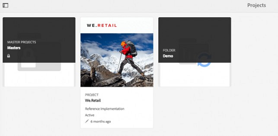

# 创建翻译项目 {#creating-translation-projects}

要创建语言副本，请触发[!DNL Experience Manager]用户界面的“引用”边栏下提供的以下语言副本工作流之一。

* **创建并翻译**：在此工作流中，要翻译的资产将被复制到要翻译的语言的语言根中。 此外，根据您选择的选项，将为项目控制台中的资产创建翻译项目。 根据设置，可以手动启动翻译项目，也可以允许在创建翻译项目后立即自动运行翻译项目。

* **更新语言副本**：运行此工作流以翻译其他资源组，并将其包含在特定区域设置的语言副本中。 在这种情况下，已翻译资产会添加到已包含先前已翻译资产的目标文件夹。

>[!PREREQUISITES]
>
>* 创建翻译项目的用户是组`projects-administrators`的成员。
>* 翻译服务提供商支持二进制文件的翻译。

## 创建和翻译工作流 {#create-and-translate-workflow}

您可以使用创建和翻译工作流首次生成特定语言的语言副本。 工作流提供了以下选项：

* 仅创建结构。
* 创建翻译项目。
* 添加到现有翻译项目。

### 只创建结构 {#create-structure-only}

使用“ **[!UICONTROL 仅创建结构]** ”选项可在目标语言根目录中创建目标文件夹层次结构，以匹配源语言根目录中源文件夹的层次结构。 在这种情况下，源资产会复制到目标文件夹。 但是，不会生成翻译项目。

1. 在[!DNL Assets]界面中，选择要在目标语言根目录中创建结构的源文件夹。

1. 打开&#x200B;**[!UICONTROL 引用]**&#x200B;窗格，然后单击&#x200B;**[!UICONTROL 副本]**&#x200B;下的&#x200B;**[!UICONTROL 语言副本]**。

   

1. 单击&#x200B;**[!UICONTROL 创建并翻译]**。 从&#x200B;**[!UICONTROL 目标语言]**&#x200B;列表中，选择要为其创建文件夹结构的语言。

1. 从&#x200B;**[!UICONTROL 项目]**&#x200B;列表中，选择&#x200B;**[!UICONTROL 仅创建结构]**。

1. 单击&#x200B;**[!UICONTROL 创建]**。目标语言的新结构列在&#x200B;**[!UICONTROL 语言副本]**&#x200B;下。

   

1. 单击列表中的结构，然后单击&#x200B;**[!UICONTROL 在Assets中展现]**&#x200B;以导航到目标语言中的文件夹结构。

   

### 创建翻译项目 {#create-a-new-translation-project}

如果使用此选项，则要翻译的资产将会复制到要翻译的语言的语言根中。 根据您选择的选项，将为项目控制台中的资产创建翻译项目。 根据设置，翻译项目可以手动启动，也可以在创建翻译项目后立即自动运行。

1. 在[!DNL Assets]用户界面中，选择要为其创建语言副本的源文件夹。
1. 打开&#x200B;**[!UICONTROL 引用]**&#x200B;窗格，然后单击&#x200B;**[!UICONTROL 副本]**&#x200B;下的&#x200B;**[!UICONTROL 语言副本]**。

   

1. 单击底部的&#x200B;**[!UICONTROL 创建并翻译]**。

1. 从&#x200B;**[!UICONTROL 目标语言]**&#x200B;列表中，选择要为其创建文件夹结构的语言。

1. 从&#x200B;**[!UICONTROL 项目]**&#x200B;列表中，选择&#x200B;**[!UICONTROL 新建翻译项目]**。

1. 在&#x200B;**[!UICONTROL 项目标题]**&#x200B;字段中，输入项目标题。

1. 单击&#x200B;**[!UICONTROL 创建]**。源文件夹中的[!DNL Assets]将复制到您在步骤4中选择的区域设置的目标文件夹。

   

1. 要导航到文件夹，请选择语言副本，然后单击&#x200B;**[!UICONTROL 在Assets中显示]**。

   

1. 导航到“项目”控制台。 翻译文件夹将会复制到项目控制台。

   

1. 打开文件夹以查看翻译项目。

   

1. 单击项目以打开详细信息页面。

   

1. 要查看翻译作业的状态，请单击&#x200B;**[!UICONTROL 翻译作业]**&#x200B;拼贴底部的省略号。

   

   有关作业状态的更多详细信息，请参阅[监控翻译作业的状态](/help/sites-administering/tc-manage.md#monitoring-the-status-of-a-translation-job)。

1. 导航到[!DNL Assets]用户界面，打开每个已翻译资源的[!UICONTROL 属性]页面以查看已翻译的元数据。

   

   *图：资源属性页面中已翻译的元数据。*

   >[!NOTE]
   >
   >此功能对资源和文件夹均可用。 选择资源而不是文件夹时，将复制语言根之前文件夹的整个层次结构，以创建资源的语言副本。

### 添加至现有翻译项目 {#add-to-existing-translation-project}

如果使用此选项，则对于运行以前的翻译工作流后添加到源文件夹中的资产，翻译工作流会运行。 只有新添加的资产才会复制到包含以前翻译的资产的目标文件夹。 在这种情况下，不会创建新的翻译项目。

1. 在[!DNL Assets] UI中，导航到包含未翻译资产的源文件夹。
1. 选择要翻译的资产，然后打开&#x200B;**[!UICONTROL “引用”窗格]**。**[!UICONTROL 语言副本]**&#x200B;部分显示当前可用的翻译副本数。
1. 单击&#x200B;**[!UICONTROL 副本]**&#x200B;下的&#x200B;**[!UICONTROL 语言副本]**。 此时将显示可用翻译副本列表。
1. 单击底部的&#x200B;**[!UICONTROL 创建并翻译]**。

1. 从&#x200B;**[!UICONTROL 目标语言]**&#x200B;列表中，选择要为其创建文件夹结构的语言。

1. 从“项 **[!UICONTROL 目]** ”列表中，选择 **[!UICONTROL 添加到现有翻译项目]** ，以在文件夹上运行翻译工作流。

   >[!NOTE]
   >
   >如果选择&#x200B;**[!UICONTROL 添加到现有翻译项目]**&#x200B;选项，则仅当项目设置与预先存在的项目的设置完全匹配时，才会将翻译项目添加到预先存在的项目。 否则，将创建一个新项目。

1. 从&#x200B;**[!UICONTROL 现有翻译项目]**&#x200B;列表中，选择一个项目以添加要翻译的资产。

1. 单击&#x200B;**[!UICONTROL 创建]**。要翻译的资产将添加到目标文件夹。更新的文件夹列在&#x200B;**[!UICONTROL 语言副本]**&#x200B;部分下。

   

1. 导航到项目控制台，然后打开您添加到的现有翻译项目。
1. 单击翻译项目可查看项目详细信息页面。

   

1. 单击&#x200B;**翻译作业**&#x200B;拼贴底部的省略号可查看翻译工作流中的资产。 翻译作业列表还会显示资源元数据和标记条目。这些条目指示资源的元数据和标记也会被翻译。

   >[!NOTE]
   >
   >如果删除标记或元数据的条目，则不会为任何资源翻译标记或元数据。

   >[!NOTE]
   >
   >如果添加到翻译作业的资产包含子资产，请选择子资产并移除它们，以便翻译在没有出现任何错误的情况下继续进行。

1. 要开始资产的翻译，请单击&#x200B;**[!UICONTROL 翻译作业]**&#x200B;拼贴上的箭头，然后从列表中选择&#x200B;**[!UICONTROL 开始]**。

   

   消息会通知翻译作业已开始。

1. 要查看翻译作业的状态，请单击&#x200B;**[!UICONTROL 翻译作业]**&#x200B;拼贴底部的省略号。

   

   有关更多详细信息，请参阅[监控翻译作业的状态](/help/sites-administering/tc-manage.md#monitoring-the-status-of-a-translation-job)。

1. 翻译完成后，状态将更改为“准备好审查”。 导航到[!DNL Assets]用户界面，并打开每个已翻译资产的属性页面以查看已翻译元数据。

## 更新语言副本 {#update-language-copies}

运行此工作流可翻译任何其他资产集，并将其包含在特定区域设置的语言副本中。 在这种情况下，已翻译资产会添加到已包含先前已翻译资产的目标文件夹。 根据选项选择，将为新资产创建翻译项目或更新现有翻译项目。 更新语言副本工作流包含以下选项：

* 创建翻译项目
* 添加至现有翻译项目

### 创建翻译项目 {#create-a-new-translation-project-1}

如果使用此选项，将为要更新语言副本的资源集创建翻译项目。

1. 从[!DNL Assets] UI中，选择添加资产的源文件夹。
1. 打开&#x200B;**[!UICONTROL 引用]**&#x200B;窗格，然后单击&#x200B;**[!UICONTROL 副本]**&#x200B;下的&#x200B;**[!UICONTROL 语言副本]**&#x200B;以显示语言副本列表。
1. 选中&#x200B;**[!UICONTROL 语言副本]**&#x200B;前面的复选框，然后选择相应区域设置的目标文件夹。

   

1. 单击底部的&#x200B;**[!UICONTROL 更新语言副本]**。

1. 从&#x200B;**[!UICONTROL 项目]**&#x200B;列表中，选择&#x200B;**[!UICONTROL 新建翻译项目]**。

1. 在&#x200B;**[!UICONTROL 项目标题]**&#x200B;字段中，输入项目标题。

1. 单击&#x200B;**[!UICONTROL 开始]**。
1. 导航到“项目”控制台。 翻译文件夹将会复制到项目控制台。

   

1. 打开文件夹以查看翻译项目。

   

1. 单击项目以打开详细信息页面。

   

1. 要开始资产的翻译，请单击&#x200B;**[!UICONTROL 翻译作业]**&#x200B;拼贴上的箭头，然后从列表中选择&#x200B;**[!UICONTROL 开始]**。

   

   消息会通知翻译作业已开始。

1. 要查看翻译作业的状态，请单击&#x200B;**[!UICONTROL 翻译作业]**&#x200B;拼贴底部的省略号。

   

   有关作业状态的更多详细信息，请参阅[监控翻译作业的状态](../sites-administering/tc-manage.md#monitoring-the-status-of-a-translation-job)。

1. 导航到[!DNL Assets]用户界面，并打开每个已翻译资产的属性页面以查看已翻译元数据。

### 添加至现有翻译项目 {#add-to-existing-translation-project-1}

如果使用此选项，则资源集将添加到现有翻译项目中，以更新所选区域设置的语言副本。

1. 从[!DNL Assets] UI中，选择添加资产文件夹的源文件夹。
1. 打开&#x200B;**[!UICONTROL 引用窗格]**，然后单击&#x200B;**[!UICONTROL 副本]**&#x200B;下的&#x200B;**[!UICONTROL 语言副本]**&#x200B;以显示语言副本列表。

   

1. 选中&#x200B;**[!UICONTROL 语言副本]**&#x200B;前面的复选框，这将选择所有语言副本。除与您要翻译的区域设置对应的语言副本外，取消选择其他副本。

   

1. 单击底部的&#x200B;**[!UICONTROL 更新语言副本]**。

1. 从&#x200B;**[!UICONTROL 项目]**&#x200B;列表中，选择&#x200B;**[!UICONTROL 添加到现有翻译项目]**。

1. 从&#x200B;**[!UICONTROL 现有翻译项目]**&#x200B;列表中，选择一个项目以添加要翻译的资产。

1. 单击&#x200B;**[!UICONTROL 开始]**。
1. 请参阅[添加到现有翻译项目](translation-projects.md#add-to-existing-translation-project)中的步骤9-14以完成其余过程。

## 创建临时语言副本 {#creating-temporary-language-copies}

运行翻译工作流以使用原始资产的已编辑版本更新语言副本时，将保留现有的语言副本，直到您批准已翻译资产为止。 [!DNL Adobe Experience Manager Assets]将新翻译的资产存储在临时位置，并在您明确批准这些资产后更新现有的语言副本。 如果您拒绝资产，则语言副本将保持不变。

1. 单击&#x200B;**[!UICONTROL 语言副本]**&#x200B;下的源根文件夹，您已为其创建了语言副本，然后单击&#x200B;**[!UICONTROL 在Assets中展现]**&#x200B;以在[!DNL Experience Manager Assets]中打开该文件夹。

   

1. 从[!DNL Assets]界面中，选择已翻译的资产，然后单击工具栏中的&#x200B;**[!UICONTROL 编辑]**&#x200B;以在编辑模式下打开该资产。
1. 编辑资产，然后保存更改。
1. 执行[添加到现有翻译项目](#add-to-existing-translation-project)过程的步骤2-14以更新语言副本。
1. 单击&#x200B;**[!UICONTROL 翻译作业]**&#x200B;拼贴底部的省略号。 从&#x200B;**[!UICONTROL 翻译作业]**&#x200B;页面中的资产列表中，您可以清楚地查看存储资产的翻译版本的临时位置。

   

1. 选中&#x200B;**[!UICONTROL 标题]**&#x200B;旁边的复选框。
1. 在工具栏中，单击&#x200B;**[!UICONTROL 接受翻译]** ，然后在对话框中单击&#x200B;**[!UICONTROL 接受]**，以使用已编辑资产的已翻译版本覆盖目标文件夹中的已翻译资产。

   >[!NOTE]
   >
   >要启用翻译工作流以更新目标资产，请接受资产和元数据。

   单击&#x200B;**[!UICONTROL 拒绝翻译]** 可在目标区域设置根目录中保留资产的原始翻译版本，并拒绝编辑后的版本。

1. 要查看已翻译的元数据，请导航到[!DNL Assets]控制台并打开每个已翻译资产的[!UICONTROL 属性]页面。

## 提示和限制 {#tips-limitations}

* 如果您启动复杂资源(如PDF和[!DNL Adobe InDesign]文件)的翻译工作流，则不会提交其子资源或演绎版（如果有）进行翻译。
* 如果使用机器翻译，则不会翻译资产二进制文件。
