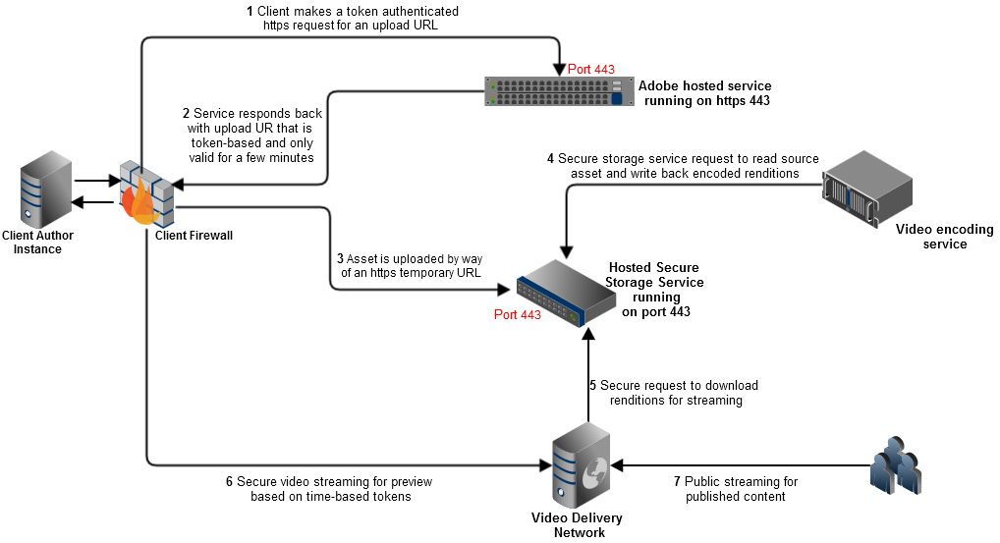
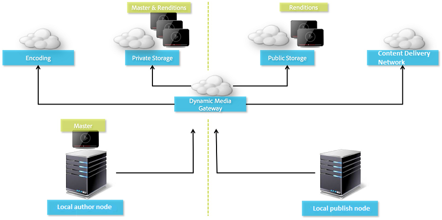
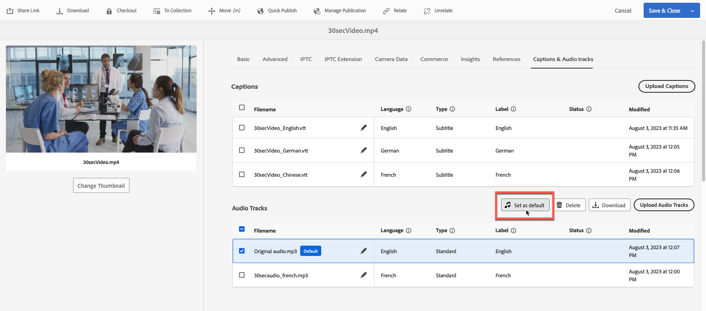
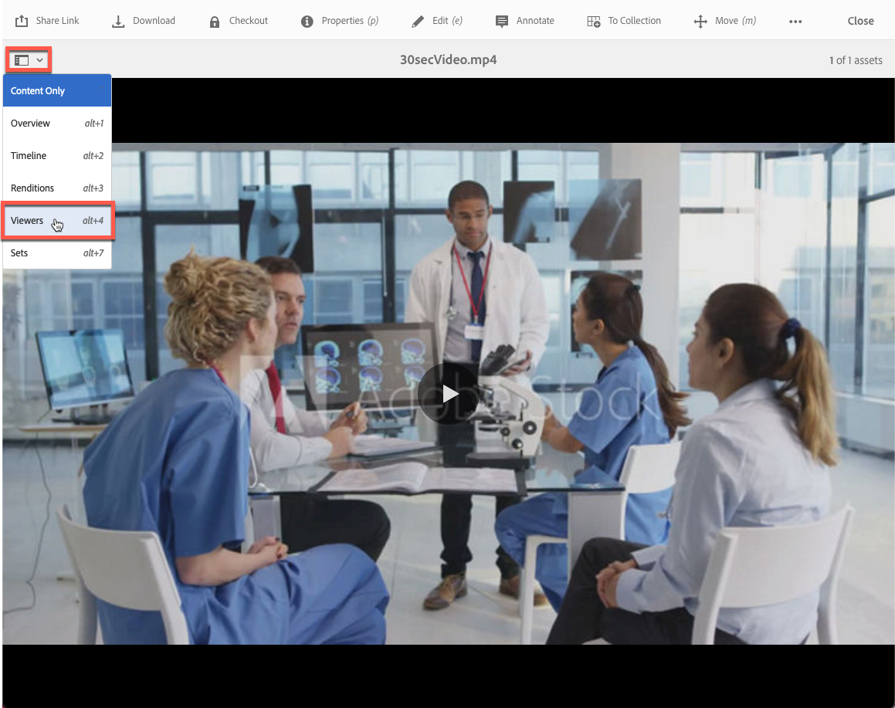

# Dynamic Media 中的视频 {#video}

本节介绍如何在Dynamic Media中使用视频。

## 快速入门：视频 {#quick-start-videos}

以下分步工作流描述可帮助您快速启动和运行Dynamic Media中的自适应视频集。 每一步之后，都会交叉引用主题标题，您可以在其中查找更多信息。

>[!IMPORTANT]
>
>在Dynamic Media中处理视频之前，请确保您的Adobe Experience Manager管理员已在Dynamic Media - Scene7模式或混合模式下启用和配置Dynamic Media云服务。
>
>* 请参阅配置Dynamic Media - Scene7模式中的[配置Dynamic Media云服务](/help/assets/config-dms7.md#configuring-dynamic-media-cloud-services)和[Dynamic Media - Scene7模式疑难解答](/help/assets/troubleshoot-dms7.md)。
>
>* 请参阅配置Dynamic Media — 混合模式中的[配置Dynamic Media云服务](/help/assets/config-dynamic.md#configuring-dynamic-media-cloud-services)。
>

1. **通过执行以下操作上传Dynamic Media视频**：

   * 创建自己的视频编码配置文件。 或者，您只需使用随Dynamic Media提供的预定义&#x200B;_自适应视频编码_&#x200B;配置文件即可。

      * [创建视频编码配置文件](/help/assets/video-profiles.md#creating-a-video-encoding-profile-for-adaptive-streaming)。
      * 最大输出视频编码分辨率为8,192 × 4,320或4,320 × 8,192.md。
      * 了解有关[视频编码最佳实践](#best-practices-for-encoding-videos)的更多信息。

   * 将视频处理配置文件关联到一个或多个要上传主源视频的文件夹。

      * [将视频配置文件应用到文件夹](/help/assets/video-profiles.md#applying-a-video-profile-to-folders)。
      * 了解有关[用于组织数字资产以使用处理配置文件的最佳实践的更多信息](/help/assets/organize-assets.md)。
      * 了解有关[组织数字资源](/help/assets/organize-assets.md)的详细信息。

   * 将您的主源视频上传到文件夹。 将视频添加到文件夹时，会根据您分配给该文件夹的视频处理配置文件对其进行编码。

      * Dynamic Media主要支持最长30分钟且最小分辨率大于25×25的短格式视频。
      * 支持的最大输入视频分辨率为16,384 × 16,384。
      * 您可以上传每个大小最大为15 GB的视频文件。
      * [上传您的视频](/help/assets/managing-video-assets.md#upload-and-preview-video-assets)。
      * 了解有关[支持的输入文件格式](/help/assets/assets-formats.md#supported-multimedia-formats)的详细信息。

   * 从资源或工作流视图中监视[视频编码进度](#monitoring-video-encoding-and-youtube-publishing-progress)。

1. **通过执行以下任一操作管理您的Dynamic Media视频**：

   * 组织、浏览和搜索视频资源

      * [组织数字资源](/help/assets/organize-assets.md)
详细了解[组织数字资产以使用处理配置文件的最佳实践](organize-assets.md)

      * [搜索视频资源](search-assets.md#custompredicates)或[搜索资源](/help/assets/search-assets.md)

   * 预览和发布视频资产

      * 查看源视频、视频的编码呈现版本及其关联的缩略图：

        [预览视频](managing-video-assets.md#upload-and-preview-video-assets)或[预览资源](previewing-assets.md)
        [查看视频演绎版](video-renditions.md)
        [管理视频演绎版](manage-assets.md#managing-renditions)

      * [管理查看器预设](managing-viewer-presets.md)
      * [发布资源](publishing-dynamicmedia-assets.md)

   * 使用视频元数据

      * 查看已编码视频演绎版的属性，如帧速率、音频和视频比特率以及编解码器：

        [查看视频演绎版属性](video-renditions.md)

      * 编辑视频的属性，如标题、描述和标记、自定义元数据字段：

        [编辑视频属性](manage-assets.md#editing-properties)

      * [管理数字资源的元数据](metadata.md)
      * [元数据架构](metadata-schemas.md)

   * 审核、批准和注释视频，并保持完整的版本控制

      * [为视频添加批注](managing-video-assets.md#annotate-video-assets)或[为资源添加批注](manage-assets.md#annotating)

      * [创建一个版本](manage-assets.md#asset-versioning)
      * [将工作流应用于资源](assets-workflow.md)或查看[启动资源工作流](manage-assets.md#starting-a-workflow-on-an-asset)

      * [审核文件夹资产](bulk-approval.md)
      * [项目](../sites-authoring/projects.md)

1. **通过执行以下操作之一发布Dynamic Media视频**：

   * 如果您使用Adobe Experience Manager作为Web内容管理系统，则可以直接将视频添加到网页。

      * [将视频添加到网页](adding-dynamic-media-assets-to-pages.md)。

   * 如果您使用的是第三方Web内容管理系统，则可以将视频链接或嵌入到网页。

      * 使用URL集成视频：

        [将URL链接到您的Web应用程序](linking-urls-to-yourwebapplication.md)。

      * 在网页上使用嵌入代码集成视频：

        [在网页上嵌入视频查看器](embed-code.md)。

   * [生成视频报告](#viewing-video-reports)。

   * [向视频添加字幕](#adding-captions-to-video)。

## 在Dynamic Media中处理视频 {#working-with-video-in-dynamic-media}

Dynamic Media中的视频是一款端到端解决方案，可让您轻松发布高质量自适应视频，以便跨多个屏幕(包括台式机、iOS、Android™、BlackBerry®和Windows移动设备)进行流式传输。 自适应视频集对使用不同比特率和格式（例如400 kbps、800 kbps和1000 kbps）编码的相同视频的版本进行分组。 台式计算机或移动设备检测可用带宽。

例如，在iOS移动设备上，它会检测3G、4G或Wi-Fi等带宽。 然后，它自动从自适应视频集内的各种视频比特率中选择正确的编码视频。 视频将流式传输到台式机、移动设备或平板电脑。

此外，如果桌面或移动设备上的网络状况发生更改，则视频质量会自动进行动态切换。 此外，如果客户在桌面上进入全屏模式，则自适应视频集将使用更好的分辨率进行响应，从而改善客户的观看体验。 自适应视频集可确保为跨多个屏幕和设备查看Dynamic Media视频的客户提供最佳回放。

视频播放器用来确定在播放期间要播放或选择的已编码视频的逻辑基于以下算法：

1. 视频播放器根据比特率加载初始视频片段，该比特率最接近在播放器本身中为“初始比特率”设置的值。
1. 视频播放器根据使用下列条件对带宽速度所做的更改进行切换：

   1. 播放器选择低于或等于估计带宽的最高带宽流。
   1. 播放器仅考虑可用带宽的80%。 然而，如果它正在切换，则更保守的是70%，以避免高估并立即切换回来。

有关算法的详细技术信息，请参阅[https://android.googlesource.com/platform/frameworks/av/+/master/media/libstagefright/httplive/LiveSession.cpp](https://android.googlesource.com/platform/frameworks/av/+/master/media/libstagefright/httplive/LiveSession.cpp)

对于管理单个视频和自适应视频集，支持以下内容：

* 以各种支持的格式上传视频，并将其编码到MP4 H.264以在多个屏幕上播放。 您可以使用预定义的自适应视频预设、单个视频编码预设或自定义自己的编码来控制视频的质量和大小。

   * 生成自适应视频集时，该视频集包含MP4视频。
   * **注意**：主/源视频未添加到自适应视频集。

* 所有HTML5视频查看器中的视频字幕。
* 使用完整的元数据支持来组织、浏览和搜索视频，从而高效管理视频资产。
* 将自适应视频集交付到Web以及桌面和移动设备，包括iPhone、iPad、Android™、BlackBerry®和Windows Phone。

各种iOS平台支持自适应视频流。 请参阅[Dynamic Media查看器参考指南](https://experienceleague.adobe.com/zh-hans/docs/dynamic-media-developer-resources/library/viewers-aem-assets-dmc/video/c-html5-video-reference#video)。

Dynamic Media支持MP4 H.264视频的移动视频播放。<!-- LINK IS 404 WITH NO SUITABLE REPLACEMENT You can find BlackBerry&reg; devices that support this video format at the following: [Supported video formats on BlackBerry&reg;](https://support.blackberry.com/kb/articleDetail?ArticleNumber=000005482). -->

您可以在以下位置找到支持此视频格式的Windows设备： [Windows Phone 8](https://learn.microsoft.com/en-us/windows/uwp/audio-video-camera/supported-codecs)支持的媒体编解码器

* 使用Dynamic Media视频查看器预设播放视频，包括以下内容：

   * 单个视频查看器。
   * 混合媒体查看器，将视频和图像内容组合在一起。

* 配置视频播放器以满足您的品牌推广需求。
* 将视频与简单URL或嵌入代码集成到您的网站、移动网站或移动应用程序。

<!-- See [Dynamic video playback](https://s7d9.scene7.com/s7/uvideo.jsp?asset=GeoRetail/Mop_AVS&config=GeoRetail/Universal_Video1&stageSize=640,480) sample. -->

另请参阅[仅适用于Experience Manager Assets和Dynamic Media Classic的查看器](https://experienceleague.adobe.com/zh-hans/docs/dynamic-media-developer-resources/library/viewers-aem-assets-dmc/c-html5-s7-aem-asset-viewers#viewers-aem-assets-dmc)和[仅适用于Experience Manager资源的查看器](https://experienceleague.adobe.com/zh-hans/docs/dynamic-media-developer-resources/library/viewers-for-aem-assets-only/c-html5-aem-asset-viewers#viewers-for-aem-assets-only)。

## 最佳实践：使用HTML5视频查看器 {#best-practice-using-the-html-video-viewer}

Dynamic Media HTML5视频查看器预设是可靠的视频播放器。 您可以使用它们来避免与HTML5视频播放相关的许多常见问题。 此外，还存在着与移动设备相关的问题，例如缺乏自适应比特率流交付以及桌面浏览器访问范围有限。

在播放器的设计方面，您可以使用标准Web开发工具来设计视频播放器的功能。 例如，您可以使用HTML5和CSS设计按钮、控件和自定义海报图像背景，以帮助您通过自定义外观触及客户。

在查看器的播放方面，它将自动检测浏览器的视频功能。 然后，它使用HLS（HTTP实时流）或DASH（HTTP上的动态自适应流）（也称为自适应比特率流）提供视频。 或者，如果不存在这些投放方法，则改用HTML5 progressive。

通过将以下内容组合到单个播放器中：

* 能够使用HTML5和CSS设计播放组件
* 具有嵌入的播放
* 根据浏览器的功能使用自适应流和渐进式流

您可以将富媒体内容的范围扩展到桌面和移动设备用户，并确保提供简化的视频体验。

另请参阅[关于HTML5查看器](https://experienceleague.adobe.com/zh-hans/docs/dynamic-media-developer-resources/library/viewers-for-aem-assets-only/c-html5-aem-asset-viewers#viewers-for-aem-assets-only)。

### 使用HTML5视频查看器在台式计算机和移动设备上播放视频 {#playback-of-video-on-desktop-computers-and-mobile-devices-using-the-html-video-viewer}

对于桌面和移动设备自适应视频流，用于比特率切换的视频基于自适应视频集中的所有MP4视频。

使用DASH或HLS或渐进式视频下载即可进行视频播放。 在Experience Manager的先前版本（如6.0、6.1和6.2）中，视频是通过HTTP进行流式传输的。

在Experience Manager 6.3及更高版本中，视频现在通过HTTPS(即DASH或HLS)进行流式传输，因为DM网关服务URL也始终使用HTTPS。 此默认行为对客户没有影响。 视频流始终通过HTTPS进行，除非浏览器不支持。 （见下表）。 因此，

* 如果您的HTTPS网站支持HTTPS视频流，则可以使用流式传输。
* 如果您的HTTP网站采用HTTPS视频流，则流式传输不会有问题，并且Web浏览器不会出现混合内容问题。

DASH是国际标准，HLS是Apple标准。 两者都用于自适应视频流。 而且，这两种技术都会根据网络带宽容量自动调整回放。 它还允许客户在视频中的任意位置“搜寻”，而无需等待下载视频的其余部分。

渐进式视频的传送是通过在用户的桌面系统或移动设备上本地下载并存储视频来实现的。

下表介绍了使用Dynamic Media视频查看器在桌面计算机和移动设备上播放视频的设备、浏览器和方法。

<table>
 <tbody>
  <tr>
   <td><strong>设备</strong></td>
   <td><strong>浏览器</strong></td>
   <td><strong>视频播放模式</strong></td>
  </tr>
  <tr>
   <td>桌面</td>
   <td>Internet Explorer 9和10</td>
   <td>渐进式下载。</td>
  </tr>
  <tr>
   <td>桌面</td>
   <td>Internet Explorer 11+</td>
   <td>在Windows 8和Windows 10上 — 每当请求DASH*或HLS时，强制使用HTTPS。 已知限制： DASH*或HLS上的HTTP在此浏览器/操作系统组合中不起作用<br /> <br /> Windows 7上 — 渐进式下载。 使用标准逻辑选择HTTP与HTTPS协议。</td>
  </tr>
  <tr>
   <td>桌面</td>
   <td>Firefox 23-44</td>
   <td>渐进式下载。</td>
  </tr>
  <tr>
   <td>桌面</td>
   <td>Firefox 45或更高版本</td>
   <td>DASH*或HLS自适应比特率流。</td>
  </tr>
  <tr>
   <td>桌面</td>
   <td>Chrome</td>
   <td>DASH*或HLS自适应比特率流。</td>
  </tr>
  <tr>
   <td>桌面</td>
   <td>Safari (Mac)</td>
   <td>HLS自适应比特率流。</td>
  </tr>
  <tr>
   <td>移动设备</td>
   <td>Chrome(Android™ 6或更早版本)</td>
   <td>渐进式下载。</td>
  </tr>
  <tr>
   <td>移动设备</td>
   <td>Chrome (Android™ 7或更高版本)</td>
   <td>DASH*或HLS自适应比特率流。</td>
  </tr>
  <tr>
   <td>移动设备</td>
   <td>Android™（默认浏览器）</td>
   <td>渐进式下载。</td>
  </tr>
  <tr>
   <td>移动设备</td>
   <td>Safari (iOS)</td>
   <td>HLS自适应比特率流。</td>
  </tr>
  <tr>
   <td>移动设备</td>
   <td>Chrome (iOS)</td>
   <td>HLS自适应比特率流。</td>
  </tr>
  <tr>
   <td>移动设备</td>
   <td>BlackBerry®</td>
   <td>DASH*或HLS自适应比特率流。/td&gt;
  </tr>
 </tbody>
</table>

## Dynamic Media视频解决方案的架构 {#architecture-of-dynamic-media-video-solution}

下图显示了通过DMGateway（在Dynamic Media混合模式下）上传和编码并可供公众使用的视频的整体创作工作流。



## 视频的混合发布架构 {#hybrid-publishing-architecture-for-videos}



## 视频编码最佳实践 {#best-practices-for-encoding-videos}

如果您已启用Dynamic Media并设置了视频云服务，则&#x200B;**Dynamic Media编码视频**&#x200B;工作流会对视频进行编码。 此工作流会捕获工作流进程历史记录和失败信息。如果您已启用Dynamic Media并设置了视频云服务，则在您上传视频时，**[!UICONTROL Dynamic Media编码视频]**&#x200B;工作流将自动生效。 （如果您未使用Dynamic Media，则&#x200B;**[!UICONTROL DAM更新资产]**&#x200B;工作流将生效。）

<!-- DEAD The following are best-practice tips for encoding source video files.

For advice about video encoding, see [Video Encoding Basics](https://www.adobe.com/go/learn_s7_encoding_en).

* [Streaming 101: The Basics — Codecs, Bandwidth, Data Rate, and Resolution](https://www.adobe.com/go/learn_s7_streaming101_en). -->

### Source视频文件 {#source-video-files}

编码视频文件时，请使用可能具有最高质量的源视频文件。 避免使用以前编码的视频文件，因为这些文件已压缩，进一步编码会创建质量不佳的视频。

* Dynamic Media主要支持最长30分钟且最小分辨率大于25×25的短格式视频。
* 您可以上载每个大小最大为15 GB的主源视频文件。

下表描述了编码源视频文件之前必须具有的建议大小、长宽比和最小比特率：

| 大小 | 宽高比 | 最小比特率 |
|--- |--- |--- |
| 1024 × 768 | 4:3 | 大多数视频为4500 kbps。 |
| 1280 × 720 | 16:9 | 3000 - 6000 kbps，具体取决于视频中的移动量。 |
| 1920 × 1080 | 16:9 | 6000 - 8000 kbps，具体取决于视频中的运动量。 |

### 获取文件的元数据 {#obtaining-a-file-s-metadata}

您可以使用视频编辑工具查看文件的元数据，或使用专为获取元数据而设计的应用程序来获取文件的元数据。 以下是使用第三方应用程序MediaInfo获取视频文件元数据的说明：

1. 转到[MediaInfo下载](https://mediaarea.net/en/MediaInfo/Download)。
1. 选择并下载GUI版本的安装程序，然后按照安装说明进行操作。
1. 安装后，右键单击视频文件（仅限Windows）并选择MediaInfo，或者打开MediaInfo并将视频文件拖到应用程序中。 您会看到与视频文件关联的所有元数据，包括其宽度、高度和fps。

### 宽高比 {#aspect-ratio}

在为主视频文件选择或创建视频编码预设时，请确保预设的长宽比与主视频文件的长宽比相匹配。 长宽比是视频的宽高比。

要确定视频文件的纵横比，请获取文件的元数据，并注意文件的宽度和高度。 请参阅上述获取文件的元数据。 然后使用此公式来确定纵横比：

宽度/高度=纵横比

下表描述了公式结果如何转换为常见的宽高比选项：

| 公式结果 | 宽高比 |
|--- |--- |
| 1.33 | 4:3 |
| 0.75 | 3:4 |
| 1.78 | 16:9 |
| 0.56 | 9:16 |

例如，宽度为1440×高度为1080的视频的长宽比为1440/1080，即1.33。在这种情况下，您可以选择宽高比为4:3的视频编码预设来编码视频文件。

### 比特率 {#bitrate}

比特率是经过编码以构成视频播放一秒的数据量。 比特率以千位/秒(Kbps)为测量单位。

>[!NOTE]
>
>由于所有的编解码器都使用有损压缩，因此比特率是决定视频质量的最重要因素。 有损压缩越是压缩视频文件，质量就越低。 因此，如果所有其他特性（分辨率、帧速率和编解码器）相等，则比特率越低，压缩文件的质量就越低。

在选择比特率编码时，您可以选择两种类型：

* **[!UICONTROL 恒定比特率编码]** (CBR) — 在CBR编码过程中，比特率或每秒比特数在整个编码过程中保持不变。 CBR编码会在整个视频中将设置的数据速率保留到您的设置。 此外，CBR编码不会优化媒体文件的质量，但会节省存储空间。
如果您的视频在整个视频中包含类似的运动级别，请使用CBR。 CBR最常用于流视频内容。 另请参阅[使用自定义添加的视频编码参数](/help/assets/video-profiles.md#using-custom-added-video-encoding-parameters)。

* **[!UICONTROL 可变比特率编码]** (VBR) - VBR编码会根据压缩程序所需的数据来向下调整数据速率，并将其调整到您设置的上限。 此功能意味着在VBR编码过程中，媒体文件的比特率会根据媒体文件的比特率需求动态增加或减少。
VBR编码时间较长，但产生的结果最理想；媒体文件的质量更好。 VBR最常用于http渐进式视频内容交付。

何时使用VBR而非CRB？
在选择VBR与CBR时，几乎总是建议您为媒体文件使用VBR。 VBR以具有竞争力的比特率提供更高质量的文件。 使用VBR时，请确保使用两遍编码，并将最大比特率设置为目标视频比特率的1.5倍。

选择视频编码预设时，请记住目标最终用户的连接速度。 选择数据速率为该速度80%的预设。 例如，如果目标最终用户的连接速度为1000 Kbps，则最佳预设为视频数据速率为800 Kbps的预设。

此表描述了典型连接速度的数据速率。

| 速度(Kbps) | 连接类型 |
|--- |--- |
| 256 | 拨号连接。 |
| 800 | 典型的移动连接。 对于此连接，请将3G体验的数据速率目标定在400到800之间。 |
| 2000 | 典型的宽带台式机连接。 对于这种连接，数据速率目标在800-2000 Kbps范围内，大多数目标平均为1200-1500 Kbps。 |
| 5000 | 典型的高宽带连接。 不建议在此上限范围内进行编码，因为大多数消费者无法以这种速度进行视频交付。 |

### 解决方法 {#resolution}

**分辨率**&#x200B;描述视频文件的高度和宽度（以像素为单位）。 大多数源视频都以高分辨率存储(例如，1920 × 1080)。 为了流传输目的，源视频被压缩成较小的分辨率(640 × 480或更小)。

分辨率和数据速率是决定视频质量的两个相互关联的因素。 要保持相同的视频质量，视频文件中的像素数越高（分辨率越高），数据速率必须越高。 例如，假定分辨率为320×240的视频文件和640×480分辨率的视频文件中每帧的像素数：

| 解决方法 | 每帧的像素 |
|--- |--- |
| 320 × 240 | 76,800 |
| 640 × 480 | 307,200 |

640 × 480文件的每帧像素是其他像素的四倍。 要获得这两个示例分辨率的相同数据速率，对640 × 480文件应用四倍压缩，这会降低视频质量。 因此，250 Kbps的视频数据速率在320 × 240分辨率下产生高质量观看，而不是在640 × 480分辨率下产生高质量观看。

通常，您使用的数据速率越高，视频的外观越好，使用的分辨率越高，则必须保持较高的数据速率（与较低的分辨率相比）。

由于分辨率和数据速率是相互关联的，因此在对视频进行编码时，您有两个选项：

* 选择数据速率，然后以最高分辨率进行编码，以适合您选择的数据速率。
* 选择分辨率，然后按照您选择的分辨率进行编码，以获得高质量视频。

当为主源视频文件选择（或创建）视频编码预设时，请使用此表定位正确的分辨率：

| 解决方法 | 高度(像素) | 屏幕大小 |
|--- |--- |--- |
| 240p | 240 | 小屏幕 |
| 300p | 300 | 通常用于移动设备的小屏幕 |
| 360p | 360 | 小屏幕 |
| 480p | 480 | Medium屏幕 |
| 720p | 720 | 大屏幕 |
| 1080p | 1080 | 高清大屏幕 |

支持的最大输入视频分辨率为16,384 × 16,384。 最大输出视频编码分辨率为8,192 × 4,320或4,320 × 8,192。

### Fps（每秒帧数） {#fps-frames-per-second}

在美国和日本，大多数视频的录制速度为每秒29.97帧(fps)。 在欧洲，标准为25 fps。 然而，电影通常以24 fps拍摄。

选择与主源视频文件的fps速率匹配的视频编码预设。 例如，如果主源视频为25 fps，请选择具有25 fps的编码预设。 默认情况下，所有自定义编码都使用主源视频文件的fps。 因此，在创建视频编码预设时，无需明确指定fps设置。

### 视频编码维度 {#video-encoding-dimensions}

要获得最佳结果，请选择编码维度，以便源视频是所有已编码视频的整数倍。

要计算此比率，请将源宽度除以编码宽度以获得宽度比率。 然后，将源高度除以编码后的高度，以获得高度比。

如果生成的比例是整数，则表示视频得到最佳缩放。 如果生成的比例不是整数，则会通过在显示器上留下多余的像素伪像而影响视频质量。 当视频包含文本时，这种效果最为明显。

例如，假设源视频为1920 × 1080。 在下表中，三个编码的视频提供了要使用的最佳编码设置。

| 视频类型 | 宽度×高度 | 宽度比例 | 高宽比 |
|--- |--- |--- |--- |
| 源 | 1920 × 1080 | 1 | 1 |
| 已编码 | 960 × 540 | 2 | 2 |
| 已编码 | 640 × 360 | 3 | 3 |
| 已编码 | 480 × 270 | 4 | 4 |

### 编码视频文件格式 {#encoded-video-file-format}

Dynamic Media建议使用MP4 H.264视频编码预设。 由于MP4文件使用H.264视频编解码器，因此它以压缩文件大小提供高品质视频。

## 查看视频报表 {#viewing-video-reports}

>[!NOTE]
>
>视频报表仅在运行Dynamic Media — 混合模式时可用。

视频报表显示指定时间内的多个聚合量度，以帮助您监视&#x200B;*已发布*&#x200B;个别和聚合视频是否按预期执行。 系统会汇总您整个网站中所有已发布视频的以下热门量度数据：

* 视频开始
* 完成率
* 视频平均逗留时间
* 视频花费的总时间
* 每次访问的视频数

还列出了所有&#x200B;*已发布*&#x200B;视频的表，以便您可以根据视频总开始次数跟踪网站上最常查看的视频。

在列表中选择视频名称时，会以折线图的形式显示视频的受众维系（流失）报表。 此图表显示在视频播放期间任何给定时间的查看次数。 播放视频时，垂直条与播放器中的时间指示器同步跟踪。 折线图数据中的下降指示受众从无兴趣状态下降的位置。

如果视频是在Adobe Experience Manager Dynamic Media之外进行编码，则表中的受众维系（流失）图表和播放百分比数据将不可用。

另请参阅[配置Dynamic Media云服务](/help/assets/config-dynamic.md)。

>[!NOTE]
>
>跟踪和报告数据完全基于Dynamic Media自己的视频播放器和关联的视频播放器预设的使用。 因此，您无法跟踪和报告通过其他视频播放器播放的视频。

默认情况下，首次输入视频报表时，报表显示从当前月份的第一天开始到当前月份日期结束的视频数据。 但是，您可以通过指定自己的日期范围来覆盖默认日期范围。 下次输入视频报表时，将使用指定的日期范围。

为了使视频报表正常工作，在配置Dynamic Media云服务时会自动创建报表包ID。 同时，报表包ID将推送至发布服务器，以便您在预览资产时可用于复制URL功能。 但是，此功能要求已设置发布服务器。 如果发布服务器未设置，您仍可以发布以查看视频报表。 但是，您必须返回到Dynamic Media云配置并选择&#x200B;**[!UICONTROL 确定]**。

**要查看视频报告：**

1. 选择Experience Manager左上角的Experience Manager徽标，然后在左边栏中，单击&#x200B;**[!UICONTROL 工具]** （锤子图标）> **[!UICONTROL Assets]** > **[!UICONTROL 视频报表]**。
1. 在“视频报表”页面上，执行以下操作之一：

   * 在右上角附近，选择&#x200B;**刷新视频报告**&#x200B;图标。
仅当报表的结束日期为当天时，才使用刷新。 这样做可确保您看到自上次运行报表以来发生的视频跟踪。

   * 在右上角附近，选择&#x200B;**日期选取器**&#x200B;图标。
指定要获取其视频数据的开始和结束日期范围，然后选择&#x200B;**[!UICONTROL 运行报表]**。

   “排名最前的量度”组框标识了您网站上所有&#x200B;*已发布*&#x200B;视频的各种聚合量度。

1. 在列出最热门发布的视频的表中，选择要播放视频的视频名称，还可以查看视频的受众维系（流失）报表。

### 查看基于您使用Dynamic Media HTML5 Viewer SDK创建的视频查看器的视频报表 {#viewing-video-reports-based-on-a-video-viewer-that-you-created-using-the-scene-hmtl-viewer-sdk}

如果您使用Dynamic Media提供的开箱即用视频查看器，或者您基于开箱即用视频查看器创建了自定义查看器预设，则无需执行其他步骤即可查看视频报表。 但是，如果您已基于HTML5 Viewer SDK API创建自己的视频查看器，请使用以下步骤确保视频查看器向Dynamic Media视频报表发送跟踪事件。

使用[Adobe Dynamic Media查看器参考指南](https://experienceleague.adobe.com/zh-hans/docs/dynamic-media-developer-resources)和[HTML5查看器SDK API](https://s7d1.scene7.com/s7sdk/3.10/docs/jsdoc/index.html)创建您自己的视频查看器。

**要查看基于使用Dynamic Media HTML5查看器SDK创建的视频查看器的视频报表，请执行以下操作：**

1. 导航到任何已发布的视频资产。
1. 在资产页面的左上角附近，从下拉列表中选择&#x200B;**[!UICONTROL 查看器]**。
1. 选择任意视频查看器预设并复制嵌入代码。
1. 在嵌入代码中，找到包含以下内容的行：

   `videoViewer.setParam("config2", "<value>");`

   `config2`参数可在HTML5查看器中启用跟踪。 它还是一个特定于公司的预设，其中包含用于视频报表的配置信息，以及用于特定于客户的Adobe Analytics配置的配置信息。

   在&#x200B;**[!UICONTROL 嵌入代码]**&#x200B;和副本&#x200B;**[!UICONTROL URL]**&#x200B;函数中均找到config2参数的正确值。 在复制&#x200B;**[!UICONTROL URL]**&#x200B;命令的URL中，要查找的参数为`&config2=<value>`。 该值几乎总是 `companypreset`，但在某些情况下，也可以是 `companypreset-1`、`companypreset-2` 等。

1. 在自定义视频查看器代码中，通过执行以下操作将AppMeasurementBridge .jsp添加到查看器页面：

   * 首先，确定您是否需要`&preset`参数。

     如果`config2`参数为`companypreset`，则您&#x200B;*不需要*`&preset=parameter`。

     如果`config2`是其他内容，则将预设参数设置为与`config2`参数相同。 例如，如果`config2=companypreset-2`，请将`&param2=companypreset-2`添加到AppMeasurmentBridge.jsp URL。

   * 然后，添加AppMeasurementBridge.jsp脚本：

     `<script language="javascript" type="text/javascript" src="https://s7d1.scene7.com/s7viewers/AppMeasurementBridge.jsp?company=robindallas&preset=companypreset-2"></script>`

1. 通过执行以下操作创建TrackingManager组件：

   * 调用`s7sdk.Util.init();`后，通过添加以下内容创建TrackingManager实例以跟踪事件：

     `var trackingManager = new s7sdk.TrackingManager();`

   * 通过执行以下操作将组件连接到TrackingManager：

     在`s7sdk.Event.SDK_READY`事件处理程序中，将要跟踪的组件附加到TrackingManager。

     例如，如果组件是`videoPlayer`，请添加

     `trackingManager.attach(videoPlayer);`

     将组件附加到trackingManager。 要跟踪页面上的多个查看器，请使用多个跟踪管理器组件。

   * 通过添加以下内容创建AppMeasurementBridge对象：

     ```
     var appMeasurementBridge = new AppMeasurementBridge(); appMeasurementBridge.setVideoPlayer(videoPlayer);
     ```

   * 通过添加以下内容来添加跟踪函数：

     ```
     trackingManager.setCallback(appMeasurementBridge.track, 
      appMeasurementBridge);
     ```

   appMeasurementBridge对象具有内置跟踪功能。 但是，您可以自行提供以支持多个跟踪系统或其他功能。

<!--    For more information, see *Using the TrackingManager Component* in the *Scene7 HTML5 Viewer SDK User Guide* available for download from [Adobe Developer Connection](https://help.adobe.com/en_US/scene7/using/WSef8d5860223939e2-43dedf7012b792fc1d5-8000.html). -->


## 关于Dynamic Media中对视频的多个字幕和音频轨道支持{#about-msma}

借助Dynamic Media中的多个字幕和音轨功能，您可以轻松地将多个字幕和音轨添加到主视频中。 此功能意味着全球观众都能看懂您的视频。只需自定义一个主视频，即可发布到多种语言的全球观众，并遵循不同地区的辅助功能准则。此外，作者从用户界面中的一个选项卡即可管理字幕和音轨。


向主视频添加多个字幕和音频轨道需要考虑的一些用例包括：

| 类型 | 用例 |
|--- |--- |
| **字幕** | 多语言支持 |
|  | 用于辅助功能的描述性文本 |
| **曲目** | 多语言支持 |
|  | 评论轨道 |
|  | 描述性音频 |

Dynamic Media [&#128279;](/help/assets/assets-formats.md)和所有Dynamic Media视频查看器支持的所有视频格式（Dynamic Media *Video_360*&#x200B;查看器除外）都支持与多个字幕和音轨一起使用。

通过必须由Adobe客户支持启用（打开）的功能切换，您的Dynamic Media帐户可以使用多个字幕和音频跟踪功能。

### 向视频中添加多个字幕和音频轨道 {#add-msma}

在将多个字幕和音频轨道添加到视频之前，请确保已具备以下功能：

* 在AEM环境中设置Dynamic Media。
* [Dynamic Media视频配置文件已应用于从中摄取视频的文件夹](/help/assets/video-profiles.md#applying-a-video-profile-to-folders)。

WebVTT和Adobe `.vtt`格式支持添加的字幕和字幕。 此外，添加的MP3格式音频轨道文件也受支持。

>[!IMPORTANT]
>
>在&#x200B;*之前*&#x200B;上传的任何视频在您的Dynamic Media帐户[上启用多个字幕和音轨支持都必须重新处理](/help/assets/processing-profiles.md#reprocessing-assets)。 此视频重新处理步骤是必需的，这样他们才能使用多个字幕和音频跟踪功能。 重新处理之后，视频URL可继续像往常一样正常工作和播放。

**要向视频添加多个字幕和音轨：**

1. [将主视频上传到已分配了视频配置文件的文件夹](/help/assets/managing-video-assets.md#upload-and-preview-video-assets)。
1. 导航到要添加多个字幕和音频轨道的上传视频资产。
1. 在资源选择模式下，从“列表视图”或“卡片视图”中选择视频资源。
1. 在工具栏上，选择“属性”图标（一个带有“i”的圆形）。
   *在卡片视图中选择的视频资产。*
1. 在视频的“属性”页面上，选择&#x200B;**[!UICONTROL 字幕和音轨]**&#x200B;选项卡。

   >[!TIP]
   >如果您看不到&#x200B;**[!UICONTROL 字幕和音轨]**&#x200B;选项卡，则表示以下两种情况之一：
   >
   >* 所选视频所在的文件夹没有分配视频配置文件。 在这种情况下，请参阅[将视频配置文件应用到文件夹](/help/assets/video-profiles.md#applying-video-profiles-to-specific-folders)。
   >* 或者，Dynamic Media必须重新处理视频。 在这种情况下，请参阅[重新处理文件夹](/help/assets/processing-profiles.md#reprocessing-assets)中的资产。
   >
   >完成以上任一任务后，请返回这些步骤。

   属性页面上的*视频的“属性”页面上的“字幕和音轨”选项卡。*

1. （可选）要将一个或多个字幕文件添加到视频，请执行以下操作：
   * 选择&#x200B;**[!UICONTROL 上传字幕]**。
   * 导航到一个或多个`.vtt` （视频字幕）文件并将其打开。
   * 为了在媒体播放器上显示字幕，您&#x200B;*必须*&#x200B;添加有关您上传的每个&#x200B;*字幕文件*&#x200B;的必要详细信息（元数据）。 选择题注文件名右侧的铅笔图标。 在&#x200B;**编辑标题**&#x200B;对话框中，输入以下有关文件的所需详细信息，然后选择&#x200B;**[!UICONTROL 保存]**。 为您上传的每个字幕文件重复此过程：

     | 题注元数据 | 描述 |
     |--- |--- |
     | 文件名 | 默认文件名是从原始文件名派生的。 只能在上传时更改文件名，以后不能更改。 文件名字符要求与AEM Assets相同。<br>不能将同一文件名用于其他字幕文件和音轨文件。 |
     | 语言 | 选择题注的语言。 |
     | 类型 | 选择您正在使用的字幕类型。<br>**子标题** — 与翻译或转录此对话框的视频一起显示的标题文本。<br>**字幕** — 字幕文本包含背景噪音、说话人辨别及其他相关详细信息。 它还提供对话框的翻译或转录。 所有这些方面使耳聋或听力缺佳的个人更容易访问这些内容。 |
     | 标签 | 在媒体播放器的&#x200B;**[!UICONTROL 选择音频或字幕]**&#x200B;弹出列表中为字幕名称显示的文本。 标签是客户看到的与字幕或描述跟踪对应的内容。 例如 `English (CC)`。 |

     您可以稍后更改或编辑字幕元数据（如有必要）。 发布视频时，这些详细信息会反映在已发布视频的公共URL上。

1. （可选）要将一个或多个音频轨道添加到视频，请执行以下操作：
   * 选择&#x200B;**[!UICONTROL 上传音轨]**。
   * 导航到一个或多个.mp3文件并将其打开。
   * 要使音频曲目显示在媒体播放器上的&#x200B;**[!UICONTROL 选择音频或题注]**&#x200B;弹出列表中，您&#x200B;*必须*&#x200B;提供所需的详细信息。 您添加的&#x200B;*每个*&#x200B;音频轨道文件都需要这些详细信息。 选择音轨文件名右侧的铅笔图标。 在&#x200B;**编辑音轨**&#x200B;对话框中，输入以下所需的详细信息，然后选择&#x200B;**[!UICONTROL 保存]**。 对您上传的每个音频轨道文件重复此过程。

     | 音轨元数据 | 描述 |
     |--- |--- |
     | 文件名 | 默认文件名是从原始文件名派生的。 只能在上传时更改文件名，以后不能更改。 文件名字符要求与AEM Assets相同。<br>不能对附加的音轨文件或字幕文件使用相同的文件名。 |
     | 语言 | 选择音轨的语言。 |
     | 类型 | 选择您正在使用的音轨类型。<br>**原始** — 音频曲目最初附加到视频，并在标签中以`[Original]`形式表示，默认情况下选择`English`语言。 虽然&#x200B;**[!UICONTROL 标签]**&#x200B;和&#x200B;**[!UICONTROL 语言]**&#x200B;可以在&#x200B;**[!UICONTROL 编辑音轨]**&#x200B;对话框中更改，但如果重新处理主视频，则默认为原始值。<br>**标准** — 用于原始语言以外的语言的附加音频轨道。<br>**音频描述** — 一个音频轨道，其中还包括视频中非语言操作和手势的描述性叙述，使视障人士更容易访问内容。 |
     | 标签 | 在媒体播放器的&#x200B;**[!UICONTROL 选择音频或子标题]**&#x200B;弹出列表中显示为音频轨道名称的文本。 该标签是客户看到的与音轨对应的内容。 例如，`English [Original]`。默认情况下，附加到视频的音频标签设置为`[Original]`。 |

     您可以稍后更改或编辑此音频轨道元数据（如有必要）。 发布视频时，这些详细信息会反映在已发布视频的公共URL上。

1. 在页面的右上角，从&#x200B;**[!UICONTROL 保存并关闭]**&#x200B;下拉列表中选择&#x200B;**[!UICONTROL 保存]**。 文件已上载，元数据处理开始，如界面的&#x200B;**状态**&#x200B;列中所示。

   >[!NOTE]
   >
   >根据实例的缓存设置，元数据处理可能需要几分钟时间，然后才能反映在预览和已发布的URL中。

1. （可选）如果您在上一步中选择了&#x200B;**[!UICONTROL 保存并关闭]**，而不是选择&#x200B;**[!UICONTROL 保存]**，您仍可以查看已上载文件的处理状态。 请参阅[查看已上传的字幕和音轨文件的生命周期状态](#lifecycle-status-video)。
1. （可选）在发布之前预览视频，以确保字幕和音频按预期工作。 查看[预览具有多个字幕和音轨的视频](#preview-video-audio-subtitle)
1. 发布视频。 请参阅[发布资源](publishing-dynamicmedia-assets.md)。

#### 关于将字幕和音频跟踪文件添加到已发布的视频

将其他字幕文件或音轨文件上传到已发布的视频会导致这些文件被分配`Processed`状态。 此状态在上载后准备文件后应用。 届时，您可以在Dynamic Media中预览视频以查看或收听新上传的文件。

但是，在预览后，您必须&#x200B;*再次发布*&#x200B;视频，才能同时发布新添加的字幕或音轨文件。 发布后，字幕或音频将随公共Dynamic Media URL一起提供。

>[!NOTE]
>
>根据实例的缓存设置，元数据更新可能需要几分钟才能反映在预览和已发布的URL中。

在已将Dynamic Media配置为立即发布的情况下，上传其他字幕或音频文件会立即触发上传字幕或音频文件后视频的发布。

>[!CAUTION]
>
>将字幕文件或音频文件上传到已发布或已取消发布的视频时，如果您&#x200B;[*重新处理*](/help/assets/processing-profiles.md#reprocessing-assets)&#x200B;该视频，文件将被删除。 只有视频的原始音频保持不变。 在这种情况下，必须再次将字幕文件和音频跟踪文件重新上传到视频。

#### 向具有带标题修饰符的现有URL的视频添加多个标题

Dynamic Media支持通过URL修饰符将单个字幕与视频相加。 请参阅[向视频添加字幕](#adding-captions-to-video)。

对已发布的视频所做的多个字幕更改优先于通过URL修饰符添加的字幕。

**要向具有带标题修饰符的现有URL的视频添加多个标题，请执行以下操作：**

1. 上传已作为视频修饰符添加的字幕文件，以便您明确管理文件。
1. 根据需要上传任何其他字幕文件。
1. 照常发布视频。
现在，带标题修饰符的现有URL可以加载多个标题。

### 查看上传的字幕和音轨文件的生命周期状态{#lifecycle-status-video}

您可以观察上传到主视频的任何字幕或音频跟踪文件的生命周期状态。 您可以在&#x200B;**属性**&#x200B;的&#x200B;**字幕和音轨**&#x200B;选项卡中执行此操作。

**要查看视频的生命周期状态：**

1. 导航到要查看其生命周期状态的视频资源。
1. 在资源选择模式下，从“列表视图”或“卡片视图”中选择视频资源。
1. 在工具栏上，选择“属性”图标（一个带有“i”的圆形）。
1. 在“属性”页面上，选择&#x200B;**[!UICONTROL 字幕和音轨]**&#x200B;选项卡。 在“状态”列中，记下每个字幕或音频文件的状态。

| 字幕或音轨状态 | 描述 |
| --- | --- |
| 正在处理 | 添加并保存新的字幕或音轨文件时，它进入“正在处理”状态。 Dynamic Media通过将流清单附加到主视频来处理该文件。 |
| 已处理 | 处理完成后，字幕或音轨文件，或与主视频相关的原始音轨将显示为“已处理”状态。 在&#x200B;*发布实时视频之前，您可以预览显示为“已处理”的字幕和音轨文件*。 |
| 发布时间 | “已发布”状态表示与主视频的“已发布”状态类似。 主视频发布后，Assets即会发布，并且可在公共Dynamic Media URL中使用。 |
| 失败 | “失败”状态表示字幕或音频轨道文件的处理未完成。 请删除字幕或音轨文件，然后重新上传。 |
| 已取消发布 | 明确取消发布已发布的主视频时，您添加到该视频的任何字幕或音频跟踪文件也会被取消发布。 |

为“字幕”和“音轨”字段突出显示*每个上载的字幕和音轨文件的生命周期状态。*

### 为具有多个音频轨道的视频设置默认音频

默认情况下，视频的原始音频设置为要播放的默认音频。

但是，可以将任何上传的音频轨道文件设置为将视频加载到查看器后播放的默认音频。 在“属性”用户界面的&#x200B;**字幕和音轨**&#x200B;选项卡下，`Default`标签将应用于音频音轨文件的右侧，以便播放视频。

>[!NOTE]
>
>默认音频的播放还取决于以下浏览器中的设置：
>
>* Chrome — 播放视频中设置的默认音频。
>* Safari — 如果在Safari中设置默认语言，则使用设置的默认语言播放音频（如果视频清单中有的话）。 否则，将播放设置为视频属性一部分的默认音频。

**要为具有多个音频轨道的视频设置默认音频：**

1. 导航到要设置其默认音频轨道的视频资产。
1. 在资源选择模式下，从“列表视图”或“卡片视图”中选择视频资源。
1. 在工具栏上，选择“属性”图标（一个带有“i”的圆形）。
1. 在“属性”页面上，选择&#x200B;**[!UICONTROL 字幕和音轨]**&#x200B;选项卡。
1. 在&#x200B;**音轨**&#x200B;标题下，选择要设置为视频的默认音轨文件。
1. 选择&#x200B;**[!UICONTROL 设置为默认值]**。
在&#x200B;**设置为默认值**&#x200B;对话框中，选择&#x200B;**[!UICONTROL 替换]**。

   *正在设置视频的默认音轨。*

1. 在右上角，选择&#x200B;**[!UICONTROL 保存并关闭]**。
1. 发布视频。 请参阅[发布资源](publishing-dynamicmedia-assets.md)。

### 预览具有多个字幕和音频轨道的视频{#preview-video-audio-subtitle}

将字幕文件和音频轨道文件上传到视频并进行处理后，您可以使用Dynamic Media视频查看器（或其他查看器类型，如果需要）预览所有不同的轨道。 预览可帮助您了解视频在客户看来是什么样子，并确保视频按预期运行。

如果对视频感到满意，则可以使用以下任意一种方法[发布视频](publishing-dynamicmedia-assets.md)。

请参阅[在网页上嵌入视频查看器或图像查看器](/help/assets/embed-code.md)。
查看[将URL链接到您的Web应用程序](/help/assets/linking-urls-to-yourwebapplication.md)。 如果您的交互式内容包含具有相对URL的链接，尤其是指向Experience Manager Sites页面的链接，则基于URL的链接方法不可用。
请参阅[将Dynamic Media Assets添加到页面](/help/assets/adding-dynamic-media-assets-to-pages.md)。

>[!NOTE]
>
>默认的“Experience Manager预览”选项卡不显示多个字幕和音轨。 原因是这些曲目与Dynamic Media相关联，并且只能通过Dynamic Media查看器预览查看。

**要预览具有多个字幕和音轨的视频，请执行以下操作：**

1. 在&#x200B;**[!UICONTROL Assets]**&#x200B;中，导航到已添加多个字幕和音轨的现有视频。
1. 单击视频资产，以便您可以在预览模式下打开它。
1. 在预览页面左上角附近，选择下拉列表，然后选择&#x200B;**[!UICONTROL 查看器]**。

   

1. 从查看器列表中，选择要用于视频预览的查看器。 例如，以下屏幕截图显示了正在选择的&#x200B;**[!UICONTROL 视频]**&#x200B;查看器。

   

1. 在右下角附近，在音量图标的左侧，选择语音泡图标，然后选择要收听的音频或题注，或者选择收听的音频或题注，或者同时选择两者。 如果需要，您可以在“字幕”下选择&#x200B;**[!UICONTROL 关闭]**，以便不显示字幕。

   *模拟用户选择音频和字幕进行视频播放。*

1. 要开始播放，请选择视频的&#x200B;**[!UICONTROL 播放]**&#x200B;按钮。
请注意左下角的&#x200B;**[!UICONTROL URL]**&#x200B;和&#x200B;**[!UICONTROL 嵌入]**&#x200B;按钮。 使用这些按钮分别[将视频的URL链接到您的Web应用程序](/help/assets/linking-urls-to-yourwebapplication.md)或[将视频嵌入网页](/help/assets/embed-code.md)。
1. 在预览页面的右上角附近，选择&#x200B;**[!UICONTROL 关闭]**。

### 从视频中删除字幕或音频跟踪文件

您可以从视频中删除字幕或音频跟踪文件。 删除已发布的字幕或音频轨道文件会自动反映在视频的已发布URL中。

无法删除从主视频中提取的原始音频轨道。

**要从视频中删除字幕或音频轨道文件：**

1. 导航到要设置其默认音频轨道的视频资产。
1. 在资源选择模式下，从“列表视图”或“卡片视图”中选择视频资源。
1. 在工具栏上，选择“属性”图标（一个带有“i”的圆形）。
1. 在“属性”页面上，选择&#x200B;**[!UICONTROL 字幕和音轨]**&#x200B;选项卡。
1. 执行以下任一操作：

   * 字幕 — 在&#x200B;**字幕**&#x200B;标题下，选择一个或多个要从视频中删除的字幕文件，然后选择&#x200B;**[!UICONTROL 删除]**。
   * 音轨 — 在&#x200B;**音轨**&#x200B;标题下，选择一个或多个要从视频中删除的音轨文件，然后选择&#x200B;**[!UICONTROL 删除]**。

1. 在“删除”对话框中，选择&#x200B;**[!UICONTROL 确定]**。
1. 发布视频。

### 下载已上传到视频的字幕或音频跟踪文件

您可以下载一个或多个已上传用于视频的字幕或音频跟踪文件。 您可以选择以.zip格式下载所有选定的文件，或者为每个文件创建单独的下载文件夹。

无法下载从主文件提取的原始音轨。

**若要从视频下载字幕或音轨文件：**

1. 导航到要设置其默认音频轨道的视频资产。
1. 在资源选择模式下，从“列表视图”或“卡片视图”中选择视频资源。
1. 在工具栏上，选择“属性”图标（一个带有“i”的圆形）。
1. 在“属性”页面上，选择&#x200B;**[!UICONTROL 字幕和音轨]**&#x200B;选项卡。
1. 执行以下任一操作：

   * 字幕 — 在&#x200B;**字幕**&#x200B;标题下，选择要从视频下载的一个或多个字幕文件，然后选择&#x200B;**[!UICONTROL 下载]**。
   * 音轨 — 在&#x200B;**音轨**&#x200B;标题下，选择要从视频下载的一个或多个音轨文件，然后选择&#x200B;**[!UICONTROL 下载]**。

1. 在“下载”对话框中，设置以下选项：

   | 选项 | 描述 |
   |--- |--- |
   | 另存为 | 使用在“另存为”文本字段中指定的默认文件名，或指定您自己的名称。 |
   | 为每个资源创建单独的文件夹 | 为您选择下载的每个字幕文件或音轨文件创建一个文件夹。 |
   | 电子邮件 | 使用默认电子邮件程序将.zip文件发送到指定的电子邮件地址。 |
   | 资源 | 指定正在下载的文件数以及所有选定文件的组合总大小。 取消选择此选项会使&#x200B;**[!UICONTROL 下载]**&#x200B;按钮变暗（关闭），从而阻止您下载任何文件。 |

1. 选择&#x200B;**[!UICONTROL 下载]**。
1. 发布视频。 请参阅[发布资源](publishing-dynamicmedia-assets.md)。


## 向视频添加隐藏式字幕 {#adding-captions-to-video}

通过将隐藏式字幕添加到单个视频或自适应视频集，您可以将视频扩展到全球市场。 通过添加隐藏式字幕，您无需对音频进行配音，也无需使用母语人士重新录制每种语言的音频。 视频以所录制的语言播放。 出现外语字幕是为了让不同语言的人仍然能够理解音频部分。

隐藏式字幕还可以让耳聋或听力缺佳的用户更容易使用。

>[!NOTE]
>
>您使用的视频播放器必须支持字幕显示。

另请参阅Dynamic Media中的[辅助功能](/help/assets/accessibility-dm.md)。

Dynamic Media将字幕文件转换为JSON(JavaScript对象表示法)格式。 这种转换意味着，您可以将JSON文本作为隐藏但完整的视频转录内容嵌入到网页中。 然后，搜索引擎可以爬网和索引内容，以使视频更容易被发现，并为客户提供有关视频内容的更多详细信息。

有关在URL中使用JSON函数的更多信息，请参阅[提供静态（非图像）内容](https://experienceleague.adobe.com/zh-hans/docs/dynamic-media-developer-resources/image-serving-api/image-serving-api/c-serving-static-nonimage-contents#image-serving-api)。

**向视频添加隐藏式字幕：**

1. 使用第三方应用程序或服务创建视频字幕文件。

   确保您创建的文件遵循WebVTT（Web视频字幕信息）标准。 字幕文件扩展名为`.vtt`。 您可以了解有关WebVTT字幕标准的更多信息。

   请参阅[WebVTT： Web视频字幕格式](https://w3c.github.io/webvtt/)。

   有许多网站同时提供免费和高级的工具和服务，可用于在Dynamic Media之外创作WebVTT描述/描述文件。<!-- THE FOLLOWING LINK IS NO LONGER LIVE. CHECKED DECEMBER 13, 2023 For example, to create a simple video caption file with no styling, you can use the following free online caption authoring and editing tool: -->

   <!--[WebVTT Caption Maker](https://testdrive-archive.azurewebsites.net/Graphics/CaptionMaker/Default.html)

   For best results, use the tool in Internet Explorer 9 or above, Google Chrome, or Safari.

   In the tool, in the **[!UICONTROL Enter URL of video file]** field, paste the copied URL of your video file and then click **[!UICONTROL Load]**. See [Obtain a URL for an Asset](/help/assets/linking-urls-to-yourwebapplication.md#obtaining-a-url-for-an-asset) to get the URL to the video file itself which you can then paste into the **[!UICONTROL Enter URL of video file field]**. Internet Explorer, Chrome, or Safari can then natively play back the video. -->

   按照站点中的屏幕说明创作和保存WebVTT文件。 完成后，复制字幕文件内容并将其粘贴到纯文本编辑器中，并以`.vtt`文件扩展名保存。

   >[!NOTE]
   >
   >为了全局支持多种语言的视频字幕，WebVTT标准要求您为要支持的每种语言创建单独的`.vtt`文件和调用。

   通常，您希望将标题`.vtt`文件命名为与视频文件相同的名称，并将其附加到语言区域设置，如 — EN、-FR或 — DE。 这样，它可以帮助您使用现有Web内容管理系统自动生成视频URL。

1. 在Experience Manager中，将WebVTT描述文件上传到DAM。
1. 导航到&#x200B;*已发布*&#x200B;视频资产，您要将其与您上传的字幕文件相关联。

   请注意，只有在首次&#x200B;*发布*&#x200B;资产&#x200B;*后*，才可复制 URL。

   请参阅[发布资源](/help/assets/publishing-dynamicmedia-assets.md)。

1. 执行下列操作之一：

   * 若要获得弹出式视频查看器体验，请单击&#x200B;**[!UICONTROL URL]**。 在“URL”对话框中，选择URL并将其复制到剪贴板，然后将URL粘贴到简单的文本编辑器中。 使用以下语法附加复制的视频的URL：

     `&caption=<server_path>/is/content/<path_to_caption.vtt_file,1>`

     记下描述路径末尾的`,1`。 紧跟路径中`.vtt`文件扩展名之后，您可以通过分别设置为`,1`或`,0`，选择启用（打开）或禁用（关闭）视频播放器栏上的隐藏式字幕按钮。

   * 对于嵌入的视频查看器体验，请选择&#x200B;**[!UICONTROL 嵌入代码]**。 在“嵌入代码”对话框中，选择嵌入代码，并将其复制到剪贴板，然后将该代码粘贴到简单的文本编辑器中。 使用以下语法附加复制的嵌入代码：

     `videoViewer.setParam("caption","<path_to_caption.vtt_file,1>");`

     记下描述路径末尾的`,1`。 紧跟路径中`.vtt`文件扩展名之后，您可以通过分别设置为`,1`或`,0`，选择启用（打开）或禁用（关闭）视频播放器栏上的隐藏式字幕按钮。

## 向视频添加章节标记 {#adding-chapter-markers-to-video}

您可以通过将章节标记添加到单个视频或自适应视频集，使长格式视频更易于观看和导航。 当用户播放视频时，可以单击视频时间轴上的章节标记（也称为视频洗刷）以轻松导航到其目标点。 或者，他们可以立即跳转到新内容、演示和教程。

>[!NOTE]
>
>使用的视频播放器必须支持使用章节标记。 Dynamic Media视频播放器不支持章节标记，但是使用第三方视频播放器可能不支持。

如果需要，您可以创建自己的自定义视频查看器，并将其品牌化为章节，而不是使用视频查看器预设。 有关使用章节导航创建您自己的HTML5查看器的说明，请在Adobe HTML5 Viewer SDK API中，引用类`s7sdk.video.VideoPlayer`和`s7sdk.video.VideoScrubber`下的“使用修饰符自定义行为”标题。 请参阅[HTML5查看器SDK API](https://s7d1.scene7.com/s7sdk/3.10/docs/jsdoc/index.html)文档。

<!-- If desired, you can create and brand your own custom video viewer with chapters instead of using a video viewer preset. For instructions on creating your own HTML5 viewer with chapter navigation, in the Adobe Scene7 Viewer SDK for HTML5 guide, reference the heading "Customizing Behavior Using Modifiers" under the classes `s7sdk.video.VideoPlayer` and `s7sdk.video.VideoScrubber`. The Adobe Scene7 Viewer SDK is available as a download from [Adobe Developer Connection](https://help.adobe.com/en_US/scene7/using/WSef8d5860223939e2-43dedf7012b792fc1d5-8000.html). -->

您可以像创建字幕一样为视频创建章节列表。 即，创建一个WebVTT文件。 但请注意，此文件必须与您也在使用的任何WebVTT字幕文件分开；不能将字幕和章节合并到一个WebVTT文件中。

您可以使用以下示例作为创建具有章节导航的WebVTT文件时所使用的格式示例：

### 包含视频章节导航的WebVTT文件 {#webvtt-file-with-video-chapter-navigation}

```xml
WEBVTT
Chapter 1
00:00.000 --> 01:04.364
The bicycle store behind it all.
Chapter 2
01:04.364 --> 02:00.944
Creative Cloud.
Chapter 3
02:00.944 --> 03:02.937
Ease of management for a working solution.
Chapter 4
03:02.937 --> 03:35.000
Cost-efficient access to rapidly evolving technology.
```

在上述示例中，`Chapter 1`是提示标识符，是可选的。 `00:00:000 --> 01:04:364`的提示时间以`00:00:000`格式指定章节的开始时间和结束时间。 最后三位数为毫秒，可保留为`000`（如果首选）。 `The bicycle store behind it all`的章节标题是章节内容的实际描述。 当用户将鼠标指针悬停在视频时间轴中的可视提示点上时，提示标识符、开始提示时间和章节标题都会显示在视频播放器弹出窗口中。

由于您使用的是HTML5视频查看器，因此请确保您创建的章节文件遵循WebVTT（Web视频文本跟踪）标准。 章节文件扩展名为`.vtt`。 您可以了解有关WebVTT字幕标准的更多信息。

请参阅[WebVTT：Web视频字幕格式](https://w3c.github.io/webvtt/)

**要添加视频章节导航：**

1. 将`.vtt`文件保存为UTF8编码，以避免章节标题文本中的字符呈现出现问题。

   通常，您希望将章节`.vtt`文件命名为与视频文件相同的名称，并将其附加到章节中。 这样，它可以帮助您使用现有Web内容管理系统自动生成视频URL。
1. 在Experience Manager中，上传WebVTT章节文件。

   请参阅[上传Assets](/help/assets/manage-assets.md#uploading-assets)。

1. 执行下列操作之一：

   <table>
     <tbody>
      <tr>
       <td>对于弹出视频查看器体验，</td>
       <td>
       <ol>
       <li>导航到<i>已发布的</i>视频资产，您要将其与上载的章节文件关联。 请注意，只有在首次<i>发布</i>资产<i>后</i>，才可复制 URL。请参阅<a href="/help/assets/publishing-dynamicmedia-assets.md">发布Assets。</a></li>
       <li>从下拉菜单中，单击<strong>查看器</strong>。</li>
       <li>在左边栏中，单击视频查看器预设名称。 视频预览会在单独的页面中打开。</li>
       <li>在左边栏的底部，单击<strong>URL</strong>。</li>
       <li>在“URL”对话框中，选择URL并将其复制到剪贴板，然后将URL粘贴到简单的文本编辑器中。</li>
       <li>使用以下语法附加复制的视频的URL，以便将其与章节文件的复制URL关联：<br /> <br /> <code>&navigation=<<i>full_copied_URL_path_to_chapter_file</i>.vtt></code><br /> </li>
       </ol> </td>
      </tr>
      <tr>
       <td>对于嵌入的视频查看器体验，<br /> </td>
       <td>
       <ol>
       <li>导航到<i>已发布的</i>视频资产，您要将其与上载的章节文件关联。 请注意，只有在首次<i>发布</i>资产<i>后</i>，才可复制 URL。请参阅<a href="/help/assets/publishing-dynamicmedia-assets.md">发布Assets。</a></li>
       <li>从下拉菜单中，单击<strong>查看器</strong>。</li>
       <li>在左边栏中，单击视频查看器预设名称。 视频预览会在单独的页面中打开。</li>
       <li>在左边栏的底部，单击<strong>嵌入</strong>。</li>
       <li>在“嵌入代码”对话框中，选择并将整个代码复制到剪贴板，然后将其粘贴到简单的文本编辑器中。</li>
       <li>使用以下语法附加视频的嵌入代码，以便将其与复制的URL关联到章节文件：<br /> <br /> <code>videoViewer.setParam("navigation","&lt;<i>full_copied_URL_path_to_chapter_file</i>.vtt&gt;"</code></li>
       </ol> </td>
      </tr>
     </tbody>
   </table>

## 关于Dynamic Media - Scene7模式下的视频缩略图 {#about-video-thumbnails-in-dynamic-media-scene-mode}

视频缩略图是视频帧的缩减版本，或者向客户表示视频的图像资产。 缩略图用于鼓励客户选择视频。

Experience Manager中的所有视频都必须具有关联的缩略图，删除缩略图需要替换它。 默认情况下，将视频上传到Experience Manager时，第一帧将用作缩略图。 但是，您可以自定义缩略图，例如，用于品牌策略或可视搜索。 自定义视频缩略图时，可以播放视频并在要使用的帧上暂停。 或者，您可以选择已在数字资产管理器中上传并&#x200B;*发布*&#x200B;的图像资产。

您从视频中选择的自定义视频缩略图图像不会提取并保存在DAM中，作为单独的独特资产。 但是，您从现有图像资源中选择的自定义视频缩略图会保存到JCR中。 所选资源的路径将存储在视频资源的节点下，如以下示例路径所示：

`/content/dam/*<folder_name*>/<*video_name*>/jcr:content/manualThumbnail`

自定义视频缩略图的功能仅在您将视频配置文件应用到视频所在的文件夹之后才可用。

另请参阅[关于Dynamic Media — 混合模式下的视频缩略图](#about-video-thumbnails-in-dynamic-media-hybrid-mode)。

### 添加自定义视频缩略图 {#adding-a-custom-video-thumbnail}

这些步骤仅适用于在“Dynamicmedia_Scene7”模式下运行的Dynamic Media。

**要添加自定义视频缩略图：**

1. 确保您已完成以下操作：

   * 已为您的视频资产创建文件夹。
   * [将视频配置文件应用到文件夹](/help/assets/video-profiles.md#applying-a-video-profile-to-folders)。

   * [已将视频上传到文件夹](/help/assets/managing-video-assets.md#upload-and-preview-video-assets)。

1. 导航到要更改其缩略图图像的已上传视频资产。
1. 在&#x200B;**[!UICONTROL 列表视图]**&#x200B;或&#x200B;**[!UICONTROL 卡片视图]**&#x200B;的资源选择模式下，选择视频资源。
1. 在工具栏上，选择&#x200B;**[!UICONTROL 属性]**&#x200B;图标（一个带有“i”的圆圈）。
1. 在视频的“属性”页面上，选择&#x200B;**[!UICONTROL 更改缩略图]**。
1. 在“更改缩略图”页面上，执行下列操作之一：

   * 要将视频中的帧用作新缩略图，请执行以下操作：

      * 在工具栏上，选择&#x200B;**[!UICONTROL 从视频中选择帧]**。
      * 选择“播放”按钮，然后在要捕获为视频新缩略图的帧上选择“暂停”按钮。

   * 要将图像资产用作新缩略图，请执行以下操作：

      * 在工具栏上，选择&#x200B;**[!UICONTROL 从Assets中选择缩略图]**。
      * 选择&#x200B;**[!UICONTROL 选择缩略图]**。
      * 导航到要使用的之前上传和发布的图像资产。 资源会自动调整大小以用作视频的缩略图。
      * 选择图像资源，然后选择&#x200B;**[!UICONTROL 选择]**。

1. 在“更改缩略图”页面上，选择&#x200B;**[!UICONTROL 保存更改]**。
1. 在视频的“属性”页面的右上角，选择&#x200B;**[!UICONTROL 保存并关闭]**。

## 关于Dynamic Media — 混合模式下的视频缩略图 {#about-video-thumbnails-in-dynamic-media-hybrid-mode}

您可以从Dynamic Media自动生成的十个缩略图图像中选择一个以添加到视频中。 当视频资产在Experience Manager Sites、Experience Manager Mobile或Experience Manager Screens的创作环境中与Dynamic Media组件一起使用时，视频播放器会显示您选择的缩略图。 缩略图可以用作静态图片，最好地呈现整个视频的内容，并进一步鼓励用户单击“播放”按钮。

Dynamic Media会根据视频的总时间，捕获10个（默认）缩略图。 系统按以下视频间隔捕获图像：

* 1%
* 11%
* 21%
* 31%
* 41%
* 51%
* 61%
* 71%
* 81%
* 91%

这10个缩略图仍然存在，这意味着如果您稍后决定选择其他缩略图，则无需重新生成系列。 您可以预览十个缩略图，然后选择要用于视频的缩略图。 如果要更改为默认值，可以使用CRXDE Lite配置生成缩略图图像的时间间隔。 例如，如果只想从视频中生成一系列四个均匀分布的缩略图，则可以将间隔时间配置为24%、49%、74%和99%。

理想情况下，您可以在上传视频之后但在网站上发布视频之前添加视频缩略图。

如果您愿意，可以选择上传自定义缩略图来表示您的视频，而不是使用Dynamic Media生成的缩略图。 例如，您可以创建一个自定义缩略图图像，其中包含视频标题、引人注目的开场图像或从视频捕获的特定图像。 您上传的自定义视频缩略图图像的最大分辨率必须为1280 × 720像素（最小宽度为640像素），并且不得大于2 MB。

另请参阅[关于Dynamic Media中的视频缩略图 — Scene7模式](/help/assets/video.md#about-video-thumbnails-in-dynamic-media-scene-mode)。

### 添加视频缩略图 {#adding-a-video-thumbnail}

这些步骤仅适用于以混合模式运行的Dynamic Media。

**添加视频缩略图：**

1. 导航到要添加视频缩略图的已上传视频资产。
1. 在资源选择模式下，从“列表视图”或“卡片视图”中选择视频资源。
1. 在工具栏上，选择&#x200B;**[!UICONTROL 查看属性]**&#x200B;图标（一个带有“i”的圆圈）。
1. 在视频的“属性”页面上，选择&#x200B;**[!UICONTROL 更改缩略图]**。
1. 在更改缩略图页面的工具栏上，选择&#x200B;**[!UICONTROL 选择框架]**。

   Dynamic Media会根据您自定义的默认时间间隔或时间间隔，从视频中生成一系列缩略图图像。

1. 预览生成的缩略图，然后选择要添加到视频中的图像。
1. 选择&#x200B;**[!UICONTROL 保存更改]**。

   视频的缩略图图像会更新以使用您选择的缩略图。 如果您稍后决定更改缩略图图像，则可以返回&#x200B;**[!UICONTROL 更改缩略图]**&#x200B;页面并选择一个新页面。

   如果您设置了新的默认时间间隔或上传了新视频来替换现有时间间隔，请确保Dynamic Media重新生成缩略图。

   请参阅[配置生成视频缩略图的默认时间间隔](#configuring-the-default-time-interval-that-video-thumbnails-are-generated)。

#### 配置生成视频缩略图的默认时间间隔 {#configuring-the-default-time-interval-that-video-thumbnails-are-generated}

当您配置和保存新的默认时间间隔时，您的更改将自动应用于您将来上传的视频。 它不会自动将新的默认设置应用于您之前上传的视频。 对于现有视频，必须重新生成缩略图。

请参阅[添加视频缩略图](#adding-a-video-thumbnail)。

**要配置生成视频缩略图的默认时间间隔：**

1. 在Experience Manager中，选择&#x200B;**[!UICONTROL 工具]** > **[!UICONTROL 常规]** > **[!UICONTROL CRXDE Lite]**。

1. 在CRXDE Lite页面的左侧目录面板中，导航到`o etc/dam/imageserver/configuration/jcr:content/settings.`

   如果目录面板不可见，请选择“主页”选项卡左侧的>>图标。

1. 在右下方面板的“属性”选项卡中，双击`thumbnailtime`。
1. 在&#x200B;**[!UICONTROL 编辑缩略图]**&#x200B;对话框中，使用文本字段以百分比形式输入间隔值。

   * 如果要添加一个或多个间隔值字段，请选择加号(+)图标。 如有必要，请滚动到对话框底部以查看图标。
   * 如果要从列表中删除间隔值字段，请选择其右侧的减号(-)图标。
   * 如果要重新排序间隔值，请选择向上箭头图标和向下箭头图标。

1. 选择&#x200B;**[!UICONTROL 确定]**&#x200B;并返回到“属性”选项卡。
1. 在CRXDE Lite页面的左上角附近，选择&#x200B;**[!UICONTROL 全部保存]**，然后选择左上角的“返回主页”图标以返回Experience Manager。

   请参阅[添加视频缩略图](#adding-a-video-thumbnail)。

### 添加自定义视频缩略图 {#adding-a-custom-video-thumbnail-1}

这些步骤仅适用于以混合模式运行的Dynamic Media。

**要添加自定义视频缩略图：**

1. 导航到要添加自定义视频缩略图的已上传视频资产。
1. 在资源选择模式下，从“列表视图”或“卡片视图”中选择视频资源。
1. 在工具栏上，选择&#x200B;**[!UICONTROL 查看属性]**&#x200B;图标（一个带有“i”的圆圈）。
1. 在视频的“属性”页面上，选择&#x200B;**[!UICONTROL 更改缩略图]**。
1. 在“更改缩略图”页面的工具栏上，选择&#x200B;**[!UICONTROL 上传新的缩略图]**。
1. 导航到要使用的缩略图图像，选择该图像，然后选择&#x200B;**[!UICONTROL 打开]**&#x200B;以开始将该图像上传到Experience Manager。 上传后，请确保已发布图像。
1. 成功上载并发布图像后，在“更改缩略图”页面中，选择&#x200B;**[!UICONTROL 保存更改]**。

   自定义缩略图将会添加到您的视频中。

## 更改Dynamic Media资产的Dynamic Media URL {#manifest-urls}

在Dynamic Media中处理的视频可与开箱即用的查看器一起使用。 或者，访问清单URL并在自定义查看器中播放它们。 以下是获取视频清单URL的API。

### 关于getVideoManifestURI API

`getVideoManifestURI`API通过c`q-scene7-api:com.day.cq.dam.scene7.api`公开，可用于生成以下清单URL：

```java
/**   
* Returns the manifest url for videos 
* @param resource video resource 
* @param manifestType type of video streaming manifest being requested 
* @param onlyIfPublished return a manifest only if the video is published 
* @return the manifest url for videos 
* 
* @throws Exception 
*/
@Nullable 
String getVideoManifestURI(Resource resource, ManifestType manifestType, boolean onlyIfPublished) throws Exception;
```

#### getVideoManifestURI API参数

此API采用以下三个参数：

| 参数 | 描述 |
| --- | --- |
| `resource` | 与Dynamic Media已摄取的视频对应的资源。 |
| `manifestType` | 可以是`ManifestType.DASH`或`ManifestType.HLS` |
| `onlyIfPublished` | 如果清单URI仅在投放层上发布且可用的情况下生成，则设置为true。 |

要使用上述方法获取视频的清单URL，请将[视频编码配置文件](/help/assets/video-profiles.md#creating-a-video-encoding-profile-for-adaptive-streaming)添加到“上传视频”文件夹。 Dynamic Media会根据在分配给文件夹的视频编码文件中找到的编码来处理这些视频。 现在，您可以调用上述API以获取已上传视频的清单URL。

### 错误方案

如果出现错误，则API返回空值。 异常记录在Experience Manager错误日志中。 所有此类记录错误以`Could not generate Video Manifest URI`开头。 以下情况可能会导致发生此类错误：

* `IllegalArgumentException`被记录为以下任意项：

   * 传递的`resource`参数为null。
   * 传递的`resource`参数不是视频。
   * 传递的`manifestType`参数为null。
   * `onlyIfPublished`参数作为true传递，但视频未发布。
   * 未使用Dynamic Media中的自适应视频集摄取视频。

* 在连接到Dynamic Media时出现问题时记录`IOException`。
* 当传递的`manifestType`参数为`ManifestType.DASH`且未使用DASH格式处理视频时，将记录`UnsupportedOperationException`。

以下是使用在&#x200B;*HTTPWhiteBoard*&#x200B;规范中编写的Servlet的上述API示例。 选择每个选项卡以获取代码语法。

>[!BEGINTABS]

>[!TAB 在pom.xml中添加依赖项]

+++**在pom.xml中添加依赖项**

```java
dependency> 
     <groupId>com.day.cq.dam</groupId> 
     <artifactId>cq-scene7-api</artifactId> 
     <version>5.12.64</version> 
     <scope>provided</scope> 
</dependency> 
```

+++

>[!TAB 示例servlet]

+++**示例servlet**

```java
@Component
        service = Servlet.class 
) 
@HttpWhiteboardServletPattern(value = ManifestServlet.SERVLET_PATTERN) 
@HttpWhiteboardContextSelect(value = Constants.SERVLET_CONTEXT_SELECTOR) 
public class ManifestServlet extends HttpServlet { 

   private static final Logger LOGGER = LoggerFactory.getLogger(ManifestServlet.class); 

   private final ObjectMapper objectMapper; 

    @Reference 
    private Scene7Service scene7Service; 

   public static final String SERVLET_PATTERN = Constants.VIDEO_API_PREFIX + "/manifestUrl"; 

   public ManifestServlet() {
         this.objectMapper = new ObjectMapper(); 
         objectMapper.setSerializationInclusion(JsonInclude.Include.NON_NULL); 
   }

   @Override 

   protected void doGet(HttpServletRequest request, HttpServletResponse response) throws IOException {
        final ResourceResolver resolver = getResourceResolver(request); 
        String assetPath = request.getParameter("assetPath"); 
        String manifest = request.getParameter("manifestType"); 
        String onlyIfPublished = request.getParameter("onlyIfPublished"); 
        Resource resource = resolver.getResource(assetPath); 
        response.setCharacterEncoding(StandardCharsets.UTF_8.toString()); 
        response.setContentType("application/json"); 
        if(resource == null) { 
            LOGGER.info("could not retrieve the resource from JCR"); 
            error("could not retrieve the resource from JCR", response); 
            return; 
        }

        String manifestUri = null; 

        try{ 
            ManifestType manifestType =  ManifestType.DASH; 
            if(manifest != null) { 
                manifestType = ManifestType.valueOf(manifest); 
            } 
            manifestUri = scene7Service.getVideoManifestURI(resource, manifestType, onlyIfPublished != null); 
            objectMapper.writeValue(response.getWriter(), new ManifestUrl(manifestUri)); 
            response.setContentType("application/json"); 
        } catch (Exception e) { 
            LOGGER.error(e.getMessage(), e); 
            error(String.format("Unable to get the manifest url for %s. %s", assetPath, e.getMessage()), response); 
        } 
    } 

    private ResourceResolver getResourceResolver(HttpServletRequest request) { 
        Object rr = request.getAttribute(AuthenticationSupport.REQUEST_ATTRIBUTE_RESOLVER); 
        if (!(rr instanceof ResourceResolver)) { 
            throw new IllegalStateException( 
                    "The request does not seem to have been created via Apache Sling's authentication mechanism."); 
        } else { 
            return (ResourceResolver) rr; 
        } 
    } 

    private void error(String errorMessage, HttpServletResponse response) throws IOException { 
        ManifestUrl errorManifest = new ManifestUrl(null); 
        errorManifest.setErrorMessage(errorMessage); 
        response.setStatus(HttpServletResponse.SC_INTERNAL_SERVER_ERROR); 
        objectMapper.writeValue(response.getWriter(), errorManifest); 
    } 
} 
```

+++

>[!TAB servlet的 响应类]

+++servlet的&#x200B;**响应类**

```java
public class ManifestUrl extends VideoResponse { 
     String manifestUrl; 
     public ManifestUrl(String manifestUrl) { 
         this.manifestUrl = manifestUrl; 
     } 
     public String getManifestUrl() { 
         return manifestUrl; 
     } 
} 

public abstract class VideoResponse { 
     String errorString; 

     public String getErrorString() { 
         return errorString; 
     } 

     public void setErrorMessage(String errorString) { 
         this.errorString = errorString; 
     } 
} 
```

+++

>[!TAB 在servlet中引用的 常量文件]

+++在servlet **中引用的**&#x200B;常量文件

```java
public final class Constants { 

     private Constants() { 
     } 

     public static final String VIDEO_API_PREFIX = "/dynamicmedia/video"; 
     public static final String SERVLET_CONTEXT_SELECTOR = "(" + HttpWhiteboardConstants.HTTP_WHITEBOARD_CONTEXT_NAME + "=" + 
             DMSampleApiHttpContext.CONTEXT_NAME + ")"; 

 } 
```

+++

>[!TAB ServletContext]

+++**ServletContext**

使用`servletContext`装载上述servlet。 以下是`servletContext`的一个示例。

```java
public class DMSampleApiHttpContext extends ServletContextHelper { 

 public static final String CONTEXT_NAME = "com.adobe.dmSample"; 
 public static final String CONTEXT_PATH = "/dmSample"; 

 private final MimeTypeService mimeTypeService; 

 private final AuthenticationSupport authenticationSupport; 

 /** 
  * Constructs a new context that will use the given dependencies. 
  * 
  * @param mimeTypeService Used when providing mime type of requests. 
  * @param authenticationSupport Used to authenticate requests with sling. 
  */ 
 @Activate 
 public DMSampleApiHttpContext(@Reference final MimeTypeService mimeTypeService, 
                               @Reference final AuthenticationSupport authenticationSupport) { 
     this.mimeTypeService = mimeTypeService; 
     this.authenticationSupport = authenticationSupport; 
 } 

 // ---------- HttpContext interface ---------------------------------------- 
 /** 
  * Returns the MIME type as resolved by the <code>MimeTypeService</code> or 
  * <code>null</code> if the service is not available. 
  */ 
 @Override 
 public String getMimeType(String name) { 
     MimeTypeService mtservice = mimeTypeService; 
     if (mtservice != null) { 
         return mtservice.getMimeType(name); 
     } 
     return null; 
 } 

 /** 
  * Returns the real context path that is used to mount this context. 
  * @param req servlet request 
  * @return the context path 
  */ 
 public static String getRealContextPath(HttpServletRequest req) { 
     final String path = req.getContextPath(); 
     if (path.equals(CONTEXT_PATH)) { 
         return ""; 
     } 
     return path.substring(CONTEXT_PATH.length()); 
 } 

 /** 
  * Returns a request wrapper that transforms the context path back to the original one 
  * @param req request 
  * @return the request wrapper 
  */ 
 public static HttpServletRequest createContextPathAdapterRequest(HttpServletRequest req) { 
     return new HttpServletRequestWrapper(req) { 

         @Override 
         public String getContextPath() { 
             return getRealContextPath((HttpServletRequest) getRequest()); 
         } 

     }; 

 } 

 /** 
  * Always returns <code>null</code> because resources are all provided 
  * through individual endpoint implementations. 
  */ 
 @Override 
 public URL getResource(String name) { 
     return null; 
 } 

 /** 
  * Tries to authenticate the request using the 
  * <code>SlingAuthenticator</code>. If the authenticator or the Repository 
  * is missing this method returns <code>false</code> and sends a 503/SERVICE 
  * UNAVAILABLE status back to the client. 
  */ 
 @Override 
 public boolean handleSecurity(HttpServletRequest request, 
                               HttpServletResponse response) throws IOException { 

     final AuthenticationSupport authenticator = this.authenticationSupport; 
     if (authenticator != null) { 
         return authenticator.handleSecurity(createContextPathAdapterRequest(request), response); 
     } 

     // send 503/SERVICE UNAVAILABLE, flush to ensure delivery 
     response.sendError(HttpServletResponse.SC_SERVICE_UNAVAILABLE, 
             "AuthenticationSupport service missing. Cannot authenticate request."); 
     response.flushBuffer(); 

     // terminate this request now 
     return false; 
 } 
}
```

+++

>[!ENDTABS]

### 使用示例servlet

通过在`/dmSample/dynamicmedia/video/manifestUrl`上执行`GET`操作来调用该servlet。 传递以下查询参数：

| 查询参数 | 描述 |
| --- | --- |
| `assetPath` | 必填。 生成`manifestUrl`的视频路径。 |
| `manifestType` | 可选。参数可以是DASH或HLS。 如果未传递，则默认为DASH。 |
| `onlyIfPublished` | 可选。如果通过，则仅在发布视频时返回`manifestUrl`。 |

在本例中，我们假定进行以下设置：

* 公司是`samplecompany`。
* 创作实例为`http://sample-aem-author.com`。
* 文件夹`/content/dam/video-example`应用了视频编码配置文件。
* 已将视频`scenery.mp4`上传到文件夹`/content/dam/video-example`。

可以通过以下方式调用servlet：

| 类型 | 描述 |
| :--- | --- |
| HLS | `http://sample-aem-author.com/dmSample/dynamicmedia/video/manifestUrl?manifestType=HLS&assetPath=/content/dam/video-example/scenery.mp4`<br><br>如果启用了DASH投放：<br>`{"manifestUrl":"https://s7d1.scene7.com/is/content/samplecompany/scenery-AVS.m3u8?packagedStreaming=true"}`<br><br>如果禁用了DASH投放：<br>`{"manifestUrl":"https://s7d1.scene7.com/is/content/samplecompany/scenery-AVS.m3u8"}` |
| 短划线 | `http://sample-aem-author.com/dmSample/dynamicmedia/video/manifestUrl?manifestType=DASH&assetPath=/content/dam/video-example/scenery.mp4`<br><br>如果启用了DASH投放：<br>`{"manifestUrl":"https://s7d1.scene7.com/is/content/samplecompany/scenery-AVS.mpd"}`<br><br>如果禁用了DASH投放：<br>`{}` |
| 错误：资源路径错误 | `http://sample-aem-author.com/dmSample/dynamicmedia/video/manifestUrl?manifestType=DASH&assetPath=/content/dam/video-example/scennnnnnery.mp4`<br><br>`{"errorString":"could not retrieve the resource from JCR"}` |
