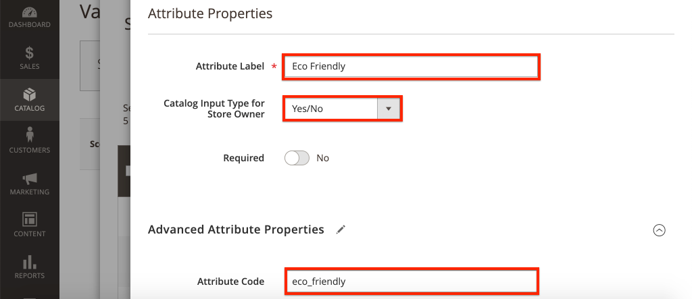

# 自定义Adobe Experience Manager CIF核心组件 {#customize-cif-components}

[CIF Venia项目](https://github.com/adobe/aem-cif-guides-venia)是使用[CIF核心组件](https://github.com/adobe/aem-core-cif-components)的参考代码库。 在本教程中，您进一步扩展了[Product Teaser](https://github.com/adobe/aem-core-cif-components/tree/master/ui.apps/src/main/content/jcr_root/apps/core/cif/components/commerce/productteaser/v1/productteaser)组件以显示Adobe Commerce中的自定义属性。 您还可以详细了解Adobe Experience Manager (AEM)与GraphQL之间的Adobe Commerce集成以及CIF核心组件提供的扩展挂接。

>[!TIP]
>
>在启动您自己的Commerce实现时使用[AEM项目原型](https://github.com/adobe/aem-project-archetype)。

## 您将构建的内容

Venia品牌最近开始使用可持续材料制造一些产品，并且公司希望在Product Teaser中显示&#x200B;**环保徽章**。 在Adobe Commerce中创建一个新的自定义属性，以指示产品是否使用&#x200B;**环保材料**。 此自定义属性作为GraphQL查询的一部分添加，并显示在指定产品的产品Teaser中。


## 前提条件 {#prerequisites}

需要本地开发环境才能完成本教程。 这包括一个AEM正在运行的实例，该实例已配置并连接到Adobe Commerce实例。 查看[使用AEM](../develop.md)设置本地开发的要求和步骤。 要完全遵循本教程，您需要具有在Adobe Commerce中将[属性添加到产品](https://docs.magento.com/user-guide/catalog/product-attributes-add.html)的权限。

您还需要GraphQL IDE（如[GraphiQL](https://github.com/graphql/graphiql)）或浏览器扩展来运行代码示例和教程。 如果安装浏览器扩展，请确保它能够设置请求标头。 在Google Chrome上，_Altair GraphQL Client_&#x200B;是一个可执行此作业的扩展。

## 克隆Venia项目 {#clone-venia-project}

您克隆[Venia项目](https://github.com/adobe/aem-cif-guides-venia)，然后覆盖默认样式。

>[!NOTE]
>
>**请随时使用现有项目**(基于包含CIF的AEM项目原型)并跳过此部分。

1. 运行以下git命令，以便克隆项目：

   ```shell
   $ git clone git@github.com:adobe/aem-cif-guides-venia.git
   ```

1. 生成项目并将其部署到AEM的本地实例：

   ```shell
   $ cd aem-cif-guides-venia/
   $ mvn clean install -PautoInstallSinglePackage -Pclassic
   ```

1. 添加必要的OSGi配置，以便将AEM实例连接到Adobe Commerce实例，或将配置添加到新创建的项目。

1. 此时，您应该拥有连接到Adobe Commerce实例的工作中店面版本。 导航至`US` > `Home`页面，网址为： [http://localhost:4502/editor.html/content/venia/us/en.html](http://localhost:4502/editor.html/content/venia/us/en.html)。

   您应该会看到店面当前使用的是Venia主题。 展开店面的主菜单，您应该会看到各种类别，这表示与Adobe Commerce的连接正在正常工作。

   

## 创作产品Teaser {#author-product-teaser}

本教程中对产品Teaser组件进行了扩展。 第一步，向主页添加Product Teaser的实例以了解基线功能。

1. 导航到网站的&#x200B;**主页**： [http://localhost:4502/editor.html/content/acme/us/en.html](http://localhost:4502/editor.html/content/acme/us/en.html)

2. 将新的&#x200B;**Product Teaser**&#x200B;组件插入页面上的主布局容器中。

   

3. 展开侧面板（如果尚未切换）并将资产查找器下拉列表切换为&#x200B;**产品**。 此时应会显示已连接的Adobe Commerce实例中可用产品的列表。 选择一个产品并&#x200B;**将其拖放**&#x200B;到页面上的&#x200B;**Product Teaser**&#x200B;组件上。

   

   >[!NOTE]
   >
   >请注意，您还可以通过使用对话框（单击&#x200B;_扳手_&#x200B;图标）配置组件来配置显示的产品。

4. 此时，您应该会看到产品Teaser正在显示产品。 产品名称和产品价格是显示的默认属性。

   

## 在Adobe Commerce中添加自定义属性 {#add-custom-attribute}

AEM中显示的产品和产品数据存储在Adobe Commerce中。 接下来，使用Adobe Commerce UI将&#x200B;**环保特性**&#x200B;添加为产品特性集的一部分。

>[!TIP]
>
>产品属性集中已有自定义&#x200B;**是/否**&#x200B;属性？ 欢迎您随时使用，并跳过此部分。

1. 登录到您的Adobe Commerce实例。
1. 导航到&#x200B;**目录** > **产品**。
1. 更新搜索筛选器，以便您可以找到在上一个练习添加到Teaser组件时使用的&#x200B;**可配置产品**。 在编辑模式下打开产品。

   

1. 在产品视图中，单击&#x200B;**添加属性** > **创建新属性**。
1. 使用以下值填写&#x200B;**新属性**&#x200B;表单（保留其他值的默认设置）

   | 字段集 | 字段标签 | 价值 |
   | ----------------------------- | ------------------ | ---------------- |
   | 属性属性 | 属性标签 | **环保** |
   | 属性属性 | 目录输入类型 | **是/否** |
   | 高级属性属性 | 属性代码 | **环保** |

   

   完成后，单击&#x200B;**保存属性**。

1. 滚动到产品底部并展开&#x200B;**属性**&#x200B;标题。 您应该会看到新的&#x200B;**环保型**&#x200B;字段。 将切换开关切换到&#x200B;**是**。

   

   **保存**&#x200B;对产品的更改。

   >[!TIP]
   >
   >有关管理[产品属性的更多详细信息，请参阅Adobe Commerce用户指南](https://docs.magento.com/user-guide/catalog/attribute-best-practices.html)。

1. 导航到&#x200B;**系统** > **工具** > **缓存管理**。 由于对数据架构进行了更新，因此您必须使Adobe Commerce中的某些缓存类型失效。
1. 选中&#x200B;**配置**&#x200B;旁边的框并提交&#x200B;**刷新**&#x200B;的缓存类型

   

   >[!TIP]
   >
   >有关[缓存管理的更多详细信息，请参阅Adobe Commerce用户指南](https://docs.magento.com/user-guide/system/cache-management.html)。

## 使用GraphQL IDE验证属性 {#use-graphql-ide}

在跳转到AEM代码之前，使用GraphQL IDE浏览[Adobe Commerce GraphQL](https://devdocs.magento.com/guides/v2.4/graphql/)会很有用。 Adobe Commerce与AEM的集成主要通过一系列GraphQL查询来完成。 了解和修改GraphQL查询是扩展CIF核心组件的关键方式之一。

接下来，使用GraphQL IDE验证是否已将`eco_friendly`属性添加到产品属性集。 本教程中的屏幕截图使用的是Google Chrome扩展&#x200B;_Altair GraphQL客户端_。

1. 打开GraphQL IDE，然后在IDE或扩展的URL栏中输入URL `http://<server>/graphql`。
2. 添加以下[产品查询](https://devdocs.magento.com/guides/v2.4/graphql/queries/products.html)，其中`YOUR_SKU`是上一个练习中使用的产品的&#x200B;**SKU**：

   ```json
     {
       products(
       filter: { sku: { eq: "YOUR_SKU" } }
       ) {
           items {
           name
           sku
           eco_friendly
           }
       }
   }
   ```

3. 执行查询，您应会收到如下响应：

   ```json
   {
     "data": {
       "products": {
         "items": [
           {
             "name": "Valeria Two-Layer Tank",
             "sku": "VT11",
             "eco_friendly": 1
           }
         ]
       }
     }
   }
   ```

   

**Yes**&#x200B;的值是&#x200B;**1**&#x200B;的整数。 当您使用Java™编写GraphQL查询时，这将很有用。

>[!TIP]
>
>有关Adobe Commerce GraphQL的更多详细文档，请参阅以下[GraphQL概述](https://devdocs.magento.com/guides/v2.4/graphql/index.html)。

## 更新产品Teaser的Sling模型 {#updating-sling-model-product-teaser}

接下来，通过实施Sling模型来扩展Product Teaser的业务逻辑。 [Sling模型](https://sling.apache.org/documentation/bundles/models.html)是注释驱动的“POJO”(纯旧Java™对象)，它们实现组件所需的任何业务逻辑。 Sling模型与HTL脚本一起用作组件的一部分。 遵循Sling模型](https://github.com/adobe/aem-core-wcm-components/wiki/Delegation-Pattern-for-Sling-Models)的[委派模式，以便您可以扩展现有产品Teaser模型的部分。

Sling模型是作为Java™实现的，并且可在所生成项目的&#x200B;**core**&#x200B;模块中找到。

使用[您选择的IDE](https://experienceleague.adobe.com/docs/experience-manager-learn/cloud-service/local-development-environment-set-up/development-tools.html#set-up-the-development-ide)导入Venia项目。 使用的屏幕截图来自[Visual Studio Code IDE](https://experienceleague.adobe.com/docs/experience-manager-learn/cloud-service/local-development-environment-set-up/development-tools.html?#microsoft-visual-studio-code)。

1. 在IDE中的&#x200B;**core**&#x200B;模块下导航到： `core/src/main/java/com/venia/core/models/commerce/MyProductTeaser.java`。

   

   `MyProductTeaser.java`是扩展CIF [ProductTeaser](https://github.com/adobe/aem-core-cif-components/blob/master/bundles/core/src/main/java/com/adobe/cq/commerce/core/components/models/productteaser/ProductTeaser.java)接口的Java™接口。

   已添加名为`isShowBadge()`的新方法以显示徽章（如果产品被视为“新”）。

1. 将方法`isEcoFriendly()`添加到接口：

   ```java
   @ProviderType
   public interface MyProductTeaser extends ProductTeaser {
       // Extend the existing interface with the additional properties which you
       // want to expose to the HTL template.
       public Boolean isShowBadge();
   
       public Boolean isEcoFriendly();
   }
   ```

这是一种封装逻辑的新方法，用于指示产品的`eco_friendly`属性是否设置为&#x200B;**是**&#x200B;或&#x200B;**否**。

1. 接下来，在`core/src/main/java/com/venia/core/models/commerce/MyProductTeaserImpl.java`处检查`MyProductTeaserImpl.java`。

   Sling模型](https://github.com/adobe/aem-core-wcm-components/wiki/Delegation-Pattern-for-Sling-Models)的[委托模式允许`MyProductTeaserImpl`通过`sling:resourceSuperType`属性引用`ProductTeaser`模型：

   ```java
   @Self
   @Via(type = ResourceSuperType.class)
   private ProductTeaser productTeaser;
   ```

   对于未覆盖或更改的所有方法，您可以返回`ProductTeaser`返回的值。 例如：

   ```java
   @Override
   public String getImage() {
       return productTeaser.getImage();
   }
   ```

   这会最大限度地减少实施必须编写的Java™代码量。

1. AEM CIF核心组件提供的额外扩展点之一是`AbstractProductRetriever`，它提供对特定产品属性的访问权限。 检查`initModel()`方法：

   ```java
   import javax.annotation.PostConstruct;
   ...
   @Model(adaptables = SlingHttpServletRequest.class, adapters = MyProductTeaser.class, resourceType = MyProductTeaserImpl.RESOURCE_TYPE)
   public class MyProductTeaserImpl implements MyProductTeaser {
       ...
       private AbstractProductRetriever productRetriever;
   
       /* add this method to intialize the proudctRetriever */
       @PostConstruct
       public void initModel() {
           productRetriever = productTeaser.getProductRetriever();
   
           if (productRetriever != null) {
               productRetriever.extendProductQueryWith(p -> p.createdAt());
           }
   
       }
   ...
   ```

   `@PostConstruct`注释可确保在Sling模型初始化时调用此方法。

   请注意，产品GraphQL查询已使用`extendProductQueryWith`方法扩展，以检索额外的`created_at`属性。 此属性稍后将用作`isShowBadge()`方法的一部分。

1. 更新GraphQL查询以将`eco_friendly`属性包含在部分查询中：

   ```java
   //MyProductTeaserImpl.java
   
   private static final String ECO_FRIENDLY_ATTRIBUTE = "eco_friendly";
   
   @PostConstruct
   public void initModel() {
       productRetriever = productTeaser.getProductRetriever();
   
       if (productRetriever != null) {
           productRetriever.extendProductQueryWith(p -> p
               .createdAt()
               .addCustomSimpleField(ECO_FRIENDLY_ATTRIBUTE)
           );
       }
   }
   ```

   将添加到`extendProductQueryWith`方法是确保其他产品属性可用于模型的其余部分的一种有效方法。 它还可以最大限度地减少执行的查询数。

   在上述代码中，`addCustomSimpleField`用于检索`eco_friendly`属性。 这说明了如何查询属于Adobe Commerce架构的任何自定义属性。

   >[!NOTE]
   >
   >`createdAt()`方法已作为[产品接口](https://github.com/adobe/commerce-cif-magento-graphql/blob/master/src/main/java/com/adobe/cq/commerce/magento/graphql/ProductInterface.java)的一部分实现。 大多数常见的架构属性都已实现，因此仅将`addCustomSimpleField`用于真正的自定义属性。

1. 添加记录器，以便能够帮助您调试Java™代码：

   ```java
   import org.slf4j.Logger;
   import org.slf4j.LoggerFactory;
   ...
   @Model(adaptables = SlingHttpServletRequest.class, adapters = MyProductTeaser.class, resourceType = MyProductTeaserImpl.RESOURCE_TYPE)
   public class MyProductTeaserImpl implements MyProductTeaser {
   
   private static final Logger LOGGER = LoggerFactory.getLogger(MyProductTeaserImpl.class);
   ```

1. 接下来，实现`isEcoFriendly()`方法：

   ```java
   @Override
   public Boolean isEcoFriendly() {
   
       Integer ecoFriendlyValue;
       try {
           ecoFriendlyValue = productRetriever.fetchProduct().getAsInteger(ECO_FRIENDLY_ATTRIBUTE);
           if(ecoFriendlyValue != null && ecoFriendlyValue.equals(Integer.valueOf(1))) {
               LOGGER.info("*** Product is Eco Friendly**");
               return true;
           }
       } catch (SchemaViolationError e) {
           LOGGER.error("Error retrieving eco friendly attribute");
       }
       LOGGER.info("*** Product is not Eco Friendly**");
       return false;
   }
   ```

   在上述方法中，`productRetriever`用于获取产品，`getAsInteger()`方法用于获取`eco_friendly`属性的值。 根据您之前运行的GraphQL查询，您知道`eco_friendly`属性设置为“**是**”时的预期值实际上是&#x200B;**1**&#x200B;的整数。

   现在Sling模型已更新，请更新组件标记以根据Sling模型显示&#x200B;**生态友好**&#x200B;的指示器。

## 自定义产品Teaser的标记 {#customize-markup-product-teaser}

AEM组件的常见扩展是修改组件生成的标记。 这是通过覆盖组件用于呈现其标记的[HTL脚本](https://experienceleague.adobe.com/docs/experience-manager-htl/content/overview.html)来实现的。 HTML模板语言(HTL)是一种轻量级模板语言，AEM组件使用它根据创作的内容动态呈现标记，从而允许重用组件。 例如，产品Teaser可以重复使用以显示不同的产品。

在本例中，您希望在Teaser顶部呈现横幅，以表明产品基于自定义属性是“环保的”。 自定义组件的标记[的设计模式是所有AEM组件的标准模式，而不仅仅是AEM CIF核心组件的标准模式。](https://experienceleague.adobe.com/docs/experience-manager-core-components/using/developing/customizing.html#customizing-the-markup)

>[!NOTE]
>
>如果您使用CIF产品和类别选取器(如本产品Teaser或CIF页面组件)自定义组件，请确保为组件对话框包含所需的`cif.shell.picker` clientlib。 有关详细信息，请参阅[CIF产品和类别选取器的用法](use-cif-pickers.md)。

1. 在IDE中，导航并展开`ui.apps`模块，然后将文件夹层次结构展开到： `ui.apps/src/main/content/jcr_root/apps/venia/components/commerce/productteaser`并检查`.content.xml`文件。

   

   ```xml
   <?xml version="1.0" encoding="UTF-8"?>
   <jcr:root xmlns:sling="https://sling.apache.org/jcr/sling/1.0" xmlns:cq="https://www.day.com/jcr/cq/1.0" xmlns:jcr="https://www.jcp.org/jcr/1.0"
       jcr:description="Product Teaser Component"
       jcr:primaryType="cq:Component"
       jcr:title="Product Teaser"
       sling:resourceSuperType="core/cif/components/commerce/productteaser/v1/productteaser"
       componentGroup="Venia - Commerce"/>
   ```

   该项目中的产品Teaser组件的组件定义如上所示。 注意属性`sling:resourceSuperType="core/cif/components/commerce/productteaser/v1/productteaser"`。 这是创建[代理组件](https://experienceleague.adobe.com/docs/experience-manager-core-components/using/get-started/using.html#create-proxy-components)的示例。 您可以使用`sling:resourceSuperType`继承所有功能，而不是从AEM CIF核心组件复制和粘贴所有产品Teaser HTL脚本。

1. 打开文件`productteaser.html`。 这是[CIF产品Teaser](https://github.com/adobe/aem-core-cif-components/blob/master/ui.apps/src/main/content/jcr_root/apps/core/cif/components/commerce/productteaser/v1/productteaser/productteaser.html)中的`productteaser.html`文件副本

   ```html
   <!--/* productteaser.html */-->
   <sly
     data-sly-use.product="com.venia.core.models.commerce.MyProductTeaser"
     data-sly-use.templates="core/wcm/components/commons/v1/templates.html"
     data-sly-use.actionsTpl="actions.html"
     data-sly-test.isConfigured="${properties.selection}"
     data-sly-test.hasProduct="${product.url}"
   ></sly>
   ```

   请注意，已使用`MyProductTeaser`的Sling模型并将其分配给`product`变量。

1. 编辑`productteaser.html`，以便调用上一个练习中实现的`isEcoFriendly`方法：

   ```html
   ...
   <div
     data-sly-test="${isConfigured && hasProduct}"
     class="item__root"
     data-cmp-is="productteaser"
     data-virtual="${product.virtualProduct}"
   >
     <div data-sly-test="${product.showBadge}" class="item__badge">
       <span>${properties.text || 'New'}</span>
     </div>
     <!--/* Insert call to Eco Friendly here */-->
     <div data-sly-test="${product.ecoFriendly}" class="item__eco">
       <span>Eco Friendly</span>
     </div>
     ...
   </div>
   ```

   在HTL中调用Sling模型方法时，该方法的`get`和`is`部分将被丢弃，且第一个字母变为小写。 因此，`isShowBadge()`变为`.showBadge`，`isEcoFriendly`变为`.ecoFriendly`。 基于`.isEcoFriendly()`返回的布尔值，确定是否显示`<span>Eco Friendly</span>`。

   有关`data-sly-test`和其他HTL块语句的详细信息，请参阅[HTL规范](https://experienceleague.adobe.com/docs/experience-manager-htl/content/specification.html)。

1. 使用您的Maven技能从命令行终端保存更改并将更新部署到AEM：

   ```shell
   $ cd aem-cif-guides-venia/
   $ mvn clean install -PautoInstallSinglePackage -Pclassic
   ```

1. 打开新的浏览器窗口，并导航到AEM和&#x200B;**OSGi控制台** > **状态** > **Sling模型**： [http://localhost:4502/system/console/status-slingmodels](http://localhost:4502/system/console/status-slingmodels)

1. 搜索`MyProductTeaserImpl`，您应该会看到如下所示的一行：

   ```plain
   com.venia.core.models.commerce.MyProductTeaserImpl - venia/components/commerce/productteaser
   ```

   这表明Sling模型已正确部署并映射到正确的组件。

1. 刷新到&#x200B;**Venia主页**，该主页位于[http://localhost:4502/editor.html/content/venia/us/en.html](http://localhost:4502/editor.html/content/venia/us/en.html)，其中已添加产品Teaser。

   显示

   如果产品的`eco_friendly`属性设置为&#x200B;**是**，则您应该会在页面上看到文本“Eco Friendly”。 尝试切换到其他产品以查看行为变化。

1. 接下来，打开AEM `error.log`以查看已添加的Log语句。 `error.log`位于`<AEM SDK Install Location>/crx-quickstart/logs/error.log`。

   搜索AEM日志以查看在Sling模型中添加的日志语句：

   ```plain
   2020-08-28 12:57:03.114 INFO [com.venia.core.models.commerce.MyProductTeaserImpl] *** Product is Eco Friendly**
   ...
   2020-08-28 13:01:00.271 INFO [com.venia.core.models.commerce.MyProductTeaserImpl] *** Product is not Eco Friendly**
   ...
   ```

   >[!CAUTION]
   >
   >如果Teaser中使用的产品不将`eco_friendly`属性作为其属性集的一部分，则您还可能会看到一些栈栈跟踪。

## 为环保徽章添加样式 {#add-styles}

此时，何时显示&#x200B;**环保徽章**&#x200B;徽章的逻辑正在工作，但纯文本可以使用某些样式。 接下来，向`ui.frontend`模块添加图标和样式以完成实施。

1. 下载[eco_friendly.svg](../assets/customize-cif-components/eco_friendly.svg)文件。 此徽章用作&#x200B;**环保**&#x200B;徽章。
1. 返回到IDE并导航到`ui.frontend`文件夹。
1. 将`eco_friendly.svg`文件添加到`ui.frontend/src/main/resources/images`文件夹：

   

1. 在`ui.frontend/src/main/styles/commerce/_productteaser.scss`处打开文件`productteaser.scss`。
1. 在`.productteaser`类中添加以下Sass规则：

   ```scss
   .productteaser {
       ...
       .item__eco {
           width: 60px;
           height: 60px;
           left: 0px;
           overflow: hidden;
           position: absolute;
           padding: 5px;
   
       span {
           display: block;
           position: absolute;
           width: 45px;
           height: 45px;
           text-indent: -9999px;
           background: no-repeat center center url('../resources/images/eco_friendly.svg');
           }
       }
   ...
   }
   ```

   >[!NOTE]
   >
   >有关前端工作流的更多详细信息，请参阅[设置CIF核心组件的样式](./style-cif-component.md)。

1. 使用您的Maven技能从命令行终端保存更改并将更新部署到AEM：

   ```shell
   $ cd aem-cif-guides-venia/
   $ mvn clean install -PautoInstallSinglePackage -Pclassic
   ```

1. 刷新到&#x200B;**Venia主页**，该主页位于[http://localhost:4502/editor.html/content/venia/us/en.html](http://localhost:4502/editor.html/content/venia/us/en.html)，其中已添加产品Teaser。

   

## 恭喜 {#congratulations}

您已自定义您的第一个AEM CIF组件！ 在此下载[完成的解决方案文件](../assets/customize-cif-components/customize-cif-component-SOLUTION_FILES.zip)。

## 奖励质询 {#bonus-challenge}

查看已在产品Teaser中实施的&#x200B;**New**&#x200B;徽章的功能。 尝试添加额外的复选框以便作者控制何时应显示&#x200B;**环保型**&#x200B;徽章。 更新位于`ui.apps/src/main/content/jcr_root/apps/venia/components/commerce/productteaser/_cq_dialog/.content.xml`的组件对话框。


## 其他资源 {#additional-resources}

- [AEM原型](https://experienceleague.adobe.com/docs/experience-manager-core-components/using/developing/archetype/overview.html)
- [AEM CIF核心组件](https://github.com/adobe/aem-core-cif-components)
- [自定义AEM CIF核心组件](https://github.com/adobe/aem-core-cif-components)
- [自定义核心组件](https://experienceleague.adobe.com/docs/experience-manager-core-components/using/developing/customizing.html)
- [AEM Sites快速入门](https://experienceleague.adobe.com/docs/experience-manager-learn/getting-started-wknd-tutorial-develop/overview.html?lang=zh-Hans)
- [CIF产品和类别选取器的用法](use-cif-pickers.md)
