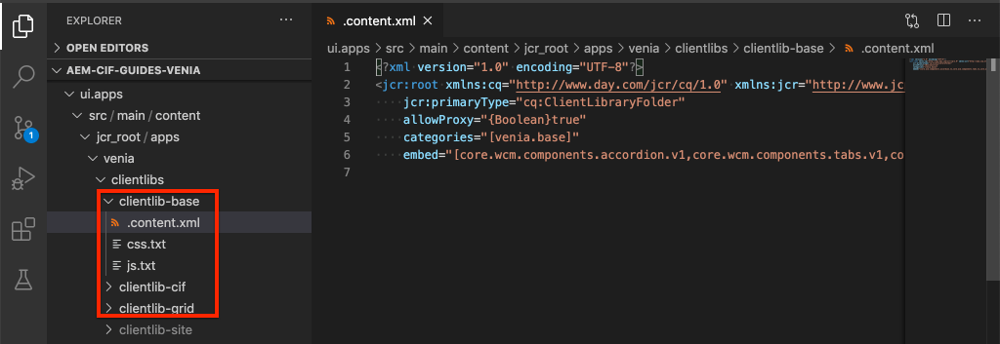

# 样式AEM CIF核心组件 {#style-aem-cif-core-components}

[CIF Venia项目](https://github.com/adobe/aem-cif-guides-venia)是使用[CIF核心组件](https://github.com/adobe/aem-core-cif-components)的参考代码库。 在本教程中，您将检查Venia参考项目，并了解AEM CIF核心组件使用的CSS和JavaScript的组织方式。 您还将使用CSS创建样式以更新&#x200B;**Product Teaser**&#x200B;组件的默认样式。

>[!TIP]
>
>在启动您自己的Commerce实现时使用[AEM项目原型](https://github.com/adobe/aem-project-archetype)。

## 您将构建的内容

在本教程中，将实施产品Teaser组件的新样式，该样式类似于信息卡。 在本教程中吸取的经验教训可以应用于其他CIF核心组件。


## 前提条件 {#prerequisites}

需要本地开发环境才能完成本教程。 这包括一个AEM正在运行的实例，该实例已配置并连接到Adobe Commerce实例。 查看[使用AEM](../develop.md)设置本地开发的要求和步骤。

## 克隆Venia项目 {#clone-venia-project}

我们克隆[Venia项目](https://github.com/adobe/aem-cif-guides-venia)，然后覆盖默认样式。

>[!NOTE]
>
>**请随时使用现有项目**(基于包含CIF的AEM项目原型)并跳过此部分。

1. 运行以下git命令以克隆项目：

   ```shell
   $ git clone git@github.com:adobe/aem-cif-guides-venia.git
   ```

1. 生成项目并将其部署到AEM的本地实例：

   ```shell
   $ cd aem-cif-guides-venia/
   $ mvn clean install -PautoInstallPackage,cloud
   ```

1. 添加必要的OSGi配置以将您的AEM实例连接到Adobe Commerce实例，或将配置添加到新创建的项目。

1. 此时，您应该拥有连接到Adobe Commerce实例的工作中店面版本。 导航至`US` > `Home`页面，网址为： [http://localhost:4502/editor.html/content/venia/us/en.html](http://localhost:4502/editor.html/content/venia/us/en.html)。

   您应该会看到店面当前使用的是Venia主题。 展开店面的主菜单，您应该会看到各种类别，这表示与Adobe Commerce的连接正在正常工作。

   

## 客户端库和ui.frontend模块 {#introduction-to-client-libraries}

负责呈现店面主题/样式的CSS和JavaScript在AEM中由[客户端库](/help/sites-developing/clientlibs.md)或简称为clientlibs管理。 客户端库提供了一种机制，用于在项目代码中整理CSS和JavaScript，然后将其交付到页面上。

通过添加和覆盖这些客户端库管理的CSS，可以将特定于品牌的样式应用到AEM CIF核心组件。 了解如何构建客户端库并将其包含在页面上至关重要。

[ui.frontend](https://experienceleague.adobe.com/docs/experience-manager-core-components/using/developing/archetype/uifrontend.html?lang=zh-Hans)是一个专用的[webpack](https://webpack.js.org/)项目，用于管理项目的所有前端资源。 这允许前端开发人员使用任意数量的语言和技术，如[TypeScript](https://www.typescriptlang.org/)、[Sass](https://sass-lang.com/)等。

`ui.frontend`模块也是Maven模块，通过使用NPM模块[aem-clientlib-generator](https://github.com/wcm-io-frontend/aem-clientlib-generator)与更大的项目集成。 在生成期间，`aem-clientlib-generator`将编译后的CSS和JavaScript文件复制到`ui.apps`模块中的客户端库中。


*在Maven生成期间，已编译的CSS和JavaScript将作为客户端库从`ui.frontend`模块复制到`ui.apps`模块中*

## 更新Teaser样式 {#ui-frontend-module}

接下来，对Teaser样式进行小幅更改，以了解`ui.frontend`模块和客户端库的工作方式。 使用[您选择的IDE](https://experienceleague.adobe.com/docs/experience-manager-learn/cloud-service/local-development-environment-set-up/development-tools.html?lang=zh-Hans#set-up-the-development-ide)导入Venia项目。 使用的屏幕截图来自[Visual Studio Code IDE](https://experienceleague.adobe.com/docs/experience-manager-learn/cloud-service/local-development-environment-set-up/development-tools.html?lang=zh-Hans#microsoft-visual-studio-code)。

1. 导航并展开&#x200B;**ui.frontend**&#x200B;模块并将文件夹层次结构展开到： `ui.frontend/src/main/styles/commerce`：

   

   请注意，文件夹下有多个Sass (`.scss`)文件。 这些是每个Commerce组件的Commerce特定样式。

1. 打开文件`_productteaser.scss`。

1. 更新`.item__image`规则并修改边框规则：

   ```scss
   .item__image {
       border: #ea00ff 8px solid; /* <-- modify this rule */
       display: block;
       grid-area: main;
       height: auto;
       opacity: 1;
       transition-duration: 512ms;
       transition-property: opacity, visibility;
       transition-timing-function: ease-out;
       visibility: visible;
       width: 100%;
   }
   ```

   上述规则应该为产品Teaser组件添加粗粉红色边框。

1. 打开新的终端窗口并导航到`ui.frontend`文件夹：

   ```shell
   $ cd <project-location>/aem-cif-guides-venia/ui.frontend
   ```

1. 运行以下Maven命令：

   ```shell
   $ mvn clean install
   ...
   [INFO] ------------------------------------------------------------------------
   [INFO] BUILD SUCCESS
   [INFO] ------------------------------------------------------------------------
   [INFO] Total time:  29.497 s
   [INFO] Finished at: 2020-08-25T14:30:44-07:00
   [INFO] ------------------------------------------------------------------------
   ```

   检查终端输出。 您可以看到Maven命令运行了多个NPM脚本，包括`npm run build`。 `npm run build`命令在`package.json`文件中定义，具有编译webpack项目并触发客户端库生成的效果。

1. 检查文件`ui.frontend/dist/clientlib-site/site.css`：

   

   该文件是项目中所有Sass文件的编译和缩小版本。

   >[!NOTE]
   >
   >此类文件会从源代码管理中忽略，因为它们应在构建期间生成。

1. 检查文件`ui.frontend/clientlib.config.js`。

   ```js
   /* clientlib.config.js*/
   ...
   // Config for `aem-clientlib-generator`
   module.exports = {
       context: BUILD_DIR,
       clientLibRoot: CLIENTLIB_DIR,
       libs: [
           {
               ...libsBaseConfig,
               name: 'clientlib-site',
               categories: ['venia.site'],
               dependencies: ['venia.dependencies', 'aem-core-cif-react-components'],
               assets: {
   ...
   ```

   这是[aem-clientlib-generator](https://github.com/wcm-io-frontend/aem-clientlib-generator)的配置文件，可确定编译后的CSS和JavaScript转换为AEM客户端库的位置和方式。

1. 在`ui.apps`模块中，检查文件： `ui.apps/src/main/content/jcr_root/apps/venia/clientlibs/clientlib-site/css/site.css`：

   

   这会将`site.css`文件复制到`ui.apps`项目中。 它现在包含在名为`clientlib-site`的客户端库中，类别为`venia.site`。 一旦文件成为`ui.apps`模块的一部分，便可以将其部署到AEM。

   >[!NOTE]
   >
   >类似这样的文件也会从源代码管理中忽略，因为它们应该在构建期间生成。

1. 接下来，检查项目生成的其他客户端库：

   

   这些客户端库不由`ui.frontend`模块管理。 这些客户端库包含由Adobe提供的CSS和JavaScript依赖项。 这些客户端库的定义在每个文件夹下的`.content.xml`文件中。

   **clientlib-base** — 这是一个空的客户端库，它只是从[AEM核心组件](https://experienceleague.adobe.com/docs/experience-manager-core-components/using/introduction.html?lang=zh-hans)中嵌入必要的依赖项。 类别为`venia.base`。

   **clientlib-cif** — 这也是一个空客户端库，它仅嵌入来自[AEM CIF核心组件](https://github.com/adobe/aem-core-cif-components)的必要依赖项。 类别为`venia.cif`。

   **clientlib-grid** — 这包括启用AEM的响应式网格功能所需的CSS。 使用AEM网格会在AEM编辑器中启用[布局模式](/help/sites-authoring/responsive-layout.md)，并使内容作者能够调整组件大小。 类别为`venia.grid`且已嵌入到`venia.base`库中。

1. 检查`ui.apps/src/main/content/jcr_root/apps/venia/components/page`下的文件`customheaderlibs.html`和`customfooterlibs.html`：

   

   这些脚本包含&#x200B;**venia.base**&#x200B;和&#x200B;**venia.cif**&#x200B;库作为所有页面的一部分。

   >[!NOTE]
   >
   >在页面脚本中，只有基础库进行“硬编码”。 `venia.site`未包含在这些文件中，而是作为页面模板的一部分包含，以便更加灵活。 稍后将对此进行检查。

1. 从终端，构建整个项目并将其部署到AEM的本地实例：

   ```shell
   $ cd aem-cif-guides-venia/
   $ mvn clean install -PautoInstallPackage,cloud
   ```

## 创作产品Teaser {#author-product-teaser}

现在已部署代码更新，请使用AEM创作工具将新的Product Teaser组件实例添加到网站的主页。 这允许我们查看更新的样式。

1. 打开新的浏览器选项卡，并导航到网站的&#x200B;**主页**： [http://localhost:4502/editor.html/content/venia/us/en.html](http://localhost:4502/editor.html/content/venia/us/en.html)。

1. 在&#x200B;**编辑**&#x200B;模式下展开资产查找器（侧边栏）。 将资产筛选器切换到&#x200B;**产品**。

   

1. 将新产品拖放到主布局容器的主页上：

   

   您应该会看到，根据之前创建的CSS规则更改，产品Teaser现在具有亮粉红色边框。

## 验证页面上的客户端库 {#verify-client-libraries}

接下来，验证页面上是否包含客户端库。

1. 导航到网站的&#x200B;**主页**： [http://localhost:4502/editor.html/content/venia/us/en.html](http://localhost:4502/editor.html/content/venia/us/en.html)。

1. 选择&#x200B;**页面信息**&#x200B;菜单，然后单击&#x200B;**以发布的形式查看**：

   

   此操作将打开页面，而不加载任何AEM创作JavaScript，因为它将显示在已发布的网站上。 请注意，已附加URL的查询参数`?wcmmode=disabled`。 在开发CSS和JavaScript时，最好使用此参数来简化页面，而无需AEM创作中的任何内容。

1. 查看页面源，您应该能够识别包含了多个客户端库：

   ```html
   <!DOCTYPE html>
   <html lang="en-US">
   <head>
       ...
       <link rel="stylesheet" href="/etc.clientlibs/venia/clientlibs/clientlib-base.min.css" type="text/css">
       <link rel="stylesheet" href="/etc.clientlibs/venia/clientlibs/clientlib-site.min.css" type="text/css">
   </head>
   ...
       <script type="text/javascript" src="/etc.clientlibs/venia/clientlibs/clientlib-site.min.js"></script>
       <script type="text/javascript" src="/etc.clientlibs/core/wcm/components/commons/site/clientlibs/container.min.js"></script>
       <script type="text/javascript" src="/etc.clientlibs/venia/clientlibs/clientlib-base.min.js"></script>
   <script type="text/javascript" src="/etc.clientlibs/core/cif/clientlibs/common.min.js"></script>
   <script type="text/javascript" src="/etc.clientlibs/venia/clientlibs/clientlib-cif.min.js"></script>
   </body>
   </html>
   ```

   客户端库在交付到页面时带有`/etc.clientlibs`前缀，并通过[代理](/help/sites-developing/clientlibs.md)提供服务，以避免公开`/apps`或`/libs`中的任何敏感内容。

   注意`venia/clientlibs/clientlib-site.min.css`和`venia/clientlibs/clientlib-site.min.js`。 这些是从`ui.frontend`模块派生的已编译CSS和JavaScript文件。

## 包含客户端库和页面模板 {#client-library-inclusion-pagetemplates}

有几个选项可用于说明如何包含客户端库。 接下来，通过[页面模板](/help/sites-developing/templates.md)检查生成的项目如何包含`clientlib-site`库。

1. 在AEM编辑器中导航到网站的&#x200B;**主页**： [http://localhost:4502/editor.html/content/venia/us/en.html](http://localhost:4502/editor.html/content/venia/us/en.html)。

1. 选择&#x200B;**页面信息**&#x200B;菜单，然后单击&#x200B;**编辑模板**：

   

   这将打开&#x200B;**主页**&#x200B;页面所基于的&#x200B;**登陆页面**&#x200B;模板。

   >[!NOTE]
   >
   >要从AEM开始屏幕查看所有可用的模板，请导航到&#x200B;**工具** > **常规** > **模板**。

1. 在左上角，选择&#x200B;**页面信息**&#x200B;图标，然后单击&#x200B;**页面策略**。

   

1. 这将为登陆页面模板打开页面策略：

   

   在右侧，您可以看到客户端库&#x200B;**类别**&#x200B;的列表，这些类别将包含在使用此模板的所有页面中。

   * `venia.dependencies` — 提供`venia.site`所依赖的任何供应商库。
   * `venia.site` - `ui.frontend`模块生成的`clientlib-site`类别。

   请注意，其他模板使用相同的策略，**内容页面**、**登陆页面**&#x200B;等。 通过重用相同的策略，我们可以确保在所有页面上都包含相同的客户端库。

   使用模板和页面策略管理客户端库包含的好处是，您可以为每个模板更改策略。 例如，您可能在同一个AEM实例中管理两个不同的品牌。 每个品牌都有自己的独特样式或&#x200B;*主题*，但基础库和代码将相同。 另一个示例，如果您有一个更大的客户端库，而您只希望该库显示在某些页面上，则您可以为该模板制定唯一的页面策略。

## 本地Webpack开发 {#local-webpack-development}

在上一个练习中，对`ui.frontend`模块中的Sass文件进行了更新，然后在执行Maven构建后，这些更改将部署到AEM。 接下来，我们将考虑使用webpack-dev-server来快速开发前端样式。

webpack-dev-server代理来自AEM的本地实例的图像和一些CSS/JavaScript，但允许开发人员修改`ui.frontend`模块中的样式和JavaScript。

1. 在浏览器中，导航到&#x200B;**主页**&#x200B;页面和&#x200B;**以发布的形式查看**： [http://localhost:4502/content/venia/us/en.html?wcmmode=disabled](http://localhost:4502/content/venia/us/en.html?wcmmode=disabled)。

1. 查看页面源和&#x200B;**复制**&#x200B;页面的原始HTML。

1. 返回到`ui.frontend`模块下面您选择的IDE以打开文件： `ui.frontend/src/main/static/index.html`

   

1. 覆盖上一步中复制的`index.html`和&#x200B;**粘贴** HTML的内容。

1. 查找`clientlib-site.min.css`、`clientlib-site.min.js`和&#x200B;**删除的包含**。

   ```html
   <head>
       <!-- remove this link -->
       <link rel="stylesheet" href="/etc.clientlibs/venia/clientlibs/clientlib-base.min.css" type="text/css">
       ...
   </head>
   <body>
       ...
        <!-- remove this link -->
       <script type="text/javascript" src="/etc.clientlibs/venia/clientlibs/clientlib-site.min.js"></script>
   </body>
   ```

   这些组件将被删除，因为它们代表`ui.frontend`模块生成的CSS和JavaScript的编译版本。 保留将从正在运行的AEM实例代理的其他客户端库。

1. 打开新的终端窗口并导航到`ui.frontend`文件夹。 运行命令`npm start`：

   ```shell
   $ cd ui.frontend
   $ npm start
   ```

   这会启动[http://localhost:8080/](http://localhost:8080/)上的webpack-dev-server

   >[!CAUTION]
   >
   >如果收到Sass相关错误，请停止服务器并运行命令`npm rebuild node-sass`并重复上述步骤。 如果您在项目`aem-cif-guides-venia/pom.xml`中指定了其他版本的`npm`和`node`，则可能会发生这种情况。

1. 使用与AEM登录实例相同的浏览器，在新的选项卡中导航到[http://localhost:8080/](http://localhost:8080/)。 您应会通过webpack-dev-server看到Venia主页：

   端口80上的Webpack开发服务器

   保持webpack-dev-server正在运行。 它将在下一个练习中使用。

## 实施产品Teaser的卡片样式 {#update-css-product-teaser}

接下来，修改`ui.frontend`模块中的Sass文件，为Product Teaser实施卡片样式。 webpack-dev-server用于快速查看更改。

返回到IDE和生成的项目。

1. 在&#x200B;**ui.frontend**&#x200B;模块中，在`ui.frontend/src/main/styles/commerce/_productteaser.scss`处重新打开文件`_productteaser.scss`。

1. 对产品Teaser边框进行以下更改：

   ```diff
       .item__image {
   -       border: #ea00ff 8px solid;
   +       border-bottom: 1px solid #c0c0c0;
           display: block;
           grid-area: main;
           height: auto;
           opacity: 1;
           transition-duration: 512ms;
           transition-property: opacity, visibility;
           transition-timing-function: ease-out;
           visibility: visible;
           width: 100%;
       }
   ```

   保存更改，webpack-dev-server应使用新样式自动刷新。

1. 在产品Teaser中添加投影并包括圆角。

   ```scss
    .item__root {
        position: relative;
        box-shadow: 0 4px 8px 0 rgba(0,0,0,0.2);
        transition: 0.3s;
        border-radius: 5px;
        float: left;
        margin-left: 12px;
        margin-right: 12px;
   }
   
   .item__root:hover {
      box-shadow: 0 8px 16px 0 rgba(0,0,0,0.2);
   }
   ```

1. 更新产品名称以显示在Teaser底部，并修改文本颜色。

   ```css
   .item__name {
       color: #000;
       display: block;
       float: left;
       font-size: 22px;
       font-weight: 900;
       line-height: 1em;
       padding: 0.75em;
       text-transform: uppercase;
       width: 75%;
   }
   ```

1. 更新产品的价格以使其也显示在Teaser的底部，并修改文本颜色。

   ```css
   .price {
       color: #000;
       display: block;
       float: left;
       font-size: 18px;
       font-weight: 900;
       padding: 0.75em;
       padding-bottom: 2em;
       width: 25%;
   
       ...
   ```

1. 更新底部的媒体查询，以在小于&#x200B;**992px**&#x200B;的屏幕中栈叠名称和价格。

   ```css
   @media (max-width: 992px) {
       .productteaser .item__name {
           font-size: 18px;
           width: 100%;
       }
       .productteaser .item__price {
           font-size: 14px;
           width: 100%;
       }
   }
   ```

   此时，您应该会看到卡样式反映在webpack-dev-server中：

   

   但是，这些更改尚未部署到AEM。 您可以[在此下载解决方案文件](../assets/style-cif-component/_productteaser.scss)。

1. 使用您的Maven技能从命令行终端将更新部署到AEM：

   ```shell
   $ cd aem-cif-guides-venia/
   $ mvn clean install -PautoInstallPackage,cloud
   ```

   >[!NOTE]
   >还有其他[IDE设置和工具](https://experienceleague.adobe.com/docs/experience-manager-learn/foundation/development/set-up-a-local-aem-development-environment.html?lang=zh-Hans#set-up-an-integrated-development-environment)可以直接将项目文件同步到本地AEM实例，而无需执行完整的Maven构建。

## 查看更新的产品Teaser {#view-updated-product-teaser}

将项目的代码部署到AEM后，您应该能够看到产品Teaser的更改。

1. 返回浏览器并刷新主页： [http://localhost:4502/editor.html/content/venia/us/en.html](http://localhost:4502/editor.html/content/venia/us/en.html)。 您应该会看到应用的已更新产品Teaser样式。

   

1. 通过添加其他产品Teaser进行试验。 使用布局模式更改组件的宽度和偏移，以便在一行中显示多个Teaser。

   

## 疑难解答 {#troubleshooting}

您可以在[CRXDE-Lite](http://localhost:4502/crx/de/index.jsp)中验证更新的CSS文件是否已部署： [http://localhost:4502/crx/de/index.jsp#/apps/venia/clientlibs/clientlib-site/css/site.css](http://localhost:4502/crx/de/index.jsp#/apps/venia/clientlibs/clientlib-site/css/site.css)

在部署新的CSS和/或JavaScript文件时，确保浏览器不提供过时文件也很重要。 您可以通过清除浏览器缓存或启动新的浏览器会话来消除这种情况。

AEM还会尝试缓存客户端库以提高性能。 有时，在代码部署后，会提供旧文件。 您可以使用[重新生成客户端库工具](http://localhost:4502/libs/granite/ui/content/dumplibs.rebuild.html)手动使AEM的客户端库缓存失效。 如果您怀疑AEM缓存了旧版本的客户端库，则&#x200B;*使缓存失效是首选方法。 重建库效率低下且耗时。*

## 恭喜 {#congratulations}

您配置了第一个AEM CIF核心组件的样式，并且使用了webpack开发服务器！

## 奖励质询 {#bonus-challenge}

使用[AEM样式系统](/help/sites-authoring/style-system.md)创建两个可由内容作者打开/关闭的样式。 [使用样式系统开发](https://experienceleague.adobe.com/docs/experience-manager-learn/getting-started-wknd-tutorial-develop/project-archetype/style-system.html?lang=zh-Hans)包括有关如何完成此操作的详细步骤和信息。


## 其他资源 {#additional-resources}

* [AEM项目原型](https://github.com/adobe/aem-project-archetype)
* [AEM CIF核心组件](https://github.com/adobe/aem-core-cif-components)
* [设置本地AEM开发环境](https://experienceleague.adobe.com/docs/experience-manager-learn/cloud-service/local-development-environment-set-up/overview.html?lang=zh-Hans)
* [客户端库](/help/sites-developing/clientlibs.md)
* [AEM Sites快速入门](https://experienceleague.adobe.com/docs/experience-manager-learn/getting-started-wknd-tutorial-develop/overview.html?lang=zh-Hans)
* [使用样式系统进行开发](https://experienceleague.adobe.com/docs/experience-manager-learn/getting-started-wknd-tutorial-develop/project-archetype/style-system.html?lang=zh-Hans)
