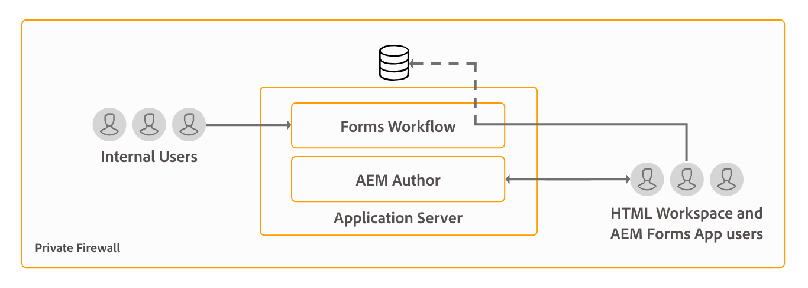

# AEM Forms 的架构与部署拓扑 {#architecture-and-deployment-topologies-for-aem-forms}

## 应用到 {#applies-to}

该文档适用于&#x200B;**AEM 6.5 LTS Forms**。

有关AEM as a Cloud Service文档，请参阅Cloud Service上的[AEM Forms](https://experienceleague.adobe.com/docs/experience-manager-cloud-service/content/forms/forms-overview/aem-forms-cloud-service-architecture.html?lang=zh-Hans)。

## 架构 {#architecture}

AEM Forms是作为AEM包部署到AEM中的应用程序。 此包称为AEM Forms附加组件包。 AEM Forms附加组件包包含部署到AEM OSGi容器中的服务（API提供程序）和由AEM Sling框架管理的servlet或JSP（提供前端和REST API功能）。 下图描述了此设置：

AEM Forms的架构包含以下组件：

* **核心AEM服务：** AEM为部署的应用程序提供的基本服务。 这些服务包括符合JCR的内容存储库、OSGI服务容器、工作流引擎、信任存储、密钥存储等。 AEM Forms应用程序可以使用这些服务，但AEM Forms包不提供这些服务。 这些服务是整个AEM栈栈的组成部分，各种AEM Forms组件都会使用这些服务。
* **Forms服务：**&#x200B;提供表单相关功能，例如创建、汇编、分发和存档PDF文档，添加数字签名以限制对文档的访问，以及对条形码表单进行解码。 这些服务可通过在AEM中联合部署的自定义代码公开使用。
* **Web层：** JSP或Servlet，基于通用服务和表单服务构建，可提供以下功能：

   * **前端创作**：用于创作和管理表单的表单创作和表单管理用户界面。
   * **表单呈现和提交前端**：面向最终用户的界面，供AEM Forms的最终用户（例如，访问政府网站的公民）使用。 这提供了表单呈现（在Web浏览器中显示表单）和提交功能。
   * **REST API**： JSP和Servlet导出表单服务的子集，以供基于HTTP的客户端(如表单移动SDK)远程使用。

**OSGi上的AEM Forms：** OSGi环境上的AEM Forms是标准的AEM Author或AEM Publish，并在其上部署了AEM Forms包。 您可以在[单服务器环境、场设置和群集设置](/help/sites-deploying/recommended-deploys.md)中的OSGi上运行AEM Forms。 集群设置仅可用于AEM Author实例。

<!--

**AEM Forms on JEE:** AEM Forms on JEE is AEM Forms server running on JEE stack. It has AEM Author with AEM Forms add-on packages and additional AEM Forms JEE capabilities co-deployed on a single JEE stack running on an application server. You can run AEM Forms on JEE in single-server and clustered setups. AEM Forms on JEE is required only to run document security, process management, and for LiveCycle customers upgrading to AEM Forms. Here are a few additional scenarios to use AEM Forms on JEE:

* **HTML workspace support (for customers using HTML workspace):** AEM Forms on JEE enables single sign-on with Processing instances, serves certain assets rendered on Processing instances, and handles submission of forms rendered within the HTML workspace.
* **Advanced additional form/interactive communication data processing**: AEM Forms on JEE can be utilized for additionally processing form/interactive communication data (and saving the results to a suitable data store) in complex use-cases where advanced process-management capabilities are required.

AEM Forms on JEE also includes provides following supporting services to the AEM components:

* **Integrated user management:** Allows users of AEM Forms on JEE to be recognized as AEM forms on OSGi users and helps enable SSO for both OSGi and JEE users. This is required for scenarios where single sign-on between AEM forms on OSGi and AEM Forms on JEE is required (for example, HTML workspace).
* **Asset hosting:** AEM Forms on JEE can serve assets (for example, HTML5 forms) rendered on AEM Forms on OSGi.

-->

AEM Forms创作用户界面不支持创建记录文档(DOR)、PDF forms和HTML5 Forms。 此类资源是使用独立的Forms Designer应用程序设计的，并分别上传到AEM Forms Manager。<!--Alternatively, for AEM Forms on JEE, forms can be designed as application (in AEM Forms Workbench) assets and deployed into AEM Forms on JEE server.-->

OSGi <!--and AEM Forms on JEE both-->上的AEM Forms具有工作流功能。 您可以在OSGi上的AEM表单上快速生成和部署用于各种任务的基本工作流。<!--, without having to install the full-fledged Process Management capability of AEM Forms on JEE. There is some difference in the [features of Form-centric workflow on AEM Forms on OSGi and Process Management capability of AEM Forms on JEE](capabilities-osgi-jee-workflows.md). The development and management of Form-centric workflows on AEM Forms on OSGi uses the familiar AEM Workflow and AEM Inbox capabilities.-->

## 术语 {#terminologies}

下图显示了典型AEM部署中使用的各种AEM Forms表单服务器配置及其组件：

**创作：**&#x200B;创作实例是在标准创作运行模式下运行的AEM Forms服务器。 <!--It can be AEM Forms on JEE or AEM Forms on OSGi environment.-->面向内部用户、表单和交互式通信设计人员以及开发人员。 它支持以下功能：

* **创作和管理表单和交互式通信：**&#x200B;设计人员和开发人员可以创建和编辑自适应表单和交互式通信，上传外部创建的其他类型的表单，例如在Adobe Forms Designer中创建的表单，并使用Forms Manager控制台管理这些资源。
* **表单和交互式通信发布：**&#x200B;可以将托管在创作实例上的Assets发布到发布实例以执行运行时操作。 资产发布使用AEM的复制功能。 Adobe建议在所有创作实例上配置复制代理，以手动将已发布的表单推送到处理实例，并在处理实例上配置另一个复制代理，同时启用&#x200B;*接收时*&#x200B;触发器，以自动将收到的表单复制到发布实例。

**发布：**&#x200B;发布实例是在标准发布运行模式下运行的AEM Forms服务器。 发布实例面向基于表单的应用程序的最终用户，例如访问公共网站和提交表单的用户。 它支持以下功能：

* 呈现和提交最终用户的Forms。
* 将原始提交的表单数据传输到处理实例，以供进一步处理并存储在最终记录系统中。 AEM Forms中提供的默认实施是使用AEM的反向复制功能来实现这一点的。 此外，还可以使用替代实施将表单数据直接推送到处理服务器，而不是先在本地保存（后者是激活反向复制的先决条件）。 担心在发布实例上存储潜在敏感数据的客户可以加入此[替代实施](/help/forms/using/configuring-draft-submission-storage.md)，因为处理实例通常位于更安全的区域中。
* 呈现和提交交互式通信和信件：在发布实例上呈现交互式通信和信件，并将相应数据提交到处理实例以供存储和后处理。 数据可以在发布实例上本地保存并在以后反向复制到处理实例（默认选项），也可以直接推送到处理实例而不保存在发布实例上。 后一种实施对于注重安全的客户非常有用。

**正在处理：** AEM Forms实例在创作运行模式下运行，没有用户分配给forms-manager组。 您可以在OSGi上将<!--AEM Forms on JEE or--> AEM Forms部署为处理实例。 未分配用户以确保表单创作和管理活动不在处理实例上执行，并且仅在创作实例上发生。 处理实例可启用以下功能：

* **处理从发布实例到达的原始表单数据：**&#x200B;这主要是在处理实例上通过AEM工作流实现的，当数据到达时会触发该工作流。 工作流可以使用现成的表单数据模型步骤将数据或文档存档到适当的数据存储。
* **表单数据的安全存储**：处理为与用户隔离的原始表单数据提供了一个防火墙后的存储库。 创作实例上的表单设计人员和发布实例上的最终用户均无法访问此存储库。

  >[!NOTE]
  >
  >Adobe建议使用第三方数据存储来保存最终处理数据，而不是使用AEM存储库。

* **对来自发布实例** AEM工作流的通信数据进行存储和后处理，可对相应的信件定义执行可选的后处理。 这些工作流可以将最终处理的数据保存到合适的外部数据存储中。

* **HTML Workspace托管**：处理实例托管HTML Workspace的前端。 HTML工作区为审阅和批准流程提供了相关任务/组分配的UI。

处理实例配置为在创作运行模式下运行，因为：

* 它允许从发布实例反向复制原始表单数据。 默认数据存储处理程序需要反向复制功能。
* 建议在创作样式系统上运行AEM工作流，这是处理从发布实例到达的原始表单数据的主要方式。

<!--

## Sample physical topologies for AEM Forms on JEE {#sample-physical-topologies-for-aem-forms-on-jee}

The AEM Forms on JEE topologies recommended below are mainly for customers upgrading from LiveCycle or a previous version of AEM Forms on JEE. Adobe recommends using AEM Forms on OSGi for fresh installations. A fresh installation of AEM Forms on JEE only recommended for using Document Security and Process Management capabilities.

### Topology for using document services or document security capabilities {#topology-for-using-document-services-or-document-security-capabilities}

AEM Forms customers planning to use only document services or document security capabilities can have a topology similar to the one displayed below. This topology recommends using a single instance of AEM Forms. You can also create a cluster or farm of AEM Forms servers, if necessary. This topology is recommended when most users programmatically access capabilities of AEM Forms server and intervention through the user interface is minimum. The topology is helpful in batch processing operations of document services. For example, using output service to create hundreds of non-editable PDF documents on daily basis.

Although, AEM Forms lets you set up and run all the functionalities from a single server, yet, you should do capacity planning, load balancing, and set up dedicated servers for specific capabilities in a production environment. For example, for an environment using the PDF Generator service to convert thousands of pages a day and add digital signatures to limit access to documents, set up separate AEM Forms servers for the PDF Generator service and digital signature capabilities. It helps provide optimum performance and scale the servers independent of each other.

### Topology for using AEM Forms process management {#topology-for-using-aem-forms-process-management}

AEM Forms customers planning to use AEM Forms process management features, for example, HTML Workspace can have a topology similar to the one displayed below. The AEM Forms on JEE server can be in a single server or cluster configuration.

If you are upgrading from LiveCycle ES4, this topology closely mirrors with what you already have in LiveCycle except for the addition of AEM Author built-in to AEM Forms on JEE. Moreover, there is no change in the clustering requirements for customers performing an upgrade. If you were using AEM Forms in a clustered environment, you can continue with same in AEM 6.5 Forms. For a fresh installation of AEM Forms of JEE for using HTML Workspace, running AEM author instance built-in to the JEE environment is an additional requirement.

Form data store is a third-party data store used for storing final processed data of forms and interactive communications. This is an optional element in the topology. You can also choose to set up a processing instance and use its repository as the final system-of-record system, if necessary.

The topology is recommended to the customers planning to use AEM Forms on JEE server for process management capabilities (HTML Workspace) without using any post-processing, adaptive forms, HTML5 forms, and interactive communication capabilities.

### Topology for using adaptive forms, HTML5 forms, interactive communication capabilities {#topology-for-using-adaptive-forms-html-forms-interactive-communication-capabilities}

AEM Forms customers planning to use AEM Forms data capture capabilities, for example, adaptive forms, HTML5 Forms, PDF Forms, can have a topology similar to the one displayed below. This topology is also recommended for using interactive communication capabilities of AEM Forms.

You can make the following changes/customizations to the above-suggested topology:

* Using HTML Workspace and AEM Forms app requires an AEM author or processing instance. You can use the AEM author instance built-in to AEM Forms on JEE server instead of setting up an additional external AEM author server.
* An AEM Author or Processing instance is required only for Forms-centric workflows on OSGi, adaptive forms, forms portal, and interactive communication.
* interactive communication Agent UI is generally run within the organization. So, you can keep a publish server for Agent UI within the private network.
* AEM forms on OSGi instance built-in to AEM Forms on JEE server can also run Forms-centric workflows on OSGi and Watched Folders.

-->

## 在OSGi上使用AEM Forms的物理拓扑示例 {#sample-physical-topologies-for-using-aem-forms-on-osgi}

### OSGi功能上的数据捕获、交互式通信、以表单为中心的工作流的拓扑 {#topology-for-data-capture-interactive-communication-form-centric-workflow-on-osgi-capabilities}

计划使用AEM Forms数据捕获功能(例如自适应表单、HTML5 Forms、PDF forms)的AEM Forms客户可以具有与下面显示的拓扑类似的拓扑。 此外，还建议将此拓扑用于在OSGi功能上使用交互式通信和Forms为中心的工作流，例如，将AEM收件箱和AEM Forms应用程序用于业务流程工作流。

### 用于使用watched文件夹功能进行脱机批处理的拓扑 {#topology-for-using-watched-folder-capabilities-for-offline-batch-processing}

计划使用Watched文件夹进行批处理的AEM Forms客户可以具有与下面显示的拓扑相似的拓扑。 拓扑显示一个群集环境，但您决定根据负载使用单个实例或AEM Forms服务器场。 第三方数据源是您自己的记录系统。 它用作Watched文件夹的输入源。 拓扑还会以打印文件的形式显示输出。 您还可以将输出内容存储到文件系统，通过电子邮件发送，并使用其他自定义方法来使用输出。

### 使用文档服务功能进行基于API的离线处理的拓扑 {#topology-for-using-document-services-capabilities-for-offline-api-based-processing}

计划仅使用document services功能的AEM Forms客户可以具有与下面显示的拓扑类似的拓扑。 此拓扑建议在OSGi服务器上使用AEM Forms群集。 当大多数用户以编程方式（使用API）访问AEM Forms服务器的功能且通过用户界面进行干预最小时，建议使用此拓扑。 该拓扑在多个软件客户端场景中非常有用。 例如，多个客户端使用PDF Generator服务按需创建PDF文档。

虽然AEM Forms允许您从一台服务器设置和运行所有功能，但您应该进行容量规划、负载平衡，并为生产环境中的特定功能设置专用服务器。 例如，对于使用PDF Generator服务每天转换数千页数据和使用多个自适应表单捕获数据的环境，请为PDF Generator服务和自适应表单功能设置单独的AEM Forms服务器。 它有助于提供最佳性能并扩展相互独立的服务器。

