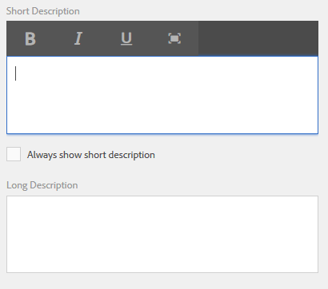
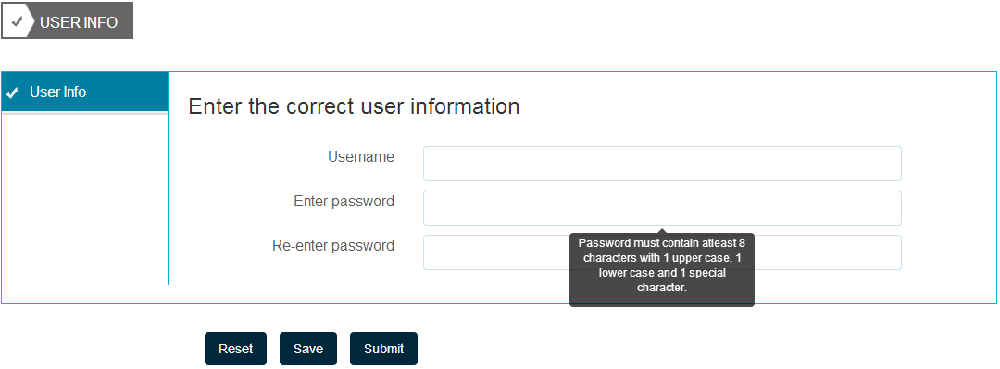
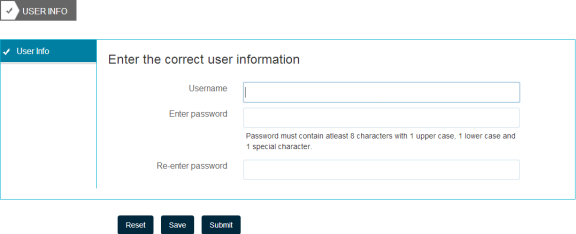
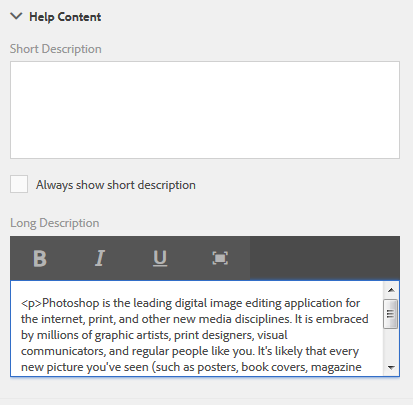
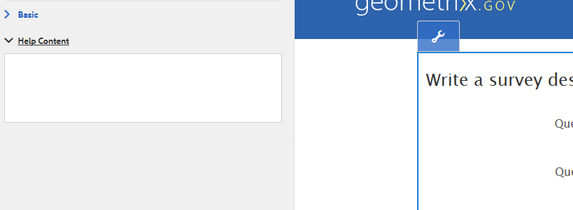

# 为表单字段创作上下文帮助{#authoring-in-context-help-for-form-fields}

Adobe 建议使用现代、可扩展的数据捕获[核心组件](https://experienceleague.adobe.com/docs/experience-manager-core-components/using/adaptive-forms/introduction.html?lang=zh-Hans)，以[创建新的自适应表单](/help/forms/using/create-an-adaptive-form-core-components.md)或[将自适应表单添加到 AEM Sites 页面](/help/forms/using/create-or-add-an-adaptive-form-to-aem-sites-page.md)。 这些组件代表了自适应表单创建方面的一大进步，可确保提供令人印象深刻的用户体验。 本文介绍了使用基础组件创作自适应表单的旧方法。

## 简介 {#introduction}

在某些情况下，最终用户填写表单时不确定如何在特定表单字段中填写详细信息。 为了解决此类问题，自适应表单支持向表单字段添加文本或富上下文帮助。 它有助于改善表单填写体验并避免最终用户出现任何歧义。

本文介绍了表单作者如何在创作自适应Forms时添加上下文帮助。

## 添加上下文帮助 {#add-in-context-help}

您可以使用侧边栏中“属性”选项卡的“帮助内容”部分中的以下选项指定上下文帮助。

* [简要说明](../../forms/using/authoring-in-field-help.md#p-short-description-p)
* [详细说明](../../forms/using/authoring-in-field-help.md#p-long-description-p)

>[!NOTE]
>
>长描述将覆盖短描述。 如果同时指定了两者，则只显示详细描述。

### 简要说明 {#short-description}

简短描述字段用于提供有关填写表单字段的快速和简短提示。 将鼠标悬停在简短描述字段中时，该字段中指定的文本将显示为工具提示。

>[!NOTE]
>
>选择&#x200B;**始终显示简短描述**&#x200B;以永久显示字段下的帮助文本。

### 详细说明 {#long-description}

您可以使用详细描述字段指定长文本或嵌入富媒体内容（包括视频）作为上下文帮助。 例如，下图显示了如何将视频作为上下文帮助进行嵌入。

添加详细描述时显示&#x200B;**？** 字段旁边的图标。 单击此图标将显示在详细描述部分中添加的内容。

### 面板级帮助 {#panel-level-help}

除了表单字段的上下文帮助之外，您还可以在面板编辑对话框的“帮助内容”选项卡中指定面板级别的帮助。

添加面板的帮助将显示&#x200B;**？** 图标图标。 单击图标将显示在面板编辑对话框的“帮助内容”部分中添加的内容。

的上下文帮助示例
