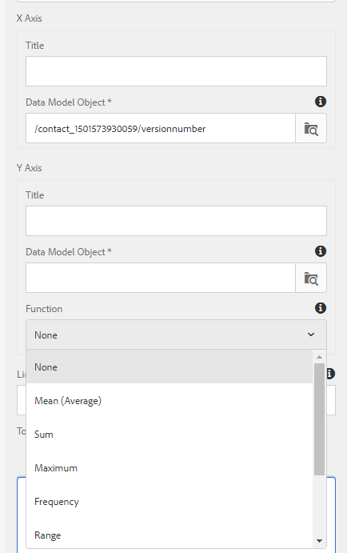

# 在交互式通信中使用图表{#using-charts-in-interactive-communications}

图表或图形是数据的可视化表示形式。 它将大量信息压缩为易于理解的视觉格式，使交互式通信的接收者能够更好地可视化、解释和分析复杂数据。

在创建交互式通信时，可以添加图表以直观地表示来自交互式通信表单数据模型的二维数据。 图表组件允许您添加和配置以下类型的图表：饼图、列、圆环图、条形图、折线图、折线图和点图、点图、面积图以及象限图。

## 在交互式通信中添加和配置图表 {#add-and-configure-chart-in-an-interactive-communication}

执行以下步骤在交互式通信中添加和配置图表：

1. 从交互式通信的Sidekick中选择&#x200B;**组件**。
1. 将&#x200B;**Chart**&#x200B;组件拖放到以下组件之一：

   * 打印渠道：目标区域或图像字段
   * Web渠道：面板或目标区域

1. 在交互式通信编辑器中选择图表组件，然后从组件工具栏中选择&#x200B;**[!UICONTROL 配置(]** )。

   图表属性显示在左窗格中。

   

   打印渠道中折线图的基本属性

   

   Web渠道中折线图的基本属性

1. 根据渠道类型配置[图表属性](../../forms/using/chart-component-interactive-communications.md#configure-chart-properties)。
1. （仅打印渠道）在&#x200B;**[!UICONTROL 代理设置]**&#x200B;中，指定代理是否必须使用此图表。 如果未选中&#x200B;**[!UICONTROL t强制代理使用此图表]**&#x200B;选项，代理可以在Agent UI的&#x200B;**[!UICONTROL 内容]**&#x200B;选项卡中选择图表的眼睛图标来显示或隐藏图表。

   

1. 选择以保存图表属性。

   选择&#x200B;**[!UICONTROL 预览]**&#x200B;以查看与图表关联的外观和数据。 选择&#x200B;**[!UICONTROL 编辑]**&#x200B;以重新配置图表的属性。

## 配置图表属性 {#configure-chart-properties}

为打印和Web渠道创建图表时，请配置以下属性：

<table>
 <tbody>
  <tr>
   <td>字段</td>
   <td>描述</td>
   <td>渠道类型</td>
  </tr>
  <tr>
   <td>名称</td>
   <td>图表元素的标识符。 在此字段中指定的图表的名称在图表中不可见。 当从其他组件、脚本和SOM表达式中引用元素时，会使用该元素。</td>
   <td>打印和Web</td>
  </tr>
  <tr>
   <td>图表类型</td>
   <td>要生成的图表类型。 可用的选项有“饼图”、“列”、“圆环图”、“条形图”、“直线”、“线和点”、“点”和“区域”。</td>
   <td>打印和Web</td>
  </tr>
  <tr>
   <td>系列&gt;多个系列</td>
   <td>选择以为X轴和Y轴上绘制的表单数据模型收集项添加多个系列。</td>
   <td>打印和Web</td>
  </tr>
  <tr>
   <td>系列&gt;数据模型对象</td>
   <td>要向图表添加多个系列的表单数据模型集合项的名称。<br />为绘制在X轴和Y轴上的属性选择父表单数据模型对象属性，以形成有意义的系列。 您绑定的数据模型对象必须为Number、String或Date类型。</td>
   <td>打印和Web</td>
  </tr>
  <tr>
   <td>显示排列</td>
   <td>选择将各系列的数值排列程序。</td>
   <td>打印和Web</td>
  </tr>
  <tr>
   <td>X轴&gt;标题</td>
   <td>X轴的标题。</td>
   <td>打印和Web</td>
  </tr>
  <tr>
   <td>X轴&gt;数据模型对象</td>
   <td><p>将在X轴上绘制的表单数据模型收集项的名称。</p> <p>为相同的父数据模型对象选择两个彼此有意义且收藏集/数组类型属性，以绘制在图表的X轴和Y轴上。 您绑定的数据模型对象必须为Number、String或Date类型。</p> </td>
   <td>打印和Web</td>
  </tr>
  <tr>
   <td>Y轴&gt;标题</td>
   <td>Y轴的标题。 </td>
   <td>打印和Web</td>
  </tr>
  <tr>
   <td>Y轴&gt;数据模型对象</td>
   <td><p>表单数据模型集合项绘制在Y轴上。 在打印渠道中，Y轴的数据模型对象应为“数字”类型。</p> <p>为相同的父数据模型对象选择两个彼此有意义且收藏集/数组类型属性，以绘制在图表的X轴和Y轴上。 </p> </td>
   <td>打印和Web</td>
  </tr>
  <tr>
   <td>Y轴&gt;函数</td>
   <td>用于计算y轴上值的统计/自定义函数。</td>
   <td>打印和Web</td>
  </tr>
  <tr>
   <td>隐藏对象</td>
   <td>选择以在最终输出中隐藏图表。</td>
   <td>打印和Web</td>
  </tr>
  <tr>
   <td>标题</td>
   <td>图表的标题。 </td>
   <td>打印</td>
  </tr>
  <tr>
   <td>高度</td>
   <td>图表的高度（像素）。</td>
   <td>打印</td>
  </tr>
  <tr>
   <td>宽度</td>
   <td>图表的宽度（像素）。 您可以使用样式层或应用主题来控制Web渠道中的图表宽度。</td>
   <td>打印</td>
  </tr>
  <tr>
   <td>在此之前强制分页</td>
   <td>选择此项可在图表之前添加强制分页符，并将图表放在新页面的顶部。 </td>
   <td>打印</td>
  </tr>
  <tr>
   <td>在此之后强制分页</td>
   <td>选择此项可在图表后添加强制分页符，并将图表后的内容置于新页面的顶部。 </td>
   <td>打印</td>
  </tr>
  <tr>
   <td>缩进</td>
   <td>图表从页面左侧的缩进。 </td>
   <td>打印</td>
  </tr>
  <tr>
   <td>工具提示</td>
   <td><p>工具提示在Web渠道图表中数据点悬停鼠标时显示的格式。 默认值为${x}(${y})。 根据图表类型，当您将鼠标指向图表的某个点、条形或切片时，变量${x}和${y}将动态替换为X轴和Y轴上的相应值，并显示在工具提示中。</p> <p>要禁用工具提示，请保留<span class="uicontrol">工具提示</code> 字段为空。 此选项不适用于折线图和面积图。 例如，请参阅<a href="#chartoutputprintweb">示例1：打印和Web中的图表输出</a>。</p> </td>
   <td>Web</td>
  </tr>
  <tr>
   <td>特定于图表的配置</td>
   <td><p>除了常见配置外，还提供以下特定于图表的配置：</p>
    <ul>
     <li><strong>显示图例： </strong>启用时显示饼图或圆环图的图例。</li>
     <li><strong>图例位置： </strong>指定图例相对于图表的位置。 可用的选项有“右”、“左”、“上”和“下”。 在打印渠道中使用右侧图例。</li>
     <li><strong>内半径</strong>：可用于圆环图以指定图表中内圆的半径（以像素为单位）。</li>
     <li><strong>线条颜色</strong>：可用于线条、线和点以及面积图，以指定图表中线条的颜色。</li>
     <li><strong>点颜色</strong>：可用于点图表、折线图和点图表，以指定图表中的点的颜色。<br /> </li>
     <li><strong>区域颜色</strong>：可用于区域图，以指定图表中线下区域的颜色。</li>
     <li><strong>参考点&gt;绑定类型： </strong>可用于象限图以<strong> </strong>指定参考点的绑定类型。 使用静态文本或数据模型对象属性定义参考点的值。</li>
     <li><strong>参考点&gt; X轴： </strong>如果选择<span class="uicontrol">静态，可用于象限图</code> 从“绑定类型”下拉列表中指定参照点的X轴值。</li>
     <li><strong>参考点&gt; Y轴： </strong>如果选择<span class="uicontrol">静态，可用于象限图</code> 从“绑定类型”下拉列表中指定参照点的Y轴值。</li>
     <li><strong>参考点&gt;系列的数据模型对象： </strong>如果您选择<span class="uicontrol">数据模型对象，则可用于多个系列象限图</code> 从“绑定类型”下拉列表中。 定义表单数据模型对象属性以标识参考点的系列。 </li>
     <li><strong>参考点&gt;系列的数据模型对象值： </strong>如果您选择<span class="uicontrol">数据模型对象，则可用于多个系列象限图</code> 从“绑定类型”下拉列表中。 使用系列的表单数据模型对象属性以及在此字段中定义的值来标识参考点的系列。</li>
     <li><strong>参考点&gt;参考点的数据模型对象： </strong>如果选择<span class="uicontrol">数据模型对象，可用于象限图</code> 从“绑定类型”下拉列表中。 定义表单数据模型对象属性，该属性是绘制在X轴和Y轴上的属性的同级。 此外，对于多个系列，定义一个数据模型对象属性，该属性是为系列定义的数据模型对象属性的子实体。</li>
     <li><strong>参考点&gt;参考点的数据模型对象值： </strong>可用于象限图表（如果选择<span class="uicontrol">数据模型对象）</code> 从“绑定类型”下拉列表中。 使用参考点的表单数据模型对象属性以及在此字段中定义的值来标识图表的参考点。<br /> <strong>象限标签&gt;左上角：</strong>可用于象限图以指定左上象限的名称。</li>
     <li><strong>象限标签&gt;右上方：</strong>可用于象限图以指定右上象限的名称。</li>
     <li><strong>象限标签&gt;右下方： </strong>可用于象限图以指定右下象限的名称。</li>
     <li><strong>象限标签&gt;左下方： </strong>可用于象限图以指定左下象限的名称。</li>
    </ul> </td>
   <td>打印和Web</td>
  </tr>
 </tbody>
</table>

## 在图表中使用函数 {#use-functions-in-chart}

您可以配置图表以使用统计函数计算源数据的值，以便在图表上绘图。 通过在图表中应用函数，可以绘制表单数据模型未直接提供的数据。

图表中的

虽然图表组件带有一些内置函数，但您可以编写[自定义函数](#customfunctionsweb)，使其可用于Web渠道的图表配置中。

默认情况下，以下函数可用于图表组件：

**平均值(Average)**&#x200B;返回另一轴上给定值的X轴或Y轴上的值的平均值。

**Sum**&#x200B;返回X轴或Y轴上给定值在其他轴上的总和。

**Maximum**&#x200B;返回另一轴上给定值的X轴或Y轴上的值的最大值。

**Frequency**&#x200B;返回另一轴上给定值的X轴或Y轴上的值数。

**范围**&#x200B;返回另一轴上给定值的X轴或Y轴上的最大值和最小值之间的差值。

**中间值**&#x200B;返回将另一轴上给定值在X轴或Y轴上一半的高值和低值分隔开的值。

**Minimum**&#x200B;返回另一轴上给定值在X或Y轴上的最小值。

**Mode**&#x200B;返回另一个轴上给定值在X或Y轴上出现次数最多的值。

有关详细信息，请参阅[示例2：在折线图](#applicationsumfrequency)中应用求和和和频度函数。

### Web渠道中的自定义函数 {#customfunctionsweb}

除了在图表中使用默认函数之外，您还可以在JavaScript中编写自定义函数，™且在Web渠道的图表组件中的函数列表中提供这些函数。

函数将一个或多个值和类别名称作为输入并返回一个值。 例如：

```javascript
Multiply(valueArray, category) {
 var val = 1;
 _.each(valueArray, function(value) {
 val = val * value;
 });
 return val;
}
```

编写自定义函数后，请执行以下操作以使其可用于图表配置：

1. 在与相关交互式通信关联的客户端库中添加自定义函数。 有关详细信息，请参阅[配置提交操作](/help/forms/using/configuring-submit-actions.md)和[使用客户端库](/help/sites-developing/clientlibs.md)。

1. 要在“函数”下拉列表中显示自定义函数，请在CRXDe Lite的apps文件夹中创建具有以下属性的`nt:unstructured`节点：

   * 添加值为`fd/af/reducer`的属性`guideComponentType`。 （必填）

   * 将属性`value`添加到自定义JavaScript™函数的完全限定名称。 （必需）并将其值设置为自定义函数的名称，如Multiply。
   * 添加属性`jcr:description`，使其具有要显示为自定义函数名称的值，该自定义函数显示在“函数”下拉列表中。 例如，**乘**。

   * 添加属性`qtip`，其值将作为自定义函数的简短说明。 当指针悬停在&#x200B;**函数**&#x200B;下拉列表中的函数名称上时，它显示为工具提示。

1. 单击&#x200B;**全部保存**&#x200B;以保存配置。

函数现在可用于图表中。

## 示例1：打印和Web中的图表输出 {#chartoutputprintweb}

在“基本”选项卡中，您可以定义图表类型、包含数据的源表单数据模型属性、要在图表的X轴和Y轴上绘制的标签，还可以选择定义统计函数以计算在图表上绘制的值。

让我们通过使用交互式通信生成的卡语句来详细了解基本属性中最低要求的信息。 假设您要生成一个图表来描述对帐单中不同费用的金额。 要使用不同类型的图表进行交互式通信的打印和Web输出。

### 用于打印的柱状图 {#columnchartprint}

要完成此操作，请指定以下属性：

* **[!UICONTROL 名称]** — 指定图表的名称。
* **[!UICONTROL 图表类型]** — 从下拉列表中选择&#x200B;**列**。
* **[!UICONTROL 标题]** — 指定X轴的费用类型和Y轴的交易金额。
* **[!UICONTROL 数据模型对象]** — 选择数据模型对象属性以创建X轴（费用类型）和Y轴（交易金额）的数据绑定。


交互式通信打印渠道中的柱状图

### 适用于Web的圆环图 {#donutchartweb}

要完成此操作，请指定以下属性：

* **[!UICONTROL 名称]** — 指定图表的名称。
* **[!UICONTROL 图表类型]** — 从下拉列表中选择&#x200B;**[!UICONTROL 圆环图]**。
* **[!UICONTROL 数据模型对象]** — 选择数据模型对象属性以创建X轴（费用类型）和Y轴（交易金额）的数据绑定。
* **[!UICONTROL 内半径]** — 将内半径值指定为150，以指定图表内圆的半径（以像素为单位）。
* **[!UICONTROL 工具提示]** — 使用${x}(${y})默认格式显示工具提示。 工具提示显示为：费用类型（交易金额）。 示例：借记的比特币(10000)。

交互式通信的Web渠道中的

交互式通信Web渠道中的圆环图

## 示例2：在折线图中应用“和”和“频率”函数 {#applicationsumfrequency}

通过在图表中应用函数，可以绘制表单数据模型未直接提供的数据。 在本例中，我们使用信用卡对帐单示例来了解如何将“总和”和“频率”函数应用于图表。


不带函数的折线图，带有两个“AirBnB借记”交易记录

### Sum函数 {#sum-function}

您可以应用sum函数将同一数据属性的多个实例的值相加，并且只显示一次。 例如，在下图中，在Y轴上应用Sum函数，将AirBnB事务处理（2050和1050）的两个Debit for AirBnB事务处理(3100)的总和相加，并仅显示一个事务处理(3100)。

当您要整理并显示同一数据属性的多个实例的总和时，Sum函数可以使图形更有用。


### 频率函数 {#frequency-function}

Frequency函数返回另一个轴上给定值的Y轴值的数量。 在Y轴（事务处理金额）上应用“频率”函数后，该图表显示AirBnB事务处理出现了两次借方，其它类型的事务处理也出现一次。


## 示例3：Web中的多系列象限图 {#example-multi-series-quadrant-chart-in-web}

图表绘制在特定日期范围内执行的事务处理金额。 象限图表能够将图表区划分为四个标记部分。 该字符对X轴和Y轴使用静态参考点。 使用多系列功能根据银行名称分离数据。

要完成此操作，请指定以下属性：

* **名称：**&#x200B;指定图表的名称。
* **图表类型：**&#x200B;从下拉列表中选择&#x200B;**象限**。

* 选中&#x200B;**多个系列**&#x200B;复选框。
* **数据模型对象**：指定系列的数据模型对象属性。 库名称的数据模型对象属性是以X轴和Y轴绘制的数据模型对象属性的父级。
* **数据模型对象：**&#x200B;选择数据模型对象属性以创建X轴（事务日期）和Y轴（事务金额）的数据绑定。
* 在&#x200B;**参考点**&#x200B;部分中，选择&#x200B;**静态**&#x200B;作为绑定类型。

* 指定X轴和Y轴参照点的值。
* 指定左上、右上、右下和左下象限的象限标签。
* 选中&#x200B;**显示图例**&#x200B;复选框以显示银行名称的颜色代码。


