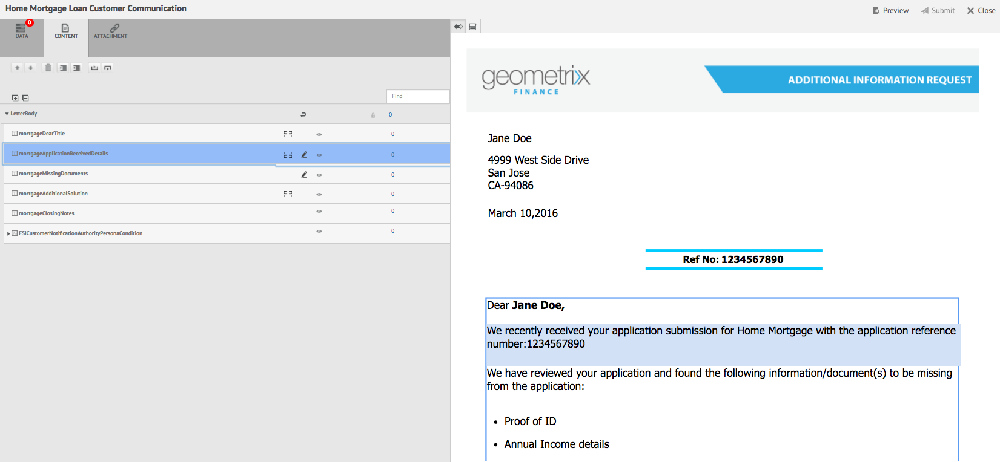

# 创建通信{#create-correspondence}

## 在“创建通信”用户界面中创建通信 {#create-correspondence-in-the-create-correspondence-user-interface}

在Correspondence Management[&#128279;](/help/forms/using/create-letter.md)中创建信件模板后，最终用户/代理/索赔理算员可以在“创建信件”用户界面中打开信件，并通过输入数据、设置内容和管理附件来创建信件。 最后，理赔人或代理可以在预览模式下管理内容并提交信件。

### 预览通信 {#preview-a-correspondence}

使用以下步骤选择要预览的字母：

1. 在“书信”页面上，选择&#x200B;**选择**。
1. 通过点按选择相应的字母。

   

   选择书信

1. 对于基于数据字典的书信，请选择&#x200B;**预览** > **预览**。 对于非基于数据字典的书信，请选择&#x200B;**预览**。 您还可以将鼠标悬停在信件上（无需选择信件），然后选择信件预览图标以进行预览。

   >[!NOTE]
   >
   >如果数据字典未与信件关联，则打开信件预览。 否则，如果信件基于数据字典，则“通信管理”会在“预览”菜单中显示“预览”和“自定义”选项，您可以选择两个选项之一。 您还可以将测试数据与数据字典关联。 当[数据字典关联了测试数据](../../forms/using/data-dictionary.md#p-working-with-test-data-p)时，在选择预览选项时，将打开普通预览并填充测试数据。

1. 为了能够在预览通信时呈现通信，您应当是管理员或以下组之一的成员：

   * forms-users（在创作实例上预览）
   * cm-agent-users（用于发布实例上的演绎版）

   如果您没有所需的权限，请向管理员请求相应的访问权限。 有关创建用户并将其添加到组的详细信息，请参阅[将用户或组添加到组](/help/sites-administering/security.md)。 如果您尝试在没有适当权限的情况下渲染通信，则会显示404错误页面。

1. 如果已选择&#x200B;**预览** > **自定义**，则会打开一个对话框。 在对话框中，选择与数据字典对应的数据文件以预览字母，然后选择&#x200B;**预览**。 基于特定信件的数据字典创建数据文件。 有关数据文件的详细信息，请参阅[数据字典](../../forms/using/data-dictionary.md#p-working-with-test-data-p)。

   

1. 默认情况下，书信HTML预览（移动设备表单预览）会打开，其中的“数据”选项卡处于焦点。

   有关移动表单及其支持的功能的详细信息，请参阅[移动Forms与PDF forms之间的功能区别](/help/forms/using/feature-differentiation-html5-forms-pdf-forms.md)。

   有三个选项卡：数据、内容和附件。 如果没有数据元素（占位符变量和布局字段），则信件会直接在中打开，并显示“内容”选项卡。 仅当存在附件或启用了库访问权限时，“附件”选项卡才可用。

   >[!NOTE]
   >
   >有关在预览信件的HTML或PDF呈现模式之间切换的更多信息，请参阅[更改信件的呈现模式](#changerenditionmode)。 有关PDF在通信管理和AEM中支持的详细信息，请参阅[停止NPAPI浏览器插件及其影响](https://helpx.adobe.com/cn/acrobat/kb/change-in-support-for-acrobat-and-reader-plug-ins-in-modern-web-.html)。

### 输入数据 {#enterdata}

在数据选项卡中，填写可用的布局字段和占位符。

1. 根据需要在字段中输入数据和内容变量。 填写所有标有星号(&#42;)的必填字段以启用&#x200B;**提交**&#x200B;按钮。

   在HTML信件预览中选择数据字段值，以高亮显示数据选项卡中的相应数据字段。

   中输入数据

### 管理内容 {#managecontent}

在内容选项卡中，管理信件中的内容，如文档片段和内容变量。

1. 选择&#x200B;**内容**。 通信管理显示信件的内容选项卡。

   

1. 根据需要，在内容选项卡中编辑内容模块。 要使内容层次结构中的相关内容模块获得焦点，您可以在信件预览中选择相关行或段落，或者直接在内容层次结构中选择内容模块。

   例如，在下图中选择了“We has reviewed...”行，并在“内容”选项卡中选择了相关的内容模块。

   

   在“内容”或“数据”选项卡中，通过点按HTML信件预览左上角的突出显示选定模块()，可以禁用或启用在信件预览中选择相关文本、段落或数据字段时转到内容/数据模块的功能。

   有关“创建通信”用户界面中各种模块可用的操作的详细信息，请参阅“创建通信”用户界面中可用的[操作和信息](#actions-and-info-available-in-the-create-correspondence-content-tab)。

1. 要查找内容模块，请使用查找字段。 输入内容模块的完整或部分名称或标题，以在通信中搜索它。
1. 选择列表、文本、条件或目标区域前面的“显示”图标（）以在信件中显示或隐藏它。
1. 要编辑内嵌或可编辑的文本模块，请选择相关的&#x200B;**编辑**&#x200B;图标()，或在信件预览中双击相关文本模块。

   系统将显示一个文本编辑器来编辑文本并设置其格式。

   浏览器中的默认拼写检查器会检查文本编辑器中的拼写。 要管理拼写和语法检查，您可以编辑浏览器的拼写检查器设置或安装浏览器插件/加载项以检查拼写和语法。

   您还可以使用文本编辑器中的各种键盘快捷键来管理、编辑文本和设置文本格式。 有关通信管理键盘快捷键中[文本编辑器](/help/forms/using/keyboard-shortcuts.md#correspondence-management)键盘快捷键的详细信息。

   

   您可能希望重新使用存在于另一个文档应用中的多个文本段落之一。 您可以直接复制并粘贴文本，例如从MS Word、HTML页面或任何其他应用程序复制并粘贴文本。

   您可以在可编辑文本模块中复制并粘贴文本的一个或多个段落。 例如，您可能有一个包含可接受居住证明项目符号列表的MS Word文档，如下所示：

   

   您可以将MS Word文档中的文本直接复制并粘贴到可编辑的文本模块中。 项目符号列表、字体和文本颜色等格式将保留在文本模块中。

   

   >[!NOTE]
   >
   >但是，粘贴文本的格式存在一些限制。

   可以使用Tab键缩进信件中的文本和数字。 例如，可以使用Tab键将列表中的多个文本列对齐为表格格式。

   

   示例：使用Tab键将多列文本对齐为表格格式

1. 如有必要，请在通信中插入特殊字符。 例如，可以使用“特殊字符”面板插入：

   * 货币符号，如€、@和£
   * 数学符号，例如∑、√、∂和^
   * 标点符号，如&quot;和&quot;

   

   通信管理已内置对210个特殊字符的支持。 管理员可以[通过自定义](../../forms/using/custom-special-characters.md)添加对更多/自定义特殊字符的支持。

1. 要高亮显示\强调可编辑内联模块中的文本部分，请选择该文本，然后选择“高亮显示颜色”。

   

   您可以直接选择基本颜色调色板中存在的基本颜色`**[A]**`，或者在使用滑块`**[B]**`选择相应的颜色阴影后选择&#x200B;**选择**。

   或者，您也可以转到“高级”选项卡选择适当的色相、亮度和饱和度`**[C]**`以创建精确的颜色，然后选择“选择`**[D]**`”以应用颜色突出显示文本。

   

1. 进行相应的内容和格式更改并选择&#x200B;**保存**。 选择()可在可编辑文本模块之间移动，或选择&#x200B;**保存和下一个**&#x200B;以保存更改并移动到下一个可编辑文本模块。
1. 系统还会显示每个分支的未填充变量。 如果不存在未填写的变量，则未填写的变量将显示为0。 如果存在未填充的变量，您可以选择某个分支来展开该分支，然后找到未填充的变量。 使用内容工具栏可删除内容、增加/减少内容的缩进，以及在内容之前/之后插入分页符。

   即使分页符是列表和条件的一部分，也可以在数据模块的上方和下方插入分页符。

1. 选择“打开/关闭内容变量”()以打开内容变量并适当填充它们。
1. 正确填写未填写的变量后，未填写变量的计数将设置为0。

   在创建通信用户界面中，未填写的变量计数将显示在至少包含一个变量的任何模块的层次结构的每个级别。 如果模块包含未填写的变量，则计数将显示在变量、模块、目标区域和信件模板级别。

   未填写的变量计数包括：

   * 仅限无保护的数据字典和占位符变量。 变量计数不包括布局或受保护的数据字典变量。
   * 必填字段。
   * 布局字段（如果它们是必填字段，并且绑定到用户）。
   * 仅限唯一变量实例。 如果模块、目标区域或信件模板包含同一变量的两个或更多实例，则计数显示为1（一）。 但是，对于每个实例，计数都显示为1。

   未填写的变量计数不包括已取消选择的模块。 如果某个模块包含在信件模板中，但未包含在信件中，则不会显示此模块中未填写变量的计数。

   对于目标区域、模块和变量，计数会显示在信件模板中每个对象的右侧。 但是，对于完整模板，计数将显示在“创建通信”状态栏中。

   信件模板中的模块显示未填写的变量计数，如下所述：

   * **文本**&#x200B;显示文本模块中包含的唯一未填充占位符变量和数据字典元素的总和。
   * **条件**&#x200B;显示条件中包含的未填充唯一条件变量和结果模块中包含的变量的总和。
   * **列表**&#x200B;显示分配给该列表的模块中包含的所有唯一未填写变量的总和。
   * **目标区域**&#x200B;显示分配给目标区域的模块中包含的所有唯一未填充变量的总和。

   请注意以下有关具有默认值的变量的信息：

   * 布尔变量字段默认为&#x200B;*false*。 但是，变量会被视为未填充。 这意味着变量计数包括值为&#x200B;*false*&#x200B;的所有布尔变量字段。

   * 数值变量字段默认为&#x200B;*0 （零）*。 但是，变量会被视为未填充。 这意味着变量计数包括值为&#x200B;*0 （零）*&#x200B;的所有数字变量字段。

#### “创建通信内容”选项卡中可用的操作和信息 {#actions-and-info-available-in-the-create-correspondence-content-tab}

**目标区域**

* 插入空白行：插入新的空白行。
* 插入内联文本：插入新文本模块。
* 顺序锁定（信息）：指示无法更改内容的顺序。
* 未填充的值（信息）：指示目标区域中未填充变量的数量。

**模块**

* 选择（眼睛图标）：从字母中包含\排除模块。
* 跳过项目符号（适用于列表模块及其子模块）：跳过特定模块中的项目符号。
* 在之前分页（适用于目标区域的子模块）：在模块之前插入分页。
* 在后面插入分页符（适用于目标区域的子模块）：在模块之前插入分页符。
* 未填充的值（信息）：指示目标区域中未填充变量的数量。
* 编辑（仅限文本模块）：打开富文本编辑器以编辑文本模块。
* 数据面板（文本和条件模块）：打开模块的所有变量。

**列出模块**

* 插入空白行：插入新的空白行。
* 内容库：打开内容库以将模块添加到列表。
* 列表设置（仅限嵌套列表）：
* 顺序锁定（信息）：指示无法更改列表项的顺序。

### 管理附件 {#manage-attachments}

1. 选择&#x200B;**附件**。 通信管理显示创建信件模板时设置的可用附件。
1. 您可以通过点按视图图标来选择不随信件一起提交附件，也可以选择附件中的十字以将其从信件中删除。 对于指定的附件，在创建信件模板时，“查看”和“删除”图标将禁用。
1. 选择库访问权限()图标可访问内容库，以将DAM资产作为附件插入。

   >[!NOTE]
   >
   >只有创作信件时启用了库访问，库访问图标才可用。

1. 如果在创建通信时未锁定附件的顺序，则可以通过选择附件并点按向下和向上箭头来重新排序附件。

   有关详细信息，请参阅[附件投放](#attachmentdelivery)。

### 在预览中管理内容并提交书信 {#manage-content-in-preview-and-submit-the-letter}

您可以对布局和内容进行相关更改，以确保信件看起来与预期的一样，并将信件提交给各种发布流程。

1. 要突出显示信件中的所有可编辑内容，请选择&#x200B;**突出显示可编辑部分**。

   字母的可编辑内容以灰色背景突出显示。

   

1. 根据需要，在内容选项卡中编辑内容模块。 要使内容层次结构中的相关内容模块获得焦点，您可以在信件预览中选择相关行或段落，或者直接在内容层次结构中选择内容模块。

   例如，在下图中选择了“允许我们访问……”行，并在“内容”选项卡中选择了相应的内容模块。

   通过点按内容中的高亮显示选定模块()，您可以禁用或启用在信件预览中点按相关文本、段落或数据字段时在“内容”选项卡中高亮显示内容模块的功能。

   有关“创建通信”用户界面中各种模块可用的操作的详细信息，请参阅“创建通信”用户界面中可用的[操作和信息](#actions-and-info-available-in-the-create-correspondence-content-tab)。

1. 若要在信件中添加分页符，请选择要插入分页符的位置，然后选择“在之前分页符”或“在之后分页符”()。

   在信件中插入显式分页符占位符。 要查看明确的分页符对信件有何影响，请参阅拼合的PDF预览。

   >[!NOTE]
   >
   >由于移动设备表单不支持分页符，因此页眉和页脚仅出现一次。 但是，您可以在布局（每页）中明确设置页眉和页脚，以使其显示在移动设备表单预览中。 此外，信件中的空白页面（如果有）不会出现在移动设备表单预览中。

   

1. 要将信件另存为草稿（稍后可继续处理），请选择“另存为草稿”。 若要使用此选项，您的信件需要[已发布](../../forms/using/publishing-unpublishing-forms.md#publishanasset)。 有关详细信息，请参阅[保存草稿和提交信件实例](#savingdrafts)下的草稿实例。

   

   此时将显示草稿信件名称对话框，其中包含信件实例ID。 您可以选择编辑此ID。 记下书信ID，然后选择&#x200B;**完成**。 您稍后可以使用此ID [重新加载草稿书信](submit-letter-topostprocess.md#reloaddraft)。

1. 若要以平面化PDF预览书信，并在提交书信时采用确切的布局和分页符，请选择（）预览。

   该信件显示为一个扁平的PDF。 拼合的PDF是信件的精确表示形式，因为提交信件时将使用正确的字体、分隔符和信件布局。

   >[!NOTE]
   >
   >如果您使用的是Mozilla Firefox和HTML呈现版本类型，要预览拼合的PDF形式的信件，请确保您使用的是本机浏览器插件，而不是Acrobat插件。 要选择本机浏览器插件，请转到Mozilla Firefox的设置，对于内容类型PDF，请选择“在Firefox中预览”。

1. 如果您发现拼合的PDF预览效果令人满意，请选择&#x200B;**提交**&#x200B;以提交书信。 或者，若要更改信件，请选择&#x200B;**退出预览**&#x200B;以返回信件的创建通信UI预览，从而更改信件。 选择提交后，如果在发布实例上启用了管理书信实例配置，则会生成提交书信实例。

   有关更多信息，请参阅保存草稿和提交信件实例下的草稿实例。

   您还可以将信件另存为草稿以便稍后更改信件。

   进行所需的更改后，您可以从HTML5预览中提交书信，或再次选择预览以审阅拼合的PDF输出。

   有关HTML5 Forms与PDF forms之间差异的信息，请参阅[HTML5 Forms与PDF forms之间的功能区别](../../forms/using/feature-differentiation-html5-forms-pdf-forms.md)。

## 保存草稿和提交信件实例 {#savingdrafts}

在“创建通信”用户界面中呈现信件时，您可以将信件保存为正在查看。

有两种类型的信件实例可以保存：草稿实例和提交实例。

* **草稿实例**：草稿实例捕获您正在预览的信件的当前状态。 要保存草稿实例，请先确保信件及其引用的所有资产均处于“已发布”状态。 有关发布书信的信息，请参阅[发布资产](../../forms/using/publishing-unpublishing-forms.md#publishanasset)。 您需要先发布信件，然后才能将其另存为草稿，因为发布信件时，需要先创建该信件的版本、其相关资源和数据。 您或其他用户无法编辑信件的已发布版本，并且以后可以在与已发布版本没有任何意外差异的情况下还原。 您可以稍后返回此实例，然后从所离开的位置继续。

* **提交实例**：提交实例在提交时捕获书信的状态。 提交实例存储信件实例在经过后处理后的PDF状态，以及用户在创建通信用户界面中输入的数据。

只能在发布实例上查看信件时保存此类实例。 默认情况下，在实例上保存处于关闭状态。 要启用信件实例保存，请执行以下步骤。

1. 在AEM中，使用以下URL打开服务器的Adobe Experience Manager Web控制台配置： https://&lt;server>：&lt;port>/&lt;contextpath>/system/console/configMgr
1. 找到&#x200B;**[!UICONTROL 通信管理配置]**&#x200B;并单击它。
1. 检查&#x200B;**[!UICONTROL 在发布]**&#x200B;配置中管理书信实例，然后单击&#x200B;**[!UICONTROL 保存]**。

### 启用保存草稿功能 {#enable-save-draft-feature}

在发布实例上发布信件或保存草稿之前，请在创作和发布实例上执行以下步骤以启用另存为草稿功能：

默认情况下，*cq：lastReplicationAction*、*cq：lastreplicated*&#x200B;和&#x200B;*cq：lastReplicatedBy*&#x200B;属性未转移到发布实例。 若要将&#x200B;*cq：lastReplicationAction*、*cq：lastreplicated*&#x200B;和&#x200B;*cq：lastReplicatedBy*&#x200B;属性转移到发布实例，请禁用[!UICONTROL com.day.cq.replication.impl.ReplicationPropertiesFilterFactory]组件。 要禁用组件，请执行以下操作：

1. 在创作实例上，打开Adobe Experience Manager Web控制台组件控制台。 默认URL为`http://author-server:port/system/console/components`

1. 搜索&#x200B;**[!UICONTROL com.day.cq.replication.impl.ReplicationPropertiesFilterFactory]**&#x200B;组件。

1. 单击图标以禁用[!UICONTROL com.day.cq.replication.impl.ReplicationPropertiesFilterFactory]组件。

要启用另存为草稿功能，请将[!UICONTROL VersionRestoreManager创作URL]处的现有URL替换为创作实例的URL。 要替换URL，请执行以下操作：

1. 在发布实例上，打开[!UICONTROL Aode Manager Web控制台配置]。 默认URL为`https://publish-server:port/system/console/configMgr`

1. 搜索并打开&#x200B;**[!UICONTROL 通信管理 — 作者实例版本还原配置]**&#x200B;组件。

1. 找到&#x200B;**[!UICONTROL VersionRestoreManager创作URL]**&#x200B;字段，并指定创作实例的URL。

1. 单击“保存”。

打开信件实例保存功能后，您可以选择保存信件实例的位置。 保存信件实例有两个选项：“本地保存”或“远程保存”。

### 本地保存 {#local-save}

书信实例保存在发布实例上，并在创作实例上反向复制。

### 远程保存 {#remote-save}

此选项适用于担心在发布实例上保存用户数据的人员，通常情况下，这些发布实例位于公司防火墙之外。 打开远程保存后，书信实例不会保存在发布实例上，而是保存在通过LiveCycle Client SDK配置指定的处理作者上。

#### 启用远程保存 {#enable-remote-save}

1. 在AEM中，使用以下URL打开服务器的Adobe Experience Manager Web控制台配置： `https://<server>:<port>/<contextpath>/system/console/configMgr`
1. 搜索&#x200B;**[!UICONTROL 通信管理配置]**&#x200B;并单击它。
1. 找到&#x200B;**[!UICONTROL 远程保存]**&#x200B;配置，检查该配置，然后单击&#x200B;**[!UICONTROL 保存]**。

#### 指定处理作者设置 {#specify-processing-author-settings}

1. 在AEM中，使用以下URL打开服务器的Adobe Experience Manager Web控制台配置： `https://<server>:<port>/system/console/configMgr`

   

1. 在此页面上，找到Adobe LiveCycle Client SDK配置，然后单击该配置以展开它。

1. 在处理服务器URL中，输入LiveCycle服务器的名称，提供登录信息，然后单击&#x200B;**保存**。

   

1. 如有必要，请设置要用来访问服务器的用户名和密码。

#### 附件投放 {#attachmentdelivery}

* 信件附件在PDF中可用，在提交信件后创建。
* 使用服务器端API作为交互式或非交互式PDF呈现信件时，呈现的PDF包含附件作为PDF附件。
* 当使用“创建通信”用户界面将与信件模板关联的后处理作为提交或完成通信操作的一部分加载时，附件作为List&lt;com.adobe.idp.Document>在AttachmentDocs参数中传递。
* 现成的投放机制（如电子邮件和打印）还会随生成的通信的PDF一起投放附件。

## 信件预览的演绎版模式：Mobile表单预览和PDF预览 {#rendition-modes-of-letter-preview-mobile-forms-preview-and-pdf-preview}

AEM Forms通信管理在创建通信UI中将信件显示为HTML。 但是，通信管理仍支持恢复到PDF预览，而不是HTML预览。 有关在HTML和PDF预览模式之间切换的更多信息，请参阅[更改书信的呈现模式](#changerenditionmode)。

以下是HTML和PDF预览版中提供的优势和功能。

**移动表单/HTML预览的优点**

* **选择数据字段值以突出显示对应的数据字段**：在“创建通信”用户界面中，可以选择信件中的数据字段值以突出显示“数据”选项卡中的相应数据字段。 有关详细信息，请参阅[输入数据](#enterdata)。

* **浏览器支持**：浏览器将逐渐撤回对NPAPI的支持，这会影响PDF预览信件。 信件的HTML/mobile forms预览不受此影响。
* **在信件中高亮显示可编辑内容**：在“创建通信”用户界面中，可以选择“高亮显示可编辑内容”以灰色高亮显示信件中的所有可编辑内容。 有关详细信息，请参阅[管理内容](#managecontent)。

`<li>` `<li>Benefits of HTML preview  <ul>   <li>Right to left</li>   <li>NPAPI</li>   <li>Highlight Editable Content</li>  </ul> </li>` `<li>Benefits of PDF preview  <ul>   <li>Page Break</li>   <li>Final Preview</li>  </ul> </li>`
`<li>` `<li>Benefits of HTML preview  <ul>   <li>Right to left</li>   <li>NPAPI</li>   <li>Highlight Editable Content</li>  </ul> </li>` `<li>Benefits of PDF preview  <ul>   <li>Page Break</li>   <li>Final Preview</li>  </ul> </li>` **PDF预览的优点**

* **分页符**：在PDF预览中，您可以查看信件中的分页符对其输出的确切影响。
* **最终预览**：在PDF预览中，您可以查看信件将出现在输出中的确切格式设置和外观。

有关PDF forms中脚本支持的信息，请参阅[脚本支持](https://help.adobe.com/en_US/livecycle/11.0/ScriptingSupport/index.html)。

有关HTML5表单中脚本支持的详细信息，请参阅[HTML5表单的脚本支持](/help/forms/using/scripting-support.md)。

### 更改信件的呈现模式 {#changerenditionmode}

默认情况下，创建通信UI使用HTML或移动表单呈现信件预览。 移动设备表单预览在任何浏览器中呈现时不会出现任何问题，因为它使用浏览器的本机插件，并且无需其他插件。 您可以将信件预览模式更改为PDF。 但是，浏览器限制可能会为信件的交互式PDF预览的不同功能带来问题。

有关浏览器与信件预览兼容性的详细信息，请参阅[NPAPI浏览器插件停止使用及其影响](https://helpx.adobe.com/cn/acrobat/kb/change-in-support-for-acrobat-and-reader-plug-ins-in-modern-web-.html)。

要更改信件的预览模式，请完成以下步骤：

1. 转到`https://[system]:'port'/system/console/configMgr`，并在必要时以管理员身份登录。
1. 转到&#x200B;**[!UICONTROL 通信管理配置]** > **[!UICONTROL 节目类型]**，然后选择&#x200B;**HTML节目**（默认）或&#x200B;**PDF节目**。
1. 单击&#x200B;**[!UICONTROL 保存]**。
