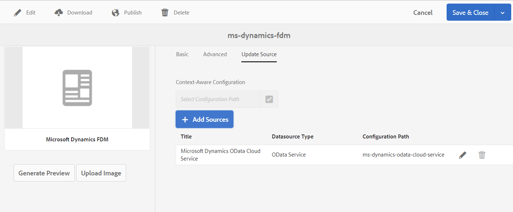

# 创建表单数据模型{#create-form-data-model}

## 应用到 {#applies-to}

该文档适用于&#x200B;**AEM 6.5 LTS Forms**。

有关AEM as a Cloud Service文档，请参阅Cloud Service上的[AEM Forms](https://experienceleague.adobe.com/docs/experience-manager-cloud-service/content/forms/integrate/use-form-data-model/create-form-data-models.html?lang=zh-Hans)。

AEM Forms数据集成提供了一个直观的用户界面，用于创建和使用表单数据模型。 表单数据模型依赖于数据源进行数据交换；但是，您可以创建具有或不具有数据源的表单数据模型。 根据您是否配置了数据源，可使用两种方法从数据模型创建：

* **使用预配置的数据源**：如果您已按照[配置数据源](../../forms/using/configure-data-sources.md)中的说明配置数据源，则可以在创建表单数据模型时选择它们。 它提供选定数据源中的所有数据模型对象、属性和服务，可用于表单数据模型。

* **没有数据源**：如果尚未为表单数据模型配置数据源，则仍可以创建它而不使用数据源。 您可以使用表单数据模型创作自适应表单和交互式通信，并使用示例数据测试它们。 当数据源可用时，您可以将表单数据模型与数据源绑定，数据源会自动反映在关联的自适应表单和交互式通信中。

>[!NOTE]
>
>您必须是&#x200B;**fdm-author**&#x200B;和&#x200B;**forms-user**&#x200B;组的成员才能创建和使用表单数据模型。 联系AEM管理员以成为组成员。

## 创建表单数据模型 {#data-sources}

请确保已配置要在表单数据模型中使用的数据源，如[配置数据源](../../forms/using/configure-data-sources.md)中所述。 执行以下操作以基于配置的数据源创建表单数据模型：

1. 在AEM创作实例中，导航到&#x200B;**[!UICONTROL Forms >数据集成]**。
1. 选择&#x200B;**[!UICONTROL 创建>表单数据模型]**。
1. 在创建表单数据模型对话框中：

   * 指定表单数据模型的名称。
   * （**可选**）为表单数据模型指定标题、描述和标记。
   * （**可选，并且仅在配置了数据源时适用**）选择&#x200B;**[!UICONTROL 数据Source配置]**&#x200B;字段旁边的勾号图标，然后选择您要使用的数据源的云服务所在的配置节点。 它将在下一页上可供选择的数据源列表限制为所选配置节点中的可用数据源列表。 但是，默认情况下会列出所有JDBC数据库和AEM用户配置文件数据源。 如果不选择配置节点，则会列出所有配置节点的数据源。

   选择&#x200B;**[!UICONTROL 下一步]**。

1. （**仅当配置了数据源时才适用**）**[!UICONTROL 选择数据源]**&#x200B;屏幕列出了可用的数据源（如果有）。 选择要在表单数据模型中使用的数据源。
1. 选择&#x200B;**[!UICONTROL 创建]**，然后在确认对话框中，选择&#x200B;**[!UICONTROL 打开]**&#x200B;以打开表单数据模型编辑器。

让我们查看表单数据模型编辑器UI的不同组件。

**A。数据源**&#x200B;列出表单数据模型中的数据源。 展开数据源以查看其数据模型对象和服务。

**B。刷新数据Source定义**&#x200B;从配置的数据源中获取数据源定义中的任何更改，并在表单数据模型编辑器的“数据源”选项卡中更新它们。

**C。模型**&#x200B;显示添加的数据模型对象的内容区域。

**天服务**&#x200B;显示添加的数据源操作或服务的内容区域。

**E。工具栏**&#x200B;用于处理表单数据模型的工具。 工具栏根据表单数据模型中选定的对象显示更多选项。

**F。添加选定项**&#x200B;将选定数据模型对象和服务添加到表单数据模型。

有关表单数据模型编辑器以及如何使用它来编辑和配置表单数据模型的详细信息，请参阅[使用表单数据模型](../../forms/using/work-with-form-data-model.md)。

## 更新数据源 {#update}

执行以下操作以将数据源添加或更新到现有表单数据模型。

1. 转到&#x200B;**[!UICONTROL Forms >数据集成]**，选择要添加或更新数据源的表单数据模型，然后选择&#x200B;**[!UICONTROL 属性]**。
1. 在表单数据模型属性中，转到&#x200B;**[!UICONTROL 更新Source]**&#x200B;选项卡。

   在更新Source选项卡中：

   * 在&#x200B;**[!UICONTROL 上下文感知配置]**&#x200B;字段中选择浏览图标，然后选择要添加的数据源的云配置驻留的配置节点。 如果不选择节点，则在选择`global`添加源&#x200B;**[!UICONTROL 时，将列出仅驻留在]**&#x200B;节点中的云配置。

   * 要添加新数据源，请选择&#x200B;**[!UICONTROL 添加源]**，然后选择要添加到表单数据模型的数据源。 将显示在`global`中配置的所有数据源和选定的配置节点（如果有）。

   * 要将现有数据源替换为相同类型的另一个数据源，请选择该数据源的&#x200B;**[!UICONTROL 编辑]**&#x200B;图标，然后从可用数据源列表中选择。
   * 要删除现有数据源，请选择数据源的&#x200B;**[!UICONTROL 删除]**&#x200B;图标。 如果将数据源中的数据模型对象添加到表单数据模型中，则“删除”图标将被禁用。

   

1. 选择&#x200B;**[!UICONTROL 保存并关闭]**&#x200B;以保存更新。

>[!NOTE]
>
>在表单数据模型中添加新数据源或更新现有数据源后，请确保在使用更新后的表单数据模型的自适应表单和交互式通信中相应地更新绑定引用。

## 后续步骤 {#next-steps}

现在，您拥有一个添加了数据源的表单数据模型。 接下来，可以编辑表单数据模型以添加和配置数据模型对象和服务，添加数据模型对象之间的关联，编辑属性，添加自定义数据模型对象和属性，生成示例数据等。

有关详细信息，请参阅[使用表单数据模型](../../forms/using/work-with-form-data-model.md)。
