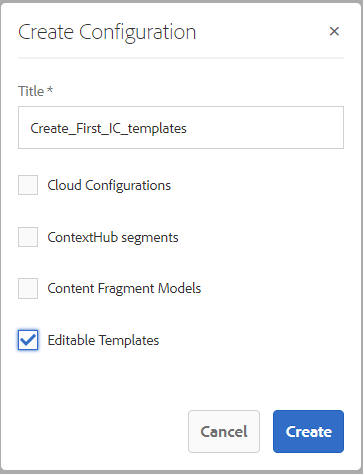
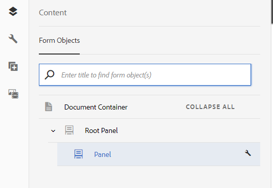

# 教程：创建模板{#tutorial-create-templates}

本教程是[创建您的第一个交互式通信](/help/forms/using/create-your-first-interactive-communication.md)系列中的步骤。 建议您按照时间顺序跟踪系列，以了解、执行和演示完整的教程用例。

要创建交互式通信，您必须在AEM服务器上为打印和Web渠道提供模板。

打印渠道的模板在Adobe Forms Designer中创建，并上传到AEM服务器。 然后，这些模板便可在创建交互式通信时使用。

Web渠道的模板是在AEM中创建的。 模板作者和管理员可以创建、编辑和启用Web模板。 创建并启用后，这些模板便可在创建交互式通信时使用。

本教程将指导您完成为打印和Web渠道创建模板的步骤，以便在创建交互式通信时使用这些模板。 在本教程结束时，您将能够：

* 使用Adobe Forms Designer为打印渠道创建XDP模板
* 将XDP模板上传到AEM Forms服务器
* 为Web渠道创建和启用模板

## 为打印渠道创建模板 {#create-template-for-print-channel}

使用以下任务为交互式通信的打印渠道创建和管理模板：

* [使用Forms Designer创建XDP模板](../../forms/using/create-templates-print-web.md#create-xdp-template-using-forms-designer)
* [将XDP模板上传到AEM Forms服务器](../../forms/using/create-templates-print-web.md#upload-xdp-template-to-the-aem-forms-server)
* [为布局片段创建XDP模板](../../forms/using/create-templates-print-web.md#create-xdp-template-for-layout-fragments)

### 使用Forms Designer创建XDP模板 {#create-xdp-template-using-forms-designer}

根据[用例](/help/forms/using/create-your-first-interactive-communication.md)和[剖析](/help/forms/using/planning-interactive-communications.md)，在XDP模板中创建以下子表单：

* 帐单详细信息：包括文档片段
* 客户详细信息：包含文档片段
* 帐单摘要：包含文档片段
* 摘要：包括文档片段（费用子表单）和图表（图表子表单）
* 分项调用：包含表（布局片段）
* 立即支付：包含图像
* 增值服务：包含图像

将XDP文件上传到Forms服务器后，这些子表单在打印模板中显示为目标区域。 创建交互式通信时，文档片段、图表、布局片段和图像等所有实体都将添加到目标区域。

要为打印渠道创建XDP模板，请执行以下操作：

1. 打开Forms Designer，选择&#x200B;**文件** > **新建** > **使用空白表单，**&#x200B;选择&#x200B;**下一步**，然后选择&#x200B;**完成**&#x200B;以打开用于创建模板的表单。

   确保从&#x200B;**窗口**&#x200B;菜单选择&#x200B;**对象库**&#x200B;和&#x200B;**对象**&#x200B;选项。

1. 将&#x200B;**子表单**&#x200B;组件从&#x200B;**对象库**&#x200B;拖放到表单中。
1. 选择子表单，以便在右窗格的&#x200B;**对象**&#x200B;窗口中查看子表单的选项。
1. 选择&#x200B;**子表单**&#x200B;选项卡，然后从&#x200B;**内容**&#x200B;下拉列表中选择&#x200B;**流式**。 要调整长度，请拖动子表单的左端点。
1. 在&#x200B;**绑定**&#x200B;选项卡中：

   1. 在&#x200B;**名称**&#x200B;字段中指定&#x200B;**BillDetails**。

   1. 从&#x200B;**数据绑定**&#x200B;下拉列表中选择&#x200B;**无数据绑定**。

   

1. 同样，选择根子表单，选择&#x200B;**子表单**&#x200B;选项卡，然后从&#x200B;**Content**&#x200B;下拉列表中选择&#x200B;**Flowed**。 在&#x200B;**绑定**&#x200B;选项卡中：

   1. 在&#x200B;**名称**&#x200B;字段中指定&#x200B;**TelecaBill**。

   1. 从&#x200B;**数据绑定**&#x200B;下拉列表中选择&#x200B;**无数据绑定**。

   打印模板的

1. 重复步骤2 - 5以创建以下子表单：

   * 账单详细信息
   * 客户详细信息
   * 账单摘要
   * 摘要 — 选择&#x200B;**子表单**&#x200B;选项卡，然后从此子表单的&#x200B;**内容**&#x200B;下拉列表中选择&#x200B;**位置**。 在&#x200B;**摘要**&#x200B;子表单中插入以下子表单。

      * 费用
      * 图表

   * ItemisedCalls
   * Paynow
   * ValueAddedServices

   为了节省时间，您还可以复制并粘贴现有子表单以创建其他子表单。

   若要将&#x200B;**Charts**&#x200B;子表单移到Charges子表单的右侧，请从左窗格中选择&#x200B;**Charts**&#x200B;子表单，选择&#x200B;**布局**&#x200B;选项卡，并指定&#x200B;**AnchorX**&#x200B;字段的值。 该值必须大于&#x200B;**费用**&#x200B;子表单的&#x200B;**宽度**&#x200B;字段的值。 选择&#x200B;**费用**&#x200B;子表单并选择&#x200B;**布局**&#x200B;选项卡，以便您可以查看&#x200B;**宽度**&#x200B;字段的值。

1. 将&#x200B;**Text**&#x200B;对象从&#x200B;**对象库**&#x200B;拖放到窗体中，并在框中输入&#x200B;**Dial XXXX以订阅**&#x200B;文本。
1. 右键单击左窗格中的文本对象，选择&#x200B;**重命名对象**，然后输入文本对象的名称作为&#x200B;**订阅**。

   

1. 选择&#x200B;**文件** > **另存为**，将文件保存在本地文件系统中：

   1. 导航到可以保存文件的位置，并将名称指定为&#x200B;**create_first_ic_print_template**。
   1. 从&#x200B;**保存类型**&#x200B;下拉列表中选择&#x200B;**.xdp**。

   1. 选择&#x200B;**保存**。

### 将XDP模板上传到AEM Forms服务器 {#upload-xdp-template-to-the-aem-forms-server}

使用Forms Designer创建XDP模板后，必须将其上传到AEM Forms服务器，以便该模板可在创建交互式通信时使用。

1. 选择&#x200B;**[!UICONTROL Forms]** > **[!UICONTROL Forms和文档]**。
1. 选择&#x200B;**创建** > **文件上传**。

   导航并选择&#x200B;**create_first_ic_print_template**&#x200B;模板(XDP)并选择&#x200B;**Open**&#x200B;以将XDP模板导入AEM Forms服务器。

### 为布局片段创建XDP模板 {#create-xdp-template-for-layout-fragments}

要为交互式通信的打印渠道创建布局片段，请使用Forms Designer创建XDP并将其上传到AEM Forms服务器。

1. 打开Forms Designer，选择&#x200B;**文件** > **新建** > **使用空白表单，**&#x200B;选择&#x200B;**下一步**，然后选择&#x200B;**完成**&#x200B;以打开用于创建模板的表单。

   确保从&#x200B;**窗口**&#x200B;菜单选择&#x200B;**对象库**&#x200B;和&#x200B;**对象**&#x200B;选项。

1. 将&#x200B;**Table**&#x200B;组件从&#x200B;**对象库**&#x200B;拖放到窗体中。
1. 在“插入表”对话框中：

   1. 指定列数为&#x200B;**5**。
   1. 指定正文行数为&#x200B;**1**。
   1. 选中&#x200B;**Include Header Row in Table**&#x200B;复选框。
   1. 选项卡&#x200B;**确定**。

1. 选择&#x200B;**表** 1旁边的左窗格中的&#x200B;**+**，右键单击&#x200B;**单元格1**，然后选择&#x200B;**将对象**&#x200B;重命名为&#x200B;**日期**。

   同样，将&#x200B;**单元格2**、**单元格3**、**单元格4**&#x200B;和&#x200B;**单元格5**&#x200B;分别重命名为&#x200B;**时间**、**数字**、**持续时间**&#x200B;和&#x200B;**费用**。

1. 单击&#x200B;**Designer视图**&#x200B;中的标题文本字段，并将它们重命名为&#x200B;**Time**、**Number**、**Duration**&#x200B;和&#x200B;**Charges**。

   

1. 从左窗格中选择&#x200B;**行1**，并为每个数据项选择&#x200B;**对象** > **绑定** > **重复行**。

   

1. 将&#x200B;**文本字段**&#x200B;组件从&#x200B;**对象库**&#x200B;拖放到&#x200B;**Designer视图**。

   布局片段的

   同样，将&#x200B;**文本字段**&#x200B;组件拖放到&#x200B;**Time**、**Number**、**Duration**&#x200B;和&#x200B;**Charges**&#x200B;行。

1. 选择&#x200B;**文件** > **另存为**，将文件保存在本地文件系统中：

   1. 导航到可以保存文件的位置，并将名称指定为&#x200B;**table_lf**。
   1. 从&#x200B;**保存类型**&#x200B;下拉列表中选择&#x200B;**.xdp**。

   1. 选择&#x200B;**保存**。

   使用Forms Designer为布局片段创建XDP模板后，必须[将](../../forms/using/create-templates-print-web.md#upload-xdp-template-to-the-aem-forms-server)该模板上传AEM Forms服务器，以便该模板可在创建布局片段时使用。

## 为Web渠道创建模板 {#create-template-for-web-channel}

使用以下任务为交互式通信的Web渠道创建和管理模板：

* [为模板创建文件夹](../../forms/using/create-templates-print-web.md#create-folder-for-templates)
* [创建模板](../../forms/using/create-templates-print-web.md#create-the-template)
* [启用模板](../../forms/using/create-templates-print-web.md#enable-the-template)
* [在交互式通信中启用按钮](../../forms/using/create-templates-print-web.md#enabling-buttons-in-interactive-communications)

### 为模板创建文件夹 {#create-folder-for-templates}

要创建Web渠道模板，请定义一个文件夹，您可以在其中保存创建的模板。 在该文件夹中创建模板后，启用该模板以允许表单用户根据该模板创建交互式通信的Web渠道。

要为可编辑模板创建文件夹，请执行以下操作：

1. 选择&#x200B;**工具**  > **配置浏览器**。
   * 有关详细信息，请参阅[配置浏览器](/help/sites-administering/configurations.md)文档。
1. 在配置浏览器页面中，选择&#x200B;**创建**。
1. 在&#x200B;**创建配置**&#x200B;对话框中，指定&#x200B;**Create_First_IC_templates**&#x200B;作为文件夹的标题，选中&#x200B;**可编辑的模板**，然后选择&#x200B;**创建**。

   

   **Create_First_IC_templates**&#x200B;文件夹已创建并列在&#x200B;**配置浏览器**&#x200B;页面上。

### 创建模板 {#create-the-template}

根据[用例](/help/forms/using/create-your-first-interactive-communication.md)和[剖析](/help/forms/using/planning-interactive-communications.md)，在Web模板中创建以下面板：

* 帐单详细信息：包括文档片段
* 客户详细信息：包含文档片段
* 帐单摘要：包含文档片段
* 费用汇总：包括文档片段和图表（两列式布局）
* 分项调用：包含表
* 立即付款：包含&#x200B;**立即付款**&#x200B;按钮和图像
* 增值服务：包含图像和&#x200B;**订阅**&#x200B;按钮。

创建交互式通信时，会添加所有实体，例如文档片段、图表、表格、图像和按钮。

要在&#x200B;**Create_First_IC_templates**&#x200B;文件夹中为Web渠道创建模板，请执行以下步骤：

1. 通过选择&#x200B;**Tools** > **Templates** > **Create_First_IC_templates**&#x200B;文件夹，导航到相应的模板文件夹。
1. 选择&#x200B;**创建**。
1. 在&#x200B;**选择模板类型**&#x200B;配置向导中，选择&#x200B;**交互式通信 — Web渠道**，然后选择&#x200B;**下一步**。
1. 在&#x200B;**模板详细信息**&#x200B;配置向导中，将&#x200B;**Create_First_IC_Web_Template**&#x200B;指定为模板标题。 指定可选说明，然后选择&#x200B;**创建**。

   显示&#x200B;**Create_First_IC_Web_Template**&#x200B;的确认消息。

1. 选择&#x200B;**打开**&#x200B;以在模板编辑器中打开模板。
1. 从&#x200B;**预览**&#x200B;选项旁边的下拉列表中选择&#x200B;**初始内容**。

   

1. 选择&#x200B;**根面板**，然后选择&#x200B;**+**&#x200B;以查看可添加到模板的组件列表。
1. 若要在&#x200B;**根面板**&#x200B;上方添加面板，请从列表中选择&#x200B;**面板**。
1. 在左窗格中选择&#x200B;**Content**&#x200B;选项卡。 在步骤8中添加的新面板显示在内容树的&#x200B;**根面板**&#x200B;下。

   

1. 选择面板，然后选择 （配置）。
1. 在“属性”窗格中：

   1. 在“名称”字段中指定&#x200B;**billdetails**。
   1. 在“标题”字段中指定&#x200B;**帐单详细信息**。
   1. 从&#x200B;**列数**&#x200B;下拉列表中选择&#x200B;**1**。

   1. 要保存属性，请选择。

   面板的名称在内容树中更新为&#x200B;**帐单详细信息**。

1. 重复步骤7 - 11，向模板中添加具有以下属性的面板：

   | 名称 | 标题 | 列数 |
   |---|---|---|
   | customerdetails | 客户详细信息 | 1 |
   | 帐单摘要 | 账单摘要 | 1 |
   | 汇总费用 | 费用汇总 | 2 |
   | itemisedcalls | 分项呼叫 | 1 |
   | paynow | 立即付款 | 2 |
   | vas | 增值服务 | 1 |

   下图描述了将所有面板添加到模板后的内容树：

   所有面板的

### 启用模板 {#enable-the-template}

创建Web模板后，必须在创建交互式通信时启用该模板以使用该模板。

要启用Web模板，请执行以下操作：

1. 选择&#x200B;**工具**  > **模板**。
1. 导航到&#x200B;**Create_First_IC_Web_Template**&#x200B;模板，选择它，然后选择&#x200B;**启用**。
1. 再次选择&#x200B;**启用**&#x200B;以确认。

   模板已启用，其状态显示为“已启用”。 在为Web渠道创建交互式通信时，可以使用此模板。

### 在交互式通信中启用按钮 {#enabling-buttons-in-interactive-communications}

根据用例，必须在交互式通信中包括&#x200B;**立即付款**&#x200B;和&#x200B;**订阅**&#x200B;按钮（自适应表单组件）。 要在交互式通信中启用这些按钮，请执行以下操作：

1. 从&#x200B;**预览**&#x200B;选项旁边的下拉列表中选择&#x200B;**结构**。
1. 使用内容树选择&#x200B;**文档容器**&#x200B;根面板，然后选择&#x200B;**策略**&#x200B;以选择允许在交互式通信中使用的组件。

   

1. 在&#x200B;**属性**&#x200B;部分的&#x200B;**允许的组件**&#x200B;选项卡中，从&#x200B;**自适应表单**&#x200B;组件中选择&#x200B;**按钮**。

   

1. 要保存属性，请选择。
