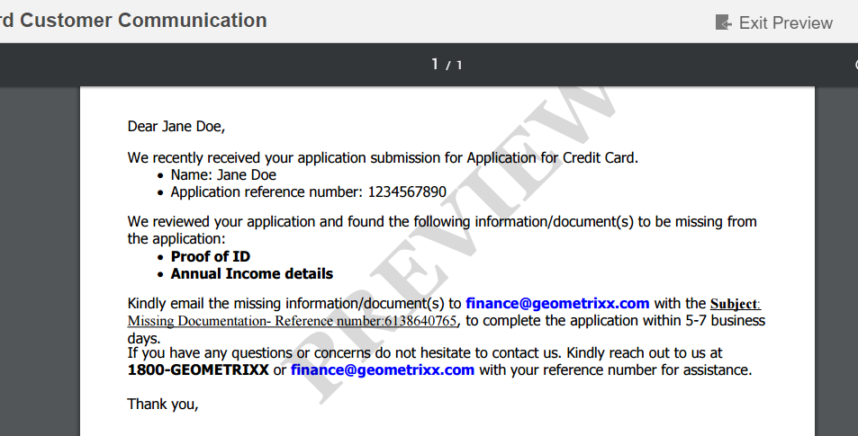

# 书信 PDF 预览中的自定义水印{#custom-watermark-in-letter-pdf-preview}

## 概述 {#overview}

在“创建通信”UI中，代理用户以最终形状预览通信，在最终形状中，通信将发送到后处理，如通过电子邮件发送或打印。

为防止未经授权使用此数据，组织可以对预览PDF施加水印。 默认水印为“PREVIEW”，它显示在PDF中。

要在预览PDF中启用水印，请在&#x200B;**[!UICONTROL 通信管理配置]**&#x200B;的https://&#39;[server]：[port]&#39;/system/console/configMgr中选择&#x200B;**[!UICONTROL 在预览期间应用水印]**。



可以使用以下步骤自定义水印的文本和外观：

## 在“创建通信”UI的PDF预览中自定义水印 {#customizewatermark-}

1. 转到`https://'[server]:[port]'/[ContextPath]/crx/de`并以管理员身份登录。
1. 在apps文件夹中，创建一个名为&#x200B;**[!UICONTROL previewwatermark]**&#x200B;的文件夹，其路径/结构与libs文件夹中的previewwatermark文件夹类似：

   1. 右键单击以下路径上的&#x200B;**previewwatermark**&#x200B;文件夹并选择&#x200B;**覆盖节点**：

      `/libs/fd/cm/configFiles/previewwatermark`

   1. 确保“覆盖节点”对话框具有以下值：

      **路径：** /libs/fd/cm/configFiles/previewwatermark

      **覆盖位置：** /apps/

      **匹配节点类型：**&#x200B;已选中

      >[!NOTE]
      >
      >请勿在/libs分支中进行更改。 您所做的任何更改都可能会丢失，因为每当您：
      >
      >    
      >    
      >    * 在实例上升级
      >    * 应用热修复程序
      >    * 安装功能包
      >    
      >

   1. 单击&#x200B;**确定**，然后单击&#x200B;**全部保存**。 **[!UICONTROL previewwatermark]**&#x200B;文件夹在指定的路径中创建。

1. 将ddx文件从“/libs/fd/cm/configFiles/previewwatermark”文件夹复制并粘贴到“/apps/fd/cm/configFiles/previewwatermark”文件夹，然后单击“**[!UICONTROL 全部保存]**”。
1. 在/apps/fd/cm/configFiles/previewwatermark/下的ddx文件中进行所需的更改。

   ```xml
   <DDX xmlns="https://ns.adobe.com/DDX/1.0/">
    <PDF result="output.pdf">
     <PDF source="input.pdf"/>
           <Watermark opacity="15%" rotation="45">
            <StyledText>
                     <p font-family="Georgia" font-size="70pt" color="black" font-weight="bold">
                         PREVIEW
                    </p>
            </StyledText>
           </Watermark>
    </PDF>
   </DDX>
   ```

   有关自定义水印外观、文本和对齐的信息，请参阅[汇编程序服务和DDX引用](https://help.adobe.com/zh_CN/livecycle/11.0/ddxRef.pdf)文档中的添加和删除水印和背景。

   >[!NOTE]
   >
   >在ddx文件中，对result和source的引用应保持未更改为output.pdf和input.pdf。 文件ddx的名称也不应更改。

1. 单击&#x200B;**全部保存**。
