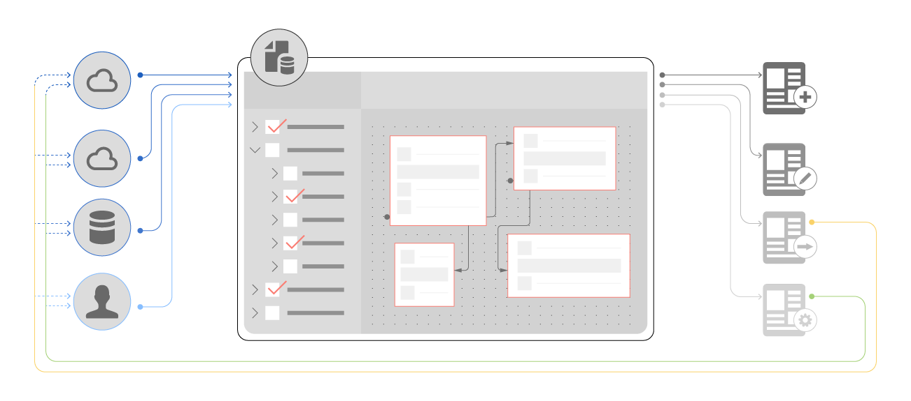

# [!DNL AEM Forms]数据集成 {#aem-forms-data-integration}

企业基础架构包括不同的后端系统或数据源，如数据库、 Web服务、 REST服务、 OData服务和CRM解决方案。 他们共同组成了一个信息系统，为企业应用程序提供数据以执行日常业务。 另一方面，应用程序会捕获数据并将其发送回更新数据源。

[!DNL AEM Forms]应用程序（如自适应表单和交互式通信）需要与数据源集成，以便在呈现表单和创建交互式通信时获取客户数据。 在某些情况下，根据自适应表单中的用户输入从数据源获取数据。 此外，提交的自适应表单数据可以写回以更新各自的数据源。

虽然分布式模块化系统有其自身的好处，但挑战在于跨数据源集成和创建数据关联。 数据集成是功能强大且高效的企业基础架构的关键，该基础架构具有连接到应用程序以交换业务数据的不同数据源。

## 数据集成概述 {#data-integration-overview}

[!DNL AEM Forms]数据集成允许配置不同的数据源并将其与[!DNL AEM Forms]连接。 它提供了一个直观的用户界面，用于跨连接的数据源创建业务实体和服务的统一数据表示架构。 这种统一表示方法称为表单数据模型，是JSON架构的扩展。 表单数据模型中的实体称为数据模型对象。 利用表单数据模型，您可以：

* 从连接的数据源访问数据模型对象、属性和服务。
* 创建自定义数据模型对象和属性
* 在数据源内和跨数据源的数据模型对象之间构建关联。
* 调用数据模型对象服务以向数据源查询数据或从数据源写入数据。

创建表单数据模型后，您便可以将其用于各种自适应表单和交互式通信工作流，例如：

* 根据表单数据模型创建自适应表单和交互式通信
* 从配置的数据源预填充自适应表单和交互式通信
* 使用自适应表单规则调用数据源服务/操作
* 将提交的自适应表单数据写入数据源

## 数据集成入门 {#get-started-with-data-integration}

实施数据集成的第一步是标识和配置数据源，以存储要在自适应表单和交互式通信用例中使用的信息。 接下来，创建表单数据模型，该模型使用来自一个或多个数据源的数据模型对象、属性和服务。 您可以基于表单数据模型创建自适应表单和交互式通信，其中交互式通信中的自适应表单字段或占位符绑定到各自的数据源属性。

[!DNL AEM Forms]还允许您创建独立于数据源的表单数据模型，并在以后将表单数据模型中的数据模型对象和属性与数据源关联或绑定。 它在处理表单数据模型时消除了对数据源的任何依赖性。

请参阅以下内容，以开始、了解和实施数据集成。

* [配置数据源](../../forms/using/configure-data-sources.md)
* [创建表单数据模型](../../forms/using/create-form-data-models.md)
* [使用表单数据模型](../../forms/using/work-with-form-data-model.md)
* [使用表单数据模型](../../forms/using/using-form-data-model.md)
