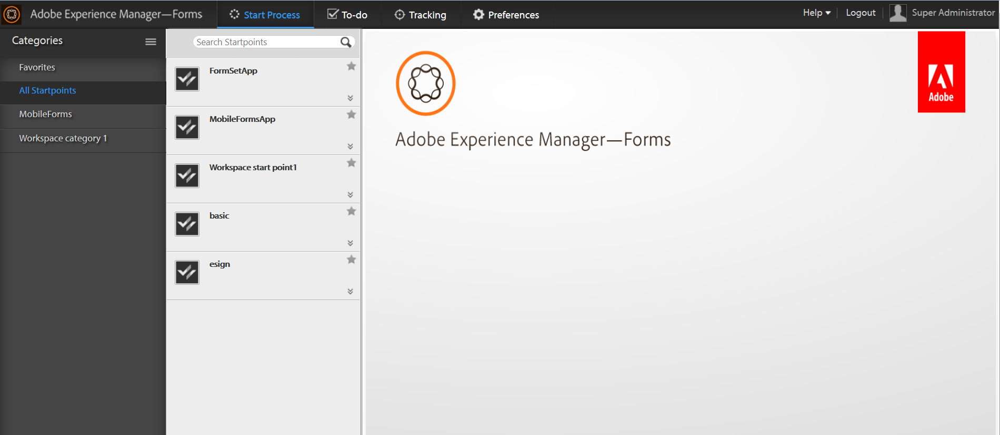

# AEM Forms 工作区简介{#introduction-to-aem-forms-workspace}

Forms workflow通过自动化关键文档和表单相关业务流程并提供可视性来提高组织效率。 使用“流程管理”模块，您可以构建可在线或离线访问的简化的端到端工作流 — 包括人员、系统、内容和业务规则。Forms工作流包括AEM Forms工作区。 AEM Forms工作区新增了扩展和集成工作区的功能，使其更便于用户使用。

AEM Forms工作区与更多设备和外形规格兼容。 它允许在没有Flash® Player和Adobe® Reader®的客户端上进行任务管理。 它有助于在PDF forms之外再现HTML Forms。

**关键功能**：

* 使用动态PDF forms、移动界面和Web应用程序吸引各地的流程参与者。
* 轻松地将工作区组件与Web应用程序集成。 由于AEM Forms工作区是基于组件的软件，因此可以轻松对其进行自定义和重复使用。
* 使用AEM Forms工作区应用程序将业务流程扩展到在线和离线移动工作人员。
* 查看用于监控积压、工作队列和关键绩效指标(KPI)的报表。 您可以使用API提取数据，以使用第三方报告工具进行进一步分析。
