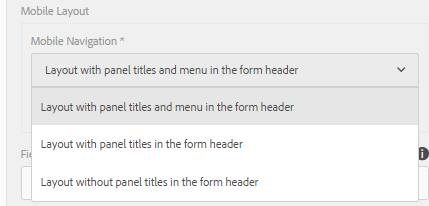

# 自适应表单的布局功能{#layout-capabilities-of-adaptive-forms}

<span class="preview">Adobe 建议使用现代、可扩展的数据捕获[核心组件](https://experienceleague.adobe.com/docs/experience-manager-core-components/using/adaptive-forms/introduction.html)，以[创建新的自适应表单](/help/forms/using/create-an-adaptive-form-core-components.md)或[将自适应表单添加到 AEM Sites 页面](/help/forms/using/create-or-add-an-adaptive-form-to-aem-sites-page.md)。这些组件代表有关创建自适应表单的重大改进，确保实现令人印象深刻的用户体验。本文介绍了使用基础组件创作自适应表单的旧方法。</span>

| 版本 | 文章链接 |
| -------- | ---------------------------- |
| AEM as a Cloud Service | [单击此处](https://experienceleague.adobe.com/docs/experience-manager-cloud-service/content/forms/adaptive-forms-authoring/authoring-adaptive-forms-foundation-components/configure-layout-of-an-adaptive-form/layout-capabilities-adaptive-forms.html) |
| AEM 6.5 | 本文 |


Adobe Experience Manager (AEM)允许您创建易于使用的自适应表单，为最终用户提供动态体验。 表单布局控制项或组件在自适应表单中的显示方式。

## 必备知识 {#prerequisite-knowledge}

在了解自适应表单的不同布局功能之前，请阅读以下文章以详细了解自适应表单。

[AEM Forms简介](../../forms/using/introduction-aem-forms.md)

[创作表单简介](../../forms/using/introduction-forms-authoring.md)

## 布局类型 {#types-of-layouts}

自适应表单为您提供以下类型的布局：

**面板布局**&#x200B;控制如何在设备上显示面板中的项或组件。

**移动设备布局**&#x200B;控制移动设备上的表单导航。 如果设备宽度为768像素或更高，则布局被视为移动设备布局并适用于移动设备。

**工具栏布局**&#x200B;控制操作按钮在表单工具栏或面板工具栏中的位置。

所有这些面板布局都在以下位置定义：

`/libs/fd/af/layouts`。

>[!NOTE]
>
>要更改自适应表单的布局，请使用AEM中的创作模式。


## 面板布局 {#panel-layout}

表单作者可以将布局与自适应表单的每个面板（包括根面板）关联。

面板布局位于`/libs/fd/af/layouts/panel`位置。


自适应表单中的面板布局列表

### 响应 — 页面上的所有内容，无需导航 {#responsive-everything-on-one-page-without-navigation-br}

使用此面板布局可创建响应式布局，该布局可调整设备的屏幕大小，而无需任何专门的导航。

使用此布局，您可以将多个&#x200B;**[!UICONTROL 面板自适应表单]**&#x200B;组件逐个放置在面板中。


使用小屏幕上显示的响应式布局的表单


使用大屏幕上显示的响应式布局的表单

### 向导 — 一次显示一个步骤的多步表单 {#wizard-a-multi-step-form-showing-one-step-at-a-time}

使用此面板布局可在表单中提供引导式导航。 例如，当您希望在表单中捕获强制信息时使用此布局，同时逐步引导用户。

使用`Panel adaptive form`组件在面板中提供分步导航。 使用此布局时，用户仅在当前步骤完成后才会进入下一步

```javascript
window.guideBridge.validate([], this.panel.navigationContext.currentItem.somExpression)
```

多步骤表单向导布局中的

多步骤表单向导布局中的步骤完成表达式


使用向导的表单

### 可折叠项设计的布局 {#layout-for-accordion-design}

使用此布局，您可以将`Panel adaptive form`组件放在具有折叠样式导航的面板中。 使用此布局，您还可以创建可重复的面板。 可重复面板允许您根据需要动态添加或移除面板。 您可以定义面板重复的最小和最大次数。 此外，可以根据面板项中提供的信息来动态确定面板的标题。

摘要表达式可用于显示最终用户在最小化面板的标题中提供的值。


使用折叠布局创建的可重复面板

### 选项卡式布局 — 选项卡显示在左侧 {#tabbed-layout-tabs-appear-on-the-left}

使用此布局，您可以将`Panel adaptive form`组件放在具有选项卡导航的面板中。 选项卡位于面板内容的左侧。


显示在面板左侧的选项卡

### 选项卡式布局 — 选项卡显示在顶部 {#tabbed-layout-tabs-appear-on-the-top}

使用此布局，您可以将`Panel adaptive form`组件放在具有选项卡导航的面板中。 选项卡位于面板内容的顶部。


显示在面板顶部的选项卡

## 移动设备布局 {#mobile-layouts}

移动设备布局允许在屏幕相对较小的移动设备上进行用户友好的导航。 移动设备布局使用选项卡式或向导式样式进行表单导航。 应用移动设备布局可为整个表单提供单个布局。

此布局使用导航栏和导航菜单控制导航。 导航栏显示&#x200B;**&lt;**&#x200B;和&#x200B;**>**&#x200B;图标，以指示表单中的&#x200B;**下一个**&#x200B;和&#x200B;**上一个**&#x200B;导航步骤。

移动设备布局位于`/libs/fd/af/layouts/mobile/`位置。 默认情况下，自适应表单中提供了以下移动设备布局。



自适应表单中的移动设备布局列表

使用移动设备布局时，通过点按图标，可以使用表单菜单访问各种表单面板。

### 在表单标题中使用面板标题进行布局 {#layout-with-panel-titles-in-the-form-header}

顾名思义，此布局显示面板标题以及导航菜单和导航栏。 此布局还提供用于导航的“下一个”和“上一个”图标。


移动版面以及表单标题中的面板标题

### 在表单标题中没有面板标题的布局 {#layout-without-panel-titles-in-the-form-header}

顾名思义，此布局仅显示没有面板标题的导航菜单和导航栏。 此布局还提供用于导航的“下一个”和“上一个”图标。


表单标题中没有面板标题的移动布局

## 工具栏布局 {#toolbar-layouts}

工具栏布局控制您添加到自适应表单的任何操作按钮的位置和显示。 可以在表单级别或面板级别添加布局。


自适应表单中的工具栏布局列表

工具栏布局位于`/libs/fd/af/layouts/toolbar`位置。 默认情况下，自适应表单提供以下工具栏布局。

### 工具栏的默认布局 {#default-layout-for-toolbar}

在自适应表单中添加任何操作按钮时，此布局被选为默认布局。 选择此布局时，桌面设备和移动设备将显示相同的布局。

此外，您还可以添加多个工具栏，其中包含使用此布局配置的操作按钮。 操作按钮与表单控件相关联。 您可以将工具栏配置为在面板之前或之后。


工具栏的默认视图

### 移动固定工具栏布局 {#mobile-fixed-layout-for-toolbar}

选择此布局可提供桌面和移动设备的替代布局。

对于桌面布局，您可以使用某些特定标签来添加操作按钮。 此布局只能配置一个工具栏。 如果多个工具栏配置了该布局，则移动设备存在重叠，并且只显示一个工具栏。 例如，您可以在表单底部或顶部有一个工具栏，或者在表单中的面板之后或之前有一个工具栏。

对于移动设备布局，您可以使用图标添加操作按钮。


移动固定工具栏布局
