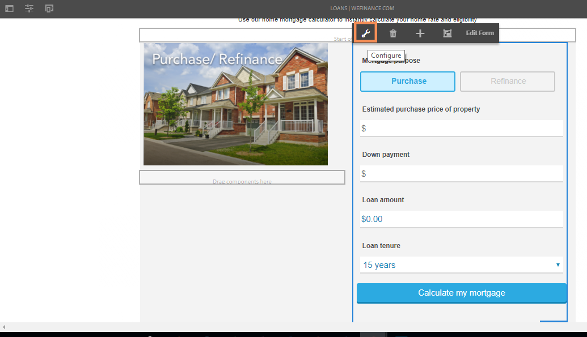
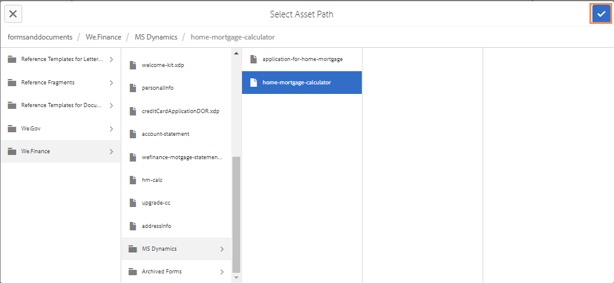

# 为 We.Finance 参考网站的住房按揭工作流配置 Microsoft Dynamics 365 {#configure-microsoft-dynamics-for-the-home-mortgage-workflow-of-the-we-finance-reference-site}

了解如何通过自适应表单为We.Finance参考网站的住房抵押贷款工作流使用® Dynamics 365服务

## 概述 {#overview}

® Dynamics 365是一款客户关系管理(CRM)和企业资源规划(ERP)软件，可提供用于创建和管理客户帐户、联系人、潜在客户、机会和案例的企业解决方案。

AEM Forms提供云服务以将Dynamics 365与[Forms数据集成](/help/forms/using/data-integration.md)模块集成。 在将“住房抵押贷款应用程序演练”与® Dynamics结合使用之前，您需要配置Microsoft® Dynamics 365以与We.Finance参考网站一起使用。

## 先决条件 {#prerequisites}

在开始设置和配置Dynamics 365之前，请确保您具有：

* AEM 6.3 Forms Service Pack 1及更高版本
* ® Dynamics 365帐户
* 已向® Azure Active Directory注册Dynamics 365服务应用程序
* 已注册应用程序的客户端ID和客户端密码

## 将住房抵押贷款计算器与您的网站主页链接 {#link-the-home-mortgage-calculator-with-your-site-home-page}

1. 在创作实例上，转到以下页面：

   `https://[server]:[port]/editor.html/content/we-finance/global/en/loan-landing-page.html`

1. 向下滚动到“住房抵押贷款计算器”。
1. 突出显示右列的（计算器）面板，然后选择以显示弹出菜单。 在弹出菜单中，选择“配置”。 此时会显示编辑AEM Forms容器对话框。

   

1. 在“编辑AEM Forms容器”对话框中，浏览资产路径并在以下路径中选择home-mortgage-calculator并选择&#x200B;**确认**：

   formsanddocuments/We.Finance/MS Dynamics/

   

1. 选择&#x200B;**完成**。
1. 发布已编辑的页面。

   >[!NOTE]
   >
   >计算器字段与FDM的绑定是通过We.Finance引用站点包预配置的。 要查看绑定，您可以在创作模式下打开表单并查看字段绑定引用。

1. 要创建用于存储房屋抵押贷款申请的申请人记录的自定义实体，请将AEMFormsFSIRefsite_1_0.zip解决方案包导入您的® Dynamics实例：

   1. 从以下位置下载包：

      `https://'[server]:[port]'/content/aemforms-refsite-collaterals/we-finance/home-mortgage/ms-dynamics/AEMFormsFSIRefsite_1_0.zip`

   1. 将解决方案包导入® Dynamics实例。 在® Dynamics实例中，转到&#x200B;**设置** > **解决方案**，然后选择&#x200B;**导入**。

1. 要设置重新网站中使用的用户联系人详细信息，请将Sarah Rose Contact.CSV包导入您的® Dynamics实例：

   1. 从以下位置下载包：

      `https://'[server]:[port]'/content/aemforms-refsite-collaterals/we-finance/home-mortgage/ms-dynamics/Sarah%20Rose%20Contact.csv`

   1. 将程序包导入您的® Dynamics实例。 在® Dynamics实例中，转到&#x200B;**Sales** > **Contacts**，然后选择&#x200B;**导入数据**。
