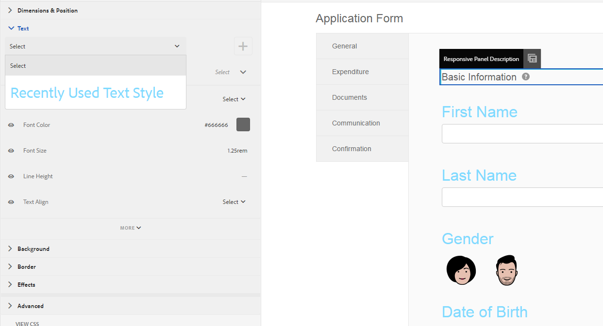

# 创建和使用主题 {#creating-and-using-themes}

Adobe 建议使用现代、可扩展的数据捕获[核心组件](https://experienceleague.adobe.com/docs/experience-manager-core-components/using/adaptive-forms/introduction.html)，以[创建新的自适应表单](/help/forms/using/create-an-adaptive-form-core-components.md)或[将自适应表单添加到 AEM Sites 页面](/help/forms/using/create-or-add-an-adaptive-form-to-aem-sites-page.md)。这些组件代表有关创建自适应表单的重大改进，确保实现令人印象深刻的用户体验。本文介绍了使用基础组件创作自适应表单的旧方法。

| 版本 | 文章链接 |
| -------- | ---------------------------- |
| AEM as a Cloud Service | [单击此处](https://experienceleague.adobe.com/docs/experience-manager-cloud-service/content/forms/adaptive-forms-authoring/authoring-adaptive-forms-foundation-components/create-an-adaptive-form-on-forms-cs/themes.html) |
| AEM 6.5 | 本文 |

## 简介 {#introduction}

您可以创建并应用主题来使自适应表单或交互式通信风格化。 主题包含组件和面板的样式详细信息。 样式包括背景颜色、状态颜色、透明度、对齐方式和大小等属性。应用主题时，指定的样式反映在相应的组件上。 主题是独立管理的，无需引用自适应表单或交互式通信。

您可以：

* 创建主题
* 编辑和复制现有主题
* 下载现有主题并将其上传到AEM Forms服务器
* 管理主题的依赖关系

## 创建、下载或上传主题 {#creating-downloading-or-uploading-a-theme}

通过AEM Forms，您可以创建、下载或上传主题。 创建主题的方式与创建表单、文档和信件等其他资产类似。 该主题将另存为单独的实体，并包含类似于表单的元属性。 作为单独实体的主题允许在多个自适应表单和交互式通信中重用。 您还可以将主题移动到AEM Forms的其他实例中并重复使用。

### 创建主题 {#creating-a-theme}

执行以下步骤可创建主题：

1. 单击&#x200B;**Adobe Experience Manager**，单击&#x200B;**Forms**，然后单击&#x200B;**主题**。

1. 在“主题”页面中，单击&#x200B;**创建>主题**。
将启动创建主题的向导。

1. 在创建主题向导的“基本”选项卡中，提供主题的&#x200B;**Title**&#x200B;和&#x200B;**Name**。 这些是必填字段。

1. 在“高级”选项卡中，您将获得两个字段：

   * **Clientlib位置**：存储库中存储主题的clientlib的位置。

   * **Clientlib类别**：提供文本字段以输入主题的clientlib类别名称。

1. 单击&#x200B;**创建**，然后单击&#x200B;**编辑**&#x200B;在主题编辑器中打开主题，或单击&#x200B;**完成**&#x200B;返回主题页面。

### 下载主题 {#downloading-a-theme}

您可以将主题导出为zip文件，并在其他项目或AEM实例中使用这些主题。 要下载主题，请执行以下操作：

1. 单击&#x200B;**Adobe Experience Manager**，单击&#x200B;**Forms**，然后单击&#x200B;**主题**。

1. 在“主题”页面中，**选择**&#x200B;主题，然后单击&#x200B;**下载**。 此时将显示一个对话框，其中包含主题的详细信息。

1. 单击&#x200B;**下载**。 主题将下载为zip文件。

>[!NOTE]
>
>如果下载的主题具有与之关联的自适应表单，并且关联的自适应表单基于自定义模板，则也要下载自定义模板。 将下载的主题和自适应表单上传到AEM Forms服务器时，还应上传相关的自定义模板。

### 上传主题 {#uploading-a-theme}

您可以在项目中将创建的主题与样式预设一起使用。 您可以通过将其他人创建的主题包上传到您的项目来导入这些主题包。

要上传主题，请执行以下操作：

1. 单击&#x200B;**Adobe Experience Manager**，单击&#x200B;**Forms**，然后单击&#x200B;**主题**。

1. 在“主题”页面中，单击&#x200B;**创建>文件上传**。
1. 在“文件上传”提示下，浏览并选择计算机上的主题包，然后单击&#x200B;**上传**。
上传的主题可在主题页面中找到。

## 主题的元数据 {#metadata-of-a-theme}

主题的元属性列表（可在主题的属性页面中找到）。

<table>
 <tbody>
  <tr>
   <th>
<strong>ID</strong>
 
 
 </th>
   <th><strong>名称</strong></th>
   <th><strong>可以编辑</strong></th>
   <th><strong>属性说明</strong></th>
  </tr>
  <tr>
   <td>1.</td>
   <td>标题</td>
   <td>是</td>
   <td>主题的显示名称。</td>
  </tr>
  <tr>
   <td>2.</td>
   <td>描述</td>
   <td>是</td>
   <td>有关主题的描述。</td>
  </tr>
  <tr>
   <td>3.</td>
   <td>类型</td>
   <td>否</td>
   <td>
    <ul>
     <li>资源类型。</li>
     <li>值始终为“主题”。</li>
    </ul> </td>
  </tr>
  <tr>
   <td>4.</td>
   <td>已创建</td>
   <td>否</td>
   <td>主题创建日期</td>
  </tr>
  <tr>
   <td>5.</td>
   <td>作者姓名</td>
   <td>是</td>
   <td>主题的作者。 在创建主题时计算。</td>
  </tr>
  <tr>
   <td>6.</td>
   <td>上次修改日期</td>
   <td>否</td>
   <td>上次修改主题的日期。</td>
  </tr>
  <tr>
   <td>7.</td>
   <td>状态</td>
   <td>否</td>
   <td>主题状态（已修改/已发布）。</td>
  </tr>
  <tr>
   <td>8.</td>
   <td>准时发布</td>
   <td>是</td>
   <td>自动发布主题的时间。</td>
  </tr>
  <tr>
   <td>9.</td>
   <td>发布关闭时间</td>
   <td>是</td>
   <td>自动取消发布主题的时间。</td>
  </tr>
  <tr>
   <td>10.</td>
   <td>标记</td>
   <td>是</td>
   <td>附加到用于标识的主题的标签，用于改进搜索。</td>
  </tr>
  <tr>
   <td>11.</td>
   <td>引用</td>
   <td>链接</td>
   <td>
    <ul>
     <li>包含“引用者”部分。 列出使用主题的表单。</li>
     <li>由于主题未引用任何其他资源，因此没有“引用”部分。</li>
    </ul> </td>
  </tr>
  <tr>
   <td>12.</td>
   <td>Clientlib 位置</td>
   <td>是</td>
   <td>
    <ul>
     <li>“/etc”中存储与此主题对应的clientlibs的用户定义存储库路径。</li>
     <li>默认值 — “/etc/clientlibs/fd/themes”+主题资源的相对路径。</li>
     <li>如果该位置不存在，则会自动生成文件夹层次结构。</li>
     <li>更改此值后，clientlib节点结构将移至输入的新位置。  <em><strong>注意：</strong>如果您更改默认clientlib位置，请在CRXDE存储库中将<code>crx:replicate</code>、<code>rep:write</code>、<code>rep:glob:*</code>、<code>rep:itemNames::</code>、<code>js.txt</code>、<code>jcr:read</code>分配给<code>forms-users</code>，并将<code>crx:replicate</code>、<code>jcr:read</code>分配给<code>fd-service</code>的新位置。 同时通过为<code>forms-user</code></em>添加<code>deny jcr:addChildNodes</code>附加另一个ACL</li>
    </ul> </td>
  </tr>
  <tr>
   <td>13.</td>
   <td>Clientlib 类别名称</td>
   <td>是</td>
   <td>
    <ul>
     <li>此主题的用户定义clientlib类别名称。</li>
     <li>如果该名称已被其他现有主题使用，则会显示错误。</li>
     <li>默认值 — 使用主题位置计算。</li>
     <li>更改此值后，将在相应的clientlib节点上更新类别名称。 不需要更新jsp文件中的Clientlib类别名称，因为引用使用了clientlib类别名称。</li>
    </ul> </td>
  </tr>
 </tbody>
</table>

## 关于主题编辑器 {#about-the-theme-editor}

AEM Forms附带主题编辑器。 它是一个便于企业用户和Web设计人员/开发人员使用的界面，提供了轻松指定各种自适应表单和交互式通信元素样式所需的功能。 创建主题时，该主题将存储为一个单独的实体，如表单、交互式通信、字母、文档片段和数据字典。

通过主题编辑器，可自定义主题中样式化组件的样式。 您可以自定义表单或交互式通信在设备上的外观。

主题编辑器分为两个面板：

* **画布** — 显示在右侧。 它显示了一个自适应表单或交互式通信示例，其中所有样式更改都会立即反映。 也可以直接从画布中选择对象来查找与其关联的样式，并编辑这些样式。 顶部的设备分辨率标尺控制画布。 从标尺中选择分辨率断点将显示相应分辨率的示例表单预览或交互式通信。 下面详细讨论了[的画布](../../forms/using/themes.md#using-canvas)。

* **侧栏** — 显示在左侧。 它包括以下项：

   * **选择器：**&#x200B;显示选定用于设置样式的组件及其可以设置样式的属性。 选择器表示某个类型的所有组件。 如果为样式选择主题中的文本框组件，则表单或交互式通信中的所有文本框将继承样式。 选择器允许您选择通用组件或特定组件来设置样式。 例如，字段组件是通用组件，文本框是特定组件。

     **正在设置泛型组件的样式：**
字段可以是数字框字段（如年龄）或文本框字段（如地址）。
设置字段样式时，所有字段（如年龄、姓名、地址）都会设置样式。

     **正在设置特定组件的样式**：
特定组件会影响特定类别的对象。 在主题中设置数字框组件的样式时，只有中的数字框对象会继承该样式。

     例如，文本框字段（如地址）的长度较长，而数字框字段（如年龄）的长度较短。 您可以选择数字框字段，缩短其长度并应用于表单。 表单中的所有数字框字段的宽度都会缩小。

     使用特定的背景颜色自定义所有字段组件时，所有字段（如年龄、名称和地址）将继承背景颜色。 如果选择数字框（如年龄）并减小其宽度，则所有数字框的宽度（如年龄）都会减小，家庭中的人数也会减少。 文本框的宽度不会更改。

   * **状态：**&#x200B;允许您自定义处于特定状态的对象的样式。 例如，您可以指定对象在默认、集中、禁用、悬停或错误状态时的外观。
   * **属性类别：**&#x200B;样式属性分为不同的类别。 例如，Dimension &amp; Position、文本、背景、边框和效果。 在每个类别下，您都会提供样式信息。 例如，在“背景”下，您可以提供“背景颜色”和“图像和渐变”。

   * **高级：**&#x200B;允许您向对象添加自定义CSS，这会覆盖可视化控件定义的属性（如果存在重叠）。

   * **查看CSS**：允许您查看选定组件的CSS

  此外，在侧栏的底部有一个箭头。 单击箭头时，您会获得另外两个选项：**模拟成功**&#x200B;和&#x200B;**模拟错误。**&#x200B;下面的[详细讨论了这些选项以及上述选项](../../forms/using/themes.md#using-rail)。

 **A.**&#x200B;侧栏&#x200B;**B.**&#x200B;画布

### 设置组件的样式 {#styling-components}

您可以在多个自适应表单和交互式通信中使用主题，这会导入您在主题中指定的组件格式。 您可以设置各种组件的样式，如标题、描述、面板、字段、图标和文本框。 使用小组件配置主题中的组件属性。 虽然CSS覆盖部分允许您编写CSS代码或提供自定义选择器，但并不要求您事先了解CSS或LESS。 在侧栏中选择组件时，将显示“CSS覆盖”部分。

侧栏中的

侧栏中的选项，用于选择和设置不同组件的样式。

单击侧边栏中某个组件的编辑按钮会选择画布中的组件，并允许您使用侧边栏中的选项设置组件样式。

某些组件（如文本框、数字框、单选按钮和复选框）在“字段”等类属组件下分类。 例如，要自定义单选按钮的样式。 要选择用于样式设置的单选按钮，请选择&#x200B;**字段>小组件>单选按钮**。

单击侧边栏中的&#x200B;**全部展开**&#x200B;以查看、选择和样式分类且前面不可见的组件。

### 样式化面板布局 {#styling-panel-layouts-br}

AEM Forms中的主题支持对表单和交互式通信中面板布局中的元素进行样式设置。 支持在现成布局和自定义布局中设计元素的样式。

现成的面板包括：

* 左侧选项卡
* 顶部选项卡
* 可折叠项
* 响应
* 向导
* 移动设备布局

   * 标题中的面板标题
   * 标题中没有面板标题

选择器会因每个布局而异。
从主题编辑器设计自定义布局的样式涉及：

* 为可设置样式的布局定义组件以及用于唯一标识这些组件的CSS选择器
* 定义可以应用于这些组件的CSS属性
* 从用户界面以交互方式定义这些组件的样式

### 不同屏幕大小的不同样式 {#different-styles-for-different-screen-sizes-br}

桌面版和移动设备版面可以具有略微不同的样式，也可以具有完全不同的样式。 对于移动设备，平板电脑和手机共享相似的布局（组件大小除外）。

使用主题编辑器断点为不同屏幕大小定义替代样式。 您可以选择开始构建主题的基本设备或分辨率，并自动生成其他分辨率的样式变体。 您可以显式修改所有分辨率的样式。

>[!NOTE]
>
>该主题首先使用表单或交互式通信创建，然后应用于不同的表单或交互式通信。 主题创建中使用的断点可能与应用主题的表单或交互式通信不同。 CSS媒体查询基于主题创建中使用的表单或交互式通信，而不是应用主题的表单或交互式通信。

### 选择对象时侧栏中的样式属性上下文更改 {#styling-properties-context-changes-in-sidebar-on-selecting-objects}

在画布中选择组件时，其样式设置属性会列在侧栏中。 选择对象类型及其状态，然后提供其样式。

### 主题编辑器中最近使用的样式 {#recently-used-styles-in-theme-editor}

主题编辑器可缓存多达10种应用于组件的样式。 您可以将缓存的样式与主题的其他组件一起使用。 最近使用的样式将作为列表框显示在侧边栏中选定组件的正下方。 最初，最近使用的样式列表为空。

在设置组件样式时，将缓存样式并将其列在列表框中。 在此示例中，文本框的标签被设置为更改字体大小和颜色。 可以按照类似步骤选择图像或更改颜色来设置组件的样式。 观察更改字段标签样式时，如何缓存样式并将其列在列表框中。

在此示例中，字段标签的样式发生了更改，并且当为样式选择了响应面板描述时，列表条目会添加到资产库中。 资源库中的条目可用于更改响应面板描述的样式。

将样式添加到资产库时，该样式可用于其他主题以及表单编辑器或交互式通信编辑器UI的[样式模式](../../forms/using/inline-style-adaptive-forms.md)。 同样，使用表单编辑器或交互式通信编辑器UI的样式模式来设置组件的样式时，将缓存该样式并可在主题中使用。

通过资产库旁边的加号按钮，您可以使用提供的名称永久保存样式。 加号按钮可保存样式，即使您未单击侧边栏中的“保存”按钮以将样式应用于组件也是如此。 在样式模式中，保存样式以供以后使用的加号按钮不可用。

当您为样式提供自定义名称时，该样式将绑定到主题，并且不再可用于其他主题。 要删除保存的样式：

1. 在“画布”工具栏上，单击&#x200B;**主题选项**  > **管理样式**。
1. 在“管理样式”对话框中，选择已保存的样式，单击&#x200B;**删除**。

   

### 实时预览、保存和放弃更改 {#live-preview-save-and-discard-changes}

在样式中所做的修改会立即反映在画布中加载的表单或交互式通信中。 实时预览允许您以交互方式定义并查看样式的影响。 更改组件的样式时，将在侧栏中启用&#x200B;**Done**&#x200B;按钮。 若要保留更改，请使用&#x200B;**完成**&#x200B;按钮。

>[!NOTE]
>
>在字段中输入无效字符时，字段边界颜色将更改为红色，并在屏幕左上角显示错误消息。 例如，如果在接受数字字符作为输入的文本框中输入字母，则输入框边界颜色将更改为红色。 如果不解决顶部显示的错误，则无法保存此类主题。

### 使用其他自适应表单或交互式通信的主题 {#theme-with-another-adaptive-form-or-interactive-communication}

创建主题时，将使用主题编辑器附带的表单来创建主题。 在此表单中提供组件的样式。 您可以选择自己选择的表单或交互式通信来提供样式并预览其结果，而不是主题编辑器附带的表单。

替换主题编辑器画布中的当前表单或交互式通信：

1. 在主题编辑器面板中，单击&#x200B;**主题选项**  > **配置**。

1. 在“常规”选项卡中，浏览并选择&#x200B;**自适应表单/文档**&#x200B;字段的表单或交互式通信。

### 重做/撤消 {#redo-undo}

您可以撤消或重做意外发生的不必要的更改。 使用画布中的重做/撤消按钮。

画布中的“撤消/重做”按钮

在主题编辑器中为组件设置样式时，会显示重做/撤消按钮。

## 使用主题编辑器 {#using-the-theme-editor}

通过主题编辑器，可以编辑您创建或上传的主题。 导航到&#x200B;**Forms &amp; Documents > Themes**，然后选择主题并将其打开。 主题将在主题编辑器中打开。

如上所述，主题编辑器包含两个面板：侧栏和画布。

在主题编辑器中自定义文本框构件组件的成功状态样式。 组件在画布中处于选中状态，其状态在侧栏中处于选中状态。 侧边栏中可用的样式选项用于自定义组件的外观。

### 使用画布 {#using-canvas}

主题是使用现成表单创建的，或使用您选择的表单或交互式通信创建的。 画布显示表单或交互式通信的预览，这些表单或交互式通信用于使用主题中指定的自定义项创建主题。 表单上方的标尺用于根据设备的显示大小确定布局。

在“画布”工具栏中，您会看到：

* **切换侧面板** ：用于显示或隐藏侧栏。
* **主题选项** ：提供三个选项

   * 配置：提供用于选择预览表单或交互式通信、基本clientlib和Adobe Fonts配置的选项。
   * 查看主题CSS：为所选主题生成CSS。
   * 管理样式：提供用于管理文本和图像样式的选项
   * 帮助：运行主题编辑器的图像引导式教程。

* **模拟器** ：模拟不同显示大小的主题外观。 在模拟器中将显示大小视为断点。 您可以选择断点并为其指定样式。 例如，台式机和平板电脑是两个断点。 您可以为每个断点指定不同的样式。

在画布中选择组件时，您会看到其顶部的组件工具栏。 通过组件工具栏，您可以选择组件，或切换到通用组件。 例如，在面板中选择一个数字文本框。 您会在组件工具栏中看到以下选项：

* **数值框小组件**：允许您选择组件以自定义其在侧栏中的外观。
* **字段小组件**：允许您选择用于样式的通用组件。 在此示例中，将选择所有文本输入组件（文本框/数字框/数字步进器/日期输入）来设置样式。

* ：允许您切换到用于样式设置的通用组件。 如果选择数字框并选择此图标，则字段组件处于选中状态。 如果选择字段组件并选择此图标，则面板将被选中。 如果不断点击此图标进行选择，则最终将选择用于样式设置的布局。

>[!NOTE]
>
>组件工具栏中可用的选项因您选择的组件而异。

Canvas中数字框上的组件工具栏

### 使用侧栏 {#using-rail}

主题编辑器中的侧边栏提供了用于自定义主题中组件的样式以及使用选择器的选项。 选择器允许您选择一组组件或单个组件，并且您可以在侧栏中搜索选择器。 您可以为自定义组件编写选择器。

从侧栏中的画布或选择器中选择组件时，侧栏会显示可用于为其自定义样式的所有选项。
以下是您在选择组件时可在侧栏中看到的选项：

* 状态
* 属性表
* 模拟错误/成功

#### 状态 {#state}

状态是用户与组件交互的指示器。 例如，当用户在文本框中输入错误数据时，文本框的状态将更改为错误状态。 主题编辑器允许您为特定状态指定样式。

用于自定义状态样式的选项因组件而异。

#### 属性表 {#property-sheet}

<table>
 <tbody>
  <tr>
   <td><strong>属性</strong></td>
   <td><strong>使用</strong></td>
  </tr>
  <tr>
   <td>
尺寸及位置
 </td>
   <td>
允许您在主题中样式对齐、大小、定位和组件放置。 
 
选项包括显示设置、填充、边距、宽度、高度和Z索引。
 
您还可以使用布局模式，通过简单的拖放界面来定义组件的宽度。 有关详细信息，请参阅<a href="../../forms/using/resize-using-layout-mode.md">使用布局模式调整组件大小</a>。
 </td>
  </tr>
  <tr>
   <td>
文本
 </td>
   <td>
允许您自定义主题组件中的文本样式。
 
例如，您想更改在文本框中输入的文本的外观。
 
选项包括字体系列、粗细、颜色、大小、行高、文本对齐、字母间距、文本缩进、下划线、斜体、文本转换、垂直对齐、基线和方向。 
 </td>
  </tr>
  <tr>
   <td>
背景 
 </td>
   <td>
允许您使用图像或颜色填充组件背景。 
 </td>
  </tr>
  <tr>
   <td>
边框
 </td>
   <td>
允许您选择组件的边框外观。 例如，希望文本框具有深红色、粗边框和虚线。 
 
您的选项包括边框的宽度、样式、半径和颜色。
 </td>
  </tr>
  <tr>
   <td>
效果
 </td>
   <td>
允许向元件添加特殊效果，如不透明度、混合模式和阴影。 
 </td>
  </tr>
  <tr>
   <td>
高级
 </td>
   <td>
允许您添加：

    <ul>
     <li><code>::before</code>和<code>::after</code>伪元素的属性，用于在选择器中的默认内容之后或之前添加内容，并设置其样式。 请参阅<a href="https://www.w3schools.com/css/css_pseudo_elements.asp" target="_blank">CSS Pseudo元素</a>。</li>
     <li>将自定义CSS代码内联到组件并编写自定义选择器。 </li>
    </ul> 
添加自定义CSS代码时，它会覆盖您使用侧边栏中的选项添加的自定义。 
 </td>
  </tr>
 </tbody>
</table>

#### 模拟错误/成功 {#simulate-error-success}

侧栏底部提供了模拟错误和成功选项。 您可以使用侧栏底部的显示/隐藏箭头查看它们。 使用主题编辑器，您可以设置组件的各种状态的样式。

例如，在表单中添加数字字段，并在主题编辑器中指定其样式。 当用户在字段中键入字母数字值时，您希望更改文本框的背景颜色。 选择主题中的数值字段，然后使用侧栏中的状态选项。 在侧栏中选择“错误”状态，然后将背景颜色更改为红色。 要预览行为，您可以使用侧边栏中提供的“模拟错误”选项。 “模拟错误”和“成功”选项详述如下：

* **模拟成功**：
当您为成功状态指定组件的样式时，您可以看到组件的外观。 例如，在表单中，客户设置密码。 用户可以按照您提供的指南设置密码。 当用户按照您提供的所有指南键入密码时，文本框将变为绿色。 当文本框变为绿色时，它处于成功状态。 您可以为处于成功状态的元件指定样式，并使用“模拟成功”选项模拟其外观。

* **模拟错误**：
当您为错误状态指定组件样式时，可以看到组件的外观。 例如，在表单中，客户设置密码。 用户可以按照您提供的指南设置密码。 当用户键入的密码未遵循您提供的所有准则时，文本框将变为红色。 当文本框变为红色时，它处于错误状态。 可为处于错误状态的元件指定样式，并使用“模拟错误”选项模拟其外观。

### 设置组件的样式 {#styling-a-component}

例如，您的表单中有两种类型的文本框：一种仅接受数字值，另一种接受字母数字值。 您可以自定义仅接受数字值的文本框（数字框）的样式。

执行以下步骤可自定义特定组件（本示例中的数字框）的样式：

1. 在主题编辑器中，选择画布中的数字框。
1. 选择数字框后，您可以看到包含三个选项的组件工具栏：

   * **数值框小组件**
   * **字段小组件**

1. 选择&#x200B;**数字框小组件**。
1. 侧栏标题将更改为数值框小组件，并显示用于自定义其外观的选项。
使用侧边栏中的&#x200B;**Dimension和位置**&#x200B;选项自定义组件的大小。 确保状态为&#x200B;**默认值**。

不要选择&#x200B;**数值框小组件**，请在组件工具栏中选择&#x200B;**字段小组件**，然后执行上述步骤。 为&#x200B;**字段小组件**&#x200B;选项选择维度时，除数字框之外的所有文本框都具有相同的大小。

### 为给定状态设置字段样式 {#styling-fields-given-state}

使用组件工具栏，还可以为其不同状态指定组件的样式。 例如，如果某个组件被禁用，则它处于禁用状态。 可在主题编辑器中样式的组件的常用状态为：默认、集中、已禁用、错误、成功和悬停。 您可以在画布中选择组件，然后使用侧边栏中的状态选项自定义其外观。

执行以下步骤以自定义处于特定状态的组件的样式：

1. 在画布中选择组件，然后从组件工具栏中选择相应的选项。
侧栏显示用于自定义组件样式的选项。
1. 在侧栏中选择一个状态。 例如，“错误”状态。
1. 使用侧栏中的选项（如&#x200B;**边框、背景**）自定义组件的外观。
1. 使用侧边栏底部的&#x200B;**模拟错误**&#x200B;选项查看编辑样式时的外观。

在指定组件的状态后自定义组件的样式时，将只针对指定状态显示组件的自定义设置。 例如，如果在选择了悬停状态时自定义组件的样式。 在将指针移动到渲染表单或应用主题的交互式通信中的组件上时，将显示组件的自定义设置。

要模拟错误和成功以外的状态行为，请使用预览模式。 要使用预览模式，请单击页面工具栏中的&#x200B;**预览**。

### 为较小的显示设置布局样式 {#styling-layouts-for-smaller-displays}

使用画布中的标尺为显示较小的设备选择断点。 在“画布”中单击模拟器以查看标尺和断点。 利用断点，可预览属于不同设备（如手机和平板电脑）的显示大小的表单或交互式通信。 主题编辑器支持多种显示大小。

要为不同的断点设置组件的样式：

1. 在画布中，选择标尺上方的断点。
断点表示移动设备及其显示大小。
1. 使用侧边栏在主题中为选定的显示大小自定义表单或交互式通信组件的样式。
1. 确保已保存自定义。

您可以为多个设备设置表单或交互式通信组件的样式。 桌面和移动设备的表单和交互式通信组件可以具有完全不同的样式。

### 在主题中使用Web字体 {#using-web-fonts-in-a-theme}

现在，您可以在自适应表单或交互式通信中使用Web服务中提供的字体。 Adobe的Web字体服务[Adobe Fonts](https://fonts.adobe.com/)现成可用作为配置。 要使用Adobe Fonts，请创建一个套件，在其中添加字体，然后从[Adobe Fonts](https://fonts.adobe.com/)中获取套件ID。

执行以下步骤以在AEM中配置Adobe Fonts：

1. 在创作实例中，单击Adobe Experience Manager >工具 >部署>云服务。
1. 在&#x200B;**云服务**&#x200B;页面上，导航到并打开&#x200B;**Adobe Fonts**&#x200B;选项。 打开配置文件夹，然后单击&#x200B;**创建**。
1. 在&#x200B;**创建配置**&#x200B;对话框中，指定配置的标题，然后单击&#x200B;**创建**。

   您将被重定向到配置页面。

1. 在出现的“编辑组件”对话框中，提供您的套件ID并单击&#x200B;**确定**。

执行以下步骤来配置主题以使用Adobe Fonts配置：

1. 在创作实例上，在主题编辑器中打开主题。
1. 在主题编辑器中，导航到&#x200B;**主题选项**  > **配置**。
1. 在&#x200B;**Adobe Fonts配置**&#x200B;字段中，选择一个套件，然后单击&#x200B;**保存**。

   现在，您可以看到字体已添加到主题的font-family属性中。

### 在主题编辑器中列出并选择字体 {#listing-and-selecting-fonts-in-theme-editor}

您可以使用主题配置服务向主题编辑器添加更多字体。 执行以下步骤以添加字体：

1. 使用管理权限登录到AEM Web Console。 AEM Web控制台的URL是`https://'[server]:[port]'/system/console/configMgr`。
1. 打开&#x200B;**自适应表单主题配置服务**。

   

1. 单击+，指定字体名称，然后单击&#x200B;**保存**。 字体已添加并在主题编辑器中可用。

#### 在主题编辑器中选择字体 {#selecting-fonts-in-theme-editor}

可以使用+按钮添加字体。 添加字体时，该字体会列在侧栏中。

除了主题配置选项之外，您还可以从主题编辑器本身添加字体。 在侧栏下的字体系列字段中键入要使用的字体，然后按键盘上的返回键。

选取字体时，会将其添加到字体系列列表下。 您可以使用主题编辑器中的“蒙版”选项来禁用或启用列出的字体。

您可以看到组件字体更改。

“字体系列”字段支持多种字体。 键入字体时，浏览器会查找该字体并将其应用于所选的组件。 如果浏览器找不到字体，则会在系列中查找该字体旁边的字体。 您可以首先键入要查找的特定字体。 如果找不到要使用的字体，可以在族中键入类属字体并使用它。

#### 在主题编辑器中应用的蒙版样式 {#mask-styles-applied-in-theme-editor}

您可以遮罩应用于主题的样式。 在主题编辑器侧边栏中，您可以使用图标禁用应用的样式。 例如，如果在表单或交互式通信中更改组件的尺寸，则可以使用属性左侧的掩码按钮禁用它。 在保存主题时，将保留所选的掩码选项。

主题编辑器侧边栏中提供了

下面的示例显示了主题中蒙版和未蒙版的样式。

## 将主题应用于表单或交互式通信 {#applying-a-theme-to-a-form-or-interactive-communication-br}

要将主题应用于自适应表单，请执行以下操作：

1. 在编辑模式下打开表单。 若要在编辑模式下打开表单，请选择一个表单，然后单击&#x200B;**打开**。
1. 在编辑模式下，选择一个组件，然后单击 > **自适应表单容器**，然后单击。

   您可以在侧栏中编辑表单的属性。

1. 在侧栏中，单击&#x200B;**样式**。
1. 从&#x200B;**自适应表单主题**&#x200B;下拉列表中选择您的主题，然后单击&#x200B;**完成** 。

要将主题应用于交互式通信，请执行以下操作：

1. 在编辑模式下打开交互式通信。 若要在编辑模式下打开交互式通信，请选择一个表单，然后单击&#x200B;**打开**。
1. 在编辑模式下，选择一个组件，然后单击 >**文档容器**，然后单击。

   您可以在侧栏中编辑表单的属性。

1. 在侧边栏中的&#x200B;**基本**&#x200B;下，从&#x200B;**主题**&#x200B;下拉列表中选择您的主题，然后单击&#x200B;**完成** 

### 在运行时更改表单主题 {#change-theme-of-a-form-at-runtime}

主题为表单的不同组件设置样式。 您可以使用`themeOverride`属性动态更改表单主题。 表单的典型URL为：

`https://<server>:<port>/content/forms/af/test.html`

可以使用themeOverride参数在运行时应用主题。

`https://<server>:<port>/content/forms/af/test.html?themeOverride=/content/dam/formsanddocuments-themes/simpleEnrollmentTheme`

`themeOverride`选项允许您提供主题的路径。 它会更改表单的主题，并使用更新的样式刷新表单。

## 使用主题获取特定外观 {#specific-af-appearance}

对于AEM Forms以及默认的现成画布主题，还有许多其他主题。 如果要使用其他主题设计表单或交互式通信以及其他更改，请从Theme Library文件夹复制主题。 将复制的主题粘贴到主题库文件夹之外，并根据所需的更改编辑复制的主题。

要复制主题，请执行以下步骤：

1. 在创作实例中，导航到&#x200B;**Adobe Experience Manager > Forms >主题**。
1. 打开主题库文件夹。
1. 在“主题库”文件夹中，将指针悬停在相应的现成主题上，然后选择&#x200B;**复制**。
1. 将复制的主题粘贴到主题库文件夹之外。
1. 自定义复制的主题。

自定义主题后，将其应用于表单或交互式通信。

>[!NOTE]
>
>请勿修改主题库文件夹中可用的主题。 此文件夹包含系统主题。 安装AEM Forms的较新版本或修补程序时，将覆盖您对这些主题所做的任何更改。

## 对其他自适应表单用例的影响 {#impact-on-other-adaptive-form-use-cases}

* **发布/取消发布表单：**&#x200B;发布表单时，也会发布应用于的主题（如果尚未发布）
* **导入/导出表单：**&#x200B;在导入或导出表单时，也将自动导入或导出与其关联的主题。
* **表单的引用：**&#x200B;表单引用中的“引用”部分包含主题的一个额外条目。
* **表单的上次修改时间：**&#x200B;更改相关主题时更新。
* **A/B测试：**&#x200B;您可以在A/B测试中将不同的主题应用于表单的两个版本。 两个主题的信息分别存储在两个引导容器上。

## CSS生成序列 {#css-generation-sequence}

当您选择查看CSS时，主题编辑器会收集所有样式信息并构建CSS。 它按以下顺序收集信息：

1. 在主题的基本客户端库中定义的样式。
1. 用户定义的样式，使用侧边栏中的属性指定。
1. 使用“CSS覆盖”选项提供的CSS样式。

例如，文本框的背景颜色为基本客户端库中的蓝色。 可使用侧栏中的属性将其更改为粉红色。 在生成CSS时，您会看到文本框的背景颜色显示为粉红色。 使用属性更改背景颜色后，另一位作者使用CSS覆盖选项将背景颜色文本框更改为白色。 在生成CSS时，您会在生成的CSS中将背景颜色显示为白色。

## 调试样式 {#debugging-styles}

在主题编辑器中为组件指定样式时，将生成CSS。 当为类属组件设置样式时，其中包含的多个组件也会设置样式。 例如，为字段设置样式时，其中的文本框和标签也会设置样式。 当在字段中设置文本框的样式时，它将获得自己的CSS。 如果要调试为字段和组件生成的CSS，主题编辑器会提供允许您查看CSS的选项。

您可以使用以下选项查看生成的CSS：

* 在侧栏中&#x200B;**查看CSS**&#x200B;选项：在主题中选择组件时，您可以在侧栏中看到“查看CSS”选项。 它显示生成的CSS，包括`::before`和`::after`伪元素的CSS。
* **在画布工具栏中查看主题CSS**&#x200B;选项：在画布工具栏中，单击 > **查看主题CSS**。 您可以看到根据在主题编辑器中定义的属性生成的整个主题CSS。

## 疑难解答、建议和最佳实践 {#troubleshooting-recommendations-and-best-practices}

* **从另一个主题中避免资源**

  编辑主题时，您可以浏览和添加其他主题中的资产（如图像）。 例如，您正在编辑页面的背景。 例如，当您选择&#x200B;**Page** > **Background** > **Add** > **Image**&#x200B;时，您会看到一个对话框，允许您浏览并添加其他主题中的图像。

* 如果从其他主题添加资产，并且移动或删除了其他主题，则您可能会遇到当前主题的问题。 建议您避免浏览和添加其他主题中的资产。
* **使用基本clientlib、主题编辑器和内嵌样式**

   * **基础clientlib**：

     基础客户端库包含样式信息。 在主题中的客户端库中使用样式信息。

      1. 导航到&#x200B;**Experience Manager > Forms >主题**。
      1. 在“主题”页面中，选择一个主题，然后单击&#x200B;**查看属性**。
      1. 在打开的“属性”页面中，单击&#x200B;**高级**。
      1. 在“高级”选项卡的“客户端库位置”字段中，浏览并选择要使用的客户端库。
      1. 单击&#x200B;**保存**。

     在客户端库中指定的样式将在使用该样式的主题中导入。 例如，在客户端库中为文本框、数字框和开关指定样式。 在主题中导入客户端库时，将导入文本框、数字框和开关的样式。 然后，您可以使用主题编辑器来设置其他组件的样式。
您还可以创建主题、创建主题的副本，然后修改复制的主题中提供的样式以用于类似用例。
查看[使用主题获取特定外观](#specific-af-appearance)

   * **主题编辑器：**

     通过主题编辑器，可创建主题以设置表单或交互式通信的样式。 您可以在主题中指定组件的样式，以便在您开发的多个表单或交互式通信之间实现外观和感觉的一致性。 建议在主题中指定样式信息，然后将主题应用于表单。

   * **内联样式：**

     处理表单时，您可以使用表单或交互式通信多渠道编辑器中的“样式”模式来设置组件的样式。 使用样式模式更改表单组件样式将覆盖主题中指定的样式。 如果要更改特定表单的某些组件的样式，请参阅[组件的内联样式](../../forms/using/inline-style-adaptive-forms.md)。

* **使用客户端库**

  如果要创建客户端库以导入样式信息，请参阅[使用客户端库](/help/sites-developing/clientlibs.md)。 创建客户端库后，您可以使用上述步骤将其导入主题。

* **更改容器面板布局宽度**

  不建议更改容器面板布局宽度。 指定容器面板的宽度时，其将变为静态并且不会适应不同的显示。

* **何时使用表单编辑器或主题编辑器来处理页眉和页脚**

  如果要使用字体样式、背景和透明度等样式选项来设置页眉和页脚的样式，请使用主题编辑器。
如果要提供徽标图像、标题中的公司名称以及页脚中的版权信息等信息，请使用表单编辑器选项。
