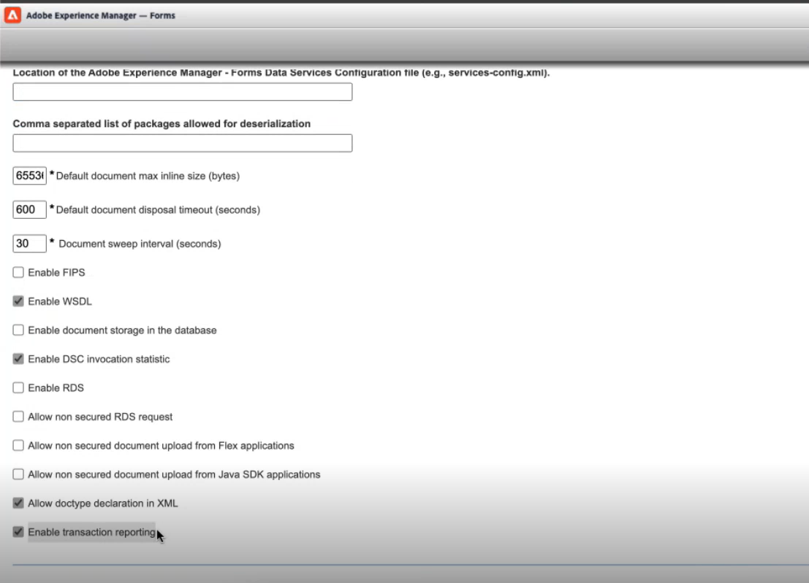

# 在JEE上启用和查看AEM Forms的交易报表 {#transaction-reports-overview}

<!--Transaction reports in AEM Forms on JEE let you keep a count of all transactions taken place on your AEM Forms deployment. The objective is to provide information about product usage and helps business stakeholders understand their digital processing volumes. Examples of a transaction include:

* Submission of a document
* Rendition of a document
* Conversion of a document from one file format to another 

For more information on what is considered a transaction, see [Billable APIs](../../forms/using/transaction-reports-billable-apis-jee.md). Transaction log helps you to gain information about the number of documents submitted, rendered, and converted.-->

## 启用交易报告 {#enable-transaction-reporting}

默认情况下，事务记录处于禁用状态。 要启用事务报告，请执行以下步骤：

1. 导航到JEE上AEM Forms上的`/adminui`，例如`http://10.14.18.10:8080/adminui`。
1. 以&#x200B;**管理员**&#x200B;登录。
1. 转到&#x200B;**设置** > **核心系统设置** > **配置**。
1. 单击此复选框可&#x200B;**启用交易报告**&#x200B;和&#x200B;**保存**&#x200B;设置。

   

1. 重新启动服务器。
1. 除了服务器上的更改之外，如果您使用项目中的`adobe-livecycle-client.jar`文件，则必须在客户端更新该文件。

<!--
* You can [enable transaction recording](../../forms/using/viewing-and-understanding-transaction-reports.md#setting-up-transaction-reports) from AEM Web Console. view transaction reports on author, processing, or publish instances. View transaction reports on author or processing instances for an aggregated sum of all transactions. View transaction reports on the publish instances for a count of all transactions that take place only on that publish instance from where the report is run.
-->

<!--Do not author content (Create adaptive forms, interactive communication, themes, and other authoring activities) and process documents (Use workflows, document services, and other processing activities) on the same AEM instance. Keep the transaction recording disabled for AEM Forms servers used to author content. Keep the transaction recording enabled for AEM Forms servers used to process documents.-->

## 查看事务报告 {#view-transaction-report}

启用事务报告后，有关事务计数的信息将可通过仪表板](#transaction-report-dashboard)的[事务报告以及日志文件](#transaction-report-logfile)的详细[事务报告访问。 两者均说明如下：

### 通过仪表板的交易报告 {#transaction-report-dashboard}

通过控制面板的事务处理报表提供每种事务处理类型的事务处理总数。 例如，您会获得有关渲染、转换和提交的表单总数的信息，如图所示。 要获取事务报告，请执行以下操作：

1. 导航到JEE上AEM Forms的`/adminui`，例如： `http://10.13.15.08:8080/adminui`。
1. 以&#x200B;**管理员**&#x200B;登录。
1. 单击“Health Monitor（运行状况监视器）”。
1. 导航到&#x200B;**交易报告器**&#x200B;选项卡，单击&#x200B;**计算交易总数**，现在您看到饼图表示已提交、已渲染或已转换的PDF forms的数量。


### 通过日志文件提供事务报告 {#transaction-report-logfile}

通过日志文件提交事务报告提供了有关每个事务的详细信息。 要访问事务日志，请遵循相对于服务器启动的上下文路径。 默认情况下，事务被捕获到单独的日志文件`transaction_log.log`中。 **文件路径**&#x200B;相对于服务器启动上下文。 不同服务器的默认路径如下所示：

```
For Jboss Turnkey:
"<AEM_Forms_Installation>/jboss/bin/transaction_log.log"

For IBM Websphere: 
"<IBM_WAS_Profile_path>/transaction_log.log"

For Oracle Weblogic:
"<Weblogic_Domain_path>/transaction_log.log"

For Jboss Cluster:
"<Jboss home>/transaction_log.log"
```

示例事务记录的示例：
`[2024-02-28 06:11:27] [INFO] TransactionRecord{service='GeneratePDFService', operation='HtmlFileToPDF', internalService='GeneratePDFService', internalOperation='HtmlFileToPDF', transactionOperationType='CONVERT', transactionCount=1, elapsedTime=1906, transactionDate=Wed Feb 28 06:11:25 UTC 2024}`

#### 交易记录 {#transaction-record-structure-jee}

事务日志结构定义每个事务如何通过其各种参数（如服务、操作、事务类型等）进行记录。 下文将详细介绍上述各项。 交易记录的结构如下：

```
TransactionRecord
{
    service='...', 
    operation='...', 
    internalService='...', 
    internalOperation='...', 
    transactionOperationType='...', 
    transactionCount=..., 
    elapsedTime=..., 
    transactionDate=...
}
```

* **服务**：服务的名称。
* **操作**：操作名称。
* **internalService**：如果存在内部调用，则为被调用方的名称，否则与服务名称相同。
* **internalOperation**：存在内部调用的被调用方的名称，否则与操作名称相同。
* **transactionOperationType**：事务类型（提交、渲染、转换）。
* **transactionCount**：事务总数。
* **elapsedTime**：呼叫启动与收到响应之间的时间。
* **transactionDate**：指示何时调用服务的时间戳。

**示例事务日志**：

```
[2024-02-14 14:23:25] [INFO] TransactionRecord
{
    service='BarcodedFormsService', 
    operation='decode', 
    internalService='BarcodedFormsService', 
    internalOperation='decode', 
    transactionOperationType='CONVERT', 
    transactionCount=1, 
    elapsedTime=47405, 
    transactionDate=Wed Feb 14 14:22:37 UTC 2024
}
```

## 交易记录频率 {#transaction-recording-frequency}

<!--Transaction persistence involves updating the total transaction count for SUBMIT, CONVERT, and RENDER operations on the server periodically: -->

记录事务的频率由服务器上对成功提交、渲染或转换的每个表单的更新操作确定。

* 在&#x200B;**仪表板**&#x200B;中，交易计数会定期更新，默认设置为1分钟。 您可以通过在`"com.adobe.idp.dsc.transaction.recordFrequency"`处设置系统属性来更新频率。 例如，在JBoss®上的AEM Forms for JEE中，在`JAVA_OPTS`中添加`-Dcom.adobe.idp.dsc.transaction.recordFrequency=5`以将更新频率设置为5分钟。

* 在&#x200B;**事务日志**&#x200B;中，当表单成功提交、渲染或转换时，每个事务的更新都会立即发生。

<!-- A transaction remains in the buffer for a specified period (Flush Buffer time + Reverse replication time). By default, it takes approximately 90 seconds for the transaction count to reflect in the transaction report.

Actions like submitting a PDF Form, using Agent UI to preview an interactive communication, or using non-standard form submission methods are not accounted as transactions. AEM Forms provides an API to record such transactions. Call the API from your custom implementations to record a transaction.

## Supported Topology {#supported-topology}

Transaction reports are available only on AEM Forms on OSGi environment. It supports author-publish, author-processing-publish, and only processing topologies. For example, topologies, see [Architecture and deployment topologies for AEM Forms](../../forms/using/transaction-reports-overview.md).

The transaction count is reverse replicated from publish instances to author or processing instances. An indicative author-publish topology is displayed below:


>[!NOTE]
>
>AEM Forms transaction reports does not support topologies that contain only publish instances.

### Guidelines for using transaction reports {#guidelines-for-using-transaction-reports}

* Disable transaction reports on all author instances as reports on author instances includes transactions registered during authoring activities.
* Enable the **Show transactions from publish only** option on the author instance to view cumulative transactions from all publish instances. You can also view transaction reports on each publish instance for actual transactions on that particular publish instance only.
* Do not use author instances to run workflows and process documents.
* Before using transaction reporting, if you are have a toplogy with publish servers, ensure that the reverse replication is enabled for all the publish instances.
* Transaction data is reverse-replicated from a publish instance to only corresponding author or processing instance. The author or processing instance cannot further replicate data to another instance. For example, if you have author-processing-publish topology, aggregated transaction data is replicated only to the processing instance.-->

## 相关文章 {#related-articles}

* [适用于AEM Forms on JEE的可计费API列表](../../forms/using/transaction-reports-billable-apis-jee.md)
* [为JEE上的AEM Forms的自定义组件API记录事务](/help/forms/using/record-transaction-custom-component-jee.md)
