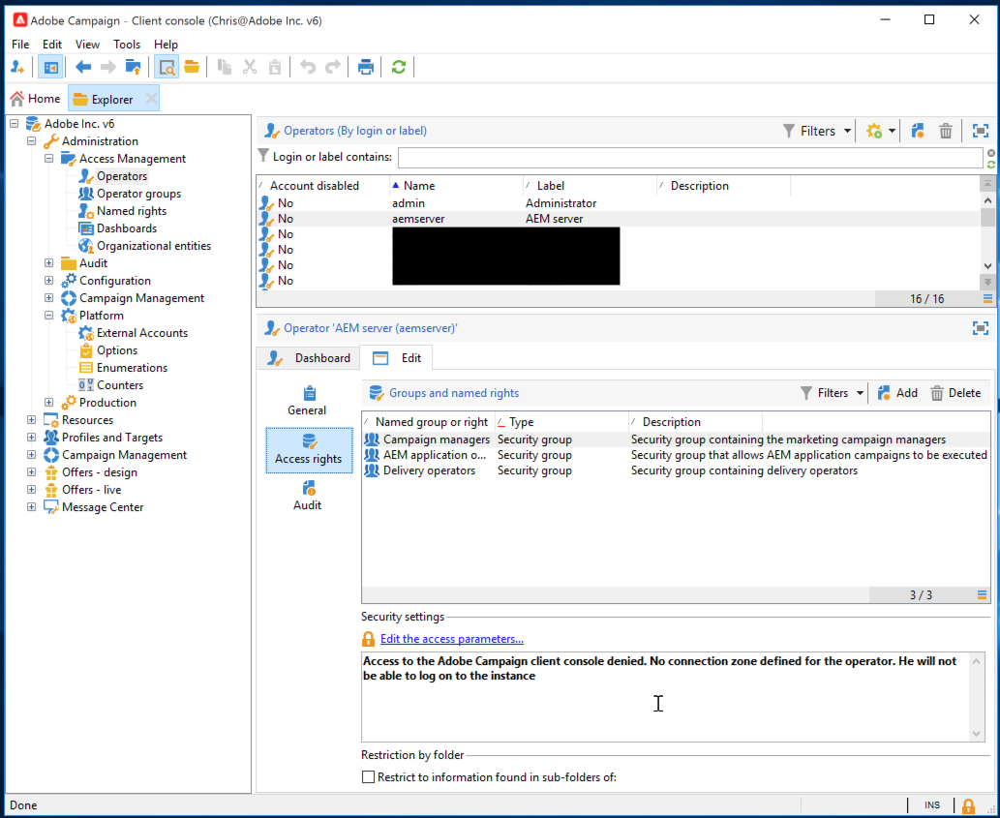

# 将AEM 6.5与Adobe Campaign Classic集成 {#integrating-campaign-classic}

通过将AEM与Adobe Campaign Classic (ACC)集成，您可以直接在AEM中管理电子邮件投放、内容和表单。 需要同时完成Adobe Campaign Classic和AEM的配置步骤才能在解决方案之间实现双向通信。

此集成允许单独使用AEM和Adobe Campaign Classic。 营销人员可以在Adobe Campaign中创建活动并使用定位，而内容创建者则可以同时在AEM中进行内容设计。 通过该集成，Adobe Campaign可以定位和交付在AEM中创建的营销活动的内容和设计。

>[!INFO]
>
>本文档详细介绍如何将Adobe Campaign Classic与AEM 6.5集成。有关其他Campaign集成，请参阅文档[将AEM 6.5与Adobe Campaign集成。](campaign.md)

## 集成步骤 {#integration-steps}

AEM和Campaign之间的集成需要在这两种解决方案中执行多个步骤。

1. [在 Campaign 中安装 AEM 集成包。](#install-package)
1. [在 Campaign 中为 AEM 创建一个运算符](#create-operator)
1. [在 AEM 中配置 Campaign 集成](#campaign-integration)
1. [配置 AEM 外部化器](#externalizer)
1. [在 AEM 中配置活动远程用户](#configure-user)
1. [在 Campaign 中配置 AEM 外部账户](#acc-setup)

本文档将详细介绍其中的每个步骤。

## 前提条件 {#prerequisites}

* 具有 Adobe Campaign Classic 管理员访问权限
   * 要执行集成，您需要一个有效的 Adobe Campaign Classic 实例，包括一个已配置的数据库。
   * 如果您需要有关如何设置和配置Adobe Campaign Classic的其他详细信息，请参阅[Adobe Campaign Classic文档，](https://experienceleague.adobe.com/docs/campaign-classic/using/campaign-classic-home.html?lang=zh-Hans)，特别是《安装和配置指南》。
* AEM的管理员访问权限

## 在Campaign中安装AEM集成包 {#install-package}

Adobe Campaign中的&#x200B;**AEM集成**&#x200B;包包含连接到AEM所需的几个标准配置。

1. 作为管理员，使用客户端控制台登录到 Adobe Campaign 实例。

1. 选择&#x200B;**“工具”**>**“高级”**>**“导入软件包...”**。

   

1. 单击&#x200B;**“安装标准包”**，然后单击&#x200B;**“下一个”**。

1. 检查&#x200B;**AEM 集成**&#x200B;包。

   

1. 单击&#x200B;**“下一个”**，然后单击&#x200B;**“开始”**&#x200B;以开始安装。

   

1. 安装完成后，单击&#x200B;**“关闭”**。

集成包现在已安装。

## 在Campaign中为AEM创建运算符 {#create-operator}

集成包会自动创建 AEM 用于连接到 Adobe Campaign 的`aemserver`运算符。为此运算符定义安全区域并设置其密码。

1. 使用客户端控制台以管理员身份登录 Adobe Campaign。

1. 从菜单栏中选择&#x200B;**工具** > **资源管理器**。

1. 在资源管理器中，导航到&#x200B;**“管理”**>**“访问管理“**＞**”运算符“**&#x200B;节点。

1. 选择`aemserver`运算符。

1. 在运算符的&#x200B;**”编辑“**&#x200B;选项卡上，选择&#x200B;**”访问权限“**&#x200B;子选项卡，然后单击&#x200B;**”修改访问参数...“**&#x200B;链接。

   

1. 选择适当的安全区域，并根据需要定义受信任的 IP 掩码。

   >[!CAUTION]
   >
   >要配置的安全区域是&#x200B;**私有公司网络(VPN+LAN)**。

1. 单击&#x200B;**”保存“**。

1. 注销 Adobe Campaign 客户端。

1. 在 Adobe Campaign 服务器的文件系统上，导航到 Campaign 安装位置，并以管理员身份编辑`serverConf.xml`文件。该文件通常位于以下位置：
   * `C:\Program Files\Adobe\Adobe Campaign Classic v7\conf`在 Windows 中。
   * `/usr/local/neolane/nl6/conf/eng` 在 Linux 中。

1. 搜索`securityZone`，并确保为 AEM 运算符的安全区域设置了以下参数。

   * `allowHTTP="true"`
   * `sessionTokenOnly="true"`
   * `allowUserPassword="true"`。

1. 保存文件。

1. 确保安全区域不会被`config-<server name>.xml`文件中的相应设置覆盖。

   * 如果配置文件包含单独的安全区域设置，则将`allowUserPassword`属性更改为`true`。

1. 如果要更改 Adobe Campaign Classic 服务器端口，请将`8080`替换为所需端口。

   >[!CAUTION]
   >
   >默认情况下，没有为运算符配置安全区域。要使 AEM 连接到 Adobe Campaign，您必须按照前面步骤中的详细说明选择一个区域。
   >
   >Adobe 强烈建议为 AEM 创建一个安全区域，以避免任何安全问题。有关此主题的更多信息，请参阅[Adobe Campaign Classic文档。](https://experienceleague.adobe.com/docs/campaign-classic/using/installing-campaign-classic/additional-configurations/security-zones.html?lang=zh-Hans)

1. 在 Campaign 客户端中，返回到`aemserver`运算符并选择&#x200B;**“常规”**&#x200B;选项卡。

1. 单击&#x200B;**“重置密码...”**&#x200B;链接。

1. 指定密码并将其存储在安全位置以供将来使用。

1. 单击&#x200B;**“确定”**&#x200B;以保存`aemserver`运算符的密码。

## 在AEM中配置Campaign集成 {#campaign-integration}

AEM使用[您在Campaign](#create-operator)中设置的运算符与Campaign通信

1. 以管理员身份登录到您的 AEM 创作实例。

1. 从全局导航侧栏中，选择&#x200B;**“工具”**>**“Cloud Service”**＞**“传统 Cloud Service”**>**“Adobe Campaign”**，然后单击&#x200B;**“立即配置”**。

   

1. 在对话框中，通过输入&#x200B;**“标题”**&#x200B;并单击&#x200B;**“创建”**&#x200B;来创建 Campaign 服务配置。

   

1. 会打开新窗口和对话框会，用以编辑配置。 提供必要的信息。

   * **用户名** – 这是在上一步创建的[ Adobe Campaign AEM 集成包运算符。](#create-operator)默认情况下，这是 `aemserver`。
   * **密码** – 这是在上一步创建的 [Adobe Campaign AEM 集成包运算符的密码。](#create-operator)
   * **API 端点** – 这是 Adobe Campaign 实例 URL。

   

1. 选择&#x200B;**“连接到 Adobe Campaign”**&#x200B;以验证连接，然后单击&#x200B;**确定**。

AEM 现在可以与 Adobe Campaign 通信。

>[!NOTE]
>
>确保您的 Adobe Campaign 服务器可以通过 Internet 访问。AEM无法访问专用网络。

## 配置到AEM发布实例的复制 {#replication}

Campaign内容由内容作者在AEM创作实例上创建。 此实例通常仅在贵组织内部可用。 要使营销活动的收件人能够访问图像和资产等内容，您需要发布该内容。

复制代理负责将内容从AEM创作实例发布到发布实例，必须设置该代理才能使集成正常工作。 此外，还需要执行此步骤以将某些创作实例配置复制到发布实例。

要配置从AEM创作实例到发布实例的复制，请执行以下操作：

1. 以管理员身份登录到您的 AEM 创作实例。

1. 从全局导航侧栏中，选择&#x200B;**工具** > **部署** > **复制** > **作者代理**，然后单击&#x200B;**默认代理（发布）**。

   

1. 单击&#x200B;**编辑**，然后选择&#x200B;**传输**&#x200B;选项卡。

1. 将默认`localhost`值替换为AEM发布实例的IP地址，以配置&#x200B;**URI**&#x200B;字段。

   

1. 单击&#x200B;**确定**&#x200B;保存对代理设置的更改。

您已配置复制到AEM发布实例，以便活动收件人可以访问您的内容。

>[!NOTE]
>
>如果您不想使用复制URL，而是使用面向公众的URL，则可以通过OSGi在下面的配置设置中设置公共URL
>
>从全局导航侧栏中，选择&#x200B;**工具** > **操作** > **Web控制台** > **OSGi配置**，然后搜索&#x200B;**AEM Campaign集成 — 配置**。 编辑配置并更改字段&#x200B;**公共URL** (`com.day.cq.mcm.campaign.impl.IntegrationConfigImpl#aem.mcm.campaign.publicUrl`)。

## 配置 AEM 外部化器 {#externalizer}

[外部化器](/help/sites-developing/externalizer.md)是AEM中的OSGi服务，它可将资源路径转换为外部和绝对URL，这是AEM提供Campaign可以使用的内容所必需的。 对其进行配置，以便Campaign集成正常工作。

1. 以管理员身份登录到 AEM 创作实例。
1. 从全局导航侧边栏中，选择&#x200B;**工具** > **操作** > **Web控制台** > **OSGi配置**，然后搜索&#x200B;**Day CQ链接外部化器**。
1. 默认情况下，**域**&#x200B;字段中的最后一个条目适用于发布实例。 将URL从默认`http://localhost:4503`更改为公开可用的发布实例。

   

1. 单击&#x200B;**保存**。

您已配置外部化器，Adobe Campaign现在可以访问您的内容。

>[!NOTE]
>
>发布实例必须可以从Adobe Campaign服务器访问。 如果它指向`localhost:4503`或Adobe Campaign无法访问的其他服务器，则来自AEM的图像将不会显示在Adobe Campaign控制台中。

## 在AEM中配置活动远程用户 {#configure-user}

如要实现 Campaign 与 AEM 之间的通信，您需要在 AEM 中为 `campaign-remote` 用户设置一个密码。

1. 以管理员身份登录 AEM。
1. 在主导航控制台上，单击左边栏中的&#x200B;**工具**。
1. 然后单击&#x200B;**安全** > **用户**&#x200B;以打开用户管理控制台。
1. 找到`campaign-remote`用户。
1. 选择`campaign-remote`用户，然后单击&#x200B;**“属性”**&#x200B;来编辑用户。
1. 在&#x200B;**“编辑用户设置”**&#x200B;窗口中，单击&#x200B;**“更改密码”**。
1. 为用户提供新密码，并将密码记在安全位置以备将来使用。
1. 单击&#x200B;**“保存”**&#x200B;以保存密码更改。
1. 单击&#x200B;**“保存并关闭”**&#x200B;以将更改保存到`campaign-remote`用户。

## 在Campaign中配置AEM外部帐户 {#acc-setup}

当[在 Campaign 中安装&#x200B;**AEM 集成**&#x200B;包时，](#install-package)会为 AEM 创建一个外部帐户。通过配置此外部帐户，Adobe Campaign可以连接到AEM，从而实现解决方案之间的双向通信。

1. 使用客户端控制台以管理员身份登录 Adobe Campaign。

1. 从菜单栏中选择&#x200B;**工具** > **资源管理器**。

1. 在资源管理器中，导航到&#x200B;**“管理”** > **“Platform“**＞**”外部账户“**&#x200B;节点。

   

1. 找到外部 AEM 帐户。默认情况下，它具有以下值：

   * **类型** - `AEM`
   * **标签** - `AEM Instance`
   * **内部名称** - `aemInstance`

1. 在该帐户的&#x200B;**“常规”**&#x200B;选项卡上，输入您在[设置活动远程用户密码](#set-campaign-remote-password)步骤中定义的用户信息。

   * **服务器** – AEM 作者服务器地址
      * AEM 作者服务器必须可以从 Adobe Campaign Classic 服务器实例中访问。
      * 确保服务器地址的&#x200B;**不是**&#x200B;以尾随斜杠结尾。
   * **帐户** – 默认情况下，这是您在[设置活动远程用户密码](#set-campaign-remote-password)步骤中在 AEM 中设置的`campaign-remote`用户。
   * **密码** – 该密码与在[设置活动远程用户密码](#set-campaign-remote-password)步骤中在 AEM 中设置的`campaign-remote`用户密码相同。

1. 选中&#x200B;**启用**&#x200B;复选框。

1. 单击&#x200B;**保存**。

Adobe Campaign 现在可以与 AEM 通信。

## 后续步骤 {#next-steps}

在配置Adobe Campaign Classic和AEM后，集成现已完成。

您现在可以通过继续阅读[本文档](/help/sites-authoring/campaign.md)学习如何在 Adobe Experience Manager 中创建新闻稿。
