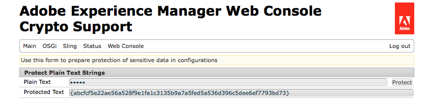

# 配置属性的加密支持{#encryption-support-for-configuration-properties}

## 概述 {#overview}

此功能允许所有OSGi配置属性都以受保护的加密形式存储，而不是以明文形式存储。 Web控制台UI中的表单用于使用系统范围加密主密钥从明文创建加密文本。

添加了OSGi配置插件支持，可在属性被服务使用之前对其进行解密。

>[!NOTE]
>
>需要加密值的服务需要使用IsProtected检查，在尝试解密值之前查看值是否已加密，因为它可能已经解密。

## 启用加密支持 {#enabling-encryption-support}

这些步骤显示如何加密Mail服务的SMTP密码。 您可以为要加密的OSGI属性完成这些步骤。

1. 转到&#x200B;*https://&lt;serveraddress>：&lt;serverport>/system/console/configMgr*&#x200B;处的AEM Web控制台
1. 在左上角，转到&#x200B;**Main - Crypto Support**

   

1. 显示&#x200B;**Adobe Experience Manager Web控制台加密支持**&#x200B;页面。

   

1. 在&#x200B;**纯文本**&#x200B;字段中，输入要保护的敏感数据的文本。
1. 选择&#x200B;**保护**。 受保护文本显示为加密文本。

   

1. 从Step#5中复制受保护的文本并将其粘贴到OSGI表单值中。 在此示例中，加密的&#x200B;**SMTP密码**&#x200B;已添加到&#x200B;*Day CQ邮件服务*。

   

1. 保存Day CQ Mail Service属性。 SMTP密码现在将作为加密值发送。

## 解密支持 {#decryption-support}

AEM现在提供了一个用于解密配置属性的配置插件。 此AEM插件将自动解密和检索明文属性。
