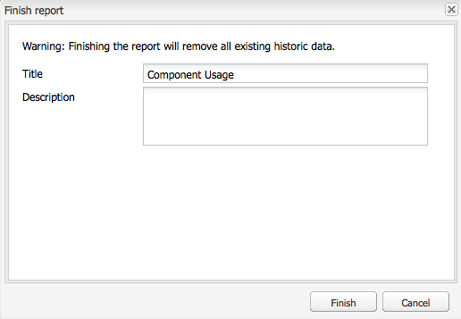

# 报告 {#reporting}

为了帮助您监测和分析实例的状态，Adobe Experience Manager (AEM)提供了一系列默认报表，您可以根据自己的要求对这些报表进行配置：

* [组件报告](#component-report)
* [磁盘使用情况](#disk-usage)
* [健康检查](#health-check)
* [页面活动报告](#page-activity-report)
* [用户生成的内容报表](#user-generated-content-report)
* [用户报告](#user-report)
* [工作流实例报告](#workflow-instance-report)
* [工作流报告](#workflow-report)

>[!NOTE]
>
>这些报表仅在经典UI中可用。 有关新版UI中的系统监视和报告，请参阅[操作仪表板。](/help/sites-administering/operations-dashboard.md)

可以从&#x200B;**工具**&#x200B;控制台访问所有报告。 在左侧窗格中选择&#x200B;**报告**，然后双击右侧窗格中的所需报告，以便打开它进行查看或配置，或同时打开两者。

还可以从&#x200B;**工具**&#x200B;控制台创建报告的新实例。 在左侧窗格中选择&#x200B;**报表**，然后从工具栏中选择&#x200B;**新建……**。 定义&#x200B;**标题**&#x200B;和&#x200B;**名称**，选择所需的报表类型，然后单击&#x200B;**创建**。 您的新报表实例随即会显示在列表中。 双击以打开，然后从Sidekick中拖动组件，以便创建第一列并启动报表定义。

>[!NOTE]
>
>除了开箱即用的标准AEM报告之外，您还可以[开发您自己的（新）报告](/help/sites-developing/dev-reports.md)。

## 报表自定义的基础知识 {#the-basics-of-report-customization}

报告有多种格式。 以下报告都使用可自定义的列，详见以下部分：

* [组件报告](#component-report)
* [页面活动报告](#page-activity-report)
* [用户生成的内容报表](#user-generated-content-report)
* [用户报告](#user-report)
* [工作流实例报告](#workflow-instance-report)

>[!NOTE]
>
>以下每个报表都有自己的格式和自定义设置：
>
>
>* [运行状况检查](#health-check)使用选择字段指定要报告的数据。
>* [磁盘使用情况](#disk-usage)使用链接深入查看存储库结构。
>* [工作流](/help/sites-administering/reporting.md#workflow-report)概述了实例上运行的工作流。
>
>因此，以下列配置过程不适用。 请参阅各个报表的说明以了解其详细信息。

### 选择并定位数据列 {#selecting-and-positioning-the-data-columns}

列可以在任何报表中添加、重定位或删除列，无论是在标准报表还是自定义报表中。

Sidekick的&#x200B;**组件**&#x200B;选项卡（可在报告页面上找到）列出了可选择作为列的所有数据类别。

要更改数据选择，请执行以下操作：

* 要添加列，请将所需的组件从sidekick拖放到所需的位置

   * 绿色勾号表示位置何时有效，一对箭头表示位置准确位置
   * 红色的no-go符号指示位置何时无效

* 要移动列，请单击标题并按住，然后拖动到新位置
* 要删除列，请单击列标题，按住，然后向上拖动到报表标题区域（红色减号表示位置无效）。 释放鼠标按键，删除组件对话框会要求确认您确实要删除该列。

### 列下拉菜单 {#column-drop-down-menu}

报表中的每一列都有一个下拉菜单。 当鼠标光标在列标题单元格上移动时，该图标将变得可见。

标题单元格的最右边出现一个箭头头（不要与标题文本右边表示[当前排序机制](#sorting-the-data)的箭头头混淆）。

菜单上的可用选项取决于列的配置（在项目开发期间完成），任何无效选项均灰显（灰显）。

### 对数据进行排序 {#sorting-the-data}

数据可根据特定列按以下任一方式排序：

* 单击相应的列标题；排序在升序和降序之间切换，由紧靠标题文本旁的箭头头指示
* 使用[列的下拉菜单](#column-drop-down-menu)专门选择&#x200B;**升序排序**&#x200B;或&#x200B;**降序排序**；再次在标题文本旁边有一个箭头指示该选项

### 组和当前数据图表 {#groups-and-the-current-data-chart}

在适当的列上，您可以从[列的下拉菜单](#column-drop-down-menu)中选择&#x200B;**按此列分组**。 这将根据该列中的每个不同值对数据进行分组。 您可以选择多个列进行分组。 如果列中的数据不合适，则该选项会灰显（灰显）。 也就是说，每个条目都是独特的，因此不能形成任何组。 例如，用户报表的用户ID列。

至少在一列分组后，将基于此分组生成&#x200B;**当前数据**&#x200B;的饼图。 如果对多个列进行分组，则会在图表中指示这一点。

将光标移至饼图上会显示相应区段的聚合值。 这会使用当前为列定义的聚合；例如，count、minimum、average等。

### 筛选器和聚合 {#filters-and-aggregates}

在适当的列上，您还可以从[列的下拉菜单](#column-drop-down-menu)配置&#x200B;**筛选器设置**&#x200B;和/或&#x200B;**聚合**。

#### 过滤器 {#filters}

过滤器设置允许您指定要显示的条目的条件。 可用的运算符包括：

* `contains`
* `equals`

要设置过滤器，请执行以下操作：

1. 从下拉列表中选择所需的运算符。
1. 输入要过滤的文本。
1. 单击&#x200B;**应用**。

要取消激活过滤器，请执行以下操作：

1. 删除筛选器文本。
1. 单击&#x200B;**应用**。

#### 聚合 {#aggregates}

您还可以选择聚合方法（这些方法可能因所选列而异）：

### 列属性 {#column-properties}

此选项仅在[用户报告](#user-report)中使用了[通用列](#generic-column)时可用。

### 历史数据 {#historic-data}

可在&#x200B;**历史数据**&#x200B;下查看数据随时间变化的图表。 这是从定期拍摄的快照派生而来的。

数据是：

* 收集者，如果可用，为第一个已排序列，否则为第一个（非分组）列
* 按相应的列分组

可以生成报告：

1. 在所需列上设置&#x200B;**分组**。
1. **编辑**&#x200B;配置，以便定义每小时或每天的快照。
1. **完成……**&#x200B;开始快照集合的定义。

   左上角的红色/绿色滑块按钮表示何时收集快照。

生成的图表显示在右下方：

数据收集开始时，您可以选择：

* **周期**

  您可以选择报表数据的开始日期和结束日期。

* **间隔**

  可以为报表的规模和聚合选择月、周、日、小时。

  例如，如果2011年2月有每日快照：

   * 如果间隔设置为`Day`，则每个快照在图表中都显示为单个值。
   * 如果间隔设置为`Month`，则2月份的所有快照都将聚合为一个值（在图表中显示为单个“点”）。

选择您的要求，然后单击&#x200B;**转到**&#x200B;以将其应用于报表。 若要在生成更多快照后更新显示，请再次单击&#x200B;**转到**。

在收集快照时，您可以：

* 再次使用&#x200B;**完成……**&#x200B;重新初始化集合。

  **完成**&#x200B;会“冻结”报表的结构（即分配给报表的列，这些列按分组、排序、过滤等）并开始生成快照。

* 打开&#x200B;**编辑**&#x200B;对话框，以便您可以选择&#x200B;**无数据快照**&#x200B;以在需要时终止收集。

  **编辑**&#x200B;只打开或关闭快照的生成。 如果再次打开了生成快照，它将使用上次完成时报表的状态来生成更多快照。

>[!NOTE]
>
>快照存储在`/var/reports/...`下，其中路径的其余部分镜像报告完成时创建的相应报告和ID的路径。
>
>
>如果您确定不再需要这些实例，可以手动清除旧快照。

>[!NOTE]
>
>预配置的报告不会对性能造成很大影响，但仍建议在生产环境中使用每日快照。 如果可能，请在网站上没有太多活动时运行这些每日快照。 可以使用&#x200B;**Day CQ报表配置**&#x200B;的`Daily snapshots (repconf.hourofday)`参数定义此项。 请参阅[OSGI配置](/help/sites-deploying/configuring-osgi.md)，了解有关如何配置此项的更多详细信息。

#### 显示限制 {#display-limits}

由于可以设置的限制（根据所选时段的结果数），历史数据报表的外观也会发生轻微变化。

每条水平线都称为一个系列（对应于图表图例中的一个条目），每列垂直的点表示聚合的快照。

要使图表在较长的时段内保持干净，可以设置一些限制。 对于标准报表，这些功能包括：

* 水平系列 — 默认系列和系统最大系列均为`9`

* 垂直聚合快照 — 默认为`35`（每个水平系列）

因此，当超出（适当的）限制时：

* 不显示圆点
* 历史数据图的图例显示的条目数可能与当前数据图的条目数不同

自定义报表还可以显示所有系列的&#x200B;**总计**&#x200B;值。 以系列形式显示（图例中的水平线和条目）。

>[!NOTE]
>
>对于自定义报表，可以不同的方式设置限制。

### 编辑（报告） {#edit-report}

使用&#x200B;**编辑**&#x200B;按钮打开&#x200B;**编辑报告**&#x200B;对话框。

在此位置已定义用于收集[历史数据](#historic-data)的快照的时段，但也可以定义各种其他设置：

* **标题**

  您可以定义自己的标题。

* **描述**

  您可以定义自己的描述。

* **根路径** （*仅对特定报告有效*）

  使用此选项可将报告限制在存储库的（子）部分。

* **报表处理**

   * **自动刷新数据**

     每次更新报表定义时，都会刷新报表数据。

   * **手动刷新数据**

     当数据量较大时，此选项可用于防止自动刷新操作造成的延迟。

     选择此选项表示当报告配置的任何方面发生更改时，必须手动刷新报告数据。 它还意味着当您更改配置的任何方面时，报告表将被遮蔽。

     选择此选项后，将显示&#x200B;**[加载数据](#load-data)**&#x200B;按钮（在报告上的&#x200B;**编辑**&#x200B;旁边）。 **加载数据**&#x200B;加载数据并刷新显示的报表数据。

* **快照**
您可以定义创建快照的频率：每天、每小时或根本不创建快照。

### 加载数据 {#load-data}

仅当从&#x200B;**[编辑](#edit-report)**&#x200B;中选择了&#x200B;**手动刷新数据**&#x200B;时，**加载数据**&#x200B;按钮才可见。

单击&#x200B;**加载数据**&#x200B;将重新加载数据并更新显示的报表。

选择手动刷新数据意味着：

1. 更改报告配置时，报告数据表为空白。

   例如，如果更改列的排序机制，则不会显示数据。

1. 如果希望再次显示报表数据，则必须单击&#x200B;**加载数据**&#x200B;以重新加载数据。

### 完成（报表） {#finish-report}

当您&#x200B;**完成**&#x200B;报告时：

* 截至该时间点&#x200B;*的报告定义*&#x200B;用于生成快照。 之后，您可以继续处理报告定义，因为它与快照不同。
* 将删除所有现有快照。
* 已为[历史数据](#historic-data)收集新快照。

利用此对话框，您可以为生成报告定义或更新自己的标题和说明。

## 报表类型 {#report-types}

### 组件报告 {#component-report}

组件报表可提供有关您的网站如何使用组件的信息。

[列信息](#selecting-and-positioning-the-data-columns)关于：

* 创作
* 组件路径
* 组件类型
* 上次修改时间
* 页面

这意味着您可以看到以下内容：

* 使用哪些组件以及在何处使用组件。

  很有用，例如，在测试时。

* 如何分发特定组件的实例。

  如果特定页面（即“重页面”）遇到性能问题，这可能会很有趣。

* 识别频繁或不频繁更改的网站部分。
* 了解页面内容如何随时间的推移而发展。

所有组件都包含在产品标准和特定于项目的数据中。 使用&#x200B;**编辑**&#x200B;对话框，用户还可以设置定义报告起点的&#x200B;**根路径** — 该根下的所有组件都考虑用于报告。

 

### 磁盘使用情况 {#disk-usage}

磁盘使用情况报表显示有关存储在存储库中的数据的信息。

报告从存储库的根( / )开始；通过单击可在存储库中向下钻取的特定分支（当前路径反映在报告标题中）。

### 健康检查 {#health-check}

此报表会分析当前的请求日志：

`<cq-installation-dir>/crx-quickstart/logs/request.log`

帮助您识别给定时间段内最昂贵的请求。

要生成报表，可以指定以下内容：

* **时段（小时）**

  要分析的小时数（过去）。

  默认： `24`

* **最大值。 结果**

  最大输出行数。

  默认： `50`

* **最大值。 请求**

  要分析的请求的最大数量。

  默认： `-1` （全部）

* **电子邮件地址**

  将结果发送到电子邮件地址。

  可选；默认：空白

* **每天运行于(hh：mm)**

  指定报告每天自动运行的时间。

  可选；默认：空白

### 页面活动报告 {#page-activity-report}

页面活动报表列出了页面以及对页面执行的操作。

[列信息](#selecting-and-positioning-the-data-columns)关于：

* 页面
* 用时
* 类型
* 用户

这意味着您可以监视：

* 最新的修改。
* 处理特定页面的作者。
* 最近未修改的页面，因此可能需要执行操作。
* 更改最频繁/最不频繁的页面。
* 大多数/最少活动用户。

页面活动报告从审核日志中获取所有信息。 默认情况下，根路径配置为位于`/var/audit/com.day.cq.wcm.core.page`的审核日志。

### 用户生成的内容报表 {#user-generated-content-report}

此报告提供有关用户生成的内容的信息；包括评论、评级或论坛。

[信息列](#selecting-and-positioning-the-data-columns)：

* 日期
* IP 地址
* 页面
* 反向链接
* 类型
* 用户标识符

允许您：

* 查看哪些页面收到的评论最多。
* 大致了解特定网站访客留下的所有评论，这些问题可能相关。
* 通过监控在页面上作出评论时判断新内容是否正在引发评论。

### 用户报告 {#user-report}

此报表提供有关已注册帐户和/或配置文件的所有用户的信息；这些信息可以同时包含您组织内的作者和外部访客。

[信息列](#selecting-and-positioning-the-data-columns)（可用时）关于：

* 年龄
* 国家/地区
* 域
* 电子邮件
* 姓氏
* 性别
* [通用](#generic-column)
* 名字
* 信息
* 关注
* 语言
* NTLM 哈希码
* 用户 ID

允许您：

* 查看用户的人口分布。
* 报告已添加到用户档案的自定义字段。

#### 通用列 {#generic-column}

**通用**&#x200B;列在用户报表中可用，以便您可以访问自定义信息，通常从[用户配置文件](/help/sites-administering/identity-management.md#profiles-and-user-accounts)访问；例如，如“将字段添加到配置文件定义”[&#128279;](/help/sites-administering/identity-management.md#adding-fields-to-the-profile-definition)下详细介绍的收藏颜色。

执行以下任一操作时，将打开“类属”列对话框：

* 将通用组件从Sidekick拖到报表中。
* 选择现有通用列的列属性。

在&#x200B;**定义**&#x200B;选项卡中，您可以定义：

* **标题**

  您自己的通用列标题。

* **属性**

  存储在存储库中的属性名称，通常位于用户的配置文件中。

* **路径**

  属性通常取自`profile`。

* **类型**

  从`String`、`Number`、`Integer`、`Date`中选择字段类型。

* **默认聚合**

  如果在报表中至少有一个分组列，而该列未分组，则它定义默认使用的聚合。 从`Count`、`Minimum`、`Average`、`Maximum`、`Sum`中选择所需的聚合。

  例如，`String`字段的&#x200B;*Count*&#x200B;表示在聚合状态中显示的列的非重复`String`值的数量。

在&#x200B;**扩展**&#x200B;选项卡中，您还可以定义可用的聚合和过滤器：

### 工作流实例报告 {#workflow-instance-report}

这为您提供了简短的概述，提供了有关各个工作流实例（包括正在运行的工作流实例和已完成的工作流实例）的信息。

[列信息](#selecting-and-positioning-the-data-columns)关于：

* 已完成
* 持续时间
* 发起者
* 模型
* 有效负荷
* 已开始
* 状态

这意味着您可以：

* 监测工作流的平均持续时间；如果这种情况定期发生，则可以突出显示工作流的问题。

### 工作流报告 {#workflow-report}

这提供了有关实例上运行的工作流的关键统计信息。

## 在发布环境中使用报表 {#using-reports-in-a-publish-environment}

在配置报告以满足特定要求后，您可以激活它以将配置传输到发布环境。

>[!CAUTION]
>
>如果您想要&#x200B;**发布环境的历史数据**，请在激活页面之前&#x200B;**完成**&#x200B;创作环境上的报告。

然后，可以在下访问相应的报表。

`/etc/reports`

例如，可以在以下位置找到用户生成的内容报表：

`http://localhost:4503/etc/reports/ugcreport.html`

此报告现在报告从发布环境收集的数据。

由于发布环境中不允许报表配置，因此&#x200B;**编辑**&#x200B;和&#x200B;**完成**&#x200B;按钮不可用。 但是，如果正在收集快照，则可以为&#x200B;**历史数据**&#x200B;报告选择&#x200B;**周期**&#x200B;和&#x200B;**间隔**。

>[!CAUTION]
>
>访问这些报告可能是一个安全问题；因此，Adobe建议您配置Dispatcher，以便`/etc/reports`对外部访客不可用。 有关更多详细信息，请参阅[安全核对清单](security-checklist.md)。

## 运行报告所需的权限 {#permissions-needed-for-running-reports}

所需的权限取决于操作：

* 使用当前用户的权限收集报表数据。
* 使用完成报告的用户的权限收集历史数据。

在标准AEM安装中，为报表预设了以下权限：

* **用户报告**

  `user administrators` — 读写

* **页面活动报告**

  `contributors` — 读写

* **组件报告**

  `contributors` — 读写

* **用户生成的内容报告**

  `contributors` — 读写

* **工作流实例报告**

  `workflow-users` — 读写

`administrators`组的所有成员均具有创建报告的必要权限。
