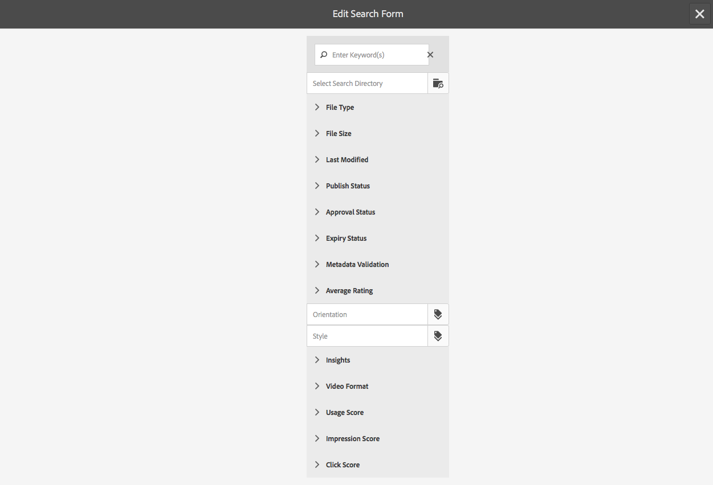

# 配置搜索表单{#configuring-search-forms}

使用&#x200B;**搜索Forms**&#x200B;可自定义搜索面板中使用的搜索谓词选择，这些面板可在各种AEM控制台和/或创作环境的面板中使用。 自定义这些面板可根据您的特定需求使搜索功能通用。

[范围的谓词](#predicates-and-their-settings)现成可用。 您可以添加多个谓词，其中包括“属性”谓词，以搜索与您指定的单个属性匹配的资产。 或者，使用“选项”谓词来搜索与您为特定属性指定的一个或多个值匹配的资产。

您可以[配置在各种控制台和资产浏览器（编辑页面时）中使用的搜索表单](#configuring-your-search-forms)。 可通过以下方式访问用于配置这些表单](#configuring-your-search-forms)的[对话框：

* **工具**

   * **常规**

      * **搜索Forms**

首次访问此控制台时，您可以看到所有配置都有一个挂锁符号。 这表示相应的配置是默认（现成）配置 — 无法删除。 自定义配置后，锁定将消失，除非您[删除自定义配置](#deleting-a-configuration-to-reinstate-the-default)。 在这种情况下，将恢复缺省值（和挂锁指示器）。

## 配置 {#configurations}

可用的默认配置包括：

* **页面编辑器（文档搜索）：**

  此配置定义在资产浏览器中搜索文档时（编辑页面时）可用的选项。

* **页面编辑器（图像搜索）：**

  此配置定义在资产浏览器中搜索图像时（编辑页面时）可用的选项。

* **页面编辑器（手稿搜索）：**

  此配置定义在资产浏览器中搜索手稿时（编辑页面时）可用的选项。

* **页面编辑器（页面搜索）：**

  此配置定义在资产浏览器中搜索页面时（编辑页面时）可用的选项。

* **页面编辑器（段落搜索）：**

  此配置定义在资产浏览器中搜索段落时（编辑页面时）可用的选项。

* **页面编辑器（产品搜索）：**

  此配置定义在资产浏览器中搜索产品时（编辑页面时）可用的选项。

* **页面编辑器(Dynamic Media Classic [以前为Scene7]搜索)**：

  此配置定义在资产浏览器中搜索Scene7资源（编辑页面时）时可用的选项。

* **站点管理员搜索边栏**：

  此配置定义用户在使用站点控制台的搜索边栏时可用的搜索选项。

* **页面编辑器（视频搜索）：**

  此配置定义在资产浏览器中搜索视频时（编辑页面时）可用的选项。

* **Assets管理员搜索边栏：**

  此配置定义用户在使用Assets控制台时可用的搜索选项。

* **目录管理员搜索边栏：**

  此配置定义用户在搜索商务目录时可用的搜索选项。

* **订单管理员搜索边栏：**

  此配置定义用户在搜索商务订单时可用的搜索选项。

* **产品收藏集管理员搜索边栏：**

  此配置定义用户在搜索商务产品收藏集时可用的搜索选项。

* **产品管理员搜索边栏：**

  此配置定义用户在搜索商务产品时可用的搜索选项。

* **项目管理员搜索边栏：**

  此配置定义用户在搜索项目时可用的搜索选项。

## 谓词及其设置 {#predicates-and-their-settings}

### 谓词 {#predicates}

以下谓词可用，具体取决于配置：

<table>
 <tbody>
  <tr>
   <th>谓词</th>
   <th>用途</th>
   <th>设置</th>
  </tr>
  <tr>
   <td>分析 </td>
   <td>显示Analytics提供的数据时，站点浏览器中的搜索/过滤功能。 Analytics搜索筛选器将加载，以匹配映射的自定义分析列。</td>
   <td>
    <ul>
     <li>字段标签</li>
     <li>描述</li>
    </ul> </td>
  </tr>
  <tr>
   <td>上次修改的资源 </td>
   <td>上次修改资产的日期。  </td>
   <td>自定义谓词，基于日期谓词。</td>
  </tr>
  <tr>
   <td>组件 </td>
   <td>允许作者搜索/筛选包含特定组件的页面。 例如，图像库。  </td>
   <td>
    <ul>
     <li>字段标签</li>
     <li>占位符</li>
     <li>属性名称*</li>
     <li>属性深度</li>
     <li>描述</li>
    </ul> </td>
  </tr>
  <tr>
   <td>日期 </td>
   <td>基于日期属性的资产基于滑块搜索。</td>
   <td>
    <ul>
     <li>字段标签</li>
     <li>属性名称*</li>
     <li>描述</li>
    </ul> </td>
  </tr>
  <tr>
   <td>日期范围 </td>
   <td>搜索在指定范围内为日期属性创建的资源。 在“搜索”面板中，您可以指定开始日期和结束日期。</td>
   <td>
    <ul>
     <li>字段标签</li>
     <li>占位符</li>
     <li>属性名称*</li>
     <li>范围文本（自）*</li>
     <li>范围文本（至）*</li>
     <li>描述</li>
    </ul> </td>
  </tr>
  <tr>
   <td>到期状态 </td>
   <td>根据到期状态搜索资产。</td>
   <td>
    <ul>
     <li>字段标签</li>
     <li>属性名称*</li>
     <li>描述</li>
    </ul> </td>
  </tr>
  <tr>
   <td>文件大小 </td>
   <td>根据资源的大小搜索资源。</td>
   <td>
    <ul>
     <li>字段标签</li>
     <li>属性名称*</li>
     <li>选项路径</li>
     <li>描述</li>
    </ul> </td>
  </tr>
  <tr>
   <td>隐藏的筛选器</td>
   <td>属性和值的筛选器，用户不可见。</td>
   <td>
    <ul>
     <li>属性名称</li>
     <li>属性值</li>
     <li>描述</li>
    </ul> </td>
  </tr>
  <tr>
   <td>选项 </td>
   <td>
选项是由用户创建的内容节点。
 
有关详细信息，请参阅<a href="#addinganoptionspredicate">添加选项谓词</a>。
 </td>
   <td>
    <ul>
     <li>字段标签</li>
     <li>JSON 路径</li>
     <li>属性名称*</li>
     <li>单选</li>
     <li>选项路径</li>
     <li>描述</li>
    </ul> </td>
  </tr>
  <tr>
   <td>Options属性 </td>
   <td>搜索选项的属性。</td>
   <td>
    <ul>
     <li>字段标签</li>
     <li>属性名称*</li>
     <li>选项节点路径  </li>
     <li>单选</li>
     <li>描述</li>
    </ul> </td>
  </tr>
  <tr>
   <td>页面状态 </td>
   <td>根据页面状态搜索页面。</td>
   <td>
    <ul>
     <li>字段标签</li>
     <li>发布属性名称</li>
     <li>LiveCopy 属性名称</li>
     <li>描述</li>
    </ul> </td>
  </tr>
  <tr>
   <td>路径 </td>
   <td>搜索位于特定路径下的资产。</td>
   <td>
    <ul>
     <li>字段标签</li>
     <li>添加搜索路径</li>
     <li>描述</li>
    </ul> </td>
  </tr>
  <tr>
   <td>属性 </td>
   <td>搜索指定的属性。</td>
   <td>无</td>
  </tr>
  <tr>
   <td>发布状态 </td>
   <td>根据资产的发布状态搜索资产</td>
   <td>
    <ul>
     <li>字段标签</li>
     <li>属性名称*</li>
     <li>描述</li>
    </ul> </td>
  </tr>
  <tr>
   <td>范围 </td>
   <td>搜索指定范围内的资源。 在“搜索”面板中，可以指定范围的最小值和最大值。</td>
   <td>
    <ul>
     <li>字段标签</li>
     <li>属性名称</li>
     <li>描述</li>
    </ul> </td>
  </tr>
  <tr>
   <td>范围选项 </td>
   <td>Assets的特定搜索谓词，与常用滑块谓词相同。 由于向后兼容问题，仍然可用。</td>
   <td>
    <ul>
     <li>字段标签</li>
     <li>属性名称*</li>
     <li>选项路径</li>
     <li>描述</li>
    </ul> </td>
  </tr>
  <tr>
   <td>评分 </td>
   <td>根据资产的评级搜索资产。  </td>
   <td>
    <ul>
     <li>字段标签</li>
     <li>属性名称*</li>
     <li>选项路径</li>
     <li>描述</li>
    </ul> </td>
  </tr>
  <tr>
   <td>相对日期 </td>
   <td>根据资产的创建相对日期搜索资产  </td>
   <td>
    <ul>
     <li>字段标签</li>
     <li>属性名称*</li>
     <li>相对日期</li>
     <li>描述</li>
    </ul> </td>
  </tr>
  <tr>
   <td>滑块范围 </td>
   <td>使用滑块功能扩展范围谓词的常用搜索谓词。 搜索属性的值必须介于滑块限制之间。</td>
   <td>
    <ul>
     <li>字段标签</li>
     <li>属性名称*</li>
     <li>描述</li>
    </ul> </td>
  </tr>
  <tr>
   <td>标记 </td>
   <td>根据标记搜索资源。 您可以配置Path属性以填充“标记”列表中的各种标记。</td>
   <td>
    <ul>
     <li>字段标签</li>
     <li>属性名称*</li>
     <li>选项路径</li>
     <li>描述</li>
    </ul> </td>
  </tr>
  <tr>
   <td>标记 </td>
   <td>基于标记进行搜索。</td>
   <td>
    <ul>
     <li>占位符</li>
     <li>属性名称*</li>
     <li>描述</li>
    </ul> </td>
  </tr>
 </tbody>
</table>

>[!NOTE]
>
>* 常见的搜索谓词定义于：
>  `/libs/cq/gui/components/common/admin/customsearch/searchpredicates`
>
>* 仅与站点管理员（经典UI）相关的搜索谓词位于以下位置：
>  `/libs/cq/gui/components/siteadmin/admin/searchpanel/searchpredicates`
>   * 这些功能已弃用，仅可用于向后兼容。
>
>此信息仅供参考。 不更改`/libs`。

### 谓词设置 {#predicate-settings}

根据谓词，可以选择用于配置的设置：

* **字段标签**

  显示为可折叠标题或谓词字段标签的标签。

* **描述**

  用户的描述性详细信息。

* **占位符**

  空文本或谓词的占位符（如果未输入过滤文本）。

* **属性名称**

  要搜索的属性。 它使用相对路径，通配符`*/*/*`指定相对于`jcr:content`节点的属性深度（每个星号表示一个节点级别）。

  如果只想在`jcr:content`节点上具有`x`属性的资源的第一级子节点上搜索，请使用`*/jcr:content/x`

* **属性深度**

  在资源中搜索该属性的最大深度。 因此，可以对该属性进行资源搜索并递归子项，直到子项的级别等于指定的深度。

* **属性值**

  作为绝对字符串或表达式语言的属性值；例如，`cq:Page`或

  `${empty requestPathInfo.suffix ? "/content" : requestPathInfo.suffix}`。

* **范围文本**

  **日期范围**&#x200B;谓词中范围字段的标签。

* **选项路径**

  用户可以使用谓词设置选项卡中的路径浏览器选择路径。 选择&#x200B;**+**&#x200B;后，使用图标将所选内容添加到有效选项列表中（如有必要，则使用&#x200B;**-**&#x200B;图标删除）。

  这些选项是由用户创建的内容节点，具有以下结构：

  `(jcr:primaryType = nt:unstructured, value (String), jcr:title (String))`

* **选项节点路径**
与**选项路径**&#x200B;几乎相同，只是该路径位于公共谓词字段中，其他路径专用于资产。

* **单选**
如果选中，这些选项将呈现为仅允许单个选择的复选框。 如果错误地选中此复选框，则可取消选中此复选框。

* **发布和Live Copy属性名称**
站点特定谓词的发布和Live Copy复选框的标签。

* **设置**&#x200B;选项卡中的字段标签上的&amp;amp；ast；表示这些字段是必填字段，如果保留为空，则会显示错误消息。

## 配置搜索Forms {#configuring-your-search-forms}

### 创建/打开自定义配置 {#creating-opening-a-customized-configuration}

1. 导航到&#x200B;**工具** >> **常规** >> **搜索Forms**。

1. 选择要自定义的配置。
1. 使用&#x200B;**编辑**&#x200B;图标打开配置以进行更新。
1. 如果进行了新的自定义，则可能需要[添加新的谓词字段并根据需要定义设置](#add-edit-a-predicate-field-and-define-field-settings)。 如果存在自定义设置，则可以选择现有字段并[更新设置](#add-edit-a-predicate-field-and-define-field-settings)。
1. 选择&#x200B;**完成**&#x200B;以保存配置。

   >[!NOTE]
   >
   >自定义配置存储（根据需要）在下：
   >
   >* `/apps/cq/gui/content/facets/<option>`
   >* `/apps/commerce/gui/content/facets/<option>`

### 添加/编辑谓词字段并定义字段设置 {#add-edit-a-predicate-field-and-define-field-settings}

您可以添加或编辑字段并定义/更新其设置：

1. [打开自定义配置](#creating-opening-a-customized-configuration)以进行更新。
1. 如果要添加字段，请打开&#x200B;**选择谓词**&#x200B;选项卡，并将所需的谓词拖到所需位置。 例如，**日期范围谓词**：

   

1. 取决于是否：

   * 您正在添加一个字段：

     添加谓词后，**设置**&#x200B;选项卡打开，并显示可定义的属性。

   * 要更新现有的谓词：

     选择谓词字段（位于右侧），然后打开&#x200B;**设置**&#x200B;选项卡。

   例如，**日期范围谓词**&#x200B;的设置：

   日期范围谓词](assets/chlimage_1-376.png)的

1. 这将显示搜索表单，它们在相应控制台的“搜索”列中显示（完全展开）。

   

1. **关闭**&#x200B;预览，以便返回并完成配置。

### 删除谓词字段 {#deleting-a-predicate-field}

1. [打开自定义配置](#creating-opening-a-customized-configuration)以进行更新。
1. 选择谓词字段（位于右侧），打开&#x200B;**设置**&#x200B;选项卡，然后选择&#x200B;**删除**&#x200B;图标（左下方）。

   

1. 此时将显示一个对话框，要求确认删除操作。

1. 使用&#x200B;**完成**&#x200B;确认此更改和任何其他更改。

### 删除配置（恢复默认设置） {#deleting-a-configuration-to-reinstate-the-default}

自定义配置后，这将覆盖默认值。 您可以通过删除自定义配置来恢复默认配置。

>[!NOTE]
>
>不能删除任一默认配置。

从控制台中删除自定义配置已完成：

1. 选择所需的配置(例如，**页面编辑器（段落搜索）**)，然后在工具栏中选择&#x200B;**删除**&#x200B;图标：

   

1. 自定义配置将被删除，默认配置将恢复（控制台中挂锁符号的重新显示即表示这一点）。

### 添加选项谓词 {#adding-options-predicates}

选项谓词（选项、选项属性）允许您配置要搜索的项目。 它们用于直接在页面下搜索某些内容；例如，页面节点上的属性。

以下示例（根据用于创建页面的模板进行搜索）说明了所涉及的步骤：

1. 创建定义要搜索的属性的节点。

   您需要一个根节点，其中包含可供用户使用的各个选项的定义。

   单个选项的节点需要以下属性：

   * `jcr:title` — 要在搜索边栏中显示的字段标签
   * `value` — 要搜索的属性值

   

   >[!NOTE]
   >
   >执行&#x200B;***不***&#x200B;更改`/libs`路径中的任何内容。
   >
   >这是因为下次升级实例时`/libs`的内容会被覆盖（在应用修补程序或功能包时很可能会被覆盖）。
   >
   >建议用于配置和其他更改的方法是：
   >
   >1. 在`/apps`下重新创建所需项，因为它存在于`/libs`中。 在本例中，来自：
   >1. `/libs/cq/gui/content/common/options/predicates`
   >1. 在`/apps.`中进行任何更改

1. 打开&#x200B;**搜索Forms**&#x200B;控制台，然后选择要更新的配置。 例如，**站点管理员搜索边栏**。

   然后单击&#x200B;**编辑搜索表单**&#x200B;图标。

1. 根据配置，将&#x200B;**Options**&#x200B;或&#x200B;**Options属性**&#x200B;添加到配置中。
1. 更新这些字段，特别是：

   * **属性名称**

     指定要在目标节点上搜索的节点属性。 例如：

     `jcr:content/cq:template`

   * **选项节点路径**

     选择保留选项的路径。 例如：

     `/apps/cq/gui/content/common/options/predicates/templatetype`

   

1. 选择&#x200B;**完成**&#x200B;以保存您的配置。
1. 导航到相应的控制台（在此示例中为&#x200B;**站点**）并打开&#x200B;**搜索**&#x200B;边栏。 新定义的搜索表单以及各种选项均可见。 选择所需的选项，以便查看搜索结果：

   

## 用户权限 {#user-permissions}

下表列出了对搜索表单执行编辑、删除和预览操作所需的权限。

<table>
 <tbody>
  <tr>
   <td><strong>操作</strong></td>
   <td><strong>权限</strong></td>
  </tr>
  <tr>
   <td>编辑 </td>
   <td><code>/apps </code>节点的读、写权限。</td>
  </tr>
  <tr>
   <td>删除</td>
   <td><code>/apps</code>节点的读取、写入和删除权限</td>
  </tr>
  <tr>
   <td>预览</td>
   <td><code>/var/dam/content</code>节点的读取、写入和删除权限。<code>/apps</code>节点上的 读、写权限。</td>
  </tr>
 </tbody>
</table>
