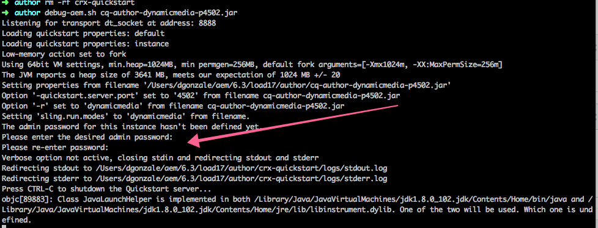

# 安装时配置管理员密码{#configure-the-admin-password-on-installation}

## 概述 {#overview}

自 6.3 版本起，Adobe Experience Manager（AEM）允许在安装新实例时通过命令行设置管理员密码。

在更早的 AEM 版本中，管理员帐户密码以及其他控制台的密码都必须在安装完成后再进行更改。

此功能允许在安装 AEM 实例时为存储库和 Servlet 引擎设置新的管理员密码，从而无需事后手动修改。

>[!CAUTION]
>
>该功能不涵盖 Felix 控制台，其密码仍需手动修改。 有关详细信息，请参阅相关的[安全检查清单章节](/help/sites-administering/security-checklist.md#change-default-passwords-for-the-aem-and-osgi-console-admin-accounts)。

## 如何使用？ {#how-do-i-use-it}

如果您选择通过命令行安装 AEM（而非在文件系统资源管理器中双击 JAR 文件），此功能会自动触发。

通过命令行运行 AEM 实例的一般语法为：

```shell
java -jar aem6.3.jar
```

通过命令行运行实例后，在安装过程中，系统会提示您修改管理员密码：



>[!NOTE]
>
>修改管理员密码的提示仅会在安装新的 AEM 实例期间出现。

## 使用 -nointeractive 标志 {#using-the-nointeractive-flag}

您还可以选择通过属性文件来指定密码。 此方法需结合使用 `-nointeractive` 标志与 `-Dadmin.password.file` 系统属性。

示例如下：

```shell
java -Dadmin.password.file =/path/to/passwordfile.properties -jar aem6.3.jar -nointeractive
```

`passwordfile.properties` 文件中的密码必须符合以下格式：

```xml
admin.password = 12345678
```

>[!NOTE]
>
>如果仅使用 `-nointeractive` 参数，而未指定 `-Dadmin.password.file` 系统属性，AEM 将会直接使用默认管理员密码，而不会提示您修改，这与早期版本的行为一致。 这种非交互模式可用于通过安装脚本在命令行中执行自动化安装。
