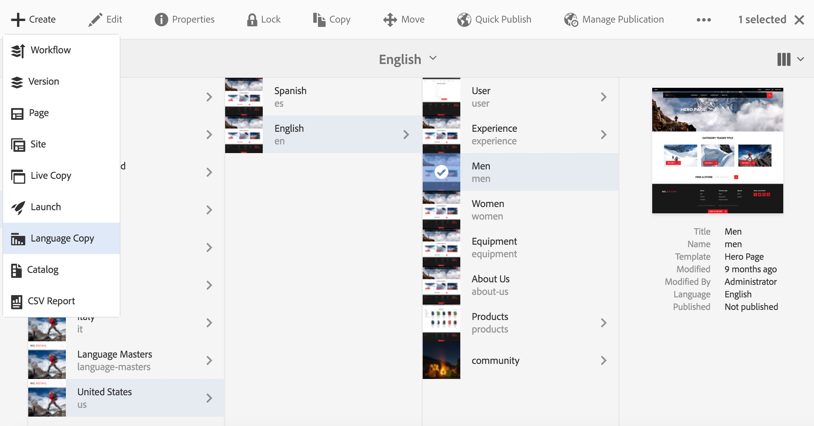

# 语言复制向导{#language-copy-wizard}

语言复制向导是一种用于创建和检测多语言内容结构的引导式体验。 现在，创建语言副本变得更加简单和快速。

>[!NOTE]
>
>用户必须是projects-administrators组的成员才能创建站点的语言副本。

要访问此向导：

1. 在站点中，选择一个页面，然后单击创建。

   

1. 选择语言复制，向导将打开。

   

1. 通过向导的&#x200B;**选择Source**&#x200B;步骤，您可以添加/删除页面。 您还可以选择包含或排除子页面。

   

1. 按&#x200B;**下一步**&#x200B;按钮可转到向导的&#x200B;**配置**&#x200B;步骤。 在此处，您可以添加/删除语言并选择翻译方法。

   

   >[!NOTE]
   >
   >默认情况下，只有一种翻译设置。要能够选择其他设置，您必须先配置云配置。请参阅[配置翻译集成框架](/help/sites-administering/tc-tic.md)。

1. 按&#x200B;**下一步**&#x200B;按钮可转到向导的&#x200B;**翻译**&#x200B;步骤。 在此处，您可以选择仅创建结构、创建翻译项目或添加到现有翻译项目。

   >[!NOTE]
   >
   >如果您在上一步中选择了多种语言，则将创建多个翻译项目。

   

1. “**创建**”按钮结束向导。

   
