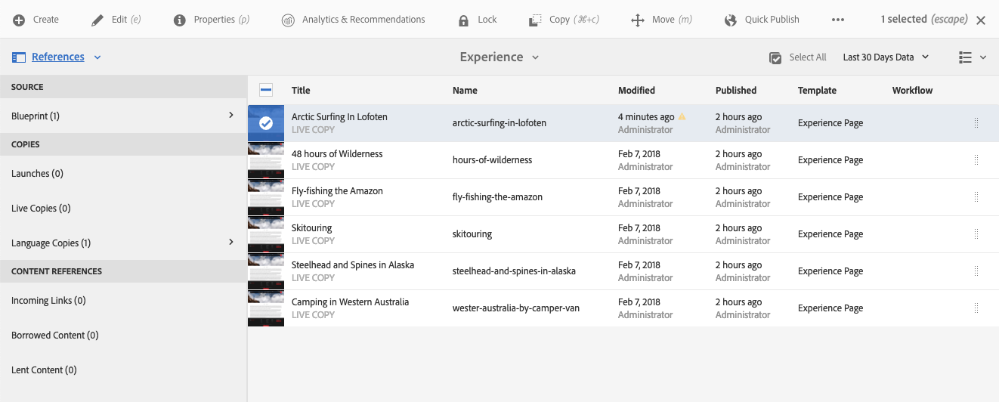

# 基本处理{#basic-handling}

>[!NOTE]
>
>* 本页旨在概述使用Adobe Experience Manager (AEM)创作环境时的基本操作。 它使用&#x200B;**Sites**&#x200B;控制台作为基础。
>
>* 某些功能并不是在所有控制台中均可用，而且某些控制台可能会提供额外的功能。有关各个控制台及其相关功能的特定信息，将在其他页面上详细介绍。
>* 用户在整个AEM环境中都可以使用键盘快捷键。 特别是当[使用控制台](/help/sites-authoring/keyboard-shortcuts.md)和[编辑页面](/help/sites-authoring/page-authoring-keyboard-shortcuts.md)时。
>

## 快速入门 {#getting-started}

### 触屏优化 UI {#a-touch-enabled-ui}

为触控启用了AEM的用户界面。 触屏界面允许您使用触屏，通过选择、触摸并按住及轻扫之类的手势与软件进行交互。 这与传统的桌面界面使用鼠标操作（如单击、双击、右键单击和鼠标悬停）的方式形成对比。

由于AEM UI支持触控，因此您可以在触控设备（例如，移动设备或平板电脑）上使用触控手势，并在传统桌面设备上使用鼠标操作。

### 首要步骤 {#first-steps}

登录后，您将立即转到[“导航”面板](#navigation-panel)。选择其中一个选项会打开相应的控制台。

>[!NOTE]
>
>为了更好地了解AEM的基本用法，本文档基于&#x200B;**站点**&#x200B;控制台。
>
>若要开始，请单击&#x200B;**站点**。

### 产品导航 {#product-navigation}

每当用户首次访问某个控制台时，都会启动一个产品导航教程。通过点进，您可以大致了解AEM的基本处理。

单击&#x200B;**下一步**&#x200B;进入概述的下一页。 单击&#x200B;**关闭**&#x200B;或单击概述对话框外部关闭。

该概述将在您下次访问控制台时重新启动，除非您查看所有幻灯片，或选中选项&#x200B;**不再显示此内容**。

## 全局导航 {#global-navigation}

您可以使用全局导航面板在控制台之间导航。当您单击屏幕左上方的Adobe Experience Manager链接时，会触发此事件，作为全屏下拉列表。

通过单击或点按&#x200B;**关闭**&#x200B;可关闭全局导航面板，以返回到您之前所在的位置。

>[!NOTE]
>
>首次登录时显示&#x200B;**导航**&#x200B;面板

全局导航有两个面板，它们由屏幕左侧的图标来表示：

* **[导航](/help/sites-authoring/basic-handling.md#navigation-panel)** – 登录到 AEM 时由一个指南针图标
* **[工具](/help/sites-authoring/basic-handling.md#tools-panel)** – 由一个锤子图标来表示

这些面板中的可用选项如下所述。

### “导航”面板 {#navigation-panel}

通过“导航”面板可访问AEM控制台：

浏览器选项卡的标题将更新，以反映您在控制台和内容中导航时的位置。

在“导航”中，可用的控制台有：

<table>
 <tbody>
  <tr>
   <td><strong>控制台</strong></td>
   <td><strong>用途</strong></td>
  </tr>
  <tr>
   <td>Assets  </td>
   <td>这些控制台允许您导入和<a href="/help/assets/assets.md">管理数字资产</a>，如图像、视频、文档和音频文件。 随后，这些资源便可由同一AEM实例上运行的任何网站使用。 </td>
  </tr>
  <tr>
   <td>体验片段</td>
   <td><a href="/help/sites-authoring/experience-fragments.md">体验片段</a>是独立的体验，可以跨渠道重复使用，也可以具有变量，从而避免反复地复制和粘贴体验或体验的部分内容。</td>
  </tr>
  <tr>
   <td>Forms</td>
   <td>此控制台允许您创建、管理和处理您的<a href="/help/forms/using/introduction-aem-forms.md">表单和文档</a>。</td>
  </tr>
  <tr>
   <td>个性化</td>
   <td>此控制台为创作目标内容和呈现个性化体验提供了<a href="/help/sites-authoring/personalization.md">工具框架</a>。</td>
  </tr>
  <tr>
   <td>项目</td>
   <td>通过<a href="/help/sites-authoring/touch-ui-managing-projects.md">项目控制台，您可以直接访问您的项目</a>。 项目是虚拟功能板。 它们可用于构建团队，然后为该团队提供对资源、工作流和任务的访问权限，从而让人们朝着同一个目标努力。  </td>
  </tr>
  <tr>
   <td>Sites</td>
   <td>站点控制台允许您<a href="/help/sites-authoring/page-authoring.md">创建、查看和管理在AEM实例上运行的网站</a>。 通过这些控制台，您可以创建、编辑、复制、移动和删除网站页面、启动工作流以及发布页面。  </td>
  </tr>
 </tbody>
</table>

### “工具”面板 {#tools-panel}

在“工具”面板中，侧面板中的每个选项都包含一系列子菜单。 此处提供的[工具控制台](/help/sites-administering/tools-consoles.md)提供了对几个专用工具和控制台的访问权限，这些工具和控制台可帮助您管理网站、数字资产及内容存储库的其他方面。

## 标题 {#the-header}

标题始终显示在屏幕顶部。无论您位于系统中的何处，标题中的大部分选项都将保持不变，但也有一些选项是特定于上下文的。

* [全局导航](#navigatingconsolesandtools)

  选择&#x200B;**Adobe Experience Manager**&#x200B;链接，您可以在其中在控制台之间导航。

  

* [搜索](/help/sites-authoring/search.md)

  

  您还可以使用[快捷键](/help/sites-authoring/keyboard-shortcuts.md) `/`（正斜杠）从任何控制台中调用搜索。

* [解决方案](https://business.adobe.com/)

  

* [帮助](#accessinghelptouchoptimizedui)

  

* [通知](/help/sites-authoring/inbox.md)

  

  此图标带有一个标记，显示当前分配的未完成通知的数量。

  >[!NOTE]
  >
  >现成的AEM预先加载了分配给管理员用户组的管理任务。 有关详细信息，请参阅[您的收件箱 — 现成的管理任务](/help/sites-authoring/inbox.md#out-of-the-box-administrative-tasks)。

* [用户属性](/help/sites-authoring/user-properties.md)

  

* [边栏选择器](/help/sites-authoring/basic-handling.md#rail-selector)

  

  显示的选项取决于您当前所在的控制台。例如，在&#x200B;**Sites**&#x200B;中，您可以选择仅限内容（默认）、时间线、引用或过滤器侧面板。

  

* 痕迹导航

  

  痕迹导航显示在边栏中间，并始终显示当前选定项目的描述，它允许您在特定控制台中导航。 在站点控制台中，您可以导航浏览网站的各个级别。

  单击痕迹导航文本将打开一个下拉列表，其中列出了当前选定项目的层次结构级别。 要跳转到该位置，请单击某个条目。

  

* Analytics时间段选择

  

  这仅在列表视图中可用。 有关详细信息，请参阅[列表视图](#list-view)。

* **创建**&#x200B;按钮

  

  单击此按钮后，会根据当前的控制台/上下文显示相应的选项。

* [视图](/help/sites-authoring/basic-handling.md#viewingandselectingyourresourcescardlistcolumn)

  视图图标位于 AEM 工具栏的最右侧。鉴于该图标也表示当前视图，因此会发生变化。例如，在默认视图&#x200B;**列视图**&#x200B;中显示：

  

  您可以在列视图、卡片视图和列表视图之间切换。 列表视图显示视图设置。

  

* 键盘导航

  您可以只使用键盘导航网站。它使用&#x200B;**TAB**&#x200B;键（或&#x200B;**OPT+TAB**）的标准浏览器功能，在页面上可聚焦&#x200B;*的元素*&#x200B;之间移动您。

  在&#x200B;**站点**&#x200B;控制台中，添加了&#x200B;**跳至主要内容**&#x200B;的选项。 当您&#x200B;*按Tab*&#x200B;通过标题选项时，该选项将变得可见，并且它可以通过允许您跳过（产品）工具栏中的标准元素并直接转到主内容来加快导航速度。

  

## 访问帮助 {#accessing-help}

有各种可用的帮助资源：

* **“控制台”工具栏**

  根据您的位置，**帮助**&#x200B;图标将打开相应的资源：

  

* **导航**

  第一次导航系统时，[系列幻灯片将介绍AEM导航](/help/sites-authoring/basic-handling.md#product-navigation)。

* **页面编辑器**

  首次编辑某个页面时，系统会提供一系列幻灯片来介绍该页面编辑器。

  

  与在首次访问任何控制台时浏览[产品导航概述](/help/sites-authoring/basic-handling.md#product-navigation)一样，浏览此概述。

  从&#x200B;**页面信息**&#x200B;菜单中，可以随时选择&#x200B;[**帮助**](/help/sites-authoring/author-environment-tools.md#accessing-help)&#x200B;以再次显示此信息。

* **“工具”控制台**

  从&#x200B;**工具**&#x200B;控制台，您还可以访问外部&#x200B;**资源**：

   * **文档**
查看Web Experience Management文档

   * **开发人员资源**
开发人员资源和下载

  >[!NOTE]
  >
  >在控制台中，您可以随时使用热键 `?`（问号）访问提供的快捷键概述。
  >
  >有关所有键盘快捷键的概述，请参阅以下内容：
  >
  >* [用于编辑页面的键盘快捷键](/help/sites-authoring/page-authoring-keyboard-shortcuts.md)
  >* [控制台的键盘快捷键](/help/sites-authoring/keyboard-shortcuts.md)

## “操作”工具栏 {#actions-toolbar}

每当选择资源（例如，一个页面或资源）时，工具栏中都会显示一些包含说明性文本的图标以指示各种操作。这些操作取决于以下要素：

* 当前控制台
* 当前上下文
* 是否处于[选择模式](#navigatingandselectionmode)

工具栏中可用的操作会发生更改，以反映您可对特定选定项目执行的操作。

[选择资源](/help/sites-authoring/basic-handling.md#viewing-and-selecting-resources)的方式依视图而定。

由于某些窗口存在空间限制，因此工具栏的长度可能很快就会超过可用空间。发生这种情况时，会显示其他选项。 单击或点按省略号（三个点或&#x200B;**...**）会打开一个下拉选择器，其中包含所有其余的操作。 例如，在 **Sites** 控制台中选择了一个页面之后：

>[!NOTE]
>
>各个可用图标根据相应控制台/功能/方案提供。

## 快速操作 {#quick-actions}

在[卡片视图](#cardviewquickactions)中，某些操作以快速操作图标的形式在工具栏中提供。 快速操作图标一次只能用于一个项目，因此无需预先选择。

将鼠标悬停在（桌面设备）资源信息卡上时，可以看到快速操作。 可用的快速操作取决于控制台和上下文。例如，下面是适用于 **Sites** 控制台中的页面的快速操作：

## 查看和选择资源 {#viewing-and-selecting-resources}

从概念上讲，所有视图中的查看、导航和选择操作都相同，只是操作方法根据所使用的视图而略有差异。

在任意可用视图中，您都可以查看、导航和选择资源（以对其执行进一步操作），可通过右上方的图标选择各个视图：

* [列视图](#column-view)
* [信息卡视图](#card-view)

* [列表视图](#list-view)

>[!NOTE]
>
>默认情况下，AEM Assets 不会在 UI 中将资源的原始呈现版本显示为任何视图中的缩略图。如果您是管理员，可以使用叠加来配置 AEM Assets，以将原始呈现版本显示为缩略图。

### 选择资源 {#selecting-resources}

选择特定资源取决于视图和设备的组合：

<table>
 <tbody>
  <tr>
   <td> </td>
   <td>选择</td>
   <td>取消选择</td>
  </tr>
  <tr>
   <td>列视图  </td>
   <td>
    <ul>
     <li>桌面： 单击缩略图</li>
     <li>移动设备：  选择缩略图</li>
    </ul> </td>
   <td>
    <ul>
     <li>桌面： 单击缩略图</li>
     <li>移动设备：  选择缩略图</li>
    </ul> </td>
  </tr>
  <tr>
   <td>卡片视图  </td>
   <td>
    <ul>
     <li>桌面： 鼠标悬停，然后使用复选标记快速操作</li>
     <li>移动设备：  选择并按住卡片</li>
    </ul> </td>
   <td>
    <ul>
     <li>桌面： 单击卡片</li>
     <li>移动设备：  选择卡</li>
    </ul> </td>
  </tr>
  <tr>
   <td>列表视图</td>
   <td>
    <ul>
     <li>桌面： 单击缩略图</li>
     <li>移动设备：  选择缩略图</li>
    </ul> </td>
   <td>
    <ul>
     <li>桌面： 单击缩略图</li>
     <li>移动设备：  选择缩略图</li>
    </ul> </td>
  </tr>
 </tbody>
</table>

#### 全选 {#select-all}

您可以通过单击控制台右上角的&#x200B;**“全选”**&#x200B;选项来选择任何视图中的所有项目。

* 在&#x200B;**卡片视图**&#x200B;中，已选择所有卡片。
* 在&#x200B;**列表视图**&#x200B;中，已选择列表中的所有项。
* 在&#x200B;**列视图**&#x200B;中，选择最左侧列中的所有项。

#### 取消全选 {#deselecting-all}

在任何情况下，当您选择项目时，即会在工具栏的右上角显示选定项目的计数。

您可以通过以下任一方式取消选择所有项目并退出选择模式：

* 单击或点按计数旁边的&#x200B;**X**，

* 或使用&#x200B;**ESC**。

在所有视图中，点按键盘上的 Esc 键，均可取消选择所有项目（如果您使用的是桌面设备）。

#### 选择示例 {#selecting-example}

1. 例如在信息卡视图中：

   

1. 选择某个资源后，顶部标题被[操作工具栏](#actionstoolbar)覆盖，通过该工具栏可访问当前适用于选定资源的操作。

   要退出选择模式，请选择右上角的&#x200B;**X**，或者使用&#x200B;**ESC**。

### 列视图 {#column-view}

列视图允许通过一系列的层叠列，对内容树进行可视化导航。通过此视图，可以查看和遍历您网站的树结构。

选择最左列的资源会在右侧的列中显示子资源。 在右列中选择资源，会在右列的另一列中显示子资源，依此类推。

* 您可以通过点按或单击资源名称或资源名称右侧的V形标记在树中向上和向下导航。

   * 点按或单击时，资源名称和V形会突出显示。

     

   * 单击/点按的资源的子资源将在其右侧的列中显示。
   * 如果单击没有子级的资源名称，其详细信息将显示在最后一列中。

* 点按或单击缩略图将选择资源。

   * 选中后，缩略图上将叠加一个复选标记，并且资源名称也会突出显示。
   * 所选资源的详细信息将显示在最后一列。
   * 操作工具栏会变得可用。

     

  在列视图中选择页面时，所选页面将与以下详细信息一起显示在最后一列中：

   * 页面标题
   * 页面名称（页面 URL 的一部分）
   * 页面所基于的模板
   * 修改详细信息
   * 页面语言
   * 发布详细信息

### 信息卡视图 {#card-view}

* 信息卡视图显示各个项目在当前级别的信息信息卡。它们提供如下信息：

   * 页面内容的可视表示形式。
   * 页面标题。
   * 重要日期（如上次编辑时间、上次发布时间）。
   * 页面将被锁定、隐藏或是Live Copy的一部分。
   * （在适当时）您何时需要在工作流中采取相应的操作。

      * 指示必需操作的标记可能与您的[收件箱](/help/sites-authoring/inbox.md)中的条目相关。

* 此视图中还提供了[快速操作](#quick-actions)，例如选择以及编辑之类的常用操作。

  

* 您可以通过点按/单击信息卡对树进行向下导航（注意避免快速操作），或使用[标题中的痕迹导航](/help/sites-authoring/basic-handling.md#the-header)再次向上导航。

### 列表视图 {#list-view}

* 列表视图列出各项资源在当前级别的信息。
* 您可以通过点按/单击资源名称来向下导航树，并使用标题](/help/sites-authoring/basic-handling.md#the-header)中的[痕迹导航进行备份。

* 要轻松选择列表中的所有项目，请使用列表左上角的复选框。

  

   * 如果选择了列表中的所有项目，此复选框即会显示为选中状态。

      * 要取消全选，请单击复选框。

   * 如果只选择了部分项目，此复选框中会显示一个减号。

      * 要选择全部，请单击复选框。
      * 要取消全选，请再次单击复选框。

* 使用位于“视图”按钮下方的&#x200B;**视图设置**&#x200B;选项选择要显示的列。 可以显示以下列：

   * **名称** – 页面名称，在多语言创作环境中非常有用，因为它是页面 URL 的一部分，无论用户使用何种语言，都不会发生更改
   * **修改时间** – 上次修改日期和上次修改用户
   * **发布时间** – 发布状态
   * **模板** – 页面所基于的模板
   * **工作流** – 当前应用于页面的工作流。当您将鼠标悬停在上面或打开时间轴时，会提供更多信息。

   * **页面分析**
   * **独特访客**
   * **页面停留时间**

  

  默认将显示&#x200B;**名称**&#x200B;列，它构成了页面 URL 的一部分。有时，作者必须访问采用不同语言的页面。 如果作者不知道页面的语言，查看页面的名称（通常不会更改）会很有帮助。

* 可使用列表中每个项目最右侧的点状垂直栏更改项目的顺序。

  >[!NOTE]
  >
  >只有在 `jcr:primaryType` 值为 `sling:OrderedFolder` 的已排序文件夹内才能更改顺序。

  

  单击垂直选择栏并将项目拖到列表中的新位置。

  

* 可以使用&#x200B;**视图设置**&#x200B;对话框显示相应的列，以显示Analytics数据。

  您可以使用标题右侧的筛选选项筛选过去30、90或365天的Analytics数据。

  

## 边栏选择器 {#rail-selector}

**边栏选择器**&#x200B;位于窗口的左上角，会根据您当前的控制台显示相应的选项。

例如，在站点中，您可以选择仅限内容（默认）、内容树、时间轴、引用或过滤器侧面板。

如果选择“仅限内容”，则只会显示边栏图标。如果选择其他任何选项，则边栏图标旁边会显示选项名称。

>[!NOTE]
>
>可使用[键盘快捷键](/help/sites-authoring/keyboard-shortcuts.md)快速地在各边栏显示选项之间进行切换。

### 内容树 {#content-tree}

使用内容树，可以快速地在侧面板内的站点层次结构中进行导航，并详细查看当前文件夹中的页面相关信息。

通过将内容树侧面板与列表视图或信息卡视图结合使用，用户可以轻松查看项目的层次结构。 他们可以使用内容树侧面板在内容结构中轻松导航，并在列表视图中查看详细的页面信息。

>[!NOTE]
>
>在层次结构视图中选择某个条目后，可以使用箭头键在层次结构中快速导航。
>
>有关更多信息，请参阅[键盘快捷键](/help/sites-authoring/keyboard-shortcuts.md)。

### 时间线 {#timeline}

时间线可用于查看和/或启动所选资源上已发生的事件。要打开时间轴列，请使用边栏选择器：

时间线列可让您：

* [查看与选定项目相关的各种事件](#timelineviewevents)。

   * 可以从下拉列表中选择事件类型：

      * [评论](#timelineaddingandviewingcomments)
      * 注释
      * 活动
      * [启动项](/help/sites-authoring/launches.md)
      * [版本](/help/sites-authoring/working-with-page-versions.md)
      * [工作流](/help/sites-authoring/workflows-applying.md)

         * [临时工作流](/help/sites-developing/workflows.md#transient-workflows)除外，因为没有保存它们的历史记录信息

      * 并全部显示

* [添加/查看有关所选项目的备注](#timelineaddingandviewingcomments)。 **评论**&#x200B;框显示在事件列表的底部。键入评论后跟回车可注册该评论。 选择“注释”或“显 **示全部** ” **时，将显示** “注释”。

* 特定的控制台还具有其他功能。 例如，在站点控制台中，您可以执行以下操作：

   * [保存版本](/help/sites-authoring/working-with-page-versions.md#creatinganewversiontouchoptimizedui)。
   * [启动工作流](/help/sites-authoring/workflows-applying.md#startingaworkflowfromtherail)。

这些选项可通过&#x200B;**评论**&#x200B;字段旁边的V形标记访问。

### 引用 {#references}

**引用**&#x200B;显示与选定资源的所有连接。 例如，在 **Sites** 控制台中，页面的[引用](/help/sites-authoring/author-environment-tools.md#showingpagereferences)会显示以下项目：

* [启动项](/help/sites-authoring/launches.md#launches-in-references-sites-console)
* [Live Copy](/help/sites-administering/msm-livecopy-overview.md#openingthelivecopyoverviewfromreferences)
* [语言副本](/help/sites-administering/tc-prep.md#seeing-the-status-of-language-roots)
* 内容引用：

   * 从其他页面链接到选定页面
   * 引用组件在选定页面中借用的内容、借出的内容或同时借出的内容

### 过滤器 {#filter}

这将打开一个与[搜索](/help/sites-authoring/search.md)类似的面板，并设置了相应的位置筛选器，从而允许您进一步筛选希望查看的内容。

