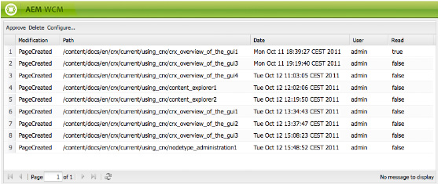

# 您的收件箱{#your-inbox}

您可以接收来自AEM各个区域的通知，例如有关工作项或表示您必须对页面内容执行的操作的任务的通知。

您会在两个收件箱中收到这些通知，这两个收件箱之间用通知类型隔开：

* 下节将介绍一个收件箱，您可以在其中查看因订阅而收到的通知。
* [参与工作流](/help/sites-classic-ui-authoring/classic-workflows-participating.md)文档中描述了工作流项目的专用收件箱。

## 查看通知 {#viewing-your-notifications}

要查看您的通知，请执行以下操作：

1. 打开通知收件箱：在&#x200B;**网站**&#x200B;控制台中，单击右上角的“用户”按钮，然后选择&#x200B;**通知收件箱**。

   

   >[!NOTE]
   >
   >您还可以直接在浏览器中访问该控制台；例如：
   >
   >
   >` https://<host>:<port>/libs/wcm/core/content/inbox.html`

1. 将列出您的通知。 您可以根据需要执行操作：

   * [订阅通知](#subscribing-to-notifications)
   * [处理您的通知](#processing-your-notifications)

   

## 订阅通知 {#subscribing-to-notifications}

要订阅通知，请执行以下操作：

1. 打开通知收件箱：在&#x200B;**网站**&#x200B;控制台中，单击右上角的“用户”按钮，然后选择&#x200B;**通知收件箱**。

   

   >[!NOTE]
   >
   >您还可以直接在浏览器中访问该控制台；例如：
   >
   >
   >`https://<host>:<port>/libs/wcm/core/content/inbox.html`

1. 单击左上角的&#x200B;**配置……**&#x200B;以打开配置对话框。

   

1. 选择通知渠道：

   * **收件箱**：通知显示在AEM收件箱中。
   * **电子邮件**：通知通过电子邮件发送到用户配置文件中定义的电子邮件地址。

   >[!NOTE]
   >
   >必须配置一些设置才能通过电子邮件接收通知。 也可以自定义电子邮件模板或添加新语言的电子邮件模板。 请参阅[配置电子邮件通知](/help/sites-administering/notification.md#configuringemailnotification)以在AEM中配置电子邮件通知。

1. 选择要通知的页面操作：

   * 已激活：页面已激活时。
   * 已停用：页面已停用时。
   * 删除（联合）：对页面进行删除复制时，即对页面执行的删除操作进行复制时。
删除或移动页面时，会自动复制删除操作：该页面将在执行删除操作的源实例上以及复制代理定义的目标实例上删除。

   * 修改时间：修改页面时。
   * 创建时间：创建页面时。
   * 已删除：通过页面删除操作删除页面时。
   * 转出：页面转出时。

1. 定义您将收到通知的页面的路径：

   * 单击&#x200B;**添加**&#x200B;以向表中添加新行。
   * 单击&#x200B;**路径**&#x200B;表单元格并输入路径，例如`/content/docs`。

   * 若要收到属于子树的所有页面的通知，是否设置&#x200B;**Exact？**&#x200B;至&#x200B;**否**。
要仅收到路径所定义页面上操作的通知，是否设置&#x200B;**精确？**&#x200B;至&#x200B;**是**。

   * 要允许该规则，请将&#x200B;**规则**&#x200B;设置为&#x200B;**允许**。 如果设置为&#x200B;**Deny**，则拒绝该规则，但不会将其删除，以后可以允许。

   要删除定义，请单击表单元格并选择行，然后单击&#x200B;**删除**。

1. 单击&#x200B;**确定**&#x200B;保存配置。

## 处理您的通知 {#processing-your-notifications}

如果您已选择在AEM收件箱中接收通知，则收件箱中会填满通知。 您可以[查看您的通知](#viewing-your-notifications)，然后选择所需的通知，以：

* 单击&#x200B;**批准**&#x200B;接受它： **读取**&#x200B;列中的值设置为&#x200B;**true**。

* 单击&#x200B;**删除**&#x200B;可将其删除。

