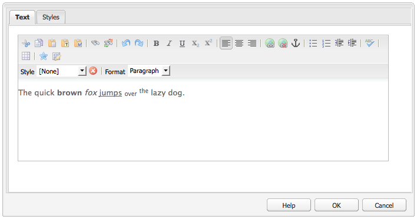
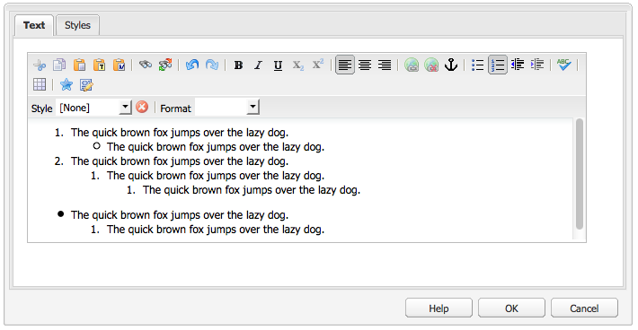
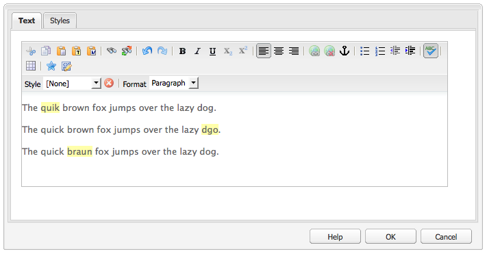

# 富文本编辑器 {#rich-text-editor}

富文本编辑器是用于向AEM输入文本内容的基本构建块。 它构成了各种组件的基础，包括：

* 文本
* 文本图像
* 表

## 富文本编辑器 {#rich-text-editor-1}

WYSIWYG编辑对话框提供了一系列广泛的功能：

>[!NOTE]
>
>可用的功能可以为各个项目进行配置，因此您的安装可能会有所不同。

## 就地编辑 {#in-place-editing}

除了基于对话框的富文本编辑模式外，AEM还提供就地编辑模式，该模式允许直接编辑显示在页面布局中的文本。

单击段落两次（缓慢双击）以进入就地编辑模式（组件边框现在将为橙色）。

您将能够直接编辑页面上的文本，而不是在对话框窗口中编辑。 只需进行更改，更改将自动保存。

>[!NOTE]
>
>如果打开了内容查找器，则选项卡顶部会显示一个包含RTE格式选项的工具栏（如上所述）。
>
>如果未打开内容查找器，则不会显示工具栏。

当前，为&#x200B;**Text**&#x200B;和&#x200B;**Title**&#x200B;组件生成的页面元素启用就地编辑模式。

>[!NOTE]
>
>[!UICONTROL Title]组件设计为包含不带换行符的短文本。 在“就地编辑”模式下编辑标题时，输入换行符将在标题下方打开一个新的&#x200B;**文本**&#x200B;组件。

## 富文本编辑器的功能 {#features-of-the-rich-text-editor}

富文本编辑器提供了一系列功能，这些[取决于单个组件的配置](/help/sites-administering/rich-text-editor.md)。 这些功能适用于触控优化用户界面和经典UI。

### 基本字符格式 {#basic-character-formats}

在这里，您可以对已选择（高亮显示）的字符应用格式；某些选项也具有快捷键：

* 粗体(Ctrl-B)
* 斜体(Ctrl-I)
* 下划线(Ctrl-U)
* 下标
* 上标

所有操作都作为切换操作，因此重新选择将移除格式。

### 预定义的样式和格式 {#predefined-styles-and-formats}

您的安装可以包括预定义的样式和格式。 这些内容在&#x200B;**[!UICONTROL 样式]**&#x200B;和&#x200B;**[!UICONTROL 格式]**&#x200B;下拉列表中可用，并且可以应用于您选择的文本。

样式可以应用于特定字符串（样式与CSS关联）：

而格式应用于整个文本段落(格式基于HTML)：

只能更改特定格式（默认为&#x200B;**[!UICONTROL 段落]**）。

可以移除样式；将光标置于已应用样式的文本中，然后单击移除图标：

>[!CAUTION]
>
>实际上，不要重新选择应用了样式的文本或图标将被停用。

### 剪切、复制、粘贴 {#cut-copy-paste}

**[!UICONTROL 剪切]**&#x200B;和&#x200B;**[!UICONTROL 副本]**&#x200B;的标准函数可用。 提供了几种风格的&#x200B;**[!UICONTROL 粘贴]**&#x200B;以满足不同格式的需要。

* 剪切(Ctrl-X)
* 复制(Ctrl-C)
* 粘贴
这是组件的默认粘贴机制(Ctrl-V)；当现成安装时，这配置为从Word]中[!UICONTROL 粘贴。

* 粘贴为文本：剥离所有样式和格式以仅粘贴纯文本。

* 从Word粘贴：此操作会将内容粘贴为HTML（进行了一些必要的重新格式设置）。

### 撤消，重做 {#undo-redo}

AEM会按时间顺序保留当前组件中最后50个操作的记录。 如有必要，可以严格按照顺序撤消（然后重新完成）这些操作。

>[!CAUTION]
>
>历史记录仅保留当前编辑会话。 每次打开组件进行编辑时，它都会重新启动。

>[!NOTE]
>
>五十是默认的任务数。 对于您的安装，这可能有所不同。

### 对齐方式 {#alignment}

文本可以左对齐、居中对齐或右对齐。

### 缩进 {#indentation}

可以增加或减少段落的缩进。 所选段落将缩进，输入的任何新文本将保留当前缩进级别。

### 列表 {#lists}

项目符号和编号列表均可在文本内创建。 选择列表类型并开始键入或突出显示要转换的文本。 在这两种情况下，换行符将启动新的列表项。

可通过缩进一个或多个列表项实现嵌套列表。

只需将光标置于列表内，然后选择另一种样式，即可更改列表的样式。 子列表也可以具有与包含列表不同的样式。 创建子列表后（通过缩进）即可应用此选项。

### 链接 {#links}

通过突出显示所需文本，然后单击超链接图标，会生成指向URL（网站内或外部位置中）的链接：

您将看到一个对话框，用于指定目标URL，以及是否应在新窗口中打开该URL。

您可以：

* 直接键入URI
* 使用站点地图选择网站中的页面
* 输入URI，然后附加目标锚点；例如，`www.TargetUri.org#AnchorName`
* 仅输入锚点（引用“当前页面”）；例如，`#anchor`
* 在内容查找器中搜索页面，然后将页面图标拖放到超链接对话框中

>[!NOTE]
>
>URI可以在任何为您的安装配置的协议前加上。 在标准安装中，它们是`https://`、`ftp://`和`mailto:`。 未针对您的安装配置的协议将被拒绝并标记为无效。

要将光标断开链接位置，请单击链接文本中的任意位置，然后单击[!UICONTROL 取消链接]图标：

### 锚点 {#anchors}

通过定位光标或选取某些文本，可以在文本中的任意位置创建锚点。 然后单击&#x200B;**锚点**&#x200B;图标以打开对话框。

输入锚点的名称，然后单击&#x200B;**确定**&#x200B;进行保存。

在编辑组件时会显示锚点，现在可以在链接的目标中使用。

### 查找和替换 {#find-and-replace}

AEM同时提供了&#x200B;**查找**&#x200B;和&#x200B;**替换**（查找和替换）函数。

两者都有&#x200B;**查找下一个**&#x200B;按钮，用于在打开的组件中搜索指定的文本。 您还可以指定是否需要匹配大小写（大写/小写）。

搜索将始终从文本中的当前光标位置开始。 当组件结束时将显示一条消息，通知您下一个搜索操作将从顶部开始。

通过&#x200B;**替换**&#x200B;选项，您可以&#x200B;**查找**，然后&#x200B;**使用指定的文本替换**&#x200B;单个实例，或者&#x200B;**替换当前组件中的所有**&#x200B;实例。

### 图像 {#images}

可以从内容查找器中拖动图像以将其添加到文本中。

>[!NOTE]
>
>AEM还提供了专门的组件，用于更详细的图像配置。 例如，**图像**&#x200B;和&#x200B;**文本图像**&#x200B;组件可用。

### 拼写检查程序 {#spelling-checker}

拼写检查器将检查当前组件中的所有文本。

任何错误的拼写都会突出显示：

>[!NOTE]
>
>拼写检查器将通过获取子树的语言属性或从URL中提取语言来使用网站的语言。 例如，将检查`en`分支的英语和`de`分支的德语。

### 表 {#tables}

表可用于以下两种情况：

* 作为&#x200B;**Table**&#x200B;组件

  

* 从&#x200B;**文本**&#x200B;组件中

  

  >[!NOTE]
  >
  >虽然RTE中提供了表，但建议在创建表时使用&#x200B;**Table**&#x200B;组件。

在&#x200B;**Text**&#x200B;和&#x200B;**Table**&#x200B;组件中，表功能均可通过在表中单击的上下文菜单（通常是鼠标右键）来使用；例如：

>[!NOTE]
>
>在&#x200B;**Table**&#x200B;组件中，还提供了一个专用工具栏，包括各种标准的富文本编辑器函数以及特定于表的函数的子集。

该表的特定功能包括：

* [表属性](#table-properties)
* [单元格属性](#cell-properties)
* [添加或删除行](#add-or-delete-rows)
* [添加或删除列](#add-or-delete-columns)
* [选择整行或整列](#selecting-entire-rows-or-columns)
* [合并单元格](#merge-cells)
* [拆分单元格](#split-cells)
* [嵌套表](#creating-nested-tables)
* [删除表](#remove-table)

#### 表属性 {#table-properties}

在单击&#x200B;**确定**&#x200B;保存之前，可以配置表的基本属性：

* **宽度**：表的总宽度。

* **高度**：表的总高度。

* **边框**：表边框的大小。

* **单元格边距**：这定义了单元格内容与其边框之间的空格。

* **单元格间距**：这定义单元格之间的距离。

>[!NOTE]
>
>一些单元格属性（如“宽度”和“高度”）可以定义为像素或百分比。

>[!CAUTION]
>
>Adobe建议您为表格定义宽度。

#### 单元格属性 {#cell-properties}

可以配置特定单元格或一系列单元格的属性：

* **宽度**
* **高度**
* **水平对齐** — 左、中或右
* **垂直对齐** — 顶部、中间、底部或基线
* **单元格类型** — 数据或标题
* **应用于：**&#x200B;单个单元格、整行、整列

#### 添加或删除行 {#add-or-delete-rows}

可以在当前行的上方或下方添加行。

也可以删除当前行。

#### 添加或删除列 {#add-or-delete-columns}

可以将列添加到当前列的左侧或右侧。

也可以删除当前列。

#### 选择整行或整列 {#selecting-entire-rows-or-columns}

选择整个当前行或列。 随后即可使用特定操作（例如合并）。

#### 合并单元格 {#merge-cells}

 

* 如果您选择了一组单元格，则可以将这些单元格合并为一个单元格。
* 如果您只选择了一个单元格，则可以将其与右侧或下方的单元格合并。

#### 拆分单元格 {#split-cells}

选择要拆分的单个单元格：

* 水平拆分单元格将在当前列中的当前单元格右侧生成一个新单元格。
* 垂直拆分单元格将在当前单元格下方但在当前行内生成一个新单元格。

#### 创建嵌套表 {#creating-nested-tables}

创建嵌套表会在当前单元格内创建一个自包含表。

>[!NOTE]
>
>某些其他行为取决于浏览器：
>
>* Windows IE：使用Ctrl +鼠标主键单击（通常是左键）选择多个单元格。
>* Firefox：拖动指针以选择单元格范围。

#### 删除表 {#remove-table}

使用选项从&#x200B;**[!UICONTROL Text]**&#x200B;组件中删除表。

### 特殊字符 {#special-characters}

富文本编辑器可以使用特殊字符；这些字符可能会因您的安装而异。

使用鼠标悬停可查看字符的放大版本，然后单击以将其包含在文本中的当前位置。

### Source编辑模式 {#source-editing-mode}

通过源编辑模式，可查看和编辑组件的基础HTML。

因此，文本：

在源模式下，将如下所示（源通常更长，因此您必须滚动）：

>[!CAUTION]
>
>离开源模式时，AEM会进行某些验证检查（例如，确保文本正确包含在块中/嵌套在块中）。 这可能会导致编辑内容发生更改。
