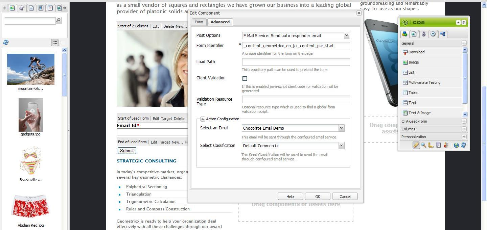

# 管理订阅{#managing-subscriptions}

>[!NOTE]
>
>Adobe不打算进一步增强此功能（管理潜在客户和列表）。
>建议使用[Adobe Campaign及其AEM集成](/help/sites-administering/campaign.md)。

借助在AEM网页上使用的&#x200B;**表单**&#x200B;组件，可以要求用户订阅&#x200B;**电子邮件服务提供程序的**&#x200B;邮件列表。 要准备带有注册表单的AEM页面以订阅电子邮件服务邮件列表，必须将相应的服务配置应用于潜在订阅者将访问的AEM页面。

## 将电子邮件服务配置应用到页面 {#applying-email-service-configuration-to-a-page}

配置AEM页面：

1. 导航到&#x200B;**网站**&#x200B;选项卡。
1. 选择需要为服务配置的页面。 右键单击页面并选择&#x200B;**属性**。

1. 选择&#x200B;**云服务**，然后选择&#x200B;**添加服务**。 从可用配置列表中选择配置。

   

1. 单击&#x200B;**确定**。

## 在AEM页面上创建用于订阅/取消订阅列表的注册表单 {#creating-a-sign-up-form-on-an-aem-page-for-subscribing-unsubscribing-to-lists}

要创建注册表单并将其配置为订阅电子邮件服务提供商的邮件列表，请执行以下操作：

1. 打开用户将访问的AEM页面。
1. 将电子邮件服务提供商的配置应用到页面。

1. 通过从Sidekick拖动组件，将&#x200B;**Form**&#x200B;组件添加到页面中。 如果该组件不可用，请切换到设计模式并启用&#x200B;**表单**&#x200B;组。
1. 在&#x200B;**表单开始**&#x200B;栏中单击&#x200B;**编辑**，然后导航到&#x200B;**高级**&#x200B;选项卡。
1. 在&#x200B;**表单**&#x200B;下拉菜单中，选择&#x200B;**电子邮件服务：创建订阅者**&#x200B;并添加到列表。
1. 在对话框底部，打开&#x200B;**操作配置**&#x200B;下拉列表，从中可以选择一个或多个订阅列表。
1. 在&#x200B;**选择列表**&#x200B;中，选择要用户订阅的列表。 您可以使用加号按钮（**添加项**）添加多个列表。

   

   >[!NOTE]
   >
   >您的对话框可能会因电子邮件服务提供商的不同而有所不同。

1. 在&#x200B;**表单**&#x200B;选项卡中，选择用户提交表单后要前往的感谢页面（如果留空，表单会在提交时重新显示）。 单击&#x200B;**确定**。 表单中显示&#x200B;**电子邮件ID**&#x200B;组件，可让您创建表单，用户可在其中提交其电子邮件地址以订阅或取消订阅邮件列表。
1. 从sidekick的&#x200B;**表单**&#x200B;分区添加&#x200B;**提交**&#x200B;按钮组件。

   表单已准备就绪。 将上面步骤中配置的页面以及&#x200B;**感谢**&#x200B;页面发布到发布实例。 任何访问页面的潜在订阅者都可以填写表单并订阅配置中提供的列表。

   >[!NOTE]
   >
   >要使表单订阅正常工作，需要在发布实例](#exporting-keys-from-author-and-importing-on-publish)上导出和导入来自作者的[加密密钥。

## 从作者导出键并在发布时导入 {#exporting-keys-from-author-and-importing-on-publish}

要使电子邮件服务通过发布实例上的注册表单进行订阅和取消订阅，您需要执行以下步骤：

1. 在创作实例上，导航到包管理器。
1. 创建包。 将筛选器设置为`/etc/key`。
1. 生成并下载包。
1. 导航到发布实例上的包管理器，并上传此包。
1. 导航到发布osgi控制台，并重新启动名为&#x200B;**Adobe Granite加密支持**&#x200B;的包。

## 从列表中取消订阅用户 {#unsubscribing-users-from-lists}

要从列表中取消订阅用户，请执行以下操作：

1. 打开具有注册表单的AEM页面的页面属性以取消订阅潜在客户。
1. 将服务配置应用到页面。
1. 在页面上创建一个注册表单。
1. 配置该组件时，请选择操作&#x200B;**电子邮件服务**： **从列表中取消订阅用户。**
1. 从下拉菜单中，选择取消订阅时从中删除用户的相应列表。

   

1. 将键从创作导出到发布。

## 为电子邮件服务配置自动回复方电子邮件 {#configuring-auto-responder-emails-for-email-service}

要为订阅者配置自动回复电子邮件，请执行以下操作：

1. 打开具有注册表单的AEM页面的页面属性，为潜在客户配置自动响应。
1. 将ExactTarget配置应用到页面。

1. 通过从Sidekick拖动组件，将&#x200B;**Form**&#x200B;组件添加到页面中。 如果该组件不可用，请切换到设计模式并启用&#x200B;**表单**&#x200B;组。
1. 在&#x200B;**表单开始**&#x200B;栏中单击&#x200B;**编辑**，然后导航到&#x200B;**高级**&#x200B;选项卡。
1. 在&#x200B;**表单**&#x200B;下拉菜单中，选择&#x200B;**电子邮件服务：发送自动回复者电子邮件。**
1. **选择电子邮件**（这是作为自动回复者电子邮件发送的邮件）。

1. **选择分类** （此分类用于发送电子邮件）。
1. 选择&#x200B;**感谢**&#x200B;页面（用户提交表单后会被定向到的页面）。

   在&#x200B;**表单**&#x200B;选项卡中，选择用户提交表单后要前往的感谢页面。 （如果留空，表单会在提交时重新显示。） 单击&#x200B;**确定**。

1. 将键从创作导出到发布。
1. 从sidekick的&#x200B;**表单**&#x200B;分区添加&#x200B;**提交**&#x200B;按钮组件。

   注册表单已准备就绪。 将上面步骤中配置的页面以及&#x200B;**感谢**&#x200B;页面发布到发布实例。 任何访问页面的潜在订阅者都可以填写表单，并且在提交表单时，访客将收到一封使用填写表单的电子邮件ID的自动回复电子邮件。

   >[!NOTE]
   >
   >要使注册表单订阅正常运行，需要在发布实例](#exporting-keys-from-author-and-importing-on-publish)上导出和导入来自作者的[加密密钥。

   
