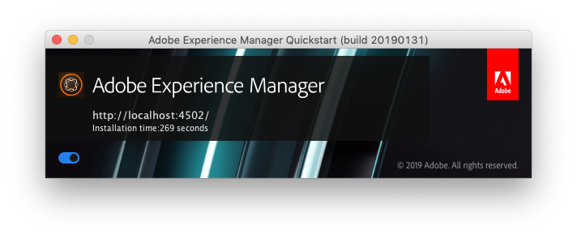

# 命令行启动与停止{#command-line-start-and-stop}

## 从命令行启动Adobe Experience Manager {#starting-adobe-experience-manager-from-the-command-line}

`start`脚本位于&#x200B;*&lt;cq-installation>/bin*&#x200B;目录下。 提供了UNIX®和Windows版本。 脚本启动安装在&#x200B;*&lt;cq-installation>*&#x200B;目录下的实例。

这两个版本支持可用于启动和调整Adobe Experience Manager (AEM)实例的环境变量列表。

<table>
 <tbody>
  <tr>
   <td><strong>环境变量 </strong></td>
   <td><strong>描述 </strong></td>
  </tr>
  <tr>
   <td>CQ_PORT</td>
   <td>用于停止和状态脚本的TCP端口<br /> </td>
  </tr>
  <tr>
   <td>CQ_HOST</td>
   <td>主机名<br /> </td>
  </tr>
  <tr>
   <td>CQ_INTERFACE</td>
   <td>此服务器应侦听的接口<br /> </td>
  </tr>
  <tr>
   <td>CQ_RUNMODE</td>
   <td>运行模式，用逗号<br />分隔 </td>
  </tr>
  <tr>
   <td>CQ_JARFILE</td>
   <td>Jarfile<br />的名称 </td>
  </tr>
  <tr>
   <td>CQ_USE_JAAS</td>
   <td>JAAS的使用（如果为true）<br /> </td>
  </tr>
  <tr>
   <td>CQ_JAAS_CONFIG</td>
   <td>JAAS配置的路径<br /> </td>
  </tr>
  <tr>
   <td>CQ_JVM_OPTS</td>
   <td>默认JVM选项<br /> </td>
  </tr>
 </tbody>
</table>

>[!CAUTION]
>
>某些运行模式（包括创作和发布）必须在首次启动AEM之前设置，此后无法更改。 在设置生产中使用的AEM实例之前，请参阅[运行模式文档](/help/sites-deploying/configure-runmodes.md)以了解详细信息。

### Windows平台start.bat脚本示例 {#windows-platform-start-bat-script-example}

```shell
SET CQ_PORT=1234 & ./start.bat
```

### UNIX®平台启动脚本示例 {#unix-platform-start-script-example}

```shell
CQ_PORT=1234 ./start
```

>[!NOTE]
>
>启动脚本将启动安装在&#x200B;*&lt;cq-installation>/app*&#x200B;文件夹下的AEM快速启动。

## 停止Adobe Experience Manager {#stopping-adobe-experience-manager}

要停止AEM，请执行以下操作之一：

* 根据您使用的平台：

  * 如果是从脚本或命令行启动AEM，请按&#x200B;**Ctrl+C**&#x200B;关闭服务器。
  * 如果您已在UNIX®上使用启动脚本，则必须使用停止脚本来停止AEM。

* 如果通过双击jar文件来启动AEM，请单击启动窗口上的&#x200B;**打开**&#x200B;按钮（该按钮随后将更改为&#x200B;**关闭**）以关闭服务器。

  

## 从命令行停止Adobe Experience Manager {#stopping-adobe-experience-manager-from-the-command-line}

`stop`脚本位于&#x200B;*&lt;cq-installation>/bin*&#x200B;目录下。 提供了UNIX®和Windows版本。 脚本停止安装在&#x200B;*&lt;cq-installation>*&#x200B;目录中的正在运行的实例。

### UNIX®平台停止脚本示例 {#unix-platform-stop-script-example}

```shell
./stop
```

### Windows平台stop.bat脚本示例 {#windows-platform-stop-bat-script-example}

```shell
./stop.bat
```

如果只想预配置存储库（而不想重新定位存储库），则只需：

* 将`repository.xml`提取到所需位置

* 根据需要更新`repository.xml`

* 创建`bootstrap.properties`并定义`repository.config`

同样，在开始实际安装之前。
