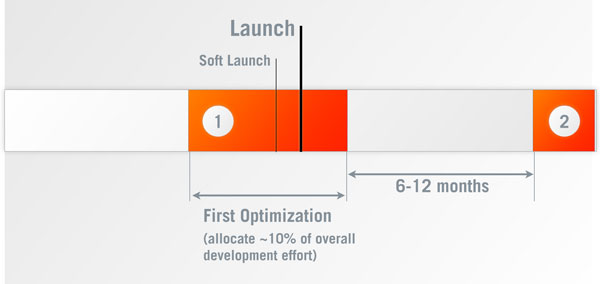
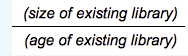
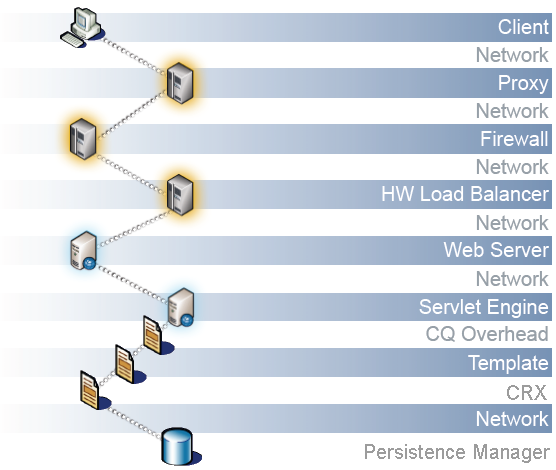

# 性能优化 {#performance-optimization}

>[!NOTE]
>
>有关故障排除和修复性能问题的详细信息，另请参阅[性能树](/help/sites-deploying/performance-tree.md)。
>
>此外，您还可以查看有关[性能优化提示](https://experienceleague.adobe.com/en/docs/experience-cloud-kcs/kbarticles/ka-17466)的知识库文章。

关键问题是网站响应访客请求所用的时间。 尽管该值因每个请求而异，但可以定义平均目标值。 一旦证实该值既可实现，又可维护，就可使用它来监控网站的性能，并指示潜在问题的发展。

您针对的响应时间在创作环境和发布环境中不同，反映了目标受众的不同特征：

## 创作环境 {#author-environment}

输入和更新内容的作者将使用此环境。 它必须满足少数用户在更新内容页面和这些页面上的单个元素时各自生成大量性能密集型请求的需求。

## 发布环境 {#publish-environment}

此环境包含可供用户使用的内容。 在这里，请求的数量甚至更多，速度也至关重要。 但是，由于请求的性质不太动态，因此可以应用额外的性能增强机制；例如缓存内容或负载平衡。

>[!NOTE]
>
>* 在配置性能优化后，请按照[Touch Day](/help/sites-developing/tough-day.md)中的过程测试重负载下的环境。
>* 另请参阅[性能优化提示。](https://experienceleague.adobe.com/en/docs/experience-cloud-kcs/kbarticles/ka-17466)

## 性能优化方法 {#performance-optimization-methodology}

AEM项目的性能优化方法可归纳为五个简单的规则，您可以遵循这些规则以从一开始就避免性能问题：

1. [优化计划](#planning-for-optimization)
1. [模拟现实](#simulate-reality)
1. [建立坚实的目标](#establish-solid-goals)
1. [保持相关](#stay-relevant)
1. [敏捷迭代周期](#agile-iteration-cycles)

这些规则通常适用于Web项目，并与项目经理和系统管理员相关，以确保他们的项目在启动时不会面临性能挑战。

### 优化计划 {#planning-for-optimization}



为性能优化阶段规划大约10%的项目工作量。 实际性能优化要求取决于项目的复杂程度和开发团队的经验。 虽然您的项目可能（最终）不需要分配时间，但最好始终在建议的区域规划性能优化。

如有可能，项目应首先向有限的受众软启动，以收集现实生活体验并执行进一步优化，而不会在完整发布后产生额外压力。

“实时”运行后，性能优化仍未结束。 现在，您会在系统上体验“真正的”负载。 计划发布后进行额外的调整很重要。

由于系统负载发生变化且系统性能配置文件会随时间变化，因此应以6-12个月为间隔安排性能“调校”或“运行状况检查”。

### 模拟现实 {#simulate-reality}


如果您通过网站上线，在发布后发现您遇到了性能问题，则可能是因为您的负载和性能测试没有充分模拟现实。

模拟现实很困难，您要在实现“真实”方面投入多少精力取决于项目的性质。 “真实”不仅表示“真实代码”和“真实流量”，还表示“真实内容”，尤其是关于内容大小和结构。 根据存储库的大小和结构，模板的行为可能会有所不同。

### 建立坚实的目标 {#establish-solid-goals}


正确制定业绩目标的重要性不容低估。 通常，在人们专注于特定的绩效目标后，即使这些目标基于假设，也很难在事后更改它们。

建立良好、可靠的绩效目标确实是最困难的领域之一。 通常最好从类似网站（例如新网站的前身）收集真实日志和基准。

### 保持相关 {#stay-relevant}


一次优化一个瓶颈是很重要的。 如果您尝试并行执行操作，而不验证一次优化的影响，则可能会丢失对哪个优化措施有所帮助的跟踪。

### 敏捷迭代周期 {#agile-iteration-cycles}


性能调整是一个迭代过程，包括测量、分析、优化和验证，直到达到目标。 考虑到这一点，在优化阶段实施敏捷验证过程，而不是在每次迭代后实施更沉重的测试过程。

此焦点意味着实施优化的开发人员应该能够快速判断优化是否已实现目标。 此信息很有价值，因为当达到目标时，优化即告结束。

## 基本性能准则 {#basic-performance-guidelines}

一般而言，将未缓存的html请求保留在100毫秒内。 更具体地说，以下内容可作为指南：

* 70%的页面请求应在100毫秒内得到响应。
* 25%的页面请求应在100毫秒 — 300毫秒内获得响应。
* 4%的页面请求应在300毫秒 — 500毫秒内获得响应。
* 1%的页面请求应在500毫秒 — 1000毫秒内获得响应。
* 任何页面的响应速度都不应小于1秒。

上述数字假定满足以下条件：

* 在发布时测量（无与创作环境相关的开销）
* 在服务器上测量（无网络开销）
* 未缓存(无AEM输出缓存，无Dispatcher缓存)
* 仅适用于具有许多依赖关系的复杂项目(HTML、JS、PDF...)
* 系统上没有其他负载

有一些问题经常会导致性能问题，其中包括：

* Dispatcher缓存效率低下
* 在一般显示模板中使用查询。

JVM和OS级别的调整通常不会导致性能的大幅提升，因此应在优化周期的最后阶段执行。

内容存储库的结构方式也会影响性能。 为获得最佳性能，附加到内容存储库中单个节点的子节点数不应超过1,000（作为一项规则）。

在常规的性能优化练习中，您最好的朋友包括：

* `request.log`
* 基于组件的计时
* Java™探查器。

### 加载和编辑Digital Assets时的性能 {#performance-when-loading-and-editing-digital-assets}

由于加载和编辑数字资产时涉及大量数据，因此性能可能会成为一个问题。

这里有两个因素会影响性能：

* CPU — 多核可在转码时提供更流畅的工作
* 硬盘 — 并行RAID磁盘可实现相同功能

要提高性能，请考虑以下事项：

* 每天将上传多少资产？ 一个好的估计可以基于：



* 进行编辑的时间范围（通常为工作日的长度，对国际业务更适用）。
* 已上传图像的平均大小（以及每个图像生成的演绎版的大小）（以MB为单位）。
* 确定平均数据速率：


* 所有编辑中的80%都是在20%的时间内完成的，因此在高峰期，您的平均数据速率是四倍。 这样的表现是你的目标。

## 性能监控 {#performance-monitoring}

性能（或缺缺性能）是用户首先注意到的事项之一，因此对于任何具有用户界面的应用程序而言，性能至关重要。 要优化AEM安装的性能，请监控实例的各种属性及其行为。

有关如何执行性能监视的信息，请参阅[监视性能](/help/sites-deploying/monitoring-and-maintaining.md#monitoring-performance)。

导致性能问题的问题通常难以跟踪，即使其影响显而易见。

一个基本出发点是对系统正常工作的情况有良好的了解。 除非您知道您的环境在正确执行时“外观”和“行为”如何，否则在性能下降时很难找到问题。 花时间调查您的系统是否运行顺畅，并确保收集性能信息是一项持续的工作。 这样做可以为您提供在性能下降时进行比较的基础。

下图说明了请求AEM内容可以采用的路径，以及可能影响性能的不同元素数量。



性能也是卷和容量之间的平衡：

* **卷** — 系统处理和传递的输出量。
* **容量** — 系统传送卷的能力。

可以在整个Web链的不同位置说明性能。


影响性能的原因通常包括以下几个功能领域：

* 缓存
* 应用程序（您的项目）代码
* 搜索功能

### 有关性能的基本规则 {#basic-rules-regarding-performance}

在优化性能时，应牢记以下某些规则：

* 性能优化&#x200B;*必须*&#x200B;是每个项目的一部分。
* 不要在开发周期的早期进行优化。
* 性能只取决于最弱的链接。
* 始终考虑容量与容量。
* 首先优化重要内容。
* 如果没有&#x200B;*现实的*&#x200B;目标，永远不要进行优化。

>[!NOTE]
>
>请记住，您用于测量绩效的机制通常准确地影响您尝试测量的内容。 请尽量考虑这些差异，并尽可能消除其影响；特别是应尽可能停用浏览器插件。

## 配置性能 {#configuring-for-performance}

可以配置AEM的某些方面（和/或底层存储库）来优化性能。 以下是一些可能性和建议，在进行更改之前，您必须确定是否（或如何）使用所讨论的功能。

### 搜索索引 {#search-indexing}

从AEM 6.0开始，Adobe Experience Manager使用基于Oak的存储库架构。

您可以在此处找到更新的索引信息：

* [有关查询和索引的最佳实践](/help/sites-deploying/best-practices-for-queries-and-indexing.md)
* [查询和索引](/help/sites-deploying/queries-and-indexing.md)

### 并发工作流处理 {#concurrent-workflow-processing}

要提高性能，请限制同时运行的工作流进程的数量。 默认情况下，工作流引擎并行处理的工作流数量与Java™ VM可用的处理器数量相同。 当工作流步骤需要大量处理资源(RAM或CPU)时，并行运行多个这些工作流可能会对可用的服务器资源提出很高的要求。

例如，在上传图像（或一般的DAM资产）时，工作流会自动将图像导入DAM。 图像通常具有高分辨率，可以轻松占用数百MB的栈进行处理。 并行处理这些图像会给内存子系统和垃圾收集器带来高负载。

工作流引擎使用Apache Sling作业队列来处理和计划工作项处理。 默认情况下，已从Apache Sling作业队列配置服务工厂创建以下作业队列服务，用于处理工作流作业：

<!-- TODO: Change the reference to 6.5 LTS javadocs -->
* Granite工作流队列：大多数工作流步骤使用Granite工作流队列服务，例如处理DAM资产的步骤。
* Granite工作流外部进程作业队列：此服务用于特殊外部工作流步骤，通常用于联系外部系统和轮询结果。 例如， InDesign媒体提取流程步骤作为外部流程实施。 工作流引擎使用外部队列处理轮询。 (请参阅[com.day.cq.workflow.exec.WorkflowExternalProcess](https://developer.adobe.com/experience-manager/reference-materials/6-5/javadoc/com/day/cq/workflow/exec/WorkflowExternalProcess.html)。)

配置这些服务以限制并发运行的工作流进程的最大数量。

>[!NOTE]
>
>配置这些作业队列会影响所有工作流，除非您为特定工作流模型创建了作业队列（请参阅下面的[为特定工作流模型配置队列](/help/sites-deploying/configuring-performance.md#configure-the-queue-for-a-specific-workflow)）。

#### 存储库中的配置 {#configuration-in-the-repo}

如果您使用sling：OsgiConfig节点](/help/sites-deploying/configuring-osgi.md#adding-a-new-configuration-to-the-repository)配置服务[，则必须找到现有服务的PID，例如：org.apache.sling.event.jobs.QueueConfiguration.370aad73-d01b-4a0b-abe4-20198d85f705。 您可以使用Web控制台发现PID。

配置名为`queue.maxparallel`的属性。

#### Web控制台中的配置 {#configuration-in-the-web-console}

要使用Web控制台](/help/sites-deploying/configuring-osgi.md#osgi-configuration-with-the-web-console)配置这些服务[，请在Apache Sling作业队列配置服务工厂下找到现有配置项。

配置名为Maximum Parallel Jobs的属性。

### 为特定工作流配置队列 {#configure-the-queue-for-a-specific-workflow}

为特定工作流模型创建作业队列，以便为该工作流模型配置作业处理。 这样，您的配置将影响特定工作流的处理，而默认Granite工作流队列的配置将控制其他工作流的处理。

执行工作流模型时，它们为特定主题创建Sling作业。 默认情况下，该主题与为常规Granite工作流队列或Granite工作流外部进程作业队列配置的主题匹配：

* `com/adobe/granite/workflow/job*`
* `com/adobe/granite/workflow/external/job*`

工作流模型生成的实际作业主题包括特定于模型的后缀。 例如，**DAM更新资产**&#x200B;工作流模型会生成具有以下主题的作业：

`com/adobe/granite/workflow/job/etc/workflow/models/dam/update_asset/jcr_content/model`

因此，您可以为与工作流模型的作业主题匹配的主题创建作业队列。 配置队列的性能相关属性只会影响生成与队列主题匹配的作业的工作流模型。

以下过程使用&#x200B;**DAM更新资产**&#x200B;工作流为工作流创建作业队列。

1. 执行要为其创建作业队列的工作流模型，以便生成主题统计信息。 例如，将图像添加到Assets以执行&#x200B;**DAM更新资产**&#x200B;工作流。
1. 打开Sling作业控制台(`https://<host>:<port>/system/console/slingevent`)。
1. 在控制台中了解与工作流相关的主题。 对于DAM更新资产，可找到以下主题：

   * `com/adobe/granite/workflow/external/job/etc/workflow/models/dam/update_asset/jcr_content/model`
   * `com/adobe/granite/workflow/job/etc/workflow/models/dam/update_asset/jcr_content/model`
   * `com/adobe/granite/workflow/job/etc/workflow/models/dam-xmp-writeback/jcr_content/model`

1. 为每个主题创建一个作业队列。 要创建作业队列，请为Apache Sling作业队列工厂服务创建工厂配置。

   工厂配置类似于[并发工作流处理](/help/sites-deploying/configuring-performance.md#concurrent-workflow-processing)中描述的Granite工作流队列，但Topics属性与工作流作业的主题匹配。

### AEM DAM资源同步服务 {#cq-dam-asset-synchronization-service}

`AssetSynchronizationService`用于同步已装入的存储库(包括LiveLink、Documentum®等)中的资产。 默认情况下，此同步每300秒（5分钟）进行一次常规检查，因此，如果您不使用已装载的存储库，则可以禁用此服务。

禁用服务操作已通过[将OSGi服务](/help/sites-deploying/configuring-osgi.md) **CQ DAM资产同步服务**&#x200B;配置为将&#x200B;**同步周期** (`scheduler.period`)设置为（最少）一年（以秒为单位定义）。

### 多个DAM实例 {#multiple-dam-instances}

部署多个DAM实例可帮助提高性能，例如：

* 由于为创作环境定期上传许多资产，因此您的负载较高；此处有一个单独的DAM实例专门用于为创作提供服务。
* 您在全球各地拥有多个团队（例如，美国、欧洲、亚洲）。

其他注意事项包括：

* 将作者的“进行中的工作”与发布上的“最终工作”分隔开
* 将内部作者用户与外部访客/发布用户分隔开（例如，代理、新闻代表、客户和学生）。

## Assurance质量最佳实践 {#best-practices-for-quality-assurance}

性能对于您的发布环境至关重要。 因此，在实施项目时，您必须仔细规划和分析为发布环境进行的性能测试。

本节旨在对定义测试概念时遇到的一些问题进行标准化概述，这些测试概念专门用于&#x200B;*publish*&#x200B;环境中的性能测试。 此信息主要与QA工程师、项目经理和系统管理员有关。

下面介绍在&#x200B;*Publish*&#x200B;环境中对AEM应用程序进行性能测试的一种标准化方法。 该性能测试包括以下五个阶段：

* [知识验证](#verification-of-knowledge)
* [范围的定义](#scope-definition)
* [测试方法](#test-methodologies)
* [绩效目标的定义](#defining-the-performance-goals)
* [优化](#optimization)

控制是一个额外、包含所有内容的过程 — 它是必需的，但不限于测试。

### 知识验证 {#verification-of-knowledge}

第一步是记录开始测试之前必须了解的基础信息：

* 测试环境的架构
* 详细说明需要测试的内部元素（单独和组合）的应用程序映射

#### 测试架构 {#test-architecture}

记录用于性能测试的测试环境的架构。

您需要复制已计划的生产Publish环境，以及Dispatcher和负载平衡器。

#### 应用程序映射 {#application-map}

获取一个清晰的概述，您可以从中创建整个应用程序的映射（您可能已在创作环境的测试中拥有此映射）。

以图表形式呈现应用程序的内部元素，可以概述测试要求；通过颜色编码，它还可以用作报告的基础。

### 范围定义 {#scope-definition}

应用程序通常有多种使用案例。 有些用例很重要，有些则不那么重要。

为了将性能测试的范围集中在发布上，Adobe建议您定义以下内容：

* 最重要的业务用例
* 最关键的技术用例

用例的数量取决于您，但应该限制为易于管理的数量（例如，5到10之间）。

选择关键用例后，可以为每个用例定义关键绩效指标(KPI)和用于衡量它们的工具。 常见KPI的示例包括：

* 端到端响应时间
* Servlet响应时间
* 单个组件的响应时间
* 服务的响应时间
* 线程池中的空闲线程数
* 可用连接数
* 系统资源，如CPU和I/O访问

### 测试方法 {#test-methodologies}

此概念有四种用于定义和测试性能目标的场景：

* 单组件测试
* 组合组件测试
* *上线*&#x200B;方案
* 错误方案

基于以下原则

#### 组件断点 {#component-breakpoints}

* 每个组件在与性能相关时都有一个特定的断点。 也就是说，部件可以显示出良好性能直到达到特定点为止，此后，性能迅速下降。
* 要获取应用程序的完整概述，您必须首先验证组件，以确定何时到达每个组件的断点。
* 要查找可以执行负载测试的断点，您可以在一段时间内增加用户数量以创建不断增加的负载。 通过监控此负载和组件的响应，您会在组件断点到达时遇到特定的性能行为。 可以通过每秒并发事务数以及并发用户数（如果组件对此KPI敏感）来限定该点。
* 然后，此信息可作为改进的基准，指示正在使用的衡量标准的效率，并帮助定义测试场景。

#### 交易 {#transactions}

* 术语事务用于表示完整网页的请求，包括页面本身和所有后续调用。 即，页面请求、任何AJAX调用、图像和其他对象&#x200B;**请求深入分析**。
* 要全面分析每个请求，可以表示调用栈栈的每个元素，然后合计每个请求的平均处理时间。

### 定义绩效目标 {#defining-the-performance-goals}

定义范围和相关KPI后，将设置特定的性能目标。 此过程包括设计测试场景以及目标值。

在平均和峰值条件下测试性能。 此外，您还需要进行上线场景测试，以确保在网站首次可用时能够满足对网站日益增长的兴趣需求。

从现有网站收集的任何经验或统计数据也可能在确定未来目标时非常有用。 例如，实时网站中的热门流量。

#### 单组件测试 {#single-component-tests}

必须在平均和峰值条件下测试关键组件。

在这两种情况下，当预定义数量的用户使用系统时，您都可以定义每秒的预期事务处理数。

| 组件 | 测试类型 | 不行。用户 | Tx/秒（预期） | Tx/秒（已测试） | 描述 |
|---|---|---|---|---|---|
| 主页单个用户 | 平均 | 1 | 1 |  |  |
|   | 峰值 | 1 | 3 |  |  |
| 主页100个用户 | 平均 | 100 | 3 |  |  |
|   | 峰值 | 100 | 3 |  |

#### 组合组件测试 {#combined-component-tests}

组合测试组件可以更密切地反映应用程序行为。 必须再次测试平均值和峰值条件。

| 场景 | 组件 | 不行。用户 | Tx/秒（预期） | Tx/秒（已测试） | 描述 |
|---|---|---|---|---|---|
| 混合平均值 | 主页 | 10 | 1 |  |  |
|   | 搜索 | 10 | 1 |  |  |
|   | 新闻 | 10 | 2 |  |  |
|   | 事件 | 10 | 1 |  |  |
|   | 激活次数 | 10 | 3 |  | 作者行为的模拟。 |
| 混合峰 | 主页 | 100 | 5 |  |  |
|   | 搜索 | 50 | 5 |  |  |
|   | 新闻 | 100 | 10 |  |  |
|   | 事件 | 100 | 10 |  |  |
|   | 激活次数 | 20 | 20 |  | 作者行为的模拟。 |

#### 上线测试 {#going-live-tests}

在您网站推出后的前几天，您可能会更加感兴趣。 此方案甚至大于您正在测试的峰值。 Adobe建议您测试上线场景，确保系统能够适应这种情况。

| 场景 | 测试类型 | 不行。用户 | Tx/秒（预期） | Tx/秒（已测试） | 描述 |
|---|---|---|---|---|---|
| 启用峰值 | 主页 | 200 | 20 |  |  |
|   | 搜索 | 100 | 10 |  |  |
|   | 新闻 | 200 | 20 |  |  |
|   | 事件 | 200 | 20 |  |  |
|   | 激活次数 | 20 | 20 |  | 作者行为的模拟。 |

#### 错误方案测试 {#error-scenario-tests}

测试错误情况以确保系统正确且正确地反应。 不仅包括错误本身的处理方式，还可能影响性能。 例如：

* 当用户尝试在搜索框中输入无效搜索词时会发生什么情况
* 当搜索词过于宽泛，以至于返回的结果数量过多时会发生什么情况

在设计这些测试时，应该记住，并非所有情景都会定期发生。 但是，它们对整个系统的影响很重要。

| 错误方案 | 错误类型 | 不行。用户 | Tx/秒（预期） | Tx/秒（已测试） | 描述 |
|---|---|---|---|---|---|
| 搜索组件过载 | 搜索全局通配符（星号） | 10 | 1 |  | 只搜索&amp;amp；ast；&amp;amp；ast；&amp;amp；ast；。 |
|   | 停用词 | 20 | 2 |  | 正在搜索停用词。 |
|   | 空字符串 | 10 | 1 |  | 正在搜索空字符串。 |
|   | 特殊字符 | 10 | 1 |  | 正在搜索特殊字符。 |

#### 耐用测试 {#endurance-tests}

只有在系统连续运行（小时或天）后，才会遇到某些问题。 持久性测试用于测试所需时间段内的恒定平均负载。 然后可以分析任何性能降级。

| 场景 | 测试类型 | 不行。用户 | Tx/秒（预期） | Tx/秒（已测试） | 描述 |
|---|---|---|---|---|---|
| 耐力测试（72小时） | 主页 | 10 | 1 |  |  |
|   | 搜索 | 10 | 1 |  |  |
|   | 新闻 | 20 | 2 |  |  |
|   | 事件 | 10 | 1 |  |  |
|   | 激活次数 | 1 | 3 |  | 作者行为的模拟。 |

### 优化 {#optimization}

在后期实施阶段，优化应用程序以实现和最大化性能目标。

必须测试所做的任何优化，以确保它们具有：

* 未影响功能
* 已在释放前通过负载测试验证

我们提供了一系列工具，帮助您进行负载生成、性能监控和结果分析。 其中一些工具包括：

* [JMeter](https://jmeter.apache.org/)
* [加载运行程序](https://www.microfocus.com/en-us/portfolio/performance-engineering/overview)
* [Java™交互式配置文件](https://jiprof.sourceforge.net/)

优化后，再次测试以确认影响。

### 报告 {#reporting}

持续报告使每个人都了解该状态。 如前面在颜色编码中提到的，体系结构图可用于该状态。

完成所有测试后，报告以下内容：

* 遇到任何严重错误
* 仍需进一步调查的非关键性问题
* 测试期间所做的任何假设
* 测试中提出的任何建议

## 使用Dispatcher时优化性能 {#optimizing-performance-when-using-the-dispatcher}

[Dispatcher](https://experienceleague.adobe.com/docs/experience-manager-dispatcher/using/dispatcher.html?lang=zh-Hans)是Adobe的缓存和/或负载平衡工具。 使用Dispatcher时，请考虑优化网站缓存性能。

>[!NOTE]
>
>虽然 Dispatcher 版本独立于 AEM，但 Dispatcher 文档会嵌入到 AEM 文档中。始终使用嵌入到最新版本的 AEM 文档中的 Dispatcher 文档。
>
>您可能是在单击以前版本的 AEM 文档中嵌入的 Dispatcher 文档链接后重定向到此页面。

Dispatcher提供了多种内置机制，如果您的网站利用这些机制可优化性能。 此部分介绍了如何设计您的网站以最大限度地提高缓存优势。

>[!NOTE]
>
>Dispatcher 将缓存存储在标准 Web 服务器上，记住这一点可能会对您有所帮助。了解此信息意味着您可以缓存可以存储为页面并使用URL请求的所有内容。 并且，您无法存储其他内容，例如Cookie、会话数据和表单数据。
>
>通常，许多缓存策略涉及选择完好的URL，并且不依赖此类额外数据。
>
>使用Dispatcher版本4.1.11，您还可以缓存响应标头，请参阅[缓存HTTP响应标头](https://experienceleague.adobe.com/docs/experience-manager-dispatcher/using/configuring/dispatcher-configuration.html#configuring-the-dispatcher-cache-cache)。
>

### 计算Dispatcher缓存比率 {#calculating-the-dispatcher-cache-ratio}

缓存比率公式估算缓存处理的请求占进入系统的请求总数的百分比。 要计算高速缓存比率，您需要以下各项：

* 请求总数。 此信息在Apache `access.log`中可用。 有关更多详细信息，请参阅[Apache官方文档](https://httpd.apache.org/docs/2.4/logs.html#accesslog)。

* 发布实例服务的请求数。 此信息在实例的`request.log`中可用。 有关详细信息，请参阅[解释request.log](/help/sites-deploying/monitoring-and-maintaining.md#interpreting-the-request-log)和[查找日志文件](/help/sites-deploying/monitoring-and-maintaining.md#finding-the-log-files)。

计算缓存比的公式为：

* （请求总数&#x200B;**减去**&#x200B;发布上的请求数）**除以**&#x200B;再除以请求总数。

例如，如果请求总数为129491，而发布实例提供的请求数58959为，则缓存比率为： **(129491 - 58959)/129491= 54.5%**。

如果您没有一对一的发布者/Dispatcher配对，请将所有Dispatcher和发布者的请求一起添加以获取准确的测量。 另请参阅[建议的部署](/help/sites-deploying/recommended-deploys.md)。

>[!NOTE]
>
>为获得最佳性能，Adobe建议将缓存比率为90%到95%。

#### 使用一致的页面编码 {#using-consistent-page-encoding}

使用Dispatcher版本4.1.11，您可以缓存响应标头。 如果不在Dispatcher上缓存响应标头，则在标头中存储页面编码信息时，可能会出现问题。 在此情况下，当 Dispatcher 从缓存中提供一个页面时，Web 服务器的默认编码将用于该页面。可通过两种方式避免此问题：

* 如果您只使用一种编码，请确保 Web 服务器上使用的编码与 AEM 网站的默认编码相同。
* 要设置编码，使用 HTML `head` 部分中的 `<META>` 标记，如以下示例所示：

```xml
        <META http-equiv="Content-Type" content="text/html; charset=EUC-JP">
```

#### 消除 URL 参数 {#avoid-url-parameters}

如果可能，请消除要缓存的页面的 URL 参数。例如，如果您有一个图片库，则绝不会缓存以下 URL（除非对 Dispatcher 进行[相应配置](https://experienceleague.adobe.com/docs/experience-manager-dispatcher/using/configuring/dispatcher-configuration.html#configuring-the-dispatcher-cache-cache)）：

```xml
www.myCompany.com/pictures/gallery.html?event=christmas&amp;page=1
```

不过，您可以将这些参数放入页面 URL 中，如下所示：

```xml
www.myCompany.com/pictures/gallery.christmas.1.html
```

>[!NOTE]
>
>此URL调用与`gallery.html`相同的页面和模板。 在模板定义中，您可以指定用于渲染页面的脚本，也可以对所有页面使用同一脚本。

#### 按 URL 进行自定义  {#customize-by-url}

如果您允许用户更改字体大小（或任何其他版面自定义设置），请确保各种自定义设置都反映在 URL 中。

例如，由于不会缓存 cookie，因此如果您将字体大小存储在 cookie（或类似机制）中，则不会为缓存的页面保留字体大小。因此，Dispatcher 会随机返回任意字体大小的文档。

在 URL 中包含字体大小作为选择器可避免出现此问题：

```xml
www.myCompany.com/news/main.large.html
```

>[!NOTE]
>
>对于大多数版面，还可以使用样式表或客户端脚本，或两者同时使用。这些工具可以很好地与缓存配合使用。
>
>此策略对于打印版本也很有用，您可以在打印版本中使用如下URL：
>
>`www.myCompany.com/news/main.print.html`
>
>通过使用模板定义的脚本通配，您可以指定单独的脚本来渲染打印页面。

#### 使用作标题的图像文件失效 {#invalidating-image-files-used-as-titles}

如果您将页面标题或其他文本渲染为图片，建议您存储文件，以便在更新页面内容时将其删除：

1. 将图像文件放入与页面相同的文件夹中。
1. 对图像文件使用以下命名格式：

   `<page file name>.<image file name>`

例如，您可以将页面`myPage.html`的标题存储在`file myPage.title.gif`中。 由于此文件会在页面更新时自动被删除，因此对页面标题进行的任何更改都会自动反映在缓存中。

>[!NOTE]
>
>图像文件不一定会实际存在于 AEM 实例上。您可以使用动态创建图像文件的脚本。随后，Dispatcher 会将文件存储在 Web 服务器上。

#### 使用于导航的图像文件失效 {#invalidating-image-files-used-for-navigation}

如果将图片用于导航条目，则方法基本上与标题相同，但会稍微复杂一些。 将所有导航图像与目标页面一起存储。如果将两张图片用于一般或活动场景，则可以使用以下脚本：

* 一个正常显示页面的脚本。
* 一个处理“.normal”请求并返回正常图片的脚本。
* 一个处理“.active”请求并返回活动图片的脚本。

请务必使用与页面相同的命名句柄创建这些图片，以确保内容更新会删除这些图片和页面。

对于未修改的页面，图片保留在缓存中，但页面本身会自动失效。

#### 个性化 {#personalization}

建议您将个性化限制在必要的地方。 原因如下：

* 如果您使用可随意自定义的开始页面，则用户每次请求该页面时都必须对它进行编辑。
* 相反，如果您有十个不同的开始页面可供选择，则可以缓存其中的每个页面，从而提高性能。

>[!TIP]
>有关配置Dispatcher缓存的更多详细信息，请参阅[AEM Dispatcher缓存教程](https://experienceleague.adobe.com/docs/experience-manager-learn/dispatcher-tutorial/overview.html)及其有关[缓存受保护内容](https://experienceleague.adobe.com/docs/experience-manager-learn/dispatcher-tutorial/chapter-1.html#dispatcher-tips-and-tricks)的部分。

例如，如果将用户名放入标题栏中对每个页面进行个性化，则会影响性能。

>[!TIP]
>有关缓存受保护内容的信息，请参阅Dispatcher指南中的[缓存受保护内容](https://experienceleague.adobe.com/docs/experience-manager-dispatcher/using/configuring/permissions-cache.html?lang=zh-hans)。

关于在单个页面上混合受限内容和公共内容，请考虑以下策略：在Dispatcher中使用服务器端包含，或者在浏览器中通过Ajax使用客户端包含。

>[!TIP]
>
>有关处理混合的公开和受限内容，请参阅[设置Sling动态包含。](https://experienceleague.adobe.com/docs/experience-manager-learn/foundation/development/set-up-sling-dynamic-include.html)

#### 粘性连接 {#sticky-connections}

[粘性连接](https://experienceleague.adobe.com/docs/experience-manager-dispatcher/using/dispatcher.html#the-benefits-of-load-balancing)可确保同一个用户的文档全部在同一服务器上撰写。如果用户在退出此文件夹不久后返回，则此连接仍保持粘性。要保存所有需要网站的粘性连接的文档，请定义一个文件夹。 尽量不要在该文件夹中放入其他文件。如果您使用个性化的页面和会话数据，此方案将影响负载平衡。

#### MIME 类型 {#mime-types}

浏览器可通过两种方式确定文件的类型：

1. 按其扩展名（例如，`.html`、`.gif`和`.jpg`）。
1. 按服务器随文件一起发送的 MIME 类型。

对于大多数文件，MIME 类型隐含在文件扩展名中。那就是，

1. 按其扩展名（例如，`.html`、`.gif`和`.jpg`）。
1. 按服务器随文件一起发送的 MIME 类型。

如果文件名没有扩展名，则以纯文本形式显示。

使用Dispatcher版本4.1.11，您可以缓存响应标头。 如果不在Dispatcher上缓存响应标头，则MIME类型是HTTP标头的一部分。 因此，如果您的AEM应用程序返回的文件没有可识别的文件结尾，而是依赖MIME类型，则这些文件可能无法正确显示。

要确保正确缓存文件，请遵循以下准则：

* 确保文件始终具有正确的扩展名。
* 避免使用通用文件服务脚本，这些脚本具有`download.jsp?file=2214`等URL。 要使用包含文件规范的URL，请重写脚本。 对于上一个示例，此重写为`download.2214.pdf`。
