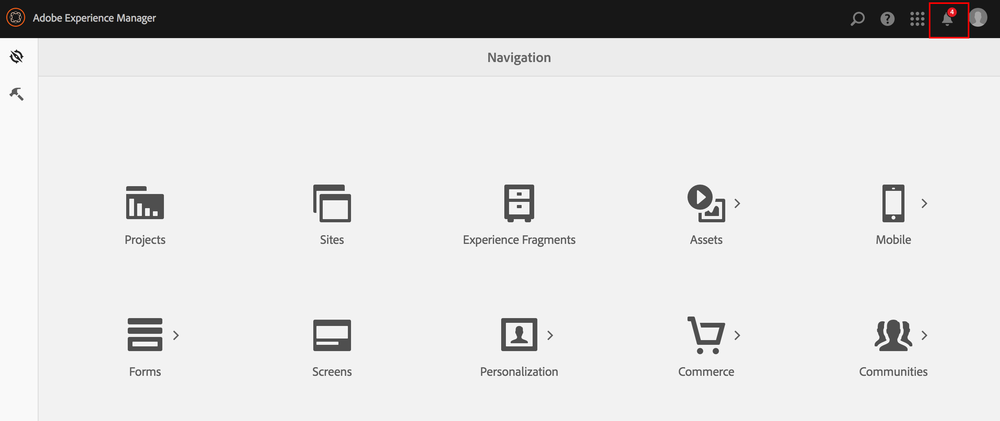
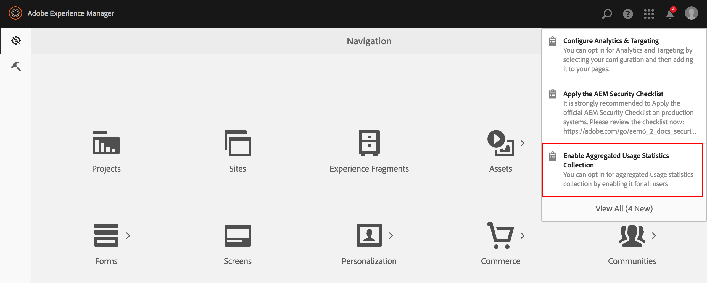
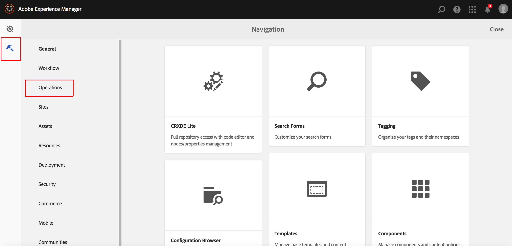

# 选择加入汇总使用情况统计信息收集{#opting-into-aggregated-usage-statistics-collection}

## 简介 {#introduction}

您可以发送有关您如何与Adobe Experience Cloud (AEM)交互的Adobe统计数据，帮助改进Adobe Experience Manager。 此信息不包含有关贵公司网站访客的任何数据，并且仅用于帮助Adobe提供、支持和改善您的用户体验。

您可以使用触屏UI或Web控制台选择收集使用情况统计数据。

>[!NOTE]
>
>有各种数据保护与隐私条例；例如，包括GDPR和CCPA。 AEM Sites随时准备帮助客户履行其数据保护和隐私合规义务。 本页将指导客户完成选择加入（或退出）汇总使用情况统计信息收集的过程。
>
>有关详细信息，另请参阅[Adobe的隐私中心](https://www.adobe.com/cn/privacy.html)。

>[!NOTE]
>
>您可以随时选择退出，方法是使用[Web控制台]&#x200B;(#opt-in-by-using-the-web-console，或不选择AEM选择加入屏幕上的选择加入选项。

## 使用触屏UI选择加入 {#opt-in-by-using-the-touch-ui}

首次启动AEM时，您可以使用触屏UI选择加入，如下所示：

1. 在AEM导航屏幕上，单击&#x200B;**收件箱** （铃铛）图标。

   

1. 在下拉列表中，单击&#x200B;**启用聚合使用情况统计信息收集**。

   

1. 在选择加入屏幕上，单击选项&#x200B;**[!UICONTROL 允许收集汇总的使用情况统计数据]**。

   

1. 单击&#x200B;**完成**。

## 使用Web控制台选择加入 {#opt-in-by-using-the-web-console}

您可以使用Web控制台选择加入（或选择退出），如下所示：

1. 在AEM导航屏幕上，单击&#x200B;**工具**，然后单击&#x200B;**操作**。

   

1. 在“操作”窗口中，单击&#x200B;**Web控制台**。

   

1. 搜索&#x200B;**汇总的使用情况统计信息集合**。
1. 单击&#x200B;**编辑**&#x200B;图标。

   

1. 选中&#x200B;**启用**&#x200B;复选框。 或者，如果您希望选择退出使用统计信息收集，则可以取消选中该复选框。

   

1. 单击&#x200B;**保存**。
