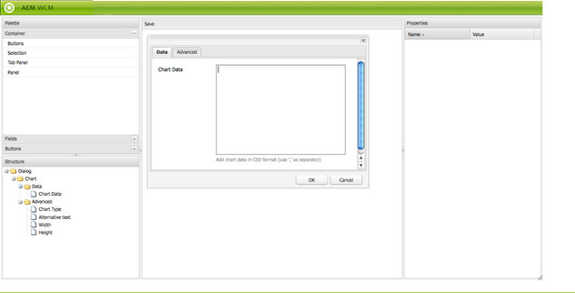

# 对话框编辑器{#dialog-editor}

对话框编辑器提供了一个图形界面，用于轻松创建和编辑对话框和基架。

要查看其工作方式，请转到CRXDE Lite，打开`/libs/foundation/components/chart`的资源管理器树并双击节点`dialog`：

对话框节点将在&#x200B;**对话框编辑器**&#x200B;中打开：

## 用户界面概述 {#user-interface-overview}

对话框编辑器界面由四个窗格组成：

* 左上角的&#x200B;**调色板**。 此窗格包含可用于构建对话框的小部件，如选项卡面板、文本字段、选择列表和按钮。 单击所需的分隔条可展开面板中的不同类别。
* 左下角的&#x200B;**结构**&#x200B;窗格。 此窗格显示构成对话框定义的节点的层次结构。 通过在CRXDE Lite或CRX Content Explorer中展开对话框节点，您可以看到相同的结构。
* **render**&#x200B;窗格，位于窗口中心。 此窗格显示结构窗格中定义的对话框定义如何作为实际对话框呈现。
* **属性**&#x200B;窗格。 此窗格显示结构窗格中突出显示的节点属性。

### 使用对话框编辑器 {#using-the-dialog-editor}

要构建对话框，用户将面板中的元素拖放到结构窗格中对话框定义层次结构的位置。

完成所需结构后，用户单击渲染窗格顶部的&#x200B;**保存**。

>[!CAUTION]
>
>对话框编辑器用于创建简单对话框。 它可能无法编辑更复杂的对话框定义。 如果对话框编辑器不允许编辑对话框结构，则必须手动创建或编辑对话框定义，或同时创建或编辑对话框定义。 例如，通过使用CRXDE Lite或CRX Content Explorer直接编辑节点结构来实现这一点。

### 创建新对话框 {#creating-a-new-dialog}

要创建对话框，请选择所需的组件，单击&#x200B;**创建……**，然后单击&#x200B;**创建对话框……**。

输入所需的详细信息，然后单击&#x200B;**全部保存** — 现在，您可以双击该对话框，以使用编辑器将其打开。

### 使用基架的对话框编辑器 {#using-the-dialog-editor-for-scaffolds}

基架是包含表单的特殊页面，可以一步完成填写和提交。 这使您可以使用输入的内容快速创建页面。

组成基架的表单由对话框定义来定义，就像普通对话框一样，但它以不同的形式显示在基架页面上。 由于对话框定义用于定义基架，因此可使用对话框编辑器设计基架。 以这种方式使用对话框编辑器时，渲染窗格仍以对话框的形式显示对话框定义，而不是作为基架。
