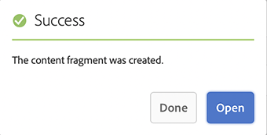
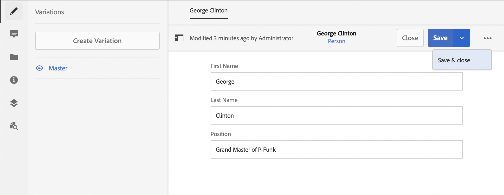

# 创建内容片段Headless快速入门指南 {#creating-content-fragments}

了解如何使用 AEM 的内容片段设计、创建、管理和使用独立于页面的内容，用于 Headless 投放。

## 什么是内容片段？ {#what-are-content-fragments}

[现在您已经创建了资源文件夹](create-assets-folder.md)，可以在其中存储您的内容片段，接下来可以创建片段！

内容片段允许您设计、创建、管理和发布独立于页面的内容。 利用这些功能，可准备内容以用于多个位置和多个渠道。

内容片段包含结构化内容，可以采用 JSON 格式投放。

## 如何创建内容片段 {#how-to-create-a-content-fragment}

内容作者将创建任意数量的内容片段，用于呈现他们创建的内容。 这将是他们在 AEM 中的主要任务。 对于本指南快速入门，我们只需要创建一个。

1. 登录AEM，从主菜单选择&#x200B;**导航> Assets**。
1. 导航到您之前创建的[文件夹。](create-assets-folder.md)
1. 单击&#x200B;**创建>内容片段**。
1. 内容片段的创建以两步向导的方式呈现。 首先选择要使用哪种模型来创建内容片段，然后单击&#x200B;**下一步**。
   * 可用的模型取决于&#x200B;[**您为资源文件夹定义的云配置**](create-assets-folder.md)，您将在该文件夹中创建内容片段。
   * 如果您收到消息 `We could not find any models`，请检查资源文件夹的配置。

   
1. 根据需要提供&#x200B;**标题**、**描述**&#x200B;和&#x200B;**标记**，然后单击&#x200B;**创建**。

   
1. 在确认窗口中单击&#x200B;**打开**。

   
1. 在内容片段编辑器中提供内容片段的详细信息。

   
1. 单击&#x200B;**保存**&#x200B;或&#x200B;**保存并关闭**。

内容片段可以引用其他内容片段，在需要时允许嵌套内容结构。

内容片段还可以引用 AEM 中的其他资源。 [这些资源需要存储在 AEM 中](/help/assets/manage-assets.md)，然后才能创建引用内容片段。

## 后续步骤 {#next-steps}

现在您已经创建了内容片段，接下来可以转到快速入门指南的最后一个部分并[创建 API 请求来访问和提供内容片段。](create-api-request.md)

>[!TIP]
>
>有关管理内容片段的完整详细信息，请参阅[内容片段文档](/help/assets/content-fragments/content-fragments.md)
