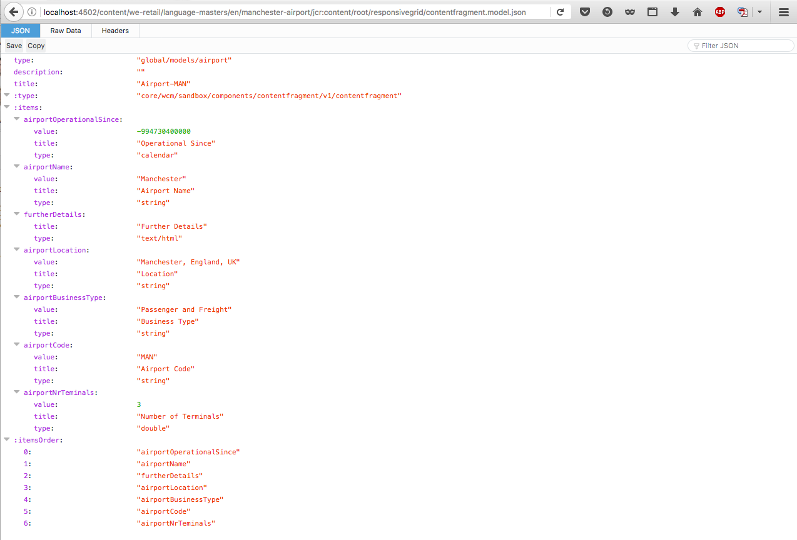

# 内容服务的 JSON 导出器{#json-exporter-for-content-services}

AEM 内容服务旨在概括 AEM 中/来自 AEM 的内容的描述和投放，而不只是关注网页。

它们使用可供任何客户使用的标准化方法，将内容投放到非传统 AEM 网页的渠道。这些渠道可以包括：

* [单页面应用程序](spa-walkthrough.md)
* 本机移动设备应用程序
* AEM 外部的其他渠道和接触点

对于使用结构化内容的内容片段，可以使用JSON导出器以JSON数据模型格式交付任何AEM页面的内容，从而提供内容服务。 然后，此方法便可由您自己的应用程序使用。

>[!NOTE]
>
>此处描述的功能适用于自[版本1.1.0的核心组件](https://experienceleague.adobe.com/docs/experience-manager-core-components/using/introduction.html?lang=zh-hans)以来的所有核心组件。

## 包含内容片段核心组件的JSON导出器 {#json-exporter-with-content-fragment-core-components}

使用AEM JSON导出器，您可以以JSON数据模型格式交付任何AEM页面的内容。 然后，此方法便可由您自己的应用程序使用。

在AEM中，使用选择器`model`和`.json`扩展实现投放。

`.model.json`

1. 例如，URL，例如：

   ```shell
   http://localhost:4502/content/we-retail/language-masters/en.model.json
   ```

1. 提供如下内容：

   

或者，您可以通过专门定向结构化内容片段来投放其内容。

使用片段的整个路径（通过`jcr:content`）；例如，使用后缀，如。

`.../jcr:content/root/responsivegrid/contentfragment.model.json`

您的页面可以包含单个内容片段，也可以包含多种类型的多个组件。 您还可以使用列表组件等机制来自动搜索相关内容。

* 例如，URL，例如：

  ```shell
  http://localhost:4502/content/we-retail/language-masters/en/manchester-airport/jcr:content/root/responsivegrid/contentfragment.model.json
  ```

* 提供如下内容：

  

  >[!NOTE]
  >
  >您可以[调整您自己的组件](/help/sites-developing/json-exporter-components.md)以访问和使用此数据。

  >[!NOTE]
  >
  >虽然不是标准实施，但支持[多个选择器，](json-exporter-components.md#multiple-selectors)但`model`必须是第一个选择器。

### 更多信息 {#further-information}

另请参阅：

* Assets HTTP API

   * [Assets HTTP API](/help/assets/mac-api-assets.md)

* Sling模型：

   * [Sling模型 — 将模型类与自130](https://sling.apache.org/documentation/bundles/models.html#associating-a-model-class-with-a-resource-type-since-130)以来的资源类型相关联

* 带有JSON的AEM：

   * [获取JSON格式的页面信息](/help/sites-developing/pageinfo.md)

## 相关文档 {#related-documentation}

有关更多详细信息，请参阅：

* Assets用户指南[&#128279;](/help/assets/content-fragments/content-fragments.md)中的内容片段主题

* [内容片段模型](/help/assets/content-fragments/content-fragments-models.md)
* [使用内容片段创作](/help/sites-authoring/content-fragments.md)
* [为组件启用 JSON 导出](/help/sites-developing/json-exporter-components.md)

* [核心组件](https://experienceleague.adobe.com/docs/experience-manager-core-components/using/introduction.html?lang=zh-hans)和[内容片段组件](https://experienceleague.adobe.com/docs/experience-manager-core-components/using/wcm-components/content-fragment-component.html?lang=zh-Hans)
