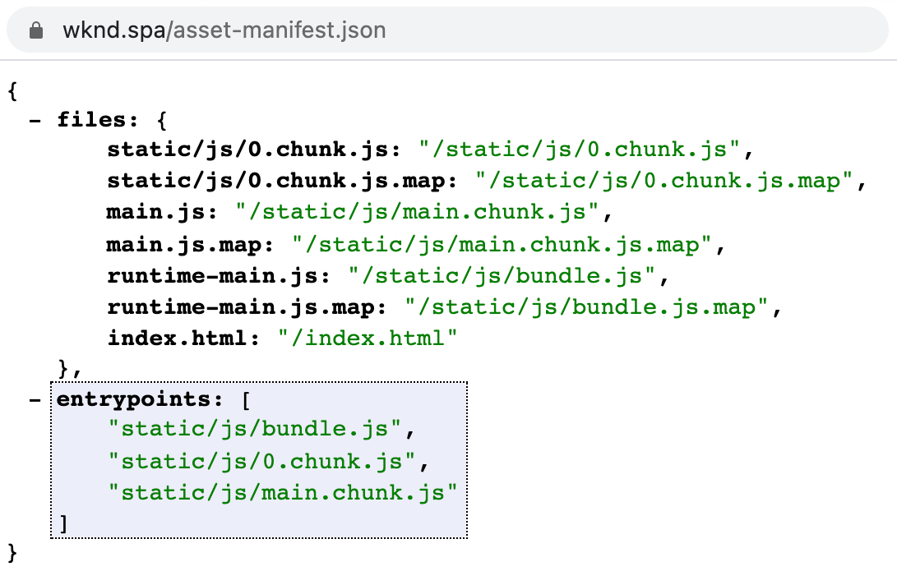

# RemotePage 组件 {#remote-page-component}

在决定外部SPA与AEM之间的集成级别时，通常需要能够在AEM中查看和编辑SPA。 RemotePage组件只是用于此目的的自定义页面组件。

## 概述 {#overview}

RemotePage组件从应用程序生成的`asset-manifest.json`中获取所有必需的资源，并使用此资源在AEM中渲染SPA。

* RemotePage允许您将SPA的脚本和样式表插入AEM Page组件的正文中。
* 通过虚拟前端组件，您可以在AEM SPA Editor中将部分标记为可编辑。
* 可以将托管在其他域上的SPA一起设置为在AEM中可编辑。

有关AEM中可编辑的外部SPA的更多详细信息，请参阅文章[在AEM中编辑外部SPA](spa-edit-external.md)。

{{ue-over-spa}}

## 要求 {#requirements}

* 在开发中启用CORS
* 在页面属性中配置远程URL
* 在AEM中渲染SPA
* Web应用程序必须使用类似于以下内容的捆绑器资产清单，并在域根目录下公开asset-manifest.json文件，该文件在入口点属性中列出要加载的所有CSS和JS文件：
  * https://github.com/shellscape/webpack-manifest-plugin
  * https://github.com/webdeveric/webpack-assets-manifest
  * https://github.com/mugi-uno/parcel-plugin-bundle-manifest

  

* 应用程序必须能够在body元素下的`

`中初始化。 如果应用程序需要不同的标记才能实例化，则必须在具有`sling:resourceSuperType="spa-project-core/components/remotepage`的代理组件的HTL脚本中相应地调整此标记。

## 限制 {#limitations}

* RemotePage组件希望该实施提供与此处找到的[类似的资产清单。](https://github.com/shellscape/webpack-manifest-plugin) 但是，RemotePage组件仅经过测试可用于React框架（和通过remote-page-next组件的Next.js），因此不支持从其他框架（如Angular）远程加载应用程序。
* 在AEM中进行远程呈现时，在应用程序的根HTML文件中定义的内部CSS和根DOM节点上的内联CSS将不可用。

## 技术详细信息 {#technical-details}

与AEM SPA项目的其余部分一样，RemotePage组件是开源的。 有关RemotePage组件的完整技术详细信息，[请参阅GitHub存储库。](https://github.com/adobe/aem-spa-project-core/tree/master/ui.apps/src/main/content/jcr_root/apps/spa-project-core/components/remotepage)
