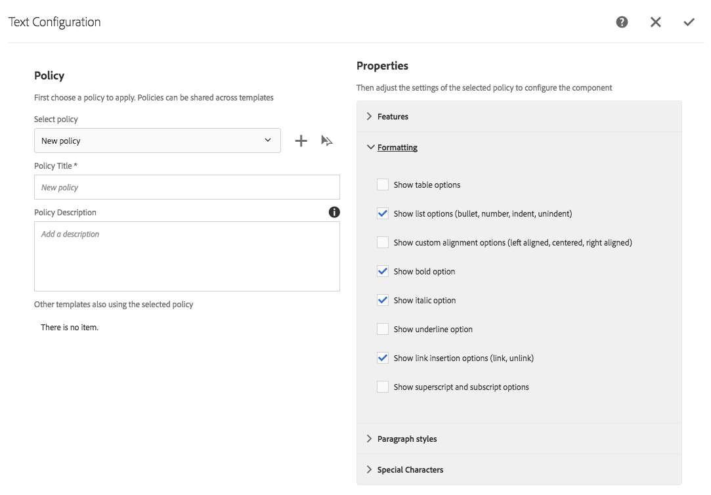

# 在We.Retail中尝试可编辑模板{#trying-out-editable-templates-in-we-retail}

使用可编辑模板，创建和维护模板不再只是开发人员的任务。 高级用户（称为模板作者）现在可以创建模板。 开发人员仍需要设置环境、创建客户端库和创建要使用的组件，但是，在这些基础知识到位后，模板作者就可以灵活地创建和配置模板，而无需开发项目。

We.Retail中的所有页面都基于可编辑的模板，允许非开发人员调整和自定义模板。

## 正在尝试 {#trying-it-out}

1. 编辑语言主分支的设备页面。

   http://localhost:4502/editor.html/content/we-retail/language-masters/en/equipment.html

1. 模式选择器不再提供设计模式。 We.Retail的所有页面都基于可编辑模板，要改变可编辑模板的设计，必须在模板编辑器中编辑这些页面。
1. 从&#x200B;**页面信息**&#x200B;菜单中选择&#x200B;**编辑模板**。
1. 您正在编辑主页模板。

   利用页面的结构模式，可修改模板的结构。 例如，这包括布局容器中允许的组件。

   

1. 配置布局容器的策略以定义容器中允许哪些组件。

   策略相当于设计配置。

   

1. 在布局容器的“设计”对话框中，可以

   * 选择现有策略或为容器创建策略
   * 选择容器中允许的组件
   * 定义将资产拖到容器时要放置的默认组件

   

1. 返回模板编辑器，您可以在布局容器中编辑文本组件的策略。

   这允许您：

   * 选择现有策略或为容器创建策略
   * 定义在使用此组件时可供页面作者使用的功能，例如

      * 允许的粘贴源
      * 格式化选项
      * 允许的段落样式
      * 允许的特殊字符

   许多基于核心组件的组件允许通过可编辑的模板在组件级别配置选项，从而无需由开发人员进行自定义。

   

1. 返回模板编辑器，您可以使用模式选择器更改为&#x200B;**初始内容**&#x200B;模式以定义页面上所需的内容。

   **布局**&#x200B;模式可在普通页面上使用，以定义模板的布局。

## 更多信息 {#more-information}

有关详细信息，请参阅创作文档[创建页面模板](/help/sites-authoring/templates.md)或开发人员文档页面[模板 — 可编辑](/help/sites-developing/page-templates-editable.md)，了解有关可编辑模板的完整技术详细信息。

您可能还希望调查[核心组件](/help/sites-developing/we-retail-core-components.md)。 有关核心组件的功能概述，请参阅创作文档[核心组件](https://experienceleague.adobe.com/docs/experience-manager-core-components/using/introduction.html?lang=zh-hans)；有关技术概述，请参阅开发人员文档[开发核心组件](https://helpx.adobe.com/cn/experience-manager/core-components/using/developing.html)。
