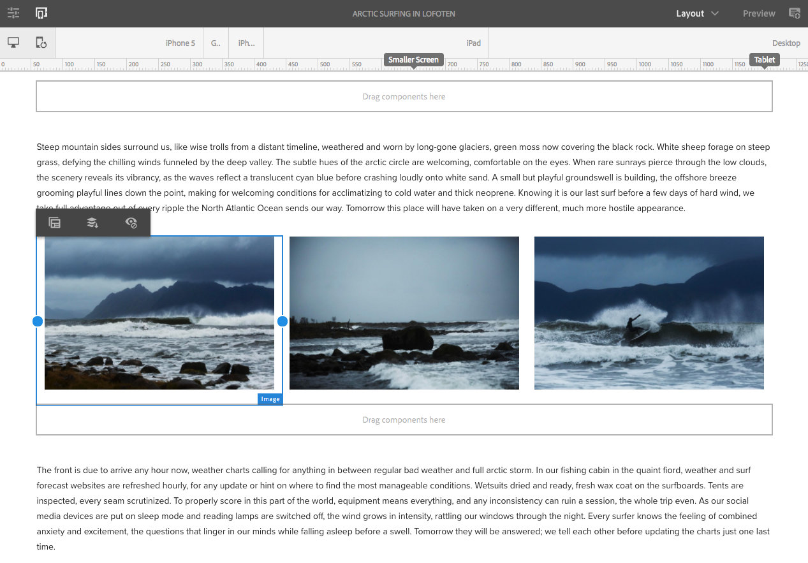
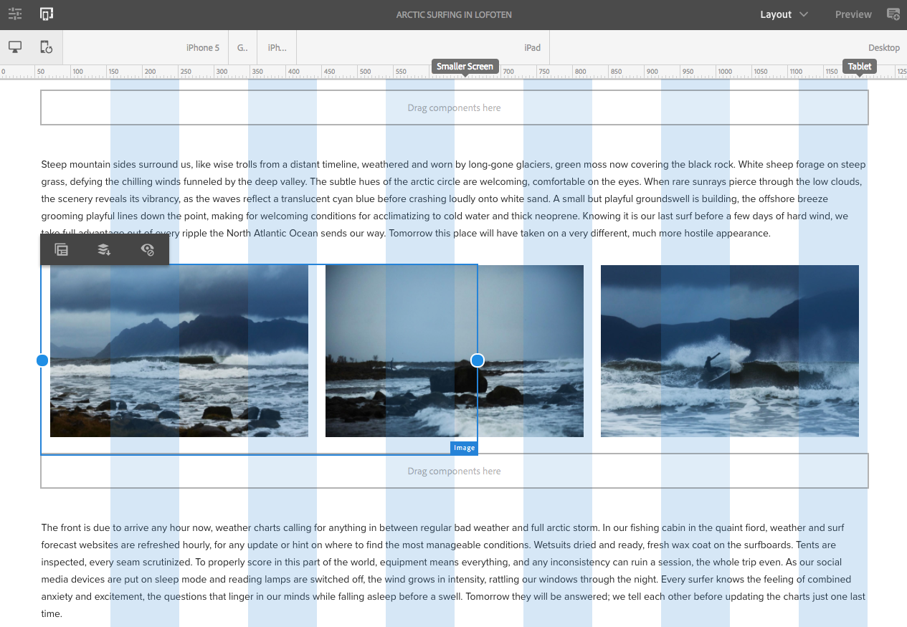

# 在 We.Retail 中试用响应式布局{#trying-out-responsive-layout-in-we-retail}

所有We.Retail页面都使用布局容器组件来实施响应式设计。 布局容器提供了一个段落系统，允许您在响应式网格内放置组件。 此网格可以根据设备/窗口大小和格式重新安排布局。 该组件与页面编辑器中的&#x200B;**布局**&#x200B;模式结合使用，允许您创建和编辑依赖于设备的响应式布局。

## 正在尝试 {#trying-it-out}

1. 在语言母版分支的体验部分中编辑“北极冲浪”页面。

   http://localhost:4502/editor.html/content/we-retail/language-masters/en/experience/arctic-surfing-in-lofoten.html

1. 切换到&#x200B;**预览**&#x200B;以查看呈现给网站访客的页面。 向下滚动到文章&#x200B;*Aloha spirits in Norther Norway*&#x200B;的内容。

   

1. 调整浏览器窗口大小并观察布局如何动态适应大小调整。

   

1. 切换到布局模式。 模拟器工具栏会自动显示，允许您按目标设备规划布局。

   选择某个组件时，会在“编辑”菜单中显示浮动和隐藏选项，以及组件的调整大小手柄。

   

1. 抓住并拖动组件的调整大小手柄会自动显示布局网格，以帮助您调整大小。

   

## 更多信息 {#further-information}

有关详细信息，请参阅创作文档[响应式布局](/help/sites-authoring/responsive-layout.md)或管理员文档[配置布局容器和布局模式](/help/sites-administering/configuring-responsive-layout.md)以了解完整的技术详细信息。
