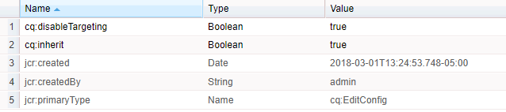

# 扩展工作流功能{#extending-workflow-functionality}

本主题介绍如何为工作流开发自定义步骤组件，以及如何以编程方式与工作流交互。

创建自定义工作流步骤涉及以下活动：

* 开发工作流步骤组件。
* 将步骤功能实现为 OSGi 服务或 ECMA 脚本。

您还可以 [通过程序和脚本](/help/sites-developing/workflows-program-interaction.md)与工作流进行交互。

## 工作流步骤组件 - 基础知识 {#workflow-step-components-the-basics}

工作流步骤组件定义创建工作流模型时步骤的外观和行为：

* 工作流助手中的类别和步骤名称。
* 工作流模型中步骤的外观。
* 用于配置组件属性的编辑对话框。
* 运行时执行的服务或脚本。

与[所有组件](/help/sites-developing/components.md)一样，工作流步骤组件继承自为`sling:resourceSuperType`属性指定的组件。 下图显示构成所有工作流步骤组件基础的`cq:component`节点的层次结构。 该图还包含&#x200B;**进程步骤**、**参与者步骤**&#x200B;和&#x200B;**动态参与者步骤**&#x200B;组件，因为这些组件是开发自定义步骤组件最常见（也是最基本）的起点。


>[!CAUTION]
>
>您&#x200B;***必须***&#x200B;不更改`/libs`路径中的任何内容。
>
>这是因为下次升级实例时`/libs`的内容会被覆盖（在应用修补程序或功能包时很可能会被覆盖）。
>
>建议用于配置和其他更改的方法是：
>
>1. 重新创建所需项（即，它存在于`/apps`下的`/libs`中）
>2. 在`/apps`中进行任何更改

`/libs/cq/workflow/components/model/step`组件是&#x200B;**进程步骤**、**参与者步骤**&#x200B;和&#x200B;**动态参与者步骤**&#x200B;的最近共同祖先，它们都继承以下项：

* `step.jsp`

  将`step.jsp`脚本添加到模型时，会呈现步骤组件的标题。

  

* [cq：dialog](/help/sites-developing/developing-components.md#creating-and-configuring-a-dialog)

  包含以下选项卡的对话框：

   * **常用**：用于编辑标题和描述。
   * **高级**：用于编辑电子邮件通知属性。

   

  >[!NOTE]
  >
  >当步骤组件的“编辑”对话框的选项卡与此默认外观不匹配时，步骤组件已定义了脚本、节点属性或对话框选项卡，这些选项卡将覆盖这些继承的选项卡。

### ECMA脚本 {#ecma-scripts}

以下对象在ECMA脚本中可用（取决于步骤类型）：

* [工作项](https://developer.adobe.com/experience-manager/reference-materials/6-5-lts/javadoc/com/day/cq/workflow/exec/WorkItem.html)工作项
* [工作流会话](https://developer.adobe.com/experience-manager/reference-materials/6-5-lts/javadoc/com/day/cq/workflow/WorkflowSession.html)工作流会话
* [工作流程数据](https://developer.adobe.com/experience-manager/reference-materials/6-5-lts/javadoc/com/day/cq/workflow/exec/WorkflowData.html) 工作流程数据
* `args`：具有进程参数的数组。

* `sling`：访问其他osgi服务。
* `jcrSession`

### 元数据映射 {#metadatamaps}

您可以使用工作流元数据来保留工作流生存期内所需的信息。 工作流步骤的一个常见要求是保留数据以供将来在工作流中使用，或检索保留的数据。

有三种类型的 MetaDataMap 对象 - for `Workflow`和 `WorkflowData` `WorkItem` 对象。 它们都具有相同的预期用途 — 存储元数据。

工作项有自己的MetaDataMap，只能在该工作项（例如，步骤）运行时使用。

在整个工作流中共享`Workflow`和`WorkflowData`元数据库。 对于这些情况，建议仅使用`WorkflowData`元数据映射。

## 创建自定义工作流步骤组件 {#creating-custom-workflow-step-components}

工作流步骤组件可以[以与任何其他组件](/help/sites-developing/components.md)相同的方式创建。

要从（现有）基本步骤组件之一继承，请将以下属性添加到`cq:Component`节点：

* 名称：`sling:resourceSuperType`
* 类型：`String`
* 值：解析为基本组件的以下路径之一：

   * `cq/workflow/components/model/process`
   * `cq/workflow/components/model/participant`
   * `cq/workflow/components/model/dynamic_participant`

### 指定步骤实例的默认标题和说明 {#specifying-the-default-title-and-description-for-step-instances}

使用以下过程为&#x200B;**常用**&#x200B;选项卡上的&#x200B;**标题**&#x200B;和&#x200B;**描述**&#x200B;字段指定默认值。

>[!NOTE]
>
>同时满足以下两个要求时，字段值将显示在步骤实例上：
>
>* 步骤的编辑对话框将标题和说明存储在以下位置： >
>* `./jcr:title`
>* `./jcr:description`个位置
>
>  当编辑对话框使用组件实现的“通用”选项卡时， `/libs/cq/flow/components/step/step` 满足此要求。
>
>* 步骤组件或组件的祖先不会重写 `step.jsp` 组件实现的 `/libs/cq/flow/components/step/step` 脚本。

1. 在`cq:Component`节点下，添加以下节点：

   * 名称：`cq:editConfig`
   * 类型：`cq:EditConfig`

   >[!NOTE]
   >
   >有关cq：editConfig节点的详细信息，请参阅[配置组件的编辑行为](/help/sites-developing/developing-components.md#configuring-the-edit-behavior)。

1. 在`cq:EditConfig`节点下方，添加以下节点：

   * 名称：`cq:formParameters`
   * 类型：`nt:unstructured`

1. 将以下名称的属性添加到`String` `cq:formParameters`节点：

   * `jcr:title`：该值用于&#x200B;**填充“**&#x200B;常用&#x200B;**”选项卡的“标题**”字段。
   * `jcr:description`：该值将&#x200B;**填充“**&#x200B;常用&#x200B;**”选项卡的“描述**”字段。

### 在工作流元数据中保存属性值 {#saving-property-values-in-workflow-metadata}

>[!NOTE]
>
>请参阅 [持久保存和访问数据](#persisting-and-accessing-data)。 具体而言，有关在运行时访问属性值的信息，请参阅 [在运行时](#accessing-dialog-property-values-at-runtime)访问对话框属性值。

项的 `cq:Widget` name 属性指定存储小部件值的 JCR 节点。 当工作流步骤组件对话框中的小组件将值存储在节点下方 `./metaData` 时，该值将添加到工作流 `MetaDataMap`中。

例如，对话框中的文本字段是 `cq:Widget` 具有以下属性的节点：

| 名称 | 类型 | 价值 |
|---|---|---|
| `xtype` | `String` | `textarea` |
| `name` | `String` | `./metaData/subject` |
| `fieldLabel` | `String` | `Email Subject` |

在此文本字段中指定的值已添加到工作流实例的` [MetaDataMap](#metadatamaps)`对象，并与`subject`键关联。

>[!NOTE]
>
>当键为`PROCESS_ARGS`时，通过`args`变量可在ECMA脚本实施中随时使用该值。 在这种情况下，name属性的值为`./metaData/PROCESS_ARGS.`

### 覆盖步骤实施 {#overriding-the-step-implementation}

通过每个基本步骤组件，工作流模型开发人员可在设计时配置以下关键功能：

* 流程步骤：要在运行时执行的服务或ECMA脚本。
* 参与者步骤：为已生成的工作项分配了用户的标识。
* 动态参与者步骤：选择已分配工作项的用户ID的服务或ECMA脚本。

要集中特定工作流场景中使用的组件，请在设计中配置关键功能，并移除模型开发人员更改该组件的功能。

1. 在cq：component节点下，添加以下节点：

   * 名称：`cq:editConfig`
   * 类型：`cq:EditConfig`

   有关cq：editConfig节点的更多信息，请参阅[配置组件的编辑行为](/help/sites-developing/developing-components.md#configuring-the-edit-behavior)。

1. 在cq：EditConfig节点下，添加以下节点：

   * 名称：`cq:formParameters`
   * 类型：`nt:unstructured`

1. 将`String`属性添加到`cq:formParameters`节点。 组件超类型确定属性的名称：

   * 处理步骤： `PROCESS`
   * 参与者步骤： `PARTICIPANT`
   * 动态参与者步骤： `DYNAMIC_PARTICIPANT`

1. 指定属性的值：

   * `PROCESS`：实现步骤行为的服务的 ECMA 脚本或 PID 的路径。
   * `PARTICIPANT`：已分配工作项的用户的ID。
   * `DYNAMIC_PARTICIPANT`：ECMA脚本的路径或选择用户以分配工作项的服务的PID。

1. 若要删除模型开发人员更改属性值的功能，请覆盖组件超类型的对话框。

### 将Forms和对话框添加到参与者步骤 {#adding-forms-and-dialogs-to-participant-steps}

自定义您的参与者步骤组件以提供在[表单参与者步骤](/help/sites-developing/workflows-step-ref.md#form-participant-step)和[对话框参与者步骤](/help/sites-developing/workflows-step-ref.md#dialog-participant-step)组件中找到的功能：

* 当用户打开生成的工作项时，向其显示表单。
* 在用户完成生成的工作项时，向其显示自定义对话框。

在新组件上执行以下过程（请参阅[创建自定义工作流步骤组件](#creating-custom-workflow-step-components)）：

1. 在`cq:Component`节点下方，添加以下节点：

   * 名称：`cq:editConfig`
   * 类型：`cq:EditConfig`

   有关cq：editConfig节点的更多信息，请参阅[配置组件的编辑行为](/help/sites-developing/components-basics.md#edit-behavior)。

1. 在cq：EditConfig节点下，添加以下节点：

   * 名称：`cq:formParameters`
   * 类型：`nt:unstructured`

1. 要在用户打开工作项时显示表单，请将以下属性添加到`cq:formParameters`节点：

   * 名称：`FORM_PATH`
   * 类型：`String`
   * 值：解析为表单的路径

1. 若要在用户完成工作项时显示自定义对话框，请将以下属性添加到 `cq:formParameters` 节点

   * 名称：`DIALOG_PATH`
   * 类型：`String`
   * 值：解析为对话框的路径

### 配置工作流步骤运行时行为 {#configuring-the-workflow-step-runtime-behavior}

在`cq:Component`节点下方，添加一个`cq:EditConfig`节点。 在下方添加`nt:unstructured`节点（必须命名为`cq:formParameters`），并向该节点添加以下属性：

* 名称：`PROCESS_AUTO_ADVANCE`

   * 类型：`Boolean`
   * 价值：

      * 当设置为 `true` 工作流时，将运行该步骤并继续 - 这是默认值，也建议这样做
      * 时 `false`，工作流将运行并停止;这需要额外的处理，因此 `true` 建议这样做

* 名称：`DO_NOTIFY`

   * 类型：`Boolean`
   * 值：指示是否应为用户参与步骤发送电子邮件通知（并假定邮件服务器配置正确）

## 持久保存和访问数据 {#persisting-and-accessing-data}

### 为后续工作流步骤保留数据 {#persisting-data-for-subsequent-workflow-steps}

您可以使用工作流元数据来保存工作流生存期内以及步骤之间所需的信息。 工作流步骤的一个常见要求是保留数据以供将来使用，或者从前面的步骤中检索持久化的数据。

工作流元数据存储在[`MetaDataMap`](#metadatamaps)对象中。 Java API提供了[`Workflow.getWorkflowData`](https://developer.adobe.com/experience-manager/reference-materials/6-5-lts/javadoc/com/adobe/granite/workflow/exec/Workflow.html)方法以返回提供适当`MetaDataMap`对象的[`WorkflowData`](https://developer.adobe.com/experience-manager/reference-materials/6-5-lts/javadoc/com/adobe/granite/workflow/exec/WorkflowData.html)对象。 此`WorkflowData` `MetaDataMap`对象可用于步骤组件的OSGi服务或ECMA脚本。

#### Java {#java}

`WorkflowProcess`实现的execute方法传递给`WorkItem`对象。 使用此对象获取当前工作流实例的`WorkflowData`对象。 以下示例将一个项目添加到工作流`MetaDataMap`对象，然后记录每个项目。 （“mykey”、“我的步骤值”）项目可用于工作流中的后续步骤。

```java
public void execute(WorkItem item, WorkflowSession session, MetaDataMap args) throws WorkflowException {

    MetaDataMap wfd = item.getWorkflow().getWorkflowData().getMetaDataMap();

    wfd.put("mykey", "My Step Value");

    Set<String> keyset = wfd.keySet();
    Iterator<String> i = keyset.iterator();
    while (i.hasNext()){
     Object key = i.next();
     log.info("The workflow medata includes key {} and value {}",key.toString(),wfd.get(key).toString());
    }
}
```

#### ECMA 脚本 {#ecma-script}

`graniteWorkItem`变量是当前`WorkItem` Java对象的ECMA脚本表示形式。 因此，您可以使用`graniteWorkItem`变量获取工作流元数据。 以下ECMA脚本可用于实施&#x200B;**进程步骤**&#x200B;以将项添加到工作流`MetaDataMap`对象，然后记录每个项。 这些项目随后可用于工作流中的后续步骤。

>[!NOTE]
>
>步骤脚本立即可用的`metaData`变量是步骤的元数据。 步骤元数据与工作流元数据不同。

```
var currentDateInMillis = new Date().getTime();

graniteWorkItem.getWorkflowData().getMetaDataMap().put("hardcodedKey","theKey");

graniteWorkItem.getWorkflowData().getMetaDataMap().put("currentDateInMillisKey",currentDateInMillis);

var iterator = graniteWorkItem.getWorkflowData().getMetaDataMap().keySet().iterator();
while (iterator.hasNext()){
    var key = iterator.next();
    log.info("Workflow metadata key, value = " + key.toString() + ", " + graniteWorkItem.getWorkflowData().getMetaDataMap().get(key));
}
```

### 在运行时访问对话框属性值 {#accessing-dialog-property-values-at-runtime}

工作流实例的`MetaDataMap`对象对于在工作流整个生命周期中存储和检索数据非常有用。 对于工作流步骤组件实现，`MetaDataMap`对于在运行时检索组件属性值特别有用。

>[!NOTE]
>
>有关配置组件对话框以将属性存储为工作流元数据的信息，请参阅[将属性值保存在工作流元数据中](#saving-property-values-in-workflow-metadata)。

工作流`MetaDataMap`可用于Java和ECMA脚本进程实现：

* 在WorkflowProcess接口的Java实现中，`args`参数是工作流的`MetaDataMap`对象。

* 在ECMA脚本实现中，该值可以使用`args`和`metadata`变量。

### 示例：检索流程步骤组件的参数 {#example-retrieving-the-arguments-of-the-process-step-component}

**进程步骤**&#x200B;组件的编辑对话框包含&#x200B;**参数**&#x200B;属性。 **参数**&#x200B;属性的值存储在工作流元数据中，并与`PROCESS_ARGS`键关联。

在下图中，**参数**&#x200B;属性的值为`argument1, argument2`：


#### Java {#java-1}

以下 Java 代码是 `execute` 实现的方法 `WorkflowProcess` 。 该方法将值记录在与`PROCESS_ARGS`键关联的值`args` `MetaDataMap`中。

```java
public void execute(WorkItem item, WorkflowSession session, MetaDataMap args) throws WorkflowException {
     if (args.containsKey("PROCESS_ARGS")){
      log.info("workflow metadata for key PROCESS_ARGS and value {}",args.get("PROCESS_ARGS","string").toString());
     }
    }
```

执行使用此 Java 实现的进程步骤时，日志包含以下条目：

```xml
16.02.2018 12:07:39.566 *INFO* [JobHandler: /var/workflow/instances/server0/2018-02-16/model_855140139900189:/content/we-retail/de] com.adobe.example.workflow.impl.process.LogArguments workflow metadata for key PROCESS_ARGS and value argument1, argument2
```

#### ECMA 脚本 {#ecma-script-1}

以下ECMA脚本用作&#x200B;**处理步骤**&#x200B;的处理。 它将记录参数数和参数值：

```
var iterator = graniteWorkItem.getWorkflowData().getMetaDataMap().keySet().iterator();
while (iterator.hasNext()){
    var key = iterator.next();
    log.info("Workflow metadata key, value = " + key.toString() + ", " + graniteWorkItem.getWorkflowData().getMetaDataMap().get(key));
}
log.info("hardcodedKey "+ graniteWorkItem.getWorkflowData().getMetaDataMap().get("hardcodedKey"));
log.info("currentDateInMillisKey "+ graniteWorkItem.getWorkflowData().getMetaDataMap().get("currentDateInMillisKey"));
```

>[!NOTE]
>
>本节介绍如何使用流程步骤的参数。 该信息也适用于动态参与者选择器。

>[!NOTE]
>有关在工作流元数据中存储组件属性的另一个示例，请参阅示例：创建记录器工作流步骤。 本示例使用了一个将元数据值与除PROCESS_ARGS之外的键关联的对话框。

### 脚本和进程参数 {#scripts-and-process-arguments}

在&#x200B;**处理步骤**&#x200B;组件的脚本中，参数可以通过`args`对象使用。

创建自定义步骤组件时，对象`metaData`在脚本中可用。 此对象仅限于单个字符串参数。

## 开发流程步骤实施 {#developing-process-step-implementations}

当在工作流进程中启动流程步骤时，这些步骤将向OSGi服务发送请求或执行ECMA脚本。 开发服务或ECMA脚本，以执行工作流所需的操作。

>[!NOTE]
>
>有关将流程步骤组件与服务或脚本关联的信息，请参阅[流程步骤](/help/sites-developing/workflows-step-ref.md#process-step)或[覆盖步骤实施](#overriding-the-step-implementation)。

### 使用Java类实施流程步骤 {#implementing-a-process-step-with-a-java-class}

将流程步骤定义为OSGI服务组件（Java包）：

1. 创建该捆绑包并将其部署到OSGI容器中。 请参阅有关使用[CRXDE Lite](/help/sites-developing/developing-with-crxde-lite.md)或[Eclipse](/help/sites-developing/howto-projects-eclipse.md)创建捆绑包的文档。

   >[!NOTE]
   >
   >OSGI组件需要使用其`execute()`方法实现`WorkflowProcess`接口。 请参阅下面的示例代码。

   >[!NOTE]
   >
   >需要将包名称添加到 `<*Private-Package*>` 配置部分 `maven-bundle-plugin` 。

1. 添加SCR属性`process.label`并根据需要设置值。 这是使用通用&#x200B;**进程步骤**&#x200B;组件时列出的进程步骤的名称。 请参阅以下示例。
1. 在&#x200B;**模型**&#x200B;编辑器中，使用通用&#x200B;**处理步骤**&#x200B;组件将处理步骤添加到工作流。
1. 在（**流程步骤**&#x200B;的）编辑对话框中，转到&#x200B;**流程**&#x200B;选项卡，然后选择您的流程实现。
1. 如果在代码中使用参数，请设置&#x200B;**进程参数**。 例如：false。
1. 保存对步骤和工作流模型（模型编辑器左上角）所做的更改。

Java 方法（分别是实现可执行 Java 方法的类）注册为 OSGI 服务，使您能够在运行时随时添加方法。

当有效负载为页面时，以下 OSGI 组件将属性 `approved` 添加到页面内容节点：

```java
package com.adobe.example.workflow.impl.process;

import com.adobe.granite.workflow.WorkflowException;
import com.adobe.granite.workflow.WorkflowSession;
import com.adobe.granite.workflow.exec.WorkItem;
import com.adobe.granite.workflow.exec.WorkflowData;
import com.adobe.granite.workflow.exec.WorkflowProcess;
import com.adobe.granite.workflow.metadata.MetaDataMap;

import org.apache.felix.scr.annotations.Component;
import org.apache.felix.scr.annotations.Property;
import org.apache.felix.scr.annotations.Service;

import org.osgi.framework.Constants;

import javax.jcr.Node;
import javax.jcr.RepositoryException;
import javax.jcr.Session;

/**
 * Sample workflow process that sets an <code>approve</code> property to the payload based on the process argument value.
 */
@Component
@Service
public class MyProcess implements WorkflowProcess {

 @Property(value = "An example workflow process implementation.")
 static final String DESCRIPTION = Constants.SERVICE_DESCRIPTION;
 @Property(value = "Adobe")
 static final String VENDOR = Constants.SERVICE_VENDOR;
 @Property(value = "My Sample Workflow Process")
 static final String LABEL="process.label";

 private static final String TYPE_JCR_PATH = "JCR_PATH";

 public void execute(WorkItem item, WorkflowSession session, MetaDataMap args) throws WorkflowException {
  WorkflowData workflowData = item.getWorkflowData();
  if (workflowData.getPayloadType().equals(TYPE_JCR_PATH)) {
   String path = workflowData.getPayload().toString() + "/jcr:content";
   try {
    Session jcrSession = session.adaptTo(Session.class);
    Node node = (Node) jcrSession.getItem(path);
    if (node != null) {
     node.setProperty("approved", readArgument(args));
     jcrSession.save();
    }
   } catch (RepositoryException e) {
    throw new WorkflowException(e.getMessage(), e);
   }
  }
 }

 private boolean readArgument(MetaDataMap args) {
  String argument = args.get("PROCESS_ARGS", "false");
  return argument.equalsIgnoreCase("true");
 }
}
```

>[!NOTE]
>
>如果该过程连续失败三次，则会在工作流管理员的收件箱中放置一个项目。

### 使用 ECMAScript {#using-ecmascript}

ECMA 脚本使脚本开发人员能够实现流程步骤。 脚本位于JCR存储库中并从那里执行。

下表列出了可立即可用于处理脚本的变量，这些变量提供对工作流 Java API 对象的访问。

| Java 类 | 脚本变量名称 | 描述 |
|---|---|---|
| `com.adobe.granite.workflow.exec.WorkItem` | `graniteWorkItem` | 当前步骤实例。 |
| `com.adobe.granite.workflow.WorkflowSession` | `graniteWorkflowSession` | 当前步骤实例的工作流会话。 |
| `String[]` （包含进程参数） | `args` | 步骤参数。 |
| `com.adobe.granite.workflow.metadata.MetaDataMap` | `metaData` | 当前步骤实例的元数据。 |
| `org.apache.sling.scripting.core.impl.InternalScriptHelper` | `sling` | 提供对 Sling 运行时环境的访问。 |

以下示例脚本演示如何访问表示工作流有效负载的 JCR 节点。 该 `graniteWorkflowSession` 变量适应于 JCR 会话变量，该变量用于从有效负载路径获取节点。

```
var workflowData = graniteWorkItem.getWorkflowData();
if (workflowData.getPayloadType() == "JCR_PATH") {
    var path = workflowData.getPayload().toString();
    var jcrsession = graniteWorkflowSession.adaptTo(Packages.javax.jcr.Session);
    var node = jcrsession.getNode(path);
    if (node.hasProperty("approved")){
     node.setProperty("approved", args[0] == "true" ? true : false);
     node.save();
 }
}
```

以下脚本检查有效负载是否为图像（`.png`文件），从中创建黑白图像，并将其另存为同级节点。

```
var workflowData = graniteWorkItem.getWorkflowData();
if (workflowData.getPayloadType() == "JCR_PATH") {
    var path = workflowData.getPayload().toString();
    var jcrsession = graniteWorkflowSession.adaptTo(Packages.javax.jcr.Session);
    var node = jcrsession.getRootNode().getNode(path.substring(1));
     if (node.isNodeType("nt:file") && node.getProperty("jcr:content/jcr:mimeType").getString().indexOf("image/") == 0) {
        var is = node.getProperty("jcr:content/jcr:data").getStream();
        var layer = new Packages.com.day.image.Layer(is);
        layer.grayscale();
                var parent = node.getParent();
                var gn = parent.addNode("grey" + node.getName(), "nt:file");
        var content = gn.addNode("jcr:content", "nt:resource");
                content.setProperty("jcr:mimeType","image/png");
                var cal = Packages.java.util.Calendar.getInstance();
                content.setProperty("jcr:lastModified",cal);
                var f = Packages.java.io.File.createTempFile("test",".png");
        var tout = new Packages.java.io.FileOutputStream(f);
        layer.write("image/png", 1.0, tout);
        var fis = new Packages.java.io.FileInputStream(f);
                content.setProperty("jcr:data", fis);
                parent.save();
        tout.close();
        fis.close();
        is.close();
        f.deleteOnExit();
    }
}
```

要使用脚本，请执行以下操作：

1. 创建脚本(例如，使用CRXDE Lite)并将其保存在`//apps/workflow/scripts/`下的存储库中
1. 若要在&#x200B;**进程步骤**&#x200B;编辑对话框中指定用于标识脚本的标题，请将以下属性添加到脚本的`jcr:content`节点：

   | 名称 | 类型 | 价值 |
   |---|---|---|
   | `jcr:mixinTypes` | `Name[]` | `mix:title` |
   | `jcr:title` | `String` | 编辑对话框中显示的名称。 |

1. 编辑&#x200B;**处理步骤**&#x200B;实例，并指定要使用的脚本。

## 开发参与者选择器 {#developing-participant-choosers}

您可以为&#x200B;**动态参与者步骤**&#x200B;组件开发参与者选择器。

在工作流期间启动&#x200B;**动态参与者步骤**&#x200B;组件时，该步骤需要确定生成的工作项可以分配到的参与者。 要执行此操作，请执行以下步骤：

* 向OSGi服务发送请求
* 执行ECMA脚本以选择参与者

您可以开发服务或ECMA脚本，以根据工作流的要求选择参与者。

>[!NOTE]
>
>有关将动态参与者步骤组件与服务或脚本相关联&#x200B;**的信息，请参阅[动态参与者步骤](/help/sites-developing/workflows-step-ref.md#dynamic-participant-step)或[覆盖步骤实现](#persisting-and-accessing-data)。**

### 使用 Java 类开发参与者选择器 {#developing-a-participant-chooser-using-a-java-class}

将参与者步骤定义为OSGI服务组件（Java类）：

1. OSGI组件需要使用其`getParticipant()`方法实现`ParticipantStepChooser`接口。 请参阅下面的示例代码。

   创建该捆绑包并将其部署到OSGI容器中。

1. 添加SCR属性`chooser.label`并根据需要设置值。 这将使用&#x200B;**动态参与者步骤**&#x200B;组件列出参与者选择器的名称。 请参阅示例：

   ```java
   package com.adobe.example.workflow.impl.process;
   
   import com.adobe.granite.workflow.WorkflowException;
   import com.adobe.granite.workflow.WorkflowSession;
   import com.adobe.granite.workflow.exec.ParticipantStepChooser;
   import com.adobe.granite.workflow.exec.WorkItem;
   import com.adobe.granite.workflow.exec.WorkflowData;
   import com.adobe.granite.workflow.metadata.MetaDataMap;
   
   import org.apache.felix.scr.annotations.Component;
   import org.apache.felix.scr.annotations.Property;
   import org.apache.felix.scr.annotations.Service;
   
   import org.osgi.framework.Constants;
   
   /**
    * Sample dynamic participant step that determines the participant based on a path given as argument.
    */
   @Component
   @Service
   
   public class MyDynamicParticipant implements ParticipantStepChooser {
   
    @Property(value = "An example implementation of a dynamic participant chooser.")
    static final String DESCRIPTION = Constants.SERVICE_DESCRIPTION;
       @Property(value = "Adobe")
       static final String VENDOR = Constants.SERVICE_VENDOR;
       @Property(value = "Dynamic Participant Chooser Process")
       static final String LABEL=ParticipantStepChooser.SERVICE_PROPERTY_LABEL;
   
       private static final String TYPE_JCR_PATH = "JCR_PATH";
   
       public String getParticipant(WorkItem workItem, WorkflowSession workflowSession, MetaDataMap args) throws WorkflowException {
           WorkflowData workflowData = workItem.getWorkflowData();
           if (workflowData.getPayloadType().equals(TYPE_JCR_PATH)) {
               String path = workflowData.getPayload().toString();
               String pathFromArgument = args.get("PROCESS_ARGS", String.class);
               if (pathFromArgument != null && path.startsWith(pathFromArgument)) {
                   return "admin";
               }
           }
           return "administrators";
       }
   }
   ```

1. 在&#x200B;**模型**&#x200B;编辑器中，使用通用&#x200B;**动态参与者步骤**&#x200B;组件将动态参与者步骤添加到工作流。
1. 在编辑对话框中，选择&#x200B;**参与者选择器**&#x200B;选项卡，然后选择您的选择器实现。
1. 如果在代码中使用参数，请设置&#x200B;**进程参数**。 对于此示例： `/content/we-retail/de`。
1. 保存步骤和工作流模型的更改。

### 使用ECMA脚本开发参与者选择器 {#developing-a-participant-chooser-using-an-ecma-script}

您可以创建一个ECMA脚本，该脚本用于选择分配了&#x200B;**参与者步骤**&#x200B;生成的工作项的用户。 脚本必须包含一个名为`getParticipant`的函数，该函数不需要参数，并返回一个包含用户或组ID的`String`。

脚本位于JCR存储库中，并从此处执行。

下表列出了允许您立即访问脚本中的工作流Java对象的变量。

| Java类 | 脚本变量名称 |
|---|---|
| `com.adobe.granite.workflow.exec.WorkItem` | `graniteWorkItem` |
| `com.adobe.granite.workflow.WorkflowSession` | `graniteWorkflowSession` |
| `String[]` （包含进程参数） | `args` |
| `com.adobe.granite.workflow.metadata.MetaDataMap` | `metaData` |
| `org.apache.sling.scripting.core.impl.InternalScriptHelper` | `sling` |

```
function getParticipant() {
    var workflowData = graniteWorkItem.getWorkflowData();
    if (workflowData.getPayloadType() == "JCR_PATH") {
        var path = workflowData.getPayload().toString();
        if (path.indexOf("/content/we-retail/de") == 0) {
            return "admin";
        } else {
            return "administrators";
        }
    }
}
```

1. 创建脚本（例如，使用 CRXDE Lite）并将其保存在下面的存储库中 `//apps/workflow/scripts`
1. 要在“ **处理步骤** ”编辑对话框中指定标识脚本的标题，请将以下属性添加到 `jcr:content` 脚本的节点：

   | 名称 | 类型 | 价值 |
   |---|---|---|
   | `jcr:mixinTypes` | `Name[]` | `mix:title` |
   | `jcr:title` | `String` | 显示在“编辑”对话框中的名称。 |

1. 编辑[动态参与者步骤](/help/sites-developing/workflows-step-ref.md#dynamic-participant-step)实例，并指定要使用的脚本。

## 处理工作流包 {#handling-workflow-packages}

可以将[工作流包](/help/sites-authoring/workflows-applying.md#specifying-workflow-details-in-the-create-workflow-wizard)传递到工作流进行处理。 工作流包包含对资源（如页面和资产）的引用。

>[!NOTE]
>
>以下工作流流程步骤接受工作流包以进行批量页面激活：
>
>* [`com.day.cq.wcm.workflow.process.ActivatePageProcess`](https://developer.adobe.com/experience-manager/reference-materials/6-5-lts/javadoc/com/day/cq/wcm/workflow/process/ActivatePageProcess.html)
>* [`com.day.cq.wcm.workflow.process.DeactivatePageProcess`](https://developer.adobe.com/experience-manager/reference-materials/6-5-lts/javadoc/com/day/cq/wcm/workflow/process/DeactivatePageProcess.html)
>

您可以开发工作流步骤以获取资源包资源并对其进行处理。 `com.day.cq.workflow.collection`包的以下成员提供对工作流包的访问权限：

* `ResourceCollection`：工作流包类。
* `ResourceCollectionUtil`：用于检索ResourceCollection对象。
* `ResourceCollectionManager`：创建和检索收藏集。 实现部署为 OSGi 服务。

以下示例 Java 类演示了如何获取包资源：

```java
package com.adobe.example;

import java.util.ArrayList;
import java.util.List;

import com.day.cq.workflow.WorkflowException;
import com.day.cq.workflow.WorkflowSession;
import com.day.cq.workflow.collection.ResourceCollection;
import com.day.cq.workflow.collection.ResourceCollectionManager;
import com.day.cq.workflow.collection.ResourceCollectionUtil;
import com.day.cq.workflow.exec.WorkItem;
import com.day.cq.workflow.exec.WorkflowData;
import com.day.cq.workflow.exec.WorkflowProcess;
import com.day.cq.workflow.metadata.MetaDataMap;

import org.apache.felix.scr.annotations.Component;
import org.apache.felix.scr.annotations.Property;
import org.apache.felix.scr.annotations.Service;
import org.apache.felix.scr.annotations.Reference;
import org.osgi.framework.Constants;

import org.slf4j.Logger;
import org.slf4j.LoggerFactory;

import javax.jcr.Node;
import javax.jcr.PathNotFoundException;
import javax.jcr.RepositoryException;
import javax.jcr.Session;

@Component
@Service
public class LaunchBulkActivate implements WorkflowProcess {

 private static final Logger log = LoggerFactory.getLogger(LaunchBulkActivate.class);

 @Property(value="Bulk Activate for Launches")
  static final String PROCESS_NAME ="process.label";
 @Property(value="A sample workflow process step to support Launches bulk activation of pages")
 static final String SERVICE_DESCRIPTION = Constants.SERVICE_DESCRIPTION;

 @Reference
 private ResourceCollectionManager rcManager;
public void execute(WorkItem workItem, WorkflowSession workflowSession) throws Exception {
    Session session = workflowSession.getSession();
    WorkflowData data = workItem.getWorkflowData();
    String path = null;
    String type = data.getPayloadType();
    if (type.equals(TYPE_JCR_PATH) && data.getPayload() != null) {
        String payloadData = (String) data.getPayload();
        if (session.itemExists(payloadData)) {
            path = payloadData;
        }
    } else if (data.getPayload() != null && type.equals(TYPE_JCR_UUID)) {
        Node node = session.getNodeByUUID((String) data.getPayload());
        path = node.getPath();
    }

    // CUSTOMIZED CODE IF REQUIRED....

    if (path != null) {
        // check for resource collection
        ResourceCollection rcCollection = ResourceCollectionUtil.getResourceCollection((Node)session.getItem(path), rcManager);
        // get list of paths to replicate (no resource collection: size == 1
        // otherwise size >= 1
        List<String> paths = getPaths(path, rcCollection);
        for (String aPath: paths) {

            // CUSTOMIZED CODE....

        }
    } else {
        log.warn("Cannot process because path is null for this " + "workitem: " + workItem.toString());
    }
}

/**
 * helper
 */
private List<String> getPaths(String path, ResourceCollection rcCollection) {
    List<String> paths = new ArrayList<String>();
    if (rcCollection == null) {
        paths.add(path);
    } else {
        log.debug("ResourceCollection detected " + rcCollection.getPath());
        // this is a resource collection. the collection itself is not
        // replicated. only its members
        try {
            List<Node> members = rcCollection.list(new String[]{"cq:Page", "dam:Asset"});
            for (Node member: members) {
                String mPath = member.getPath();
                paths.add(mPath);
            }
        } catch(RepositoryException re) {
            log.error("Cannot build path list out of the resource collection " + rcCollection.getPath());
        }
    }
    return paths;
}
}
```

## 示例：创建自定义步骤 {#example-creating-a-custom-step}

开始创建自定义步骤的一种简单方法就是从以下位置复制现有步骤：

`/libs/cq/workflow/components/model`

### 创建基本步骤 {#creating-the-basic-step}

1. 在 /apps 下重新创建路径;例如：

   `/apps/cq/workflow/components/model`

   新文件夹的类型 `nt:folder`为：

   ```xml
   - apps
     - cq
       - workflow (nt:folder)
         - components (nt:folder)
           - model (nt:folder)
   ```

   >[!NOTE]
   >
   >此步骤不适用于经典 UI 模型编辑器。

1. 然后将复制的步骤放在您的 /apps 文件夹中;例如，如：

   `/apps/cq/workflow/components/model/myCustomStep`

   这是我们的示例自定义步骤的结果：

   

   >[!CAUTION]
   >
   >因为在标准UI中，卡片上不显示标题而非详细信息，所以不需要使用`details.jsp`，因为它适用于经典UI编辑器。

1. 将以下属性应用于节点：

   `/apps/cq/workflow/components/model/myCustomStep`

   **感兴趣的属性：**

   * `sling:resourceSuperType`

     必须继承自现有步骤。

     在此示例中，我们从`cq/workflow/components/model/step`的基步骤继承，但您可以使用其他超类型，如`participant`、`process`等。

   * `jcr:title`

     在步骤浏览器（工作流模型编辑器的左侧面板）中列出组件时显示的标题。

   * `cq:icon`

     用于为步骤指定[珊瑚图标](https://developer.adobe.com/experience-manager/reference-materials/6-5/coral-ui/coralui3/Coral.Icon.html)。

   * `componentGroup`

     必须是下列之一：

      * 协作工作流
      * DAM 工作流
      * 表单工作流
      * 项目
      * WCM 工作流
      * 工作流

   

1. 您现在可以打开工作流模型进行编辑。 在步骤浏览器中，您可以筛选以查看 **“我的自定义步骤**”：

   

   将&#x200B;**我的自定义步骤**&#x200B;拖到模型上可显示卡：

   

   如果尚未为该步骤定义`cq:icon`，则使用标题的前两个字母呈现默认图标。 例如：

   

#### 定义步骤配置对话框 {#defining-the-step-configure-dialog}

[创建基本步骤](#creating-the-basic-step)后，按如下方式定义步骤&#x200B;**配置**&#x200B;对话框：

1. 按如下方式配置节点`cq:editConfig`上的属性：

   **感兴趣的属性：**

   * `cq:inherit`

     当设置为`true`时，步骤组件将继承您在`sling:resourceSuperType`中指定的步骤的属性。

   * `cq:disableTargeting`

     根据需要设置。

   

1. 按如下方式配置节点`cq:formsParameter`上的属性：

   **感兴趣的属性：**

   * `jcr:title`

     在模型映射的步骤卡和&#x200B;**我的自定义 — 步骤属性**&#x200B;配置对话框的&#x200B;**标题**&#x200B;字段中设置默认标题。

   * 您还可以定义自己的自定义属性。

   

1. 在节点`cq:listeners`上配置属性。

   `cq:listener`节点及其属性允许您在启用了触屏的UI模型编辑器中设置对事件做出反应的事件处理程序；例如，将步骤拖到模型页面上或编辑步骤属性。

   **感兴趣的属性：**

   * `afterMove: REFRESH_PAGE`
   * `afterdelete: CQ.workflow.flow.Step.afterDelete`
   * `afteredit: CQ.workflow.flow.Step.afterEdit`
   * `afterinsert: CQ.workflow.flow.Step.afterInsert`

   此配置对于编辑器的正常运行至关重要。 在大多数情况下，不得更改此配置。

   但是，将`cq:inherit`设置为true（在上面的`cq:editConfig`节点上）允许您继承此配置，而无需将其明确包含在步骤定义中。 如果未实施继承，则您需要添加具有以下属性和值的此节点。

   在此示例中，继承已激活，因此我们可以删除`cq:listeners`节点，并且步骤仍将正常运行。

   

1. 您现在可以将步骤的实例添加到工作流模型中。 当您&#x200B;**配置**&#x200B;该步骤时，您将看到对话框：

    

#### 此示例中使用的示例标记 {#sample-markup-used-in-this-example}

自定义步骤的标记在组件根节点的`.content.xml`中显示。 用于此示例的示例`.content.xml`：

`/apps/cq/workflow/components/model/myCustomStep/.content.xml`

```xml
<?xml version="1.0" encoding="UTF-8"?>
<jcr:root xmlns:sling="https://sling.apache.org/jcr/sling/1.0" xmlns:cq="https://www.day.com/jcr/cq/1.0" xmlns:jcr="https://www.jcp.org/jcr/1.0"
    cq:icon="bell"
    jcr:primaryType="cq:Component"
    jcr:title="My Custom Step"
    sling:resourceSuperType="cq/workflow/components/model/process"
    allowedParents="[*/parsys]"
    componentGroup="Workflow"/>
```

此示例中使用的`_cq_editConfig.xml`示例：

```xml
<?xml version="1.0" encoding="UTF-8"?>
<jcr:root xmlns:cq="https://www.day.com/jcr/cq/1.0" xmlns:jcr="https://www.jcp.org/jcr/1.0" xmlns:nt="https://www.jcp.org/jcr/nt/1.0"
    cq:disableTargeting="{Boolean}true"
    cq:inherit="{Boolean}true"
    jcr:primaryType="cq:EditConfig">
    <cq:formParameters
        jcr:primaryType="nt:unstructured"
        jcr:title="My Custom Step Card"
        SAMPLE_PROPERY="sample value"/>
    <cq:listeners
        jcr:primaryType="cq:EditListenersConfig"
        afterdelete="CQ.workflow.flow.Step.afterDelete"
        afteredit="CQ.workflow.flow.Step.afterEdit"
        afterinsert="CQ.workflow.flow.Step.afterInsert"
        afterMove="REFRESH_PAGE"/>
</jcr:root>
```

此示例中使用的`_cq_dialog/.content.xml`示例：

```xml
<?xml version="1.0" encoding="UTF-8"?>
<jcr:root xmlns:sling="https://sling.apache.org/jcr/sling/1.0" xmlns:cq="https://www.day.com/jcr/cq/1.0" xmlns:jcr="https://www.jcp.org/jcr/1.0" xmlns:nt="https://www.jcp.org/jcr/nt/1.0"
    jcr:primaryType="nt:unstructured"
    jcr:title="My Custom - Step Properties"
    sling:resourceType="cq/gui/components/authoring/dialog">
    <content
        jcr:primaryType="nt:unstructured"
        sling:resourceType="granite/ui/components/coral/foundation/tabs">
        <items jcr:primaryType="nt:unstructured">
            <common
                cq:hideOnEdit="true"
                jcr:primaryType="nt:unstructured"
                jcr:title="Common"
                sling:resourceType="granite/ui/components/coral/foundation/fixedcolumns"/>
            <process
                cq:hideOnEdit="true"
                jcr:primaryType="nt:unstructured"
                jcr:title="Process"
                sling:resourceType="granite/ui/components/coral/foundation/fixedcolumns"/>
            <mycommon
                jcr:primaryType="nt:unstructured"
                jcr:title="Common"
                sling:resourceType="granite/ui/components/coral/foundation/fixedcolumns">
                <items jcr:primaryType="nt:unstructured">
                    <columns
                        jcr:primaryType="nt:unstructured"
                        sling:resourceType="granite/ui/components/coral/foundation/container">
                        <items jcr:primaryType="nt:unstructured">
                            <title
                                jcr:primaryType="nt:unstructured"
                                sling:resourceType="granite/ui/components/coral/foundation/form/textfield"
                                fieldLabel="Title"
                                name="./jcr:title"/>
                            <description
                                jcr:primaryType="nt:unstructured"
                                sling:resourceType="granite/ui/components/coral/foundation/form/textarea"
                                fieldLabel="Description"
                                name="./jcr:description"/>
                        </items>
                    </columns>
                </items>
            </mycommon>
            <advanced
                jcr:primaryType="nt:unstructured"
                jcr:title="Advanced"
                sling:resourceType="granite/ui/components/coral/foundation/fixedcolumns">
                <items jcr:primaryType="nt:unstructured">
                    <columns
                        jcr:primaryType="nt:unstructured"
                        sling:resourceType="granite/ui/components/coral/foundation/container">
                        <items jcr:primaryType="nt:unstructured">
                            <email
                                jcr:primaryType="nt:unstructured"
                                sling:resourceType="granite/ui/components/coral/foundation/form/checkbox"
                                fieldDescription="Notify user via email."
                                fieldLabel="Email"
                                name="./metaData/PROCESS_AUTO_ADVANCE"
                                text="Notify user via email."
                                value="true"/>
                        </items>
                    </columns>
                </items>
            </advanced>
        </items>
    </content>
</jcr:root>
```

>[!NOTE]
>
>请注意对话框定义中的公共节点和进程节点。 这些是从我们用作自定义步骤的超类型的流程步骤继承而来的：
>
>`sling:resourceSuperType : cq/workflow/components/model/process`

>[!NOTE]
>
>经典 UI 模型编辑器对话框仍适用于标准的触屏优化 UI 编辑器。
>
>尽管AEM具有 [现代化工具](/help/sites-developing/modernization-tools.md) ，但如果要将经典UI步骤对话框升级到标准UI对话框。 转换之后，仍可针对某些情况对对话进行一些手动改进。
>
>* 在升级对话框为空的情况下，您可以查看`/libs`中的对话框，这些对话框具有类似于如何提供解决方案的示例。 例如：
>
>* `/libs/cq/workflow/components/model`
>* `/libs/cq/workflow/components/workflow`
>* `/libs/dam/components`
>* `/libs/wcm/workflow/components/autoassign`
>* `/libs/cq/projects`
>
>  不要在 中 `/libs`编辑任何内容，只需将它们用作示例即可。 如果要使用任何现有步骤，请将其复制到 `/apps` 其中并在那里进行编辑。
