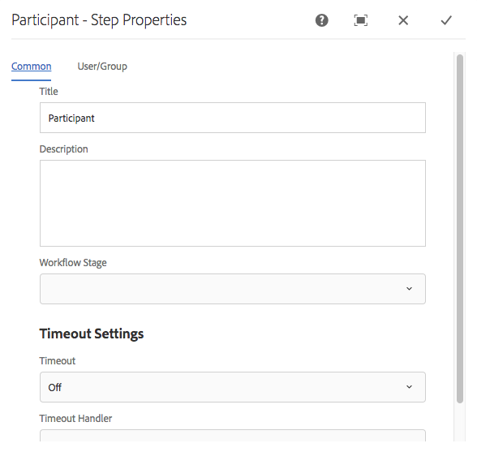

# 创建工作流模型{#creating-workflow-models}

>[!CAUTION]
>
>有关经典UI的使用，请参阅[AEM 6.3文档](https://helpx.adobe.com/experience-manager/6-3/help/sites-developing/workflows-models.html)以供参考。

您可以创建[工作流模型](/help/sites-developing/workflows.md#model)，以定义用户启动工作流时执行的一系列步骤。 您还可以定义模型属性，例如工作流是临时工作流还是使用多个资源。

当用户启动工作流时，将启动一个实例；这是相应的运行时模型，在您[同步](#sync-your-workflow-generate-a-runtime-model)更改时创建。

## 创建新工作流 {#creating-a-new-workflow}

首次创建工作流模型时，它包含：

* 步骤&#x200B;**流程开始**&#x200B;和&#x200B;**流程结束**。
这些表示工作流的开始和结束。 这些步骤是必需的，无法编辑/删除。
* 名为&#x200B;**步骤1**&#x200B;的示例&#x200B;**参与者**步骤。
此步骤配置为向工作流发起者分配工作项。 编辑或删除此步骤，并根据需要添加步骤。

使用编辑器创建工作流：

1. 打开&#x200B;**工作流模型**&#x200B;控制台；通过&#x200B;**工具**、**工作流**、**模型**&#x200B;或例如：[https://localhost:4502/aem/workflow](https://localhost:4502/aem/workflow)
1. 选择&#x200B;**创建**，然后选择&#x200B;**创建模型**。
1. 出现&#x200B;**添加工作流模型**&#x200B;对话框。 在选择&#x200B;**完成**&#x200B;之前，请输入&#x200B;**标题**&#x200B;和&#x200B;**名称**（可选）。
1. 新模型在&#x200B;**工作流模型**&#x200B;控制台中列出。
1. 选择新工作流，然后使用&#x200B;[**编辑**&#x200B;打开它以进行配置](#editinganexistingworkflow)：
   

>[!NOTE]
>
>如果以编程方式（使用crx包）创建模型，则还可以在中创建子文件夹：
>
>`/var/workflow/models`
>
>例如，`/var/workflow/models/prototypes`
>
>然后，可使用此文件夹[管理对该文件夹](/help/sites-administering/workflows-managing.md#create-a-subfolder-in-var-workflow-models-and-apply-the-acl-to-that)中模型的访问权限。

## 编辑工作流 {#editing-a-workflow}

您可以编辑任何现有的工作流模型以：

* [定义步骤](#addingasteptoamodel-)及其[参数](#configuring-a-workflow-step)
* 配置工作流属性，包括[阶段](#configuring-workflow-stages-that-show-workflow-progress)、[工作流是否为临时工作流](#creatingatransientworkflow-)和/或[使用多个资源](#configuring-a-workflow-for-multi-resource-support)

编辑&#x200B;[**默认和/或旧版**（现成）工作流](#editing-a-default-or-legacy-workflow-for-the-first-time)还有一个额外的步骤，以确保在更改之前创建[安全副本](/help/sites-developing/workflows-best-practices.md#locations-workflow-models)。

完成工作流更新后，您必须使用&#x200B;**同步**&#x200B;到&#x200B;**生成运行时模型**。 有关详细信息，请参阅[同步您的工作流](#sync-your-workflow-generate-a-runtime-model)。

### 同步工作流 — 生成运行时模型 {#sync-your-workflow-generate-a-runtime-model}

**Sync** （在编辑器工具栏的右侧）生成[运行时模型](/help/sites-developing/workflows.md#runtime-model)。 运行时模型是用户启动工作流时实际使用的模型。 如果不&#x200B;**同步**&#x200B;您的更改，则更改在运行时将不可用。

当您（或任何其他用户）对工作流进行任何更改时，您必须使用&#x200B;**同步**&#x200B;来生成运行时模型 — 即使单个对话框（例如，用于步骤）具有自己的保存选项。

当更改与运行时（已保存）模型同步时，将改为显示&#x200B;**已同步**。

某些步骤具有必填字段和/或内置验证。 如果不满足这些条件，则在尝试&#x200B;**同步**&#x200B;模型时将显示错误。 例如，当没有为&#x200B;**参与者**&#x200B;步骤定义参与者时：


### 首次编辑默认或旧版工作流 {#editing-a-default-or-legacy-workflow-for-the-first-time}

打开[默认和/或旧模型](/help/sites-developing/workflows.md#workflow-types)进行编辑时：

* 步骤浏览器不可用（左侧）。
* 工具栏（右侧）中提供了&#x200B;**编辑**&#x200B;操作。
* 最初，模型及其属性以只读模式显示为：
   * 默认工作流位于`/libs`中
   * 旧版工作流位于`/etc`中
选择**编辑**&#x200B;将：
* 将工作流的副本放入`/conf`
* 使步骤浏览器可用
* 允许您进行更改

>[!NOTE]
>
>有关详细信息，请参阅[工作流模型的位置](/help/sites-developing/workflows-best-practices.md#locations-workflow-models)。


### 向模型添加步骤 {#adding-a-step-to-a-model}

将步骤添加到模型中以表示要执行的活动 — 每个步骤都会执行特定活动。 标准AEM实例中提供了一组步骤组件。

在编辑模型时，可用的步骤将出现在&#x200B;**步骤浏览器**&#x200B;的各个组中。 例如：


>[!NOTE]
>
>有关随AEM一起安装的主要步骤组件的信息，请参阅[工作流步骤参考](/help/sites-developing/workflows-step-ref.md)。

要将步骤添加到工作流模型，请执行以下操作：

1. 打开现有的工作流模型进行编辑。 从&#x200B;**工作流模型**&#x200B;控制台中，选择所需的模型，然后选择&#x200B;**编辑**。
1. 打开步骤浏览器；使用顶部工具栏最左边的&#x200B;**切换侧面板**。 在此编辑器中，您可以：

   * **筛选**&#x200B;特定步骤。
   * 使用下拉选择器将选择限制为一组特定的步骤。
   * 选择“显示描述”图标以显示有关相应步骤的更多详细信息。

   

1. 将相应的步骤拖动到模型中的所需位置。

   例如，**参与者步骤**。

   添加到流后，您可以[配置步骤](#configuring-a-workflow-step)。

   

1. 根据需要添加任意数量的步骤或其他更新。

   在运行时，步骤将按照它们在模型中出现的顺序执行。 添加步骤组件后，可将其拖动到模型中的其他位置。

   您还可以复制、剪切、粘贴、分组或删除现有步骤；与[页面编辑器一样。](/help/sites-authoring/editing-content.md)

   也可以使用工具栏选项折叠/展开拆分步骤

1. 使用&#x200B;**同步**（编辑器工具栏）确认更改以生成运行时模型。

   有关详细信息，请参阅[同步您的工作流](#sync-your-workflow-generate-a-runtime-model)。

### 配置工作流步骤 {#configuring-a-workflow-step}

您可以&#x200B;**配置**，并使用&#x200B;**步骤属性**&#x200B;对话框自定义工作流步骤的行为。

1. 要打开步骤的&#x200B;**步骤属性**&#x200B;对话框，请执行下列任一操作：

   * 单击工作流模型中的* *步骤，然后从组件工具栏中选择&#x200B;**配置**。

   * 双击该步骤。

   >[!NOTE]
   >
   >有关随AEM一起安装的主要步骤组件的信息，请参阅[工作流步骤参考](/help/sites-developing/workflows-step-ref.md)。

1. 根据需要配置&#x200B;**步骤属性**；可用的属性取决于步骤类型，可能还有多个可用选项卡。 例如，默认&#x200B;**参与者步骤**&#x200B;在新工作流中显示为`Step 1`：

   

1. 用勾号确认您的更新。
1. 使用&#x200B;**同步**（编辑器工具栏）确认更改以生成运行时模型。

   有关详细信息，请参阅[同步您的工作流](#sync-your-workflow-generate-a-runtime-model)。

### 创建临时工作流 {#creating-a-transient-workflow}

您可以在创建模型或编辑现有模型时创建[临时](/help/sites-developing/workflows.md#transient-workflows)工作流模型：

1. 打开工作流模型以进行[编辑](#editinganexistingworkflow)。
1. 从工具栏中选择&#x200B;**工作流模型属性**。
1. 在对话框中，激活&#x200B;**临时工作流**（或者根据需要停用）：

   

1. 使用&#x200B;**保存并关闭**&#x200B;确认更改；随后使用&#x200B;**同步**（编辑器工具栏）生成运行时模型。

   有关详细信息，请参阅[同步您的工作流](#sync-your-workflow-generate-a-runtime-model)。

>[!NOTE]
>
>在[临时](/help/sites-developing/workflows.md#transient-workflows)模式下运行工作流时，AEM不会存储任何工作流历史记录。 因此，[时间线](/help/sites-authoring/basic-handling.md#timeline)不显示与该工作流相关的任何信息。

## 在触屏UI中提供工作流模型 {#classic2touchui}

如果经典UI中存在工作流模型，但在触屏UI的&#x200B;**[!UICONTROL 时间轴]**&#x200B;边栏的选择弹出菜单中缺少该模型，请按照配置使其可用。 以下步骤说明了如何使用名为&#x200B;**[!UICONTROL 请求激活]**&#x200B;的工作流模型。

1. 确认模型在触屏UI中不可用。 使用`/assets.html/content/dam`路径访问资源。 选择资源。 在左边栏中打开&#x200B;**[!UICONTROL 时间轴]**。 单击&#x200B;**[!UICONTROL 启动工作流]**，并确认弹出列表中不存在&#x200B;**[!UICONTROL 激活请求]**&#x200B;模型。

1. 浏览&#x200B;**[!UICONTROL 工具>常规>标记]**。 选择&#x200B;**[!UICONTROL 工作流]**。

1. 选择&#x200B;**[!UICONTROL 创建>创建标记]**。 将&#x200B;**[!UICONTROL Title]**&#x200B;设置为`DAM`，将&#x200B;**[!UICONTROL Name]**&#x200B;设置为`dam`。 选择&#x200B;**[!UICONTROL 提交]**。
   

1. 导航到&#x200B;**[!UICONTROL 工具>工作流>模型]**。 选择&#x200B;**[!UICONTROL 激活请求]**，然后选择&#x200B;**[!UICONTROL 编辑]**。

1. 选择&#x200B;**[!UICONTROL 编辑]**，打开&#x200B;**[!UICONTROL 页面信息]**&#x200B;菜单，从中选择&#x200B;**[!UICONTROL 打开属性]**，然后转到&#x200B;**[!UICONTROL 基本]**&#x200B;选项卡（如果尚未打开）。

1. 将`Workflow : DAM`添加到&#x200B;**[!UICONTROL 标记]**&#x200B;字段。 使用复选框（勾号）确认选择。

1. 使用&#x200B;**[!UICONTROL 保存并关闭]**确认添加标记。
   的页面属性

1. 使用&#x200B;**[!UICONTROL 同步]**&#x200B;完成该过程。 现在，该工作流在触屏UI中可用。

### 为多资源支持配置工作流 {#configuring-a-workflow-for-multi-resource-support}

您可以在创建模型或编辑现有模型时，为[多资源支持](/help/sites-developing/workflows.md#multi-resource-support)配置工作流模型：

1. 打开工作流模型以进行[编辑](#editinganexistingworkflow)。
1. 从工具栏中选择&#x200B;**工作流模型属性**。

1. 在对话框中，激活&#x200B;**多资源支持**（或者根据需要停用）：

   

1. 使用&#x200B;**保存并关闭**&#x200B;确认更改；随后使用&#x200B;**同步**（编辑器工具栏）生成运行时模型。

   有关详细信息，请参阅[同步您的工作流](#sync-your-workflow-generate-a-runtime-model)。

### 配置工作流暂存（显示工作流进度） {#configuring-workflow-stages-that-show-workflow-progress}

[工作流暂存](/help/sites-developing/workflows.md#workflow-stages)有助于在处理任务时可视化工作流的进度。

>[!CAUTION]
>
>如果在&#x200B;**页面属性**&#x200B;中定义了工作流暂存，但未用于任何工作流步骤，则进度条不会显示任何进度（无论当前工作流步骤如何）。

可用的阶段在工作流模型中定义；现有工作流模型可以更新以包括阶段定义。 您可以为工作流模型定义任意数量的阶段。

要为工作流定义&#x200B;**阶段**，请执行以下操作：

1. 打开工作流模型进行编辑。
1. 从工具栏中选择&#x200B;**工作流模型属性**。 然后打开&#x200B;**阶段**&#x200B;选项卡。
1. 添加（和定位）所需的&#x200B;**阶段**。 您可以为工作流模型定义任意数量的阶段。

   例如：

   

1. 单击&#x200B;**保存并关闭**&#x200B;以保存属性。
1. 为工作流模型中的每个步骤分配一个阶段。 例如：

   

   一个阶段可以分配给多个步骤。 例如：

   | **步骤** | **阶段** |
   |---|---|
   | 步骤 1 | 创建 |
   | 步骤 2 | 创建 |
   | 步骤 3 | 审查 |
   | 步骤 4 | 批准 |
   | 步骤 5 | 批准 |
   | 步骤 6 | 完成 |

1. 使用&#x200B;**同步**（编辑器工具栏）确认更改以生成运行时模型。

   有关详细信息，请参阅[同步您的工作流](#sync-your-workflow-generate-a-runtime-model)。

## 在资源包中导出工作流模型 {#exporting-a-workflow-model-in-a-package}

要导出资源包中的工作流模型，请执行以下操作：

1. 使用[包管理器](/help/sites-administering/package-manager.md#package-manager)创建包：

   1. 通过&#x200B;**工具**、**部署**、**包**&#x200B;导航到包管理器。

   1. 单击&#x200B;**创建包**。
   1. 指定&#x200B;**包名称**，并根据需要指定任何其他详细信息。
   1. 单击&#x200B;**确定**。

1. 单击新包工具栏上的&#x200B;**编辑**。

1. 打开&#x200B;**筛选器**&#x200B;选项卡。

1. 选择&#x200B;**添加筛选器**&#x200B;并指定工作流模型&#x200B;*设计*&#x200B;的路径：

   `/conf/global/settings/workflow/models/<*your-model-name*>`

   单击&#x200B;**完成**。

1. 选择&#x200B;**添加筛选器**&#x200B;并指定&#x200B;*运行时*&#x200B;工作流模型的路径：

   `/var/workflow/models/<*your-model-name*>`

   单击&#x200B;**完成**。

1. 为模型使用的任何自定义脚本添加其他筛选器。
1. 单击&#x200B;**保存**&#x200B;以确认您的筛选器定义。
1. 从包定义的工具栏中选择&#x200B;**生成**。
1. 从包工具栏中选择&#x200B;**下载**。

## 使用工作流处理表单提交 {#using-workflows-to-process-form-submissions}

您可以配置要由所选工作流处理的表单。 当用户提交表单时，将创建一个新的工作流实例，该实例使用表单提交的数据作为其有效负载。

要配置要与表单一起使用的工作流，请执行以下操作：

1. 创建页面并打开它以进行编辑。
1. 向页面添加&#x200B;**表单**&#x200B;组件。
1. **配置**&#x200B;页面中显示的&#x200B;**表单开始**&#x200B;组件。
1. 使用&#x200B;**启动工作流**&#x200B;从可用工作流中选择所需的工作流：

   

1. 单击勾号确认新表单配置。

## 测试工作流 {#testing-workflows}

测试工作流时，好的做法是使用各种有效负载类型（包括与为其开发该工作流的类型不同的类型）。 例如，如果您打算让工作流处理Assets，请通过将页面设置为有效负载来测试该工作流，并确保它不会引发错误。

例如，按如下方式测试新工作流：

1. 从控制台[启动您的工作流模型](/help/sites-administering/workflows-starting.md)。
1. 定义&#x200B;**有效负载**&#x200B;并确认。

1. 根据需要执行操作，以便工作流继续运行。
1. 在工作流运行时监视日志文件。

您还可以将AEM配置为在日志文件中显示&#x200B;**DEBUG**&#x200B;消息。 有关详细信息，请参阅[日志记录](/help/sites-deploying/configure-logging.md)，当开发完成后，将&#x200B;**日志级别**&#x200B;设置回&#x200B;**信息**。

## 示例 {#examples}

### 示例：创建一个（简单）工作流以接受或拒绝发布请求 {#example-creating-a-simple-workflow-to-accept-or-reject-a-request-for-publication}

为了说明创建工作流的一些可能性，以下示例创建了`Publish Example`工作流的变体。

1. [创建工作流模型](#creating-a-new-workflow)。

   新工作流将包含：

   * **流程开始**
   * `Step 1`
   * **流结束**

1. 删除`Step 1` （因为对于此示例而言，它是错误的步骤类型）：

   * 单击该步骤并从组件工具栏中选择&#x200B;**删除**。 确认该操作。

1. 从步骤浏览器的&#x200B;**工作流**&#x200B;选项中，将&#x200B;**参与者步骤**&#x200B;拖动到工作流上，并将其放置在&#x200B;**流程开始**&#x200B;和&#x200B;**流程结束**&#x200B;之间。
1. 要打开“属性”对话框，请执行以下操作：

   * 单击参与者步骤，然后从组件工具栏中选择&#x200B;**配置**。
   * 双击参与者步骤。

1. 在&#x200B;**常用**&#x200B;选项卡中，为&#x200B;**标题**&#x200B;和&#x200B;**描述**&#x200B;输入`Validate Content`。
1. 打开&#x200B;**用户/组**&#x200B;选项卡：

   * 激活&#x200B;**通过电子邮件通知用户**。
   * 为&#x200B;**用户/组**&#x200B;字段选择`Administrator` (`admin`)。

   >[!NOTE]
   >
   >若要发送电子邮件，[需要配置邮件服务和用户帐户详细信息](/help/sites-administering/notification.md)。

1. 单击勾号确认更新。

   您将返回到工作流模型的概述，此处参与者步骤将重命名为`Validate Content`。

1. 将&#x200B;**或Split**&#x200B;拖动到工作流上，并将其放置在`Validate Content`和&#x200B;**流结束**&#x200B;之间。
1. 打开&#x200B;**或Split**&#x200B;以进行配置。
1. 配置：

   * **常用**：指定拆分名称。
   * **分支1**：选择&#x200B;**默认路由**。

   * **分支2**：确保未选择&#x200B;**默认路由**。

1. 确认对&#x200B;**OR拆分**&#x200B;的更新。
1. 将&#x200B;**参与者步骤**&#x200B;拖到左侧分支，打开属性，指定以下值，然后确认更改：

   * **标题**： `Reject Publish Request`

   * **用户/组**：例如，`projects-administrators`

   * **通过电子邮件通知用户**：激活以通过电子邮件通知用户。

1. 将&#x200B;**进程步骤**&#x200B;拖到右侧分支中，打开属性，指定以下值，然后确认更改：

   * **标题**： `Publish Page as Requested`

   * **进程**：选择`Activate Page`。 此进程将所选页面发布到发布服务器实例。

1. 单击&#x200B;**同步**（编辑器工具栏）以生成运行时模型。

   有关详细信息，请参阅[同步您的工作流](#sync-your-workflow-generate-a-runtime-model)。

   您的新工作流模型将如下所示：

   

1. 将此工作流应用于您的页面，以便当用户移动到&#x200B;**完成**&#x200B;的&#x200B;**验证内容**&#x200B;步骤时，他们可以选择是要&#x200B;**按请求发布页面**，还是&#x200B;**拒绝发布请求**。

   

### 示例：使用ECMA脚本为OR拆分定义规则 {#defineruleecmascript}

**OR拆分**&#x200B;步骤允许您在工作流中引入条件处理路径。

要定义OR规则，请按照以下步骤操作：

1. 创建两个脚本并将它们保存在存储库中，例如，位于以下位置：

   `/apps/myapp/workflow/scripts`

   >[!NOTE]
   >
   >脚本必须具有返回布尔值的[函数`check()`](#function-check)。

1. 编辑工作流并将&#x200B;**OR拆分**&#x200B;添加到模型中。
1. 编辑&#x200B;**OR拆分**&#x200B;的&#x200B;**分支1**&#x200B;的属性：

   * 通过将&#x200B;**值**&#x200B;设置为`true`，将此路由定义为&#x200B;**默认路由**。

   * 作为&#x200B;**规则**，设置脚本的路径。 例如：
     `/apps/myapp/workflow/scripts/myscript1.ecma`

   >[!NOTE]
   >
   >您可以根据需要切换分支顺序。

1. 编辑&#x200B;**OR拆分**&#x200B;的&#x200B;**分支2**&#x200B;的属性。

   * 作为&#x200B;**规则**，设置其他脚本的路径。 例如：
     `/apps/myapp/workflow/scripts/myscript2.ecma`

1. 设置每个分支中各个步骤的属性。 确保设置了&#x200B;**用户/组**。
1. 单击&#x200B;**同步**（编辑器工具栏）以保留对运行时模型所做的更改。

   有关详细信息，请参阅[同步您的工作流](#sync-your-workflow-generate-a-runtime-model)。

#### 函数Check() {#function-check}

>[!NOTE]
>
>请参阅[使用ECMAScript](/help/sites-developing/workflows-customizing-extending.md#using-ecmascript)。

如果节点是位于`/content/we-retail/us/en`下的`JCR_PATH`，则以下示例脚本返回`true`：

```
function check() {
    if (workflowData.getPayloadType() == "JCR_PATH") {
      var path = workflowData.getPayload().toString();
      var node = jcrSession.getItem(path);

      if (node.getPath().indexOf("/content/we-retail/us/en") >= 0) {
       return true;
      } else {
       return false;
      }
     } else {
      return false;
     }
}
```

### 示例：自定义激活请求 {#example-customized-request-for-activation}

您可以自定义任何现成的工作流。 要具有自定义行为，请叠加相应工作流的详细信息。

例如，**请求激活**。 此工作流用于发布&#x200B;**站点**&#x200B;中的页面，当内容作者没有相应的复制权限时，此工作流将自动触发。 有关详细信息，请参阅[自定义页面创作 — 自定义激活请求工作流](/help/sites-developing/customizing-page-authoring-touch.md#customizing-the-request-for-activation-workflow)。
